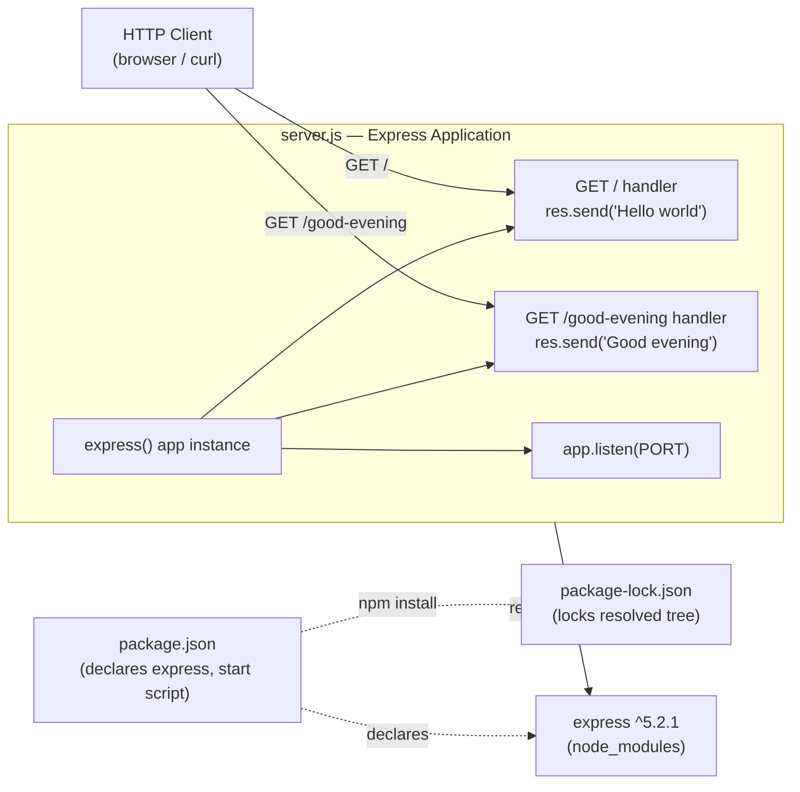

# Technical Specification

# 0. Agent Action Plan

## 0.1 Intent Clarification

This sub-section restates the user's request in precise technical terms, classifies the nature of the work, captures every explicit and implicit constraint, and maps the intent to a concrete implementation strategy. It is the authoritative interpretation layer between what the user asked for and what the Blitzy platform will build.

### 0.1.1 Core Objective

The user's request is preserved verbatim below:

> add feature to a existing product
>
> this is a tutorial of node js server hosting one endpoint that returns the response "Hello world". Could you add expressjs into the project and add another endpoint that return the reponse of "Good evening"?

Based on the provided requirements, the Blitzy platform understands that the objective is to **introduce the Express.js web framework into the Node.js project and expose a new HTTP `GET` endpoint that returns the plaintext response "Good evening", while preserving the project's "Hello world" endpoint**. The work transforms a minimal Node.js HTTP service into an Express-based service that serves two distinct greeting endpoints.

The objective decomposes into the following enhanced, individually-trackable requirements:

- **R1 — Adopt Express.js as the HTTP layer:** Declare `express` as a project dependency and use it to handle routing and request/response processing for all endpoints.
- **R2 — Provide the "Hello world" endpoint (baseline):** Expose a `GET` endpoint that responds with the exact plaintext string `Hello world`. The user describes this as already existing; it must be present and functional in the delivered result.
- **R3 — Add the "Good evening" endpoint (the requested feature):** Expose a new, additively-introduced `GET` endpoint that responds with the exact plaintext string `Good evening`, on a route distinct from the "Hello world" endpoint.
- **R4 — Provide a runnable server bootstrap:** Start an HTTP listener (conventionally on port `3000`, ideally `process.env.PORT || 3000`) so both endpoints are reachable, runnable via a standard `npm start` command.

Implicit requirements and prerequisites surfaced from the request:

- A Node.js runtime and the `npm` package manager are prerequisites (both are present in the environment: Node.js `v22.22.2`, npm `11.1.0`).
- A package manifest (`package.json`) is required to declare the `express` dependency and a `start` script, and an installation step (`npm install`) is required to materialize `node_modules/` and a `package-lock.json`.
- A single server entry file (e.g., `server.js`) referenced by the manifest's `main` field is required to host the Express application instance and route definitions.
- The two endpoints must **coexist** — the change is additive, so the "Hello world" behavior must not be removed or altered.
- The responses must be the **exact** plaintext strings the user specified, with no decoration.

**Critical context discovery (greenfield reality):** Exhaustive inspection of the target repository shows it currently contains only a single file, `README.md`, whose entire content is the level-one heading `# 12_feb_5` `[README.md:L1]`. There is no pre-existing Node.js server, `package.json`, or "Hello world" endpoint in the repository. Consequently, the platform will **bootstrap the baseline the user assumes already exists** (the Node.js project and its "Hello world" endpoint) and then layer the requested "Good evening" feature on top. This discrepancy is documented in detail in section 0.8 (Special Instructions).

### 0.1.2 Task Categorization

- **Primary task type:** Add Feature — the request adds a new endpoint and adopts a new framework into the product.
- **Secondary aspects:**
  - Build / Dependency management — creating the npm manifest and lockfile and adding the `express` dependency.
  - Documentation — updating `README.md` with install/run instructions and an endpoint reference.
  - Configuration (light) — defining an npm `start` script and a `.gitignore`.
- **Scope classification:** Cross-cutting change at the project level. Because the repository is effectively greenfield, introducing Express establishes the project's entire HTTP/routing foundation end-to-end rather than touching an isolated function within an existing server.

### 0.1.3 Special Instructions and Constraints

- **No explicit user rules were provided.** The rules input returned an empty list, and no attachments accompanied the request. The constraints below are therefore derived implicitly from the prompt and from standard engineering practice.
- **Preserve existing behavior:** The "Hello world" endpoint must remain functional (the request is "add another endpoint" — additive, not a replacement).
- **Exact response fidelity:** The endpoints must return the user's literal strings. Preserved verbatim for downstream implementation:
  - User Example: `Hello world`
  - User Example: `Good evening`
- **Framework directive:** Express.js is explicitly named and must be the framework used for routing ("add expressjs into the project").
- **Web search requirements:** The only external research needed is confirmation of the current stable Express.js version and its Node.js engine requirement. This was resolved authoritatively against the npm registry (see 0.2.2); no further external research is required for implementation.

### 0.1.4 Technical Interpretation

These requirements translate to the following technical implementation strategy:

- To **adopt Express.js (R1)**, we will *create* `package.json` declaring `express` under `dependencies` and run `npm install` to resolve it, producing `package-lock.json` and `node_modules/`.
- To **provide the "Hello world" endpoint (R2)**, we will *create* a `server.js` entry file that registers a route handler `app.get('/', (req, res) => res.send('Hello world'))`.
- To **add the "Good evening" endpoint (R3)**, we will *extend* `server.js` with a second handler `app.get('/good-evening', (req, res) => res.send('Good evening'))` on a distinct route.
- To **make the service runnable (R4)**, we will *add* `app.listen(process.env.PORT || 3000)` to `server.js` and an `npm start` script (`node server.js`) to `package.json`.
- To **keep the repository clean and documented**, we will *create* `.gitignore` (excluding `node_modules/`) and *update* `README.md` to describe the project, its prerequisites, install/run steps, and both endpoints.

## 0.2 Repository Scope Discovery

This sub-section reports the exhaustive repository search conducted to identify every file affected by the change, the external research performed to validate the approach, and an assessment of the existing project infrastructure and conventions.

### 0.2.1 Comprehensive File Analysis

A complete, recursive inventory of the target repository (excluding the internal `.git` directory) was performed. The result is unambiguous: the repository contains exactly **one** non-version-control file.

| Path | Type | Size | Status | Relevance to this change |
|------|------|------|--------|--------------------------|
| `README.md` | Documentation | 10 bytes | Pre-existing | Will be UPDATED with project description, install/run instructions, and endpoint documentation `[README.md:L1]` |

Search patterns relevant to this Add Feature task and their results:

- **Source code** (`**/*.js`, `**/*.mjs`, `**/*.ts`): none found — no server entry point exists yet.
- **Configuration / manifests** (`package.json`, `package-lock.json`, `**/*.json`, `.nvmrc`, `.*rc`): none found — no npm project is initialized.
- **Dependencies** (`node_modules/`): none found — nothing installed.
- **Build / Deploy** (`Dockerfile*`, `docker-compose*`, `.github/workflows/*`, `Makefile*`): none found.
- **Tests** (`**/*test*`, `**/*spec*`, `test/**`): none found — no testing infrastructure present.
- **Ignore rules** (`.gitignore`, `.blitzyignore`): none found — there are no ignore patterns to honor anywhere in the repository.

Related-file discovery (files that would require updates due to interface or import changes): **none**, because there are no pre-existing source files that import or depend on the components being created. The only related artifact is the documentation file `README.md`, which will be updated for consistency with the new runnable project.

### 0.2.2 Web Search Research Conducted

The research need for this task is narrow: confirm the current stable Express.js release and its runtime requirement so the dependency can be pinned to an exact, valid version (never a placeholder). The web search facility returned no results in this environment, so the information was obtained authoritatively and version-exactly from the live npm registry, supplemented by well-established Express.js conventions:

- **Express.js current stable version:** `5.2.1` is the npm `latest` dist-tag; `4.22.2` is the latest of the legacy `4.x` line.
- **Runtime requirement:** `express@5.2.1` declares `engines.node >= 18`, which the installed Node.js `v22.22.2` satisfies. The package is MIT-licensed; its homepage is `https://expressjs.com/`.
- **Dependency footprint:** `express@5.2.1` resolves roughly 28 transitive dependencies (for example `qs`, `send`, `etag`, `depd`, `vary`), but the project declares only the single top-level `express` dependency; the full resolved tree is captured in `package-lock.json`.
- **Conventions validated:** the canonical minimal Express application pattern (instantiate `app`, register `app.get()` route handlers, call `app.listen()`); use of distinct routes for distinct responses; `GET` for read-only greeting endpoints; an `npm start` script mapping to `node <entry>`; and a `.gitignore` that excludes `node_modules/`.

### 0.2.3 Existing Infrastructure Assessment

| Infrastructure dimension | Current state in repository |
|--------------------------|------------------------------|
| Project structure / organization | None beyond the `README.md` nameplate `[README.md:L1]` |
| Build / dependency tooling | None — no `package.json` or lockfile |
| Source code | None — no server or route definitions |
| Testing infrastructure | None |
| CI/CD and containerization | None |
| Documentation system | A single-line `README.md` only |
| Conventions to follow | None exist in-repo; standard Express.js / Node.js community conventions will be adopted |

The assessment confirms a **greenfield** starting point. Because there are no pre-existing patterns, file layouts, linters, or style guides to conform to, the implementation will follow widely-accepted, idiomatic Express.js conventions for a minimal service. No `/app` platform tooling or unrelated repository content is in scope or referenced by this plan.

## 0.3 Implementation Design

This sub-section describes *how* the objective will be achieved: the technical approach and its rationale, the components that are impacted, how the user's examples map to the implementation, and the critical implementation details that govern correctness.

### 0.3.1 Technical Approach

The primary objective — an Express-based Node.js service exposing "Hello world" and "Good evening" endpoints — is achieved by scaffolding a minimal project and registering two route handlers on a single Express application instance. The logical implementation flow (sequence of work, not a schedule) is:

- **First, establish the project foundation** by creating `package.json` (declaring metadata, an `npm start` script, and `express` as a dependency). This makes the project installable and runnable.
- **Next, materialize the dependency** by running `npm install`, which resolves `express@^5.2.1`, writes `package-lock.json`, and populates `node_modules/`.
- **Next, implement the HTTP layer** by creating `server.js`: import Express, instantiate the application, register the two `GET` route handlers, and start the HTTP listener.
- **Next, add repository hygiene** by creating `.gitignore` so the generated `node_modules/` directory is not committed.
- **Finally, ensure the project is documented** by updating `README.md` with the project description, prerequisites, install/run commands, and an endpoint reference table.

Rationale for key decisions:

- **Single-file server (`server.js`):** With only two trivial endpoints, a single entry file is the idiomatic, lowest-complexity structure. Splitting into router/controller modules would be over-engineering for this scope and is explicitly out of scope (see 0.5.2).
- **`express` pinned to `^5.2.1`:** This is the npm-verified latest stable release, compatible with the installed Node.js 22 runtime (`engines.node >= 18`). The caret range permits compatible patch/minor updates while locking the exact resolved tree in `package-lock.json`.
- **CommonJS module style (`require`):** Matches the default `package.json` (no `"type": "module"`), keeping the tutorial approachable. An ESM equivalent (`import`) is acceptable only if `"type": "module"` is set in the manifest.
- **Port via `process.env.PORT || 3000`:** Environment-portable while defaulting to the conventional tutorial port.

### 0.3.2 Component Impact Analysis

The relationship between the components to be introduced is shown below.



- **Direct (new) components:**
  - `package.json` — the project manifest; declares the `express` dependency and the `start` script.
  - `server.js` — hosts the Express application instance, the two `GET` route handlers, and the HTTP listener.
- **Indirect / generated components:**
  - `package-lock.json` — produced by `npm install`; pins the exact dependency tree.
  - `node_modules/` — installed dependencies; excluded from version control via `.gitignore`.
- **Supporting components:**
  - `.gitignore` — new; prevents committing `node_modules/`.
  - `README.md` — updated; documents the project.
- **Indirect impacts / ripple effects:** None on pre-existing code, because no source files exist yet. The change introduces no interface breaks, no import rewrites in existing files, and removes no behavior — it is purely additive.

### 0.3.3 User Interface Design

Not applicable. This is a backend HTTP service that returns plaintext responses; there is no graphical user interface, no component library, and no Figma design associated with the request. The "interface" consists solely of the two HTTP `GET` endpoints documented throughout this plan.

### 0.3.4 User-Provided Examples Integration

The user supplied two literal response strings, which must be reproduced exactly:

- User Example: `Hello world` — implemented in `server.js` as the response of the root route: `app.get('/', (req, res) => res.send('Hello world'))`.
- User Example: `Good evening` — implemented in `server.js` as the response of the new route: `app.get('/good-evening', (req, res) => res.send('Good evening'))`.

Fidelity to the user's intent is maintained by sending these strings unmodified (no surrounding HTML, JSON wrapping, punctuation, or whitespace changes), preserving the simple tutorial character of the project.

### 0.3.5 Critical Implementation Details

- **Design pattern:** Minimal Express application pattern — a single `app` instance with directly-registered route handlers, illustrated by the canonical two-to-three-line shape:

```js
const express = require('express');
const app = express();
app.get('/', (req, res) => res.send('Hello world'));
```

- **Routing:** Two independent `GET` routes on distinct paths (`/` and `/good-evening`) so both greetings are simultaneously reachable. The new route must not shadow or replace the root route.
- **Server bootstrap:** A single `app.listen(process.env.PORT || 3000, ...)` call with a startup log line; the listener must bind after both routes are registered.
- **Response semantics:** `res.send()` with a string yields a `text/html` (plaintext) body and a `200` status by default — appropriate for these greeting responses.
- **Error handling / edge cases:** For unmatched paths, Express's default `404` behavior is acceptable for a tutorial; no custom error middleware is required. No request body parsing, authentication, or input validation is needed because both endpoints are read-only and parameterless.
- **Performance / security considerations:** None beyond defaults are required at this scope. Production hardening (e.g., `helmet`, CORS, rate limiting) is intentionally out of scope (see 0.5.2). The Node.js engine requirement (`>= 18`) declared by `express@5.2.1` is satisfied by the installed runtime.

## 0.4 File Transformation Mapping

This sub-section enumerates **every** file to be created or modified, with the target file listed first, its transformation mode, the source/reference it derives from, and the specific changes. Nothing is left as "pending" or "to be discovered".

### 0.4.1 File-by-File Execution Plan

Transformation modes: **CREATE** (new file), **UPDATE** (modify existing), **DELETE** (remove), **REFERENCE** (used as an example/pattern, not modified).

| Target File | Transformation | Source File/Reference | Purpose/Changes |
|-------------|----------------|-----------------------|-----------------|
| `package.json` | CREATE | — (npm manifest convention) | Declare project metadata (`name`, `version`, `main: server.js`), an npm `start` script (`node server.js`), and `dependencies.express` set to `^5.2.1` |
| `server.js` | CREATE | — (Express minimal-app convention) | Express bootstrap: `require('express')`, instantiate `app`, register `GET /` → `Hello world` and `GET /good-evening` → `Good evening`, then `app.listen(process.env.PORT || 3000)` |
| `package-lock.json` | CREATE | — (generated by `npm install`) | Lock the exact resolved dependency tree (`express@5.2.1` plus its transitive dependencies) for reproducible installs |
| `.gitignore` | CREATE | — (Node.js convention) | Exclude `node_modules/` and npm debug logs from version control |
| `README.md` | UPDATE | `README.md` | Expand the single-line nameplate into a project description, prerequisites, install (`npm install`) and run (`npm start`) instructions, and an endpoint reference table |

There are **no DELETE** operations (nothing is obsolete) and **no REFERENCE** entries (no in-repo patterns exist and the user cited no reference files).

### 0.4.2 New Files Detail

- **`package.json`** — Project manifest.
  - Content type: configuration / manifest.
  - Based on: standard `npm init` output.
  - Key fields: `name` (e.g., `12_feb_5`, matching the README identifier), `version` (`1.0.0`), `main` (`server.js`), `scripts.start` (`node server.js`), `dependencies.express` (`^5.2.1`).
- **`server.js`** — Express application entry point.
  - Content type: source code.
  - Based on: the canonical minimal Express application pattern.
  - Key sections/functions: module import (`require('express')`); app instantiation (`const app = express()`); route handler `GET /` returning `Hello world`; route handler `GET /good-evening` returning `Good evening`; listener `app.listen(process.env.PORT || 3000)` with a startup log.
- **`package-lock.json`** — Dependency lockfile.
  - Content type: generated configuration.
  - Based on: output of `npm install`.
  - Key sections: the fully-resolved dependency graph with exact versions and integrity hashes. This file is generated by tooling, not authored by hand.
- **`.gitignore`** — Version-control ignore rules.
  - Content type: configuration.
  - Based on: standard Node.js `.gitignore` conventions.
  - Key entries: `node_modules/`, and optionally `npm-debug.log*` / `*.log`.

### 0.4.3 Files to Modify Detail

- **`README.md`** — Currently a single line, `# 12_feb_5` `[README.md:L1]`.
  - Sections to update/add: a short project description; a Prerequisites section (Node.js `>= 18`); an Installation section (`npm install`); a Running section (`npm start`); and an Endpoints section documenting `GET /` → `Hello world` and `GET /good-evening` → `Good evening`.
  - Content to remove: none — the existing heading is retained as the document title.
  - Refactoring needed: none beyond additive expansion of the document.

### 0.4.4 Configuration and Documentation Updates

- **Configuration changes:**
  - `package.json`: introduces the `express` dependency and the `start` script. Impact: the project becomes installable via `npm install` and runnable via `npm start`.
  - `.gitignore`: introduces `node_modules/` exclusion. Impact: keeps the repository free of installed dependencies.
- **Documentation updates:**
  - `README.md`: adds usage and endpoint documentation. Cross-references to keep consistent: the endpoint paths and response strings documented here must match exactly what `server.js` implements, and the run command must match the `start` script defined in `package.json`.

### 0.4.5 Cross-File Dependencies

- `server.js` depends on the `express` package, which is declared in `package.json` and resolved into `node_modules/` (locked by `package-lock.json`). The `require('express')` statement in `server.js` will only succeed after `npm install` has been run.
- `package.json` `main`/`scripts.start` must reference the actual entry filename (`server.js`); the two must stay in sync.
- `README.md` must remain consistent with both the route definitions in `server.js` (paths and response strings) and the run command in `package.json` (`npm start`).
- No pre-existing file requires an import or reference update, because the repository contained no source files prior to this change.

## 0.5 Scope Boundaries

This sub-section draws a hard boundary around what the implementation will and will not do, so downstream code generation stays focused on the user's intent and avoids over-engineering a minimal tutorial project.

### 0.5.1 Exhaustively In Scope

- **Source code:**
  - `server.js` — the Express application entry point hosting both `GET` route handlers and the HTTP listener.
- **Configuration and manifests:**
  - `package.json` — project manifest with the `start` script and the `express` dependency.
  - `package-lock.json` — generated lockfile pinning the resolved dependency tree.
  - `.gitignore` — excludes `node_modules/` and npm logs.
- **Dependencies:**
  - Add `express` (`^5.2.1`) as the sole declared runtime dependency.
- **Documentation:**
  - `README.md` — updated with description, prerequisites, install/run instructions, and the endpoint reference table.
- **Behavioral scope:**
  - A `GET /` endpoint returning the exact string `Hello world` (the preserved baseline).
  - A `GET /good-evening` endpoint returning the exact string `Good evening` (the requested feature).
  - A runnable server bound to `process.env.PORT || 3000`.

### 0.5.2 Explicitly Out of Scope

The following are intentionally excluded as not requested by the user and unnecessary for a minimal two-endpoint tutorial:

- Databases, persistence layers, sessions, or any stateful storage.
- Authentication, authorization, or any identity/access control.
- Additional endpoints beyond the two specified, or non-`GET` HTTP methods.
- Automated tests or test frameworks (e.g., Jest, Mocha, Supertest) — not requested; a candidate for future work.
- TypeScript migration, and linting/formatting tooling (ESLint, Prettier).
- A modular router/controller/service folder architecture — a single-file server is idiomatic at this scope.
- `Dockerfile`, `docker-compose`, or any CI/CD workflow configuration.
- Production-hardening middleware such as `helmet`, CORS handling, rate limiting, compression, or body parsing — unnecessary for parameterless plaintext `GET` greetings.
- Any change that alters or removes the `Hello world` behavior — it must be preserved.
- Any interaction with, or documentation of, unrelated platform/tooling code outside the user's project repository.

## 0.6 Dependency Inventory

This sub-section lists the packages and runtime relevant to the task with exact, verified versions. All versions were confirmed against the live npm registry; no placeholder versions are used.

### 0.6.1 Key Public Packages

| Registry | Package Name | Version | Purpose |
|----------|--------------|---------|---------|
| npm | express | ^5.2.1 | Web framework providing routing and request/response abstraction for both `GET` endpoints |

Runtime prerequisite (not an npm dependency, but required to build and run the project):

| Tool | Version | Notes |
|------|---------|-------|
| Node.js | `>= 18` (target installed `v22.22.2`, the active 22.x LTS line) | Satisfies `express@5.2.1`'s `engines.node >= 18` requirement |
| npm | `11.1.0` (installed) | Used to install dependencies and run the `start` script |

Note on transitive dependencies: installing `express@5.2.1` automatically resolves roughly 28 transitive packages (for example `qs`, `send`, `etag`, `depd`, `vary`). These are **not** declared directly in `package.json`; the complete, exact resolved tree is captured in `package-lock.json`.

### 0.6.2 Dependency Updates

- **New dependencies to add:**
  - `express`: `^5.2.1` — the user-requested web framework; powers routing for both the `Hello world` and `Good evening` endpoints. Pinned to the current stable release; compatible with the installed Node.js 22 runtime.
- **Dependencies to update:** None — there is no pre-existing manifest, so no existing dependency is being upgraded.
- **Dependencies to remove:** None.
- **Import / reference updates:**
  - No pre-existing files require import changes (the repository contained no source files prior to this change).
  - The newly created `server.js` will introduce a single new import: `const express = require('express');`.
  - `README.md` references the dependency in documentation/prose only — no code imports.

## 0.7 Rules

No explicit, user-specified implementation rules were provided for this task — the rules input was empty and no attachments accompanied the request. Accordingly, there are no rule-mandated files (such as migration scripts, configuration templates, or fixtures) to add to scope beyond what the feature itself requires.

In the absence of explicit rules, the implementation will adhere to the following implicit, best-practice directives derived from the prompt and standard engineering conventions:

- **Preserve existing behavior:** Do not remove or alter the `Hello world` endpoint; the change is strictly additive.
- **Use the named framework:** Implement routing with Express.js, as explicitly requested.
- **Exact response fidelity:** Return the user's literal strings `Hello world` and `Good evening`, unmodified.
- **Follow idiomatic conventions:** Since no in-repo patterns exist, follow standard, widely-accepted Express.js / Node.js project conventions (single entry file, `npm start` script, `node_modules/` git-ignored).
- **Pin valid versions:** Declare dependencies with exact, verified versions (`express ^5.2.1`); never use placeholder versions.

## 0.8 Special Instructions

This sub-section captures execution-specific directives, the important discrepancy between the user's premise and the repository reality, and the assumptions made to resolve unspecified details.

### 0.8.1 Special Execution Instructions

- **Greenfield bootstrap directive (most important):** The user frames this as adding a feature to an existing Node.js server, but the repository contains no such server — only `README.md` with the content `# 12_feb_5` `[README.md:L1]`. To honor the user's intent, the platform will **first scaffold the assumed baseline** (the Node.js project, the `express` dependency, and the `Hello world` endpoint) and **then add** the requested `Good evening` endpoint. The delivered result will therefore contain both endpoints, matching what the user expects to see.
- **Additive, non-destructive change:** No existing behavior is removed; the `Hello world` response is established/preserved alongside the new endpoint.
- **Runnability is part of "done":** After implementation, `npm install` followed by `npm start` must launch a server that responds correctly at both `GET /` and `GET /good-evening`.
- **Documentation-only platform context excluded:** The broader technical specification's existing sections describe unrelated internal platform tooling; that material is not part of this project and is neither modified nor referenced by this implementation.

### 0.8.2 Constraints and Boundaries

- **Technical constraints:** Express 5.x requires Node.js `>= 18`; the installed Node.js `v22.22.2` satisfies this. CommonJS (`require`) is assumed unless `"type": "module"` is added to `package.json`.
- **Output constraints:** Endpoint responses must be the exact plaintext strings `Hello world` and `Good evening`, with no additional formatting.
- **Process constraints:** Keep the implementation minimal and idiomatic; do not introduce databases, auth, tests, containerization, or middleware beyond what the two endpoints require (see 0.5.2).
- **Assumptions made to resolve ambiguities** (the user did not specify these; the following defaults are applied and can be adjusted if the user prefers otherwise):
  - **New endpoint path:** `GET /good-evening` is assumed for the "Good evening" response (a clear, distinct, kebab-case route). Alternatives such as `/goodevening` or `/evening` would be equally valid.
  - **Baseline endpoint path:** `GET /` (root) is assumed for the "Hello world" response, per the canonical hello-world tutorial convention.
  - **HTTP method:** `GET` is assumed for both endpoints, as both are read-only greetings.
  - **Entry filename:** `server.js` is the canonical entry point (`index.js` or `app.js` are acceptable equivalents).
  - **Listening port:** `process.env.PORT || 3000`.

## 0.9 Attachments

No attachments were provided with this request.

- **File attachments (PDFs, images, documents):** None.
- **Figma design frames (frame name + URL):** None.

Because no design files, reference documents, or images accompany the request, no design-system or visual-fidelity analysis applies, and the implementation is driven entirely by the textual prompt, the verified repository state, and standard Express.js / Node.js conventions documented in the preceding sub-sections.

