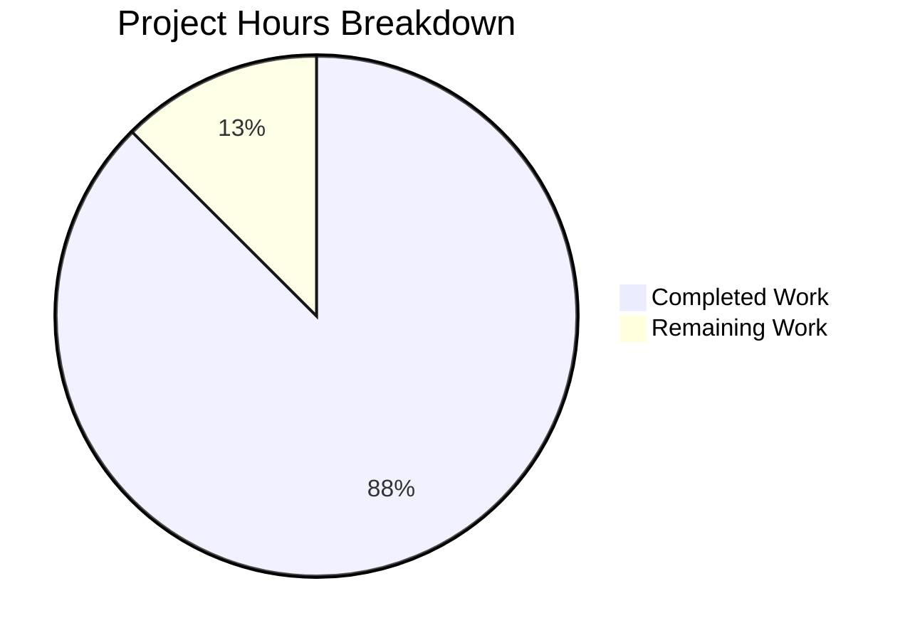

# Project Guide — Node.js Express Tutorial Server

## 1. Executive Summary

**Project completion: 87.5% (7 hours completed out of 8 total hours)**

This greenfield Node.js Express.js tutorial project has been successfully implemented from an empty repository. All features defined in the Agent Action Plan (AAP) are fully operational: two HTTP endpoints (`GET /` and `GET /good-evening`), a comprehensive test suite with 14 passing tests, 100% code coverage, and complete project documentation.

### Key Achievements
- All 6 planned files created from scratch (package.json, jest.config.js, src/app.js, src/server.js, tests/app.test.js, README.md)
- 14/14 tests passing with 100% code coverage across all metrics
- Zero compilation errors, zero test failures, zero runtime errors, zero npm vulnerabilities
- App/server separation pattern correctly implemented for Supertest testability
- Express 5.2.1, Jest 30.2.0, and Supertest 7.2.2 — all latest stable versions

### Critical Unresolved Issues
- **None.** All AAP requirements are fully satisfied with zero issues.

### Recommended Next Steps
- Add a `.gitignore` file to prevent accidental commits of `node_modules/` and `coverage/`
- Conduct a human code review and merge the PR

---

## 2. Validation Results Summary

### 2.1 Final Validator Accomplishments

The Final Validator confirmed all five production-readiness gates passed without requiring any fixes:

| Gate | Status | Details |
|------|--------|---------|
| Dependencies | ✅ PASS | 380 packages installed, 0 vulnerabilities |
| Compilation (Syntax) | ✅ PASS | 4/4 files pass `node --check` |
| Tests | ✅ PASS | 14/14 tests passed (100% pass rate) |
| Coverage | ✅ PASS | 100% statements, branches, functions, lines |
| Runtime | ✅ PASS | Server starts, both endpoints respond correctly |

### 2.2 Test Results Detail

```
PASS tests/app.test.js
  GET /
    ✓ should return 200 status code
    ✓ should return Hello world in response body
    ✓ should return correct Content-Type header
    ✓ should return Hello world with query parameters
  GET /good-evening
    ✓ should return 200 status code
    ✓ should return Good evening in response body
    ✓ should return correct Content-Type header
  404 handling
    ✓ should return 404 for non-existent routes
    ✓ should return 404 for deeply nested non-existent routes
  Unsupported HTTP methods
    ✓ should return 404 or 405 for POST /
    ✓ should return 404 or 405 for PUT /good-evening
    ✓ should return 404 or 405 for DELETE /good-evening
  Express app configuration
    ✓ should export a valid Express app instance
    ✓ should be a valid Node.js module

Test Suites: 1 passed, 1 total
Tests:       14 passed, 14 total
Time:        ~0.4s
```

### 2.3 Coverage Report

```
----------|---------|----------|---------|---------|-------------------
File      | % Stmts | % Branch | % Funcs | % Lines | Uncovered Line #s
----------|---------|----------|---------|---------|-------------------
All files |     100 |      100 |     100 |     100 |
 app.js   |     100 |      100 |     100 |     100 |
----------|---------|----------|---------|---------|-------------------
```

Coverage thresholds (90% minimum) are exceeded in every metric. `src/server.js` is excluded from coverage thresholds by design — its `.listen()` call is not testable via Supertest without port conflicts.

### 2.4 Dependency Status

```
12-feb-5@1.0.0
├── express@5.2.1
├── jest@30.2.0
└── supertest@7.2.2

npm audit: found 0 vulnerabilities
```

### 2.5 Runtime Validation

- `node src/server.js` → "Server is running on port 3000" ✅
- `GET http://localhost:3000/` → "Hello world" (200) ✅
- `GET http://localhost:3000/good-evening` → "Good evening" (200) ✅
- `GET http://localhost:3000/nonexistent` → 404 ✅

### 2.6 Git Status

- Branch: `blitzy-1b0f1090-9cf4-4123-8058-fa81db160820`
- 9 commits on branch (all by Blitzy Agent)
- All in-scope files committed — no uncommitted changes
- Only untracked: `coverage/` and `node_modules/` (build artifacts)
- 455 lines of source code added (excluding package-lock.json)

### 2.7 Fixes Applied During Validation

- **None required.** The implementation passed all validation gates on the first run without any corrections needed.

---

## 3. Completion Assessment

### 3.1 Hours Calculation

**Completed Hours Breakdown (7h total):**

| Category | Hours | Details |
|----------|-------|---------|
| Project configuration | 1.5h | package.json (0.5h), jest.config.js with coverage thresholds and exclusions (0.75h), npm install and lock file (0.25h) |
| Source code implementation | 1.5h | src/app.js with 2 route handlers and JSDoc (1h), src/server.js entry point (0.5h) |
| Test implementation | 2.5h | 14 test cases across 5 describe blocks (2h), test execution and verification (0.5h) |
| Documentation | 1.0h | README.md comprehensive update with API docs, structure, and usage instructions |
| Validation and QA | 0.5h | Syntax checking, dependency audit, runtime verification, coverage validation |
| **Total Completed** | **7h** | |

**Remaining Hours Breakdown (1h total, after enterprise multipliers):**

| Task | Base Hours | After Multipliers (×1.15 ×1.25) | Rounded |
|------|-----------|----------------------------------|---------|
| Add .gitignore file | 0.25h | 0.36h | 0.5h |
| Human code review and merge | 0.25h | 0.36h | 0.5h |
| **Total Remaining** | **0.5h** | **0.72h** | **1h** |

**Completion Formula:**

Completed: 7h / (7h completed + 1h remaining) = 7/8 = **87.5%**

### 3.2 Visual Representation



### 3.3 AAP Requirements vs. Implementation

| AAP Requirement | Status | Evidence |
|----------------|--------|----------|
| `package.json` with Express, Jest, Supertest | ✅ Complete | express@5.2.1, jest@30.2.0, supertest@7.2.2 installed |
| `jest.config.js` with 90% coverage thresholds | ✅ Complete | 90% thresholds for lines, branches, functions, statements |
| `src/app.js` — GET / returns "Hello world" | ✅ Complete | Route handler verified via tests and runtime |
| `src/app.js` — GET /good-evening returns "Good evening" | ✅ Complete | Route handler verified via tests and runtime |
| `src/app.js` — App/server separation (no .listen()) | ✅ Complete | app exported without .listen(); server.js handles binding |
| `src/server.js` — Server entry point | ✅ Complete | Imports app, calls .listen() on configurable port |
| `tests/app.test.js` — Happy path tests | ✅ Complete | 7 tests for GET / and GET /good-evening |
| `tests/app.test.js` — 404 handling tests | ✅ Complete | 2 tests for undefined routes |
| `tests/app.test.js` — HTTP method validation | ✅ Complete | 3 tests for POST, PUT, DELETE |
| `tests/app.test.js` — App config validation | ✅ Complete | 2 tests for Express instance and module export |
| `README.md` — Project documentation | ✅ Complete | Prerequisites, installation, endpoints, testing instructions |
| 90%+ code coverage | ✅ Exceeded | 100% across all metrics |
| CommonJS module format | ✅ Complete | require()/module.exports used throughout |
| 14 total test cases | ✅ Complete | 14/14 passing |

**All AAP scope items are fully implemented. Zero gaps in defined requirements.**

---

## 4. Detailed Task Table — Remaining Work

| # | Task | Description | Priority | Severity | Hours | Confidence |
|---|------|-------------|----------|----------|-------|------------|
| 1 | Add `.gitignore` file | Create `.gitignore` to exclude `node_modules/`, `coverage/`, and other build artifacts from version control. Without this, these directories could be accidentally committed. | Medium | Low | 0.5h | High |
| 2 | Human code review and PR merge | Review all 6 source files for correctness, coding standards, and tutorial suitability. Approve and merge the pull request. | Low | Low | 0.5h | High |
| | **Total Remaining Hours** | | | | **1h** | |

**Verification: Task table total (1h) = Pie chart "Remaining Work" (1h) ✓**

---

## 5. Development Guide

### 5.1 System Prerequisites

| Requirement | Version | Verification Command |
|------------|---------|---------------------|
| Node.js | v20.20.0 or later | `node -v` |
| npm | v11.1.0 or later | `npm -v` |
| Git | Any modern version | `git --version` |

### 5.2 Environment Setup

1. **Clone the repository and switch to the feature branch:**

```bash
git clone <repository-url>
cd <repository-name>
git checkout blitzy-1b0f1090-9cf4-4123-8058-fa81db160820
```

2. **Verify Node.js version:**

```bash
node -v
# Expected output: v20.20.0 (or later)
```

No environment variables are required. The application uses a hardcoded default port of 3000, configurable via the `PORT` environment variable if needed.

### 5.3 Dependency Installation

Install all project dependencies:

```bash
npm install
```

**Expected output:**
```
added 380 packages in Xs
```

Verify installed packages:

```bash
npm ls --depth=0
```

**Expected output:**
```
12-feb-5@1.0.0
├── express@5.2.1
├── jest@30.2.0
└── supertest@7.2.2
```

Verify zero vulnerabilities:

```bash
npm audit
```

**Expected output:**
```
found 0 vulnerabilities
```

### 5.4 Running Tests

Run the full test suite (single pass, non-interactive):

```bash
CI=true npm test -- --watchAll=false --ci
```

**Expected output:**
```
PASS tests/app.test.js
  GET /
    ✓ should return 200 status code
    ✓ should return Hello world in response body
    ✓ should return correct Content-Type header
    ✓ should return Hello world with query parameters
  GET /good-evening
    ✓ should return 200 status code
    ✓ should return Good evening in response body
    ✓ should return correct Content-Type header
  404 handling
    ✓ should return 404 for non-existent routes
    ✓ should return 404 for deeply nested non-existent routes
  Unsupported HTTP methods
    ✓ should return 404 or 405 for POST /
    ✓ should return 404 or 405 for PUT /good-evening
    ✓ should return 404 or 405 for DELETE /good-evening
  Express app configuration
    ✓ should export a valid Express app instance
    ✓ should be a valid Node.js module

Test Suites: 1 passed, 1 total
Tests:       14 passed, 14 total
```

Run tests with coverage report:

```bash
CI=true npm run test:coverage -- --watchAll=false --ci
```

Coverage reports are generated in the `coverage/` directory.

### 5.5 Starting the Application Server

Start the Express server:

```bash
node src/server.js
```

**Expected output:**
```
Server is running on port 3000
```

To use a custom port:

```bash
PORT=8080 node src/server.js
```

### 5.6 Verification Steps

With the server running, verify each endpoint in a separate terminal:

```bash
# Test the Hello world endpoint
curl http://localhost:3000/
# Expected: Hello world

# Test the Good evening endpoint
curl http://localhost:3000/good-evening
# Expected: Good evening

# Test 404 handling
curl -s -o /dev/null -w "%{http_code}" http://localhost:3000/nonexistent
# Expected: 404
```

### 5.7 Project Structure

```
├── src/
│   ├── app.js              # Express application (exports app without .listen())
│   └── server.js           # Server entry point (imports app, calls .listen())
├── tests/
│   └── app.test.js         # 14 test cases for all endpoint behavior
├── jest.config.js          # Jest config (node env, 90% coverage thresholds)
├── package.json            # Dependencies: express, jest, supertest
├── package-lock.json       # Lockfile for reproducible installs
└── README.md               # Full project documentation
```

### 5.8 Troubleshooting

| Issue | Cause | Solution |
|-------|-------|----------|
| `EADDRINUSE: port 3000` | Port 3000 already in use | Kill the existing process: `lsof -ti:3000 \| xargs kill` or use `PORT=3001 node src/server.js` |
| `npm test` enters watch mode | Missing `--watchAll=false` flag | Run `CI=true npm test -- --watchAll=false` |
| `MODULE_NOT_FOUND` on require | Dependencies not installed | Run `npm install` |
| Coverage below 90% threshold | New code added without tests | Add test cases to `tests/app.test.js` for new functionality |

---

## 6. Risk Assessment

### 6.1 Technical Risks

| Risk | Severity | Likelihood | Mitigation |
|------|----------|------------|------------|
| Missing `.gitignore` leads to accidental commit of `node_modules/` | Low | Medium | Create `.gitignore` file (Task #1) |
| Express 5.x breaking changes in future minor releases | Low | Low | `package-lock.json` pins exact versions; `^5.2.1` limits to non-breaking updates |

### 6.2 Security Risks

| Risk | Severity | Likelihood | Mitigation |
|------|----------|------------|------------|
| No security middleware (rate limiting, CORS, helmet) | Low | Low | Out of scope for tutorial; add if deploying to production |
| No input validation on endpoints | Low | Low | Endpoints accept no parameters; responses are static strings |

### 6.3 Operational Risks

| Risk | Severity | Likelihood | Mitigation |
|------|----------|------------|------------|
| No process manager for production (PM2, systemd) | Low | Low | Out of scope for tutorial; use PM2 or Docker for production deployments |
| No logging framework configured | Low | Low | Console.log is sufficient for tutorial; add Winston/Pino for production |

### 6.4 Integration Risks

| Risk | Severity | Likelihood | Mitigation |
|------|----------|------------|------------|
| No external service dependencies | None | N/A | Application is self-contained with zero external integrations |

**Overall Risk Level: LOW** — This is a self-contained tutorial application with minimal complexity, no external dependencies, no database, and no authentication requirements. All identified risks are low severity and relate to production hardening that is explicitly out of scope per the AAP.

---

## 7. Repository Statistics

| Metric | Value |
|--------|-------|
| Total commits on branch | 9 |
| Files created/modified | 6 source files + package-lock.json |
| Lines of code added | 455 (source) + 5,421 (lock file) |
| Source files (`.js`) | 4 (app.js, server.js, app.test.js, jest.config.js) |
| Configuration files | 2 (package.json, jest.config.js) |
| Documentation files | 1 (README.md) |
| Test files | 1 (tests/app.test.js) |
| Test cases | 14 |
| npm packages | 380 (3 direct: express, jest, supertest) |
| npm vulnerabilities | 0 |
| Test pass rate | 100% (14/14) |
| Code coverage | 100% (statements, branches, functions, lines) |

---

## 8. Consistency Verification Checklist

- [x] Completion percentage calculated using hours formula: 7h / (7h + 1h) = 87.5%
- [x] Executive Summary states: "87.5% (7 hours completed out of 8 total hours)"
- [x] Pie chart uses: "Completed Work: 7" and "Remaining Work: 1"
- [x] Task table sums to exactly 1h (0.5h + 0.5h = 1h)
- [x] All percentage and hour references throughout report are consistent
- [x] No conflicting or ambiguous statements exist
- [x] Calculation formula shown with actual numbers