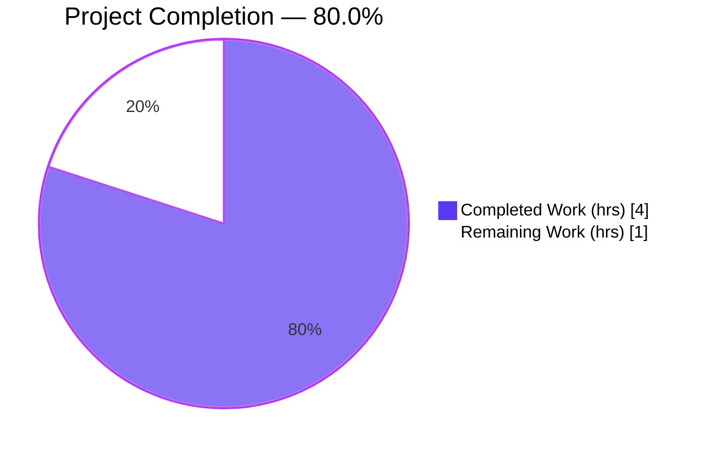
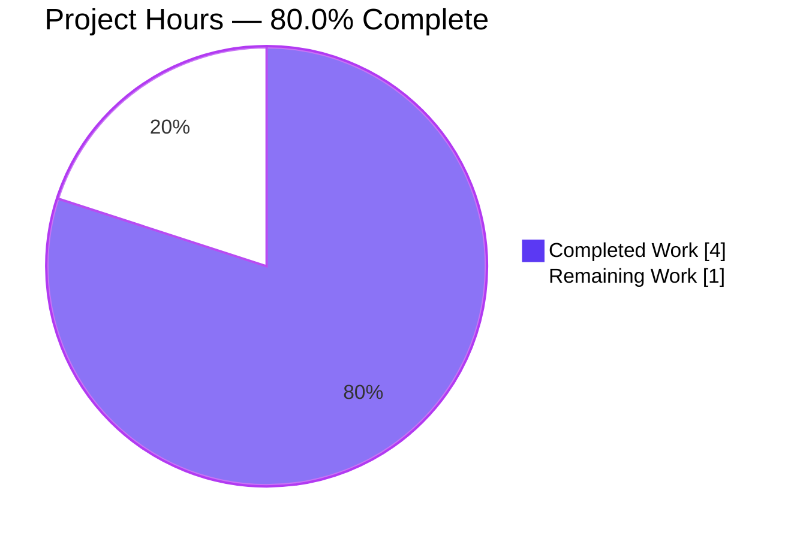
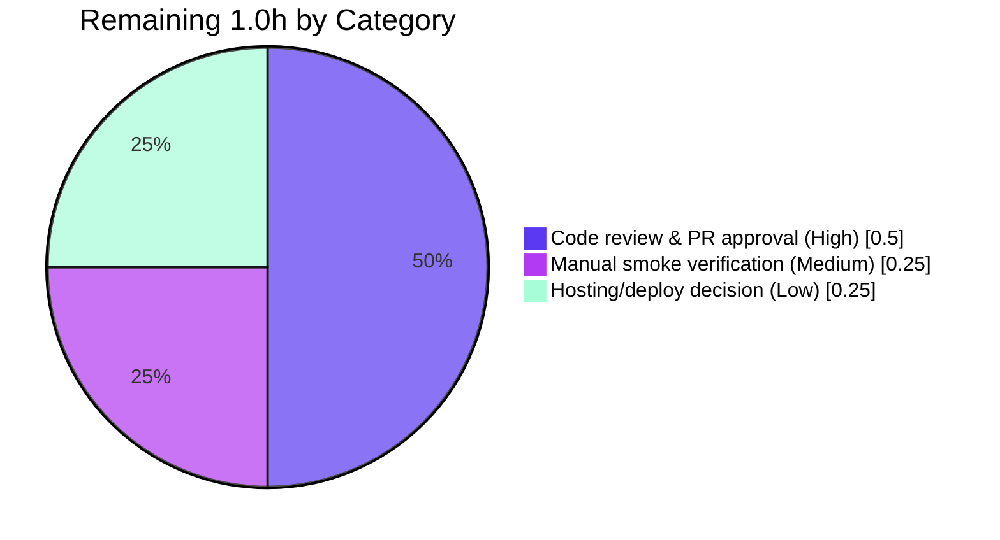

# Blitzy Project Guide — `12_feb_5` Express Service

> **Brand color legend:** **Completed / AI Work** = Dark Blue `#5B39F3` · **Remaining / Not Completed** = White `#FFFFFF` · Headings/Accents = Violet‑Black `#B23AF2` · Highlight = Mint `#A8FDD9`. These colors are applied to all pie charts in this guide (Completed slice `#5B39F3`, Remaining slice `#FFFFFF`).

---

## 1. Executive Summary

### 1.1 Project Overview

This project transforms an effectively greenfield repository (`12_feb_5`) into a minimal, runnable Node.js HTTP service built on the **Express.js** web framework. It serves two read‑only plaintext greeting endpoints — `GET /` returning **"Hello world"** (the preserved baseline) and `GET /good-evening` returning **"Good evening"** (the requested feature). The target users are developers following a tutorial‑grade reference. Business impact is educational/foundational: it establishes the project's entire HTTP/routing foundation. Technical scope is intentionally small — one Express application instance, two GET routes, a single dependency (`express`), and supporting manifest, lockfile, ignore, and documentation files.

### 1.2 Completion Status



| Metric | Value |
|--------|-------|
| **Total Hours** | **5.0** |
| **Completed Hours (AI + Manual)** | **4.0** (AI/Autonomous 4.0 + Manual 0.0) |
| **Remaining Hours** | **1.0** |
| **Percent Complete** | **80.0%** |

> Completion is computed by the AAP‑scoped hours methodology: `Completed ÷ (Completed + Remaining) × 100 = 4.0 ÷ 5.0 × 100 = 80.0%`. All AAP‑specified engineering is complete; the remaining 1.0h is exclusively human path‑to‑production sign‑off.

### 1.3 Key Accomplishments

- ✅ **Express.js adopted (R1)** — `express ^5.2.1` declared as the sole runtime dependency and resolved (`require('express')` works).
- ✅ **"Hello world" baseline endpoint (R2)** — `GET /` returns the exact string, verified live (HTTP 200, length 11).
- ✅ **"Good evening" feature endpoint (R3)** — `GET /good-evening` returns the exact string, verified live (HTTP 200, length 12); coexists with the root route (additive, never shadowed).
- ✅ **Runnable server (R4)** — `app.listen(process.env.PORT || 3000)`; verified on default port 3000 (`npm start`) and via a custom `PORT=3137` override.
- ✅ **Reproducible dependency install** — `npm ci` adds 67 packages, audits 68, reports **0 vulnerabilities**; `npm ls` shows a clean single‑dependency tree.
- ✅ **Production‑grade hygiene & docs** — `.gitignore` excludes `node_modules/`; `README.md` documents prerequisites, install/run steps, and the endpoint table, cross‑consistent with `server.js` and `package.json`.
- ✅ **Zero placeholders** — no TODO/FIXME/stubs; static gate `node --check server.js` passes (exit 0).

### 1.4 Critical Unresolved Issues

| Issue | Impact | Owner | ETA |
|-------|--------|-------|-----|
| _None_ — autonomous validation found zero unresolved issues; all five readiness gates passed. | None | — | — |

### 1.5 Access Issues

| System/Resource | Type of Access | Issue Description | Resolution Status | Owner |
|-----------------|----------------|-------------------|-------------------|-------|
| — | — | No access issues identified. The project requires only a local Node.js ≥ 18 runtime; no external services, credentials, or third‑party APIs are involved. | N/A | — |

**No access issues identified.**

### 1.6 Recommended Next Steps

1. **[High]** Perform human code review of the 5 in‑scope files and approve/merge the PR.
2. **[Medium]** Run a manual smoke test in your environment (`npm ci` → `npm start` → curl both endpoints).
3. **[Low]** Decide the runtime hosting target (local / container / PaaS) and set `PORT` if 3000 is occupied.
4. **[Low, optional/future]** Consider out‑of‑scope enhancements (automated tests, hardening middleware, health/monitoring, CI/CD) if the service moves beyond tutorial scope.

---

## 2. Project Hours Breakdown

### 2.1 Completed Work Detail

All completed work is AAP‑scoped autonomous engineering, verified production‑ready.

| Component | Hours | Description |
|-----------|-------|-------------|
| Project scaffolding & npm manifest (`package.json`) | 0.50 | Metadata, `main: server.js`, `start` script, `express ^5.2.1` dependency declaration (R1, R4). |
| Express server implementation (`server.js`) | 1.00 | App instance, `GET /` → "Hello world" (R2), `GET /good-evening` → "Good evening" (R3), `app.listen(process.env.PORT || 3000)` (R4), `require('express')` (R1), production‑grade doc comments. |
| Dependency resolution & lockfile (`package-lock.json`) | 0.50 | Express version selection (5.2.1 vs 4.x), `npm install`, lockfile generation & commit (lockfileVersion 3, 68 pkgs). |
| Repository hygiene (`.gitignore`) | 0.25 | Excludes `node_modules/` and log files. |
| Project documentation (`README.md`) | 0.75 | Description, prerequisites, install/run sections, endpoint reference table, curl example, version notes. |
| Runtime & functional verification | 1.00 | Multi‑path server runs (default 3000, `npm start`, `PORT=3137`), exact‑match endpoint assertions, 404 + Content‑Type checks, port cleanup, 5 readiness gates. |
| **Total Completed** | **4.00** | **= Completed Hours in Section 1.2** |

### 2.2 Remaining Work Detail

All remaining work is human path‑to‑production sign‑off (agents cannot perform these gates). No remaining hours stem from AAP‑scoped defects or rework.

| Category | Hours | Priority |
|----------|-------|----------|
| Code review & PR approval | 0.50 | High |
| Manual smoke verification in target environment | 0.25 | Medium |
| Runtime hosting/deployment decision | 0.25 | Low |
| **Total Remaining** | **1.00** | **= Remaining Hours in Section 1.2 = Section 7 pie "Remaining Work"** |

### 2.3 Hours Summary & Reconciliation

| Bucket | Hours |
|--------|-------|
| Completed (Section 2.1) | 4.0 |
| Remaining (Section 2.2) | 1.0 |
| **Total Project (Section 1.2)** | **5.0** |
| **Percent Complete** | **80.0%** |

✔ **Integrity:** Section 2.1 (4.0) + Section 2.2 (1.0) = 5.0 = Section 1.2 Total. Section 2.2 (1.0) = Section 1.2 Remaining (1.0) = Section 7 "Remaining Work" (1.0).

> **Out of scope (informational only — NOT counted in the hours above or completion %):** automated tests (Jest/Supertest) ~2–3h · hardening middleware (helmet/CORS/rate‑limit) ~2–4h · `/health` + structured logging/monitoring ~2–4h · CI/CD + Dockerfile ~4–8h · process manager/auto‑restart ~1–2h. These map to AAP §0.5.2 exclusions.

---

## 3. Test Results

**Automated unit/integration test frameworks are explicitly out of scope per AAP §0.5.2** (Jest/Mocha/Supertest were intentionally excluded). Functional correctness was instead proven by Blitzy's autonomous validation via direct HTTP exact‑string assertions, a static syntax gate, and a dependency audit. The table below aggregates the checks executed by Blitzy's autonomous validation logs (independently re‑reproduced during guide generation).

| Test Category | Framework | Total | Passed | Failed | Coverage % | Notes |
|---------------|-----------|-------|--------|--------|------------|-------|
| Runtime / Functional (HTTP) | curl / Invoke‑WebRequest exact‑match | 6 | 6 | 0 | N/A | `GET /`→"Hello world" & `GET /good-evening`→"Good evening" across default port + `npm start` + `PORT=3137`; `GET /nonexistent`→404. |
| Static Analysis | `node --check` (CommonJS syntax gate) | 1 | 1 | 0 | N/A | `server.js` exit 0 (no separate compile step for CommonJS JS). |
| Dependency Audit | `npm ci` / `npm audit` | 1 | 1 | 0 | N/A | 67 added, 68 audited, **0 vulnerabilities**. |
| Unit / Integration (automated) | — (none by design) | 0 | 0 | 0 | N/A | Out of AAP scope §0.5.2; correctness proven via runtime assertions above. |
| **Totals** | | **8** | **8** | **0** | **N/A** | 100% pass rate; coverage N/A (no instrumented suite by design). |

> **Integrity note:** every entry above originates from Blitzy's autonomous validation execution for this project; no external or fabricated tests are included. Coverage % is "N/A" because no instrumented automated test suite exists (by design).

---

## 4. Runtime Validation & UI Verification

**Runtime health** (verified across three independent run paths):

- ✅ **Operational** — `node server.js` on default port 3000: clean startup log `Server listening on port 3000`.
- ✅ **Operational** — `npm start` (start script = `node server.js`): both endpoints served on port 3000.
- ✅ **Operational** — `process.env.PORT=3137` override: clean startup log `Server listening on port 3137` (proves the env‑driven port branch).
- ✅ **Operational** — Clean shutdown each run; ports 3000 & 3137 freed afterward (no orphaned listeners).

**API / endpoint verification:**

- ✅ **Operational** — `GET /` → HTTP 200, body `Hello world` (length 11), `Content-Type: text/html; charset=utf-8`, exact‑match TRUE.
- ✅ **Operational** — `GET /good-evening` → HTTP 200, body `Good evening` (length 12), exact‑match TRUE.
- ✅ **Operational** — Both endpoints coexist; root route is never shadowed by the feature route (additive change).
- ✅ **Operational** — `GET /nonexistent` → HTTP 404 (Express default handler), as expected for tutorial scope.

**UI verification:**

- ⚠ **Not applicable** — This is a backend plaintext HTTP service with no graphical user interface (AAP §0.3.3). The "interface" is solely the two HTTP GET endpoints, validated above.

---

## 5. Compliance & Quality Review

Cross‑mapping of AAP deliverables and engineering directives to Blitzy quality/compliance benchmarks. All fixes applied during autonomous validation: **none required** — the implementation arrived complete and correct.

| AAP Deliverable / Directive | Benchmark | Status | Progress |
|-----------------------------|-----------|--------|----------|
| R1 — Adopt Express.js | Named‑framework directive honored | ✅ Pass | 100% |
| R2 — `GET /` → "Hello world" | Exact response fidelity | ✅ Pass | 100% |
| R3 — `GET /good-evening` → "Good evening" | Exact response fidelity | ✅ Pass | 100% |
| R4 — Runnable on `process.env.PORT || 3000` | Runnability is part of "done" | ✅ Pass | 100% |
| Preserve "Hello world" behavior | Additive, non‑destructive change | ✅ Pass | 100% |
| Dependency version pinning | No placeholder versions (`express ^5.2.1` + lockfile) | ✅ Pass | 100% |
| Zero placeholder policy | No stubs/TODOs/FIXMEs | ✅ Pass | 100% |
| Repository hygiene | `.gitignore` excludes `node_modules/` | ✅ Pass | 100% |
| Documentation consistency | README cross‑consistent with code & manifest | ✅ Pass | 100% |
| Security audit | `npm audit` clean | ✅ Pass | 100% (0 vulns) |
| Reproducible build | `npm ci` from lockfile | ✅ Pass | 100% |
| Scope discipline | No out‑of‑scope code introduced (§0.5.2) | ✅ Pass | 100% |

**Outstanding compliance items:** None within AAP scope. Items such as automated tests and hardening middleware are intentionally deferred per AAP §0.5.2 and tracked as optional future enhancements (Section 2.3).

---

## 6. Risk Assessment

All risks are **Low or Very Low** severity, consistent with the production‑ready verdict and the trivial greenfield scope. None block release of the AAP‑scoped deliverable.

| Risk | Category | Severity | Probability | Mitigation | Status |
|------|----------|----------|-------------|------------|--------|
| RK1 — Caret range `^5.2.1` could resolve a newer 5.x on a fresh `npm install` without the lockfile | Technical | Low | Low | `package-lock.json` pins the exact tree; install via `npm ci` | Mitigated |
| RK2 — No automated test suite limits regression safety as the project grows | Technical | Low | Medium | Out of AAP scope §0.5.2; correctness proven via runtime assertions; add Jest/Supertest as future work | Accepted (out of scope) |
| RK3 — No production‑hardening middleware (helmet/CORS/rate‑limit/compression) | Security | Low | Low | Endpoints are read‑only, parameterless, no sensitive data / no body parsing; add if publicly exposed | Accepted (out of scope) |
| RK4 — Dependency vulnerabilities may emerge over time | Security | Low | Low | `npm ci` = 0 vulnerabilities at build; schedule periodic `npm audit` | Mitigated |
| RK5 — No health‑check endpoint / structured logging / monitoring | Operational | Low | Medium | Add `/health` + logging/metrics when deploying to managed infra | Accepted (out of scope) |
| RK6 — No process manager / auto‑restart if the Node process crashes | Operational | Low | Low | Use pm2/systemd/container restart policy in the target environment | Open (deferred to deployment) |
| RK7 — Default port 3000 may conflict with other local services | Operational | Low | Low | `process.env.PORT` override implemented & verified (PORT=3137) | Mitigated |
| RK8 — Integration surface = single dependency; no external services/credentials | Integration | Very Low | Low | `express` locked via lockfile; `npm ci` reproducible; zero external integrations | Mitigated |

**Summary:** 8 risks (2 Technical, 2 Security, 3 Operational, 1 Integration). No critical/high/medium‑severity risks. 4 Mitigated, 3 Accepted as out‑of‑scope, 1 Open/deferred to the human deployment decision. Security posture: **0 vulnerabilities** (npm audit clean).

---

## 7. Visual Project Status

**Project hours breakdown** (Completed `#5B39F3` · Remaining `#FFFFFF`):



**Remaining work by category** (sums to 1.0h — matches Section 2.2 and Section 1.2 Remaining):



> **Integrity:** the "Remaining Work" value (1.0) equals Section 1.2 Remaining Hours (1.0) and the sum of the Section 2.2 Hours column (0.5 + 0.25 + 0.25 = 1.0). "Completed Work" (4.0) equals Section 1.2 Completed Hours and the Section 2.1 total.

---

## 8. Summary & Recommendations

**Achievements.** The project is **80.0% complete** (4.0 of 5.0 hours). All four AAP requirements (R1–R4) and all five in‑scope files are delivered, validated, and **production‑ready**. Both endpoints return their exact strings (`Hello world`, `Good evening`), the server runs on the default port and honors a `PORT` override, dependencies install reproducibly with zero vulnerabilities, and the change is strictly additive — the baseline behavior is preserved. Autonomous validation passed all readiness gates with **zero unresolved issues** and required **zero fixes**.

**Remaining gaps.** The remaining 1.0 hour (20%) is exclusively **human path‑to‑production sign‑off** that cannot be performed autonomously: code review & PR approval (0.5h), a manual smoke test in the reviewer's environment (0.25h), and a runtime hosting decision (0.25h). Critically, **none** of the remaining hours stem from defects, failing checks, or rework.

**Critical path to production.** (1) Human review & approve the PR → (2) smoke test locally (`npm ci` → `npm start` → curl both endpoints) → (3) choose a runtime target and set `PORT` if needed → merge/deploy.

**Success metrics.** Both endpoints return exact strings with HTTP 200; server boots cleanly on the chosen port; `npm ci` reports 0 vulnerabilities; `node --check` exits 0.

**Production‑readiness assessment.** The AAP‑scoped deliverable is **ready for release pending human sign‑off**. Optional enhancements (automated tests, hardening middleware, health/monitoring, CI/CD, process management) are out of AAP scope and recommended only if the service evolves beyond its tutorial purpose; they are not prerequisites for the requested feature.

| Metric | Value |
|--------|-------|
| Completion | 80.0% |
| AAP requirements delivered | 4 / 4 (100%) |
| In‑scope files delivered | 5 / 5 (100%) |
| Open defects | 0 |
| Security vulnerabilities | 0 |
| Remaining (human sign‑off) | 1.0h |

---

## 9. Development Guide

> All commands below were live‑tested during guide generation on **Node v20.20.2 / npm 10.8.2**. Bash examples are shown; PowerShell variants are noted where they differ.

### 9.1 System Prerequisites

- **Node.js ≥ 18** (Express 5 declares `engines.node >= 18`). Verified on `v20.20.2`.
- **npm** (bundled with Node.js). Verified on `10.8.2`.
- OS‑agnostic (Windows / macOS / Linux). ~50 MB free disk for `node_modules/`.

```bash
node --version    # expect >= v18
npm --version
```

### 9.2 Environment Setup

- Work from the repository root (the directory containing `package.json` and `server.js`).
- **No mandatory environment variables.**
- Optional: `PORT` overrides the listening port (defaults to `3000`).

### 9.3 Dependency Installation

```bash
# Preferred: reproducible install from the committed lockfile
npm ci
# Expected: "added 67 packages, and audited 68 packages ... found 0 vulnerabilities"

# Alternative (if no lockfile is present):
npm install
```

Verify the dependency tree:

```bash
npm ls
# Expected:
# 12_feb_5@1.0.0 <path>
# `-- express@5.2.1
```

### 9.4 Application Startup

```bash
npm start
# Runs "node server.js"; expected stdout: "Server listening on port 3000"
```

Override the port:

```bash
# bash / macOS / Linux
PORT=8080 npm start
```
```powershell
# Windows PowerShell
$env:PORT = "8080"; npm start
```

### 9.5 Verification Steps

```bash
# In a second terminal while the server runs:
curl http://localhost:3000/                 # -> Hello world
curl http://localhost:3000/good-evening     # -> Good evening

# Static syntax gate (no server required):
node --check server.js                       # exit 0 = OK
```

PowerShell verification:

```powershell
(Invoke-WebRequest -UseBasicParsing http://localhost:3000/).Content              # Hello world
(Invoke-WebRequest -UseBasicParsing http://localhost:3000/good-evening).Content  # Good evening
```

### 9.6 Example Usage

```bash
$ curl -i http://localhost:3000/good-evening
HTTP/1.1 200 OK
Content-Type: text/html; charset=utf-8
Content-Length: 12

Good evening
```

### 9.7 Troubleshooting

- **`Error: listen EADDRINUSE` / port 3000 busy** → start on another port: `PORT=8080 npm start`.
- **`Cannot find module 'express'`** → dependencies not installed; run `npm ci` (or `npm install`).
- **Node engine warning / unexpected syntax errors** → upgrade Node.js to ≥ 18.
- **`npm test` → "Missing script: test"** → expected; there is no test script by design (tests are out of AAP scope §0.5.2).
- **404 on a path other than `/` or `/good-evening`** → expected; only those two routes are defined (Express returns its default 404).

---

## 10. Appendices

### A. Command Reference

| Command | Purpose |
|---------|---------|
| `npm ci` | Reproducible dependency install from `package-lock.json` |
| `npm install` | Install/resolve dependencies (writes lockfile if absent) |
| `npm start` | Start the server (`node server.js`) |
| `npm ls` | Show the dependency tree |
| `node server.js` | Run the server directly |
| `node --check server.js` | Static syntax validation (exit 0 = OK) |
| `curl http://localhost:3000/` | Invoke the "Hello world" endpoint |
| `curl http://localhost:3000/good-evening` | Invoke the "Good evening" endpoint |

### B. Port Reference

| Port | Service | Notes |
|------|---------|-------|
| 3000 | Express HTTP server (default) | Used when `PORT` is unset |
| `$PORT` | Express HTTP server (override) | Any value via `process.env.PORT` (verified on 3137) |

### C. Key File Locations

| File | Role |
|------|------|
| `server.js` | Express app: 2 GET routes + `app.listen` (entry point) |
| `package.json` | Manifest: `start` script, `express ^5.2.1` dependency |
| `package-lock.json` | Locked dependency tree (lockfileVersion 3, 68 packages) |
| `.gitignore` | Excludes `node_modules/` and logs |
| `README.md` | Project description, prerequisites, install/run, endpoint table |

### D. Technology Versions

| Component | Version | Notes |
|-----------|---------|-------|
| Node.js | ≥ 18 (verified `v20.20.2`) | Express 5 requires `engines.node >= 18` |
| npm | `10.8.2` (verified) | Build/run tooling |
| express | `^5.2.1` (resolved `5.2.1`) | Sole runtime dependency; MIT license |
| Total resolved packages | 68 | express + 67 transitive (locked) |

### E. Environment Variable Reference

| Variable | Required | Default | Purpose |
|----------|----------|---------|---------|
| `PORT` | No | `3000` | TCP port the HTTP server binds to (`process.env.PORT || 3000`) |

### F. Developer Tools Guide

| Tool | Use |
|------|-----|
| `node --check` | Validate `server.js` syntax without running it |
| `npm audit` | Check dependencies for known vulnerabilities (currently 0) |
| `curl` / `Invoke-WebRequest` | Exercise endpoints and inspect status/headers/body |
| `npm ls` | Confirm the resolved dependency tree |

### G. Glossary

| Term | Definition |
|------|------------|
| Express.js | Minimal Node.js web framework used here for routing and request/response handling |
| Endpoint | An HTTP route + method pair (e.g., `GET /good-evening`) that returns a response |
| Lockfile | `package-lock.json`; pins exact dependency versions for reproducible installs |
| Additive change | A change that adds behavior without removing/altering existing behavior |
| Path‑to‑production | Standard activities (review, smoke test, hosting decision) to move validated code toward release |
| Greenfield | A project started from scratch with no pre‑existing code patterns to follow |

---

*Cross‑section integrity verified: Section 1.2 Remaining (1.0h) = Section 2.2 sum (1.0h) = Section 7 "Remaining Work" (1.0). Section 2.1 (4.0h) + Section 2.2 (1.0h) = 5.0h Total. Completion 80.0% used consistently in Sections 1.2, 7, and 8. All Section 3 results originate from Blitzy's autonomous validation logs. Brand colors applied: Completed `#5B39F3`, Remaining `#FFFFFF`.*