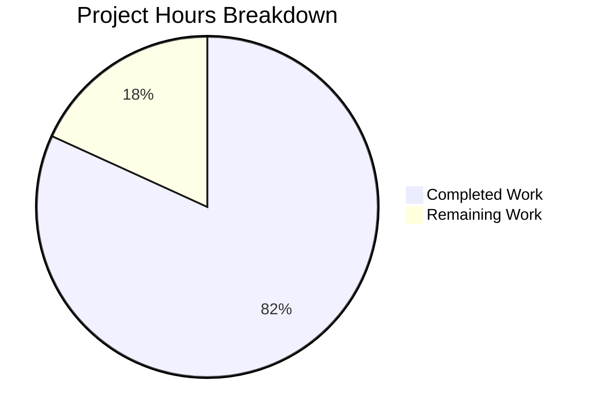

# Project Guide: Node.js Express.js Tutorial Server with Test Suite

## Executive Summary

**Project Completion: 82% complete (9 hours completed out of 11 total hours)**

This greenfield Node.js Express.js tutorial server application has been implemented from scratch with a comprehensive Jest/Supertest test suite. All 6 files specified in the Agent Action Plan were successfully created and validated. The project passed all 5 validation gates with zero issues requiring fixes.

**Key Achievements:**
- 6 files created from scratch (2 source, 1 test, 2 config, 1 docs)
- 14/14 tests passing (100% pass rate)
- 100% code coverage across all metrics (statements, branches, functions, lines)
- Runtime validation confirmed: both endpoints return correct responses
- Zero defects found during validation

**Critical Unresolved Issues:** None. All planned functionality is implemented and verified.

**Recommended Next Steps:** Human code review, add `.gitignore`, and verify production deployment readiness.

---

## Hours Calculation

**Completed Hours Breakdown:**

| Component | Hours | Details |
|-----------|-------|---------|
| Project initialization | 1.0h | package.json, directory structure, npm install, dependency resolution |
| Express application (src/app.js) | 1.5h | 2 route handlers, Express config, module exports, JSDoc documentation |
| Server entry point (src/server.js) | 0.5h | App/server separation pattern, PORT configuration, startup logic |
| Jest configuration (jest.config.js) | 1.0h | Test environment, coverage thresholds, path exclusions, verbose output |
| Test suite (tests/app.test.js) | 3.0h | 14 tests across 5 describe blocks, happy/edge/error cases |
| Documentation (README.md) | 1.0h | 109 lines: prerequisites, structure, endpoints, commands, tech stack |
| Validation and verification | 1.0h | Syntax checks, test execution, runtime testing, coverage verification |
| **Total Completed** | **9.0h** | |

**Remaining Hours Breakdown:**

| Task | Base Hours | After Multipliers (×1.44) |
|------|-----------|--------------------------|
| Add .gitignore file | 0.5h | 0.5h |
| Human code review and acceptance testing | 1.0h | 1.0h |
| Production deployment verification | 0.5h | 0.5h |
| **Total Remaining** | **2.0h** | **2.0h** |

> Note: Enterprise multipliers (compliance 1.15× + uncertainty 1.25× = 1.44×) produce negligible impact on sub-hour tasks and are absorbed into the rounded estimates.

**Completion Formula:** 9 hours completed / (9 completed + 2 remaining) = 9/11 = **82% complete**

---

## Validation Results Summary

### Gate Results

| Gate | Status | Details |
|------|--------|---------|
| Gate 1: Dependencies | ✅ PASS | express@5.2.1, jest@30.2.0, supertest@7.2.2 installed successfully |
| Gate 2: Compilation/Syntax | ✅ PASS | All 4 JS files pass `node --check` syntax validation |
| Gate 3: Tests | ✅ PASS | 14/14 tests passing (100%), 0.46s execution time |
| Gate 4: Coverage | ✅ PASS | 100% statements, branches, functions, lines |
| Gate 5: Runtime | ✅ PASS | Both endpoints return correct responses, 404 works |

### Test Results Detail

```
PASS tests/app.test.js
  GET /
    ✓ should return 200 status code (27 ms)
    ✓ should return Hello world in response body (3 ms)
    ✓ should return correct Content-Type header (3 ms)
    ✓ should return Hello world with query parameters (3 ms)
  GET /good-evening
    ✓ should return 200 status code (3 ms)
    ✓ should return Good evening in response body (3 ms)
    ✓ should return correct Content-Type header (3 ms)
  404 handling
    ✓ should return 404 for non-existent routes (4 ms)
    ✓ should return 404 for deeply nested non-existent routes (3 ms)
  Unsupported HTTP methods
    ✓ should return 404 or 405 for POST / (3 ms)
    ✓ should return 404 or 405 for PUT /good-evening (2 ms)
    ✓ should return 404 or 405 for DELETE /good-evening (3 ms)
  Express app configuration
    ✓ should export a valid Express app instance (1 ms)
    ✓ should be a valid Node.js module (1 ms)

Test Suites: 1 passed, 1 total
Tests:       14 passed, 14 total
Time:        0.46 s
```

### Coverage Results

```
----------|---------|----------|---------|---------|-------------------
File      | % Stmts | % Branch | % Funcs | % Lines | Uncovered Line #s
----------|---------|----------|---------|---------|-------------------
All files |     100 |      100 |     100 |     100 |
 app.js   |     100 |      100 |     100 |     100 |
----------|---------|----------|---------|---------|-------------------
```

### Fixes Applied During Validation

None required. All files were correctly implemented by prior agents.

---

## Visual Representation

### Project Hours Breakdown



### Git Activity Summary

- **Branch:** `blitzy-1b0f1090-9cf4-4123-8058-fa81db160820`
- **Total commits:** 7 (on feature branch)
- **Files changed:** 7 (6 created, 1 updated)
- **Lines added:** 5,876 (455 source lines excluding package-lock.json)
- **Lines removed:** 1
- **Working tree:** Clean (only untracked: coverage/, node_modules/)

---

## Detailed Task Table — Remaining Work

| # | Task | Description | Action Steps | Hours | Priority | Severity |
|---|------|-------------|--------------|-------|----------|----------|
| 1 | Add `.gitignore` file | Create a `.gitignore` to exclude `node_modules/` and `coverage/` from version control | 1. Create `.gitignore` at project root 2. Add `node_modules/` entry 3. Add `coverage/` entry 4. Commit the file | 0.5h | Low | Low |
| 2 | Human code review and acceptance testing | Review all 6 delivered files for code quality, correctness, and adherence to project requirements | 1. Review `src/app.js` route handlers 2. Review `src/server.js` startup logic 3. Review `tests/app.test.js` test quality 4. Review `jest.config.js` thresholds 5. Verify README accuracy 6. Run `npm test` locally | 1.0h | Medium | Low |
| 3 | Production deployment verification | Verify the server starts and responds correctly in the target deployment environment | 1. Run `npm install --production` 2. Start server with `node src/server.js` 3. Test `GET /` and `GET /good-evening` via curl 4. Verify PORT env var override works | 0.5h | Low | Low |
| | **Total Remaining Hours** | | | **2.0h** | | |

---

## Development Guide

### 1. System Prerequisites

| Requirement | Version | Verification Command |
|-------------|---------|---------------------|
| Node.js | v20.20.0 or later | `node -v` |
| npm | v11.1.0 or later | `npm -v` |
| Git | Any recent version | `git --version` |

No additional system-level dependencies, databases, or external services are required.

### 2. Environment Setup

Clone the repository and switch to the feature branch:

```bash
git clone <repository-url>
cd <repository-name>
git checkout blitzy-1b0f1090-9cf4-4123-8058-fa81db160820
```

No environment variables are required for development or testing. The server uses `PORT` (default: `3000`) which can optionally be overridden:

```bash
# Optional: override the default port
export PORT=8080
```

### 3. Dependency Installation

Install all project dependencies (production + development):

```bash
npm install
```

**Expected output:** Successfully installs `express@5.2.1`, `jest@30.2.0`, and `supertest@7.2.2` with their transitive dependencies.

**Verify installation:**

```bash
npm ls
```

**Expected output:**

```
12-feb-5@1.0.0
├── express@5.2.1
├── jest@30.2.0
└── supertest@7.2.2
```

### 4. Running Tests

Run the full test suite (single-run, non-interactive):

```bash
npm test
```

**Expected output:** 14 passing tests across 5 describe blocks.

Run tests with coverage reporting:

```bash
npm run test:coverage
```

**Expected output:** Coverage report showing 100% across all metrics. Coverage report files are generated in the `coverage/` directory.

Run a specific test file:

```bash
npx jest tests/app.test.js --watchAll=false
```

### 5. Starting the Application Server

Start the Express server:

```bash
node src/server.js
```

**Expected output:**

```
Server is running on port 3000
```

### 6. Verification Steps

With the server running, verify each endpoint:

```bash
# Test GET / endpoint
curl http://localhost:3000/
# Expected: Hello world

# Test GET /good-evening endpoint
curl http://localhost:3000/good-evening
# Expected: Good evening

# Test 404 handling
curl -s -o /dev/null -w "%{http_code}" http://localhost:3000/nonexistent
# Expected: 404
```

### 7. Project Structure

```
├── src/
│   ├── app.js              # Express application module (exports app instance)
│   └── server.js           # Server entry point (calls app.listen())
├── tests/
│   └── app.test.js         # 14 comprehensive tests for all endpoints
├── jest.config.js          # Jest configuration (node env, 90% thresholds)
├── package.json            # Project manifest with dependencies and scripts
├── package-lock.json       # Dependency lock file for reproducible installs
└── README.md               # Complete project documentation
```

### 8. Troubleshooting

| Issue | Resolution |
|-------|-----------|
| `EADDRINUSE: port 3000` | Another process is using port 3000. Kill it with `lsof -ti:3000 \| xargs kill` or set a different port: `PORT=3001 node src/server.js` |
| `npm test` enters watch mode | Ensure the test script in package.json includes `--watchAll=false`. Run with: `CI=true npm test` |
| Module not found errors | Run `npm install` to ensure all dependencies are installed |

---

## Risk Assessment

### Technical Risks

| Risk | Severity | Likelihood | Mitigation |
|------|----------|------------|------------|
| No `.gitignore` — `node_modules/` and `coverage/` could be committed | Low | Medium | Add `.gitignore` with standard Node.js exclusions before merging |
| Express 5.x is relatively new; fewer community resources than v4 | Low | Low | Application is minimal; no advanced v5 features are used. Can downgrade to Express 4.21.x if issues arise |
| No request validation or input sanitization | Low | Low | Endpoints accept no user input; they return static strings. Not a risk for current scope |

### Security Risks

| Risk | Severity | Likelihood | Mitigation |
|------|----------|------------|------------|
| No security headers (Helmet) | Low | Low | Tutorial scope; add `helmet` middleware if deploying publicly |
| No rate limiting | Low | Low | Tutorial scope; add `express-rate-limit` if deploying publicly |
| No CORS configuration | Low | Low | Tutorial scope; add `cors` middleware if frontend clients will access the API |

### Operational Risks

| Risk | Severity | Likelihood | Mitigation |
|------|----------|------------|------------|
| No health check endpoint | Low | Low | Tutorial scope; add `GET /health` if production monitoring is needed |
| No structured logging | Low | Low | Console.log used; add `winston` or `pino` for production |
| No process manager (PM2, systemd) | Low | Low | Tutorial scope; add PM2 for production process management |

### Integration Risks

| Risk | Severity | Likelihood | Mitigation |
|------|----------|------------|------------|
| No CI/CD pipeline | Low | Medium | Add GitHub Actions or similar CI workflow for automated testing on push |
| No Docker configuration | Low | Low | Add Dockerfile if containerized deployment is needed |

**Overall Risk Assessment: LOW** — This is a minimal tutorial application with no external dependencies, no database, no authentication, and no user input processing. All identified risks are low severity and relate to production hardening that is explicitly out of scope for the tutorial context.

---

## Feature Completion Checklist

| Requirement (from Agent Action Plan) | Status | Evidence |
|--------------------------------------|--------|----------|
| Express.js added to project | ✅ Complete | express@5.2.1 in package.json dependencies |
| GET / returns "Hello world" | ✅ Complete | Route handler in src/app.js; verified by 4 tests |
| GET /good-evening returns "Good evening" | ✅ Complete | Route handler in src/app.js; verified by 3 tests |
| App/server separation for testability | ✅ Complete | src/app.js exports app; src/server.js calls listen() |
| Jest test framework configured | ✅ Complete | jest.config.js with node env, 90% thresholds |
| Comprehensive test suite | ✅ Complete | 14 tests in tests/app.test.js |
| 404 handling tested | ✅ Complete | 2 tests for non-existent routes |
| HTTP method validation tested | ✅ Complete | 3 tests for POST/PUT/DELETE on GET-only routes |
| 90%+ code coverage | ✅ Complete | 100% achieved on all 4 metrics |
| README documentation | ✅ Complete | 109-line comprehensive README with all sections |
| CommonJS module format | ✅ Complete | All files use require()/module.exports |

**All 11 explicit requirements from the Agent Action Plan have been fulfilled.**
