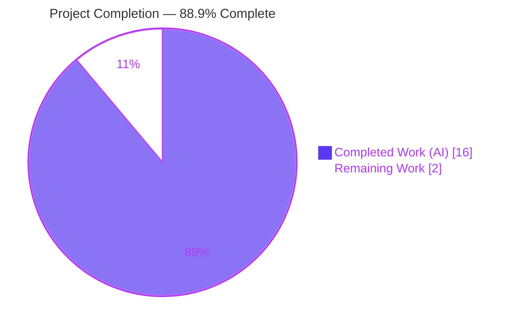
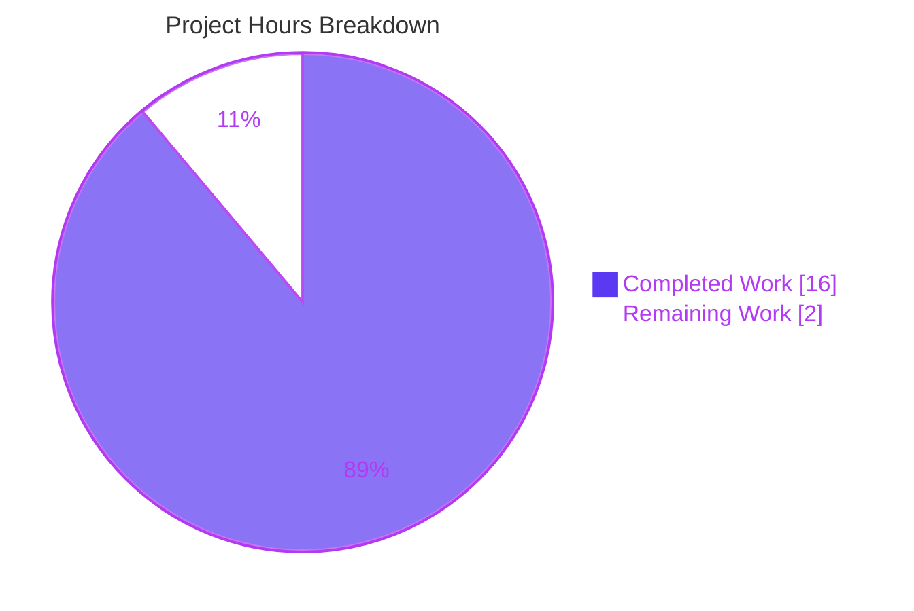
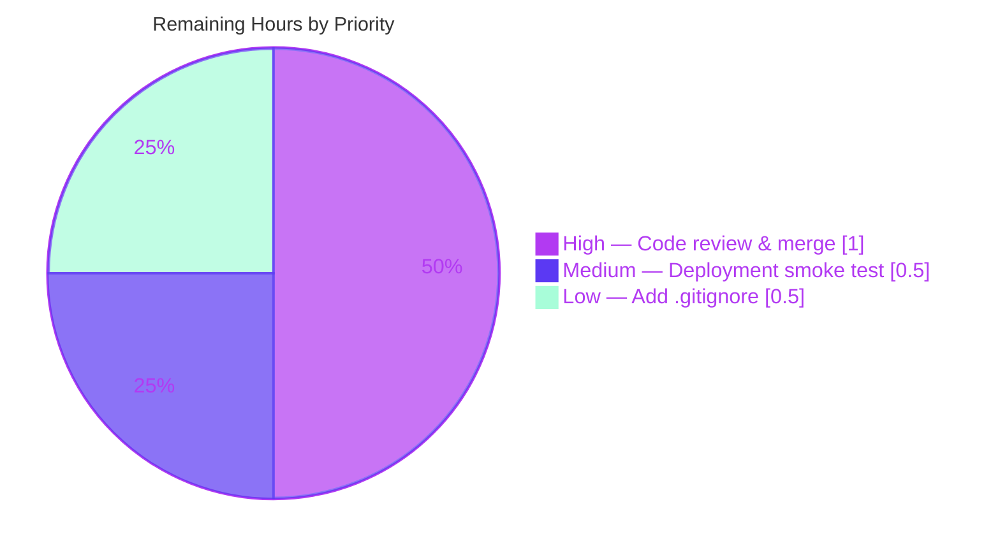

# Blitzy Project Guide — Node.js Express Tutorial Server

> **Brand legend:** Completed / AI Work = Dark Blue `#5B39F3` · Remaining / Not Completed = White `#FFFFFF` · Headings / Accents = Violet-Black `#B23AF2` · Highlight = Mint `#A8FDD9`

---

## 1. Executive Summary

### 1.1 Project Overview

This project stands up a Node.js HTTP tutorial server built on the **Express.js** framework, exposing two plain-text `GET` endpoints: the root route `GET /` returning `Hello world` and a new route `GET /good-evening` returning `Good evening`. The target users are developers learning Express fundamentals; the business impact is a clean, idiomatic, fully-tested reference implementation. Technical scope covers project scaffolding (`package.json`, lockfile), an App/Server-separated source architecture (`src/app.js` exports the app, `src/server.js` binds the port), a Jest + Supertest test suite enforcing 90% coverage thresholds, and complete README documentation. The `main` branch was greenfield (a bare README nameplate), so all seven deliverables were authored from scratch.

### 1.2 Completion Status



| Metric | Value |
|--------|-------|
| **Total Hours** | **18.0 h** |
| Completed Hours (AI) | 16.0 h |
| Completed Hours (Manual) | 0.0 h |
| **Remaining Hours** | **2.0 h** |
| **Percent Complete** | **88.9 %** |

> **Calculation (PA1, AAP-scoped):** Completion % = Completed ÷ (Completed + Remaining) = 16.0 ÷ (16.0 + 2.0) = 16.0 ÷ 18.0 = **88.9 %**.

### 1.3 Key Accomplishments

- ✅ **Express.js introduced** as the web framework — `express@5.2.1` declared (`^5.2.1`) and pinned in the lockfile (AAP R1).
- ✅ **New endpoint delivered** — `GET /good-evening` returns the byte-exact body `Good evening` with HTTP 200 (AAP R2).
- ✅ **Existing endpoint preserved** — `GET /` returns the byte-exact body `Hello world` with HTTP 200 (AAP R3).
- ✅ **App/Server separation** — `src/app.js` exports the configured app without binding a port; `src/server.js` is the sole `app.listen()` site.
- ✅ **Test suite at 100% coverage** — 14/14 Jest + Supertest tests pass; `src/app.js` covered 100% statements/branches/functions/lines (exceeds the 90% threshold).
- ✅ **Zero dependency vulnerabilities** — `npm audit` reports 0 vulnerabilities across 403 resolved packages.
- ✅ **Complete documentation** — `README.md` upgraded from a bare nameplate to full prerequisites, install, structure, endpoints table, and run/test instructions.
- ✅ **Runtime verified live** — both endpoints, the 404 path, and `PORT` override were exercised against a running server.

### 1.4 Critical Unresolved Issues

| Issue | Impact | Owner | ETA |
|-------|--------|-------|-----|
| _None._ All AAP requirements are implemented, compile, pass tests at 100% coverage, and were verified at runtime. | No release-blocking issues | — | — |

### 1.5 Access Issues

| System/Resource | Type of Access | Issue Description | Resolution Status | Owner |
|-----------------|----------------|-------------------|-------------------|-------|
| — | — | No access issues identified | N/A | — |

**No access issues identified.** The project is self-contained with no databases, external services, credentials, or third-party APIs.

### 1.6 Recommended Next Steps

1. **[High]** Perform human code review and approve/merge the pull request (≈1.0 h).
2. **[Medium]** Run a deployment smoke test in the target environment (default `:3000` and a `PORT` override) (≈0.5 h).
3. **[Low]** Add a `.gitignore` excluding `node_modules/` and `coverage/` to keep the working tree clean (≈0.5 h).
4. **[Low]** (Optional, out of AAP scope) Consider graceful-shutdown handling, a health endpoint, request logging, and a CI pipeline before high-traffic production use.

---

## 2. Project Hours Breakdown

### 2.1 Completed Work Detail

| Component | Hours | Description |
|-----------|-------|-------------|
| Express dependency + manifest | 2.0 | `package.json` declaring `express ^5.2.1`, `jest`/`supertest` dev deps, scripts (`start`/`test`/`test:coverage`), `main` entry; `package-lock.json` pinning the 403-package graph (AAP R1) |
| `src/app.js` — Express app + routes | 3.0 | Single Express instance; `GET /` → `Hello world`; `GET /good-evening` → `Good evening`; `module.exports = app`; comprehensive JSDoc (AAP R2, R3) |
| `src/server.js` — entry point / separation | 1.5 | Imports app, resolves `process.env.PORT || 3000`, sole `app.listen()` site (App/Server separation pattern) |
| `jest.config.js` — coverage config | 1.5 | `node` environment, `**/tests/**/*.test.js` discovery, 90% thresholds, `src/server.js` excluded from coverage |
| `tests/app.test.js` — 14-test suite | 3.5 | Supertest suite: both endpoints (status/body/Content-Type/query), 404 handling, unsupported methods, app-instance validation |
| `README.md` — documentation | 2.0 | Full overview, prerequisites, install, structure, endpoints table, run/test/coverage instructions, tech-stack table |
| Web research | 1.0 | Verified Express 5.2.1 currency, Node ≥ 18 requirement, App/Server separation best practice |
| Autonomous validation + refinement | 1.5 | Dependency install, compilation checks, full test run at 100% coverage, live runtime verification of both endpoints + 404 + `PORT` override |
| **Total Completed** | **16.0** | |

### 2.2 Remaining Work Detail

| Category | Hours | Priority |
|----------|-------|----------|
| Human code review & PR merge approval | 1.0 | High |
| Deployment smoke test (target environment) | 0.5 | Medium |
| Add `.gitignore` (`node_modules/`, `coverage/`) | 0.5 | Low |
| **Total Remaining** | **2.0** | |

### 2.3 Hours Reconciliation Summary

| Bucket | Hours |
|--------|-------|
| Completed (Section 2.1) | 16.0 |
| Remaining (Section 2.2) | 2.0 |
| **Total Project Hours** | **18.0** |
| **Percent Complete** | **88.9 %** |

> **Cross-section integrity:** Section 2.1 (16.0) + Section 2.2 (2.0) = 18.0 = Total Hours in Section 1.2. Remaining (2.0) is identical in Sections 1.2, 2.2, and the Section 7 pie chart. ✅

---

## 3. Test Results

All tests below originate from Blitzy's autonomous validation logs for this project and were independently re-executed during assessment (`npx jest --coverage`, exit 0).

| Test Category | Framework | Total Tests | Passed | Failed | Coverage % | Notes |
|---------------|-----------|-------------|--------|--------|------------|-------|
| API / Integration (HTTP) | Jest + Supertest | 14 | 14 | 0 | 100% (`src/app.js`) | Drives the exported app in-process; no live port required |
| **Totals** | **Jest 30.4.2 / Supertest 7.2.2** | **14** | **14** | **0** | **100%** | 1 suite, exit code 0 |

**Test breakdown (5 describe blocks, 14 tests):**

| Suite | Tests | Assertions |
|-------|-------|-----------|
| `GET /` | 4 | 200 status · body exactly `Hello world` · Content-Type · query-parameter tolerance |
| `GET /good-evening` | 3 | 200 status · body exactly `Good evening` · Content-Type |
| 404 handling | 2 | Nonexistent route → 404 · deeply nested unknown path → 404 |
| Unsupported HTTP methods | 3 | `POST /` · `PUT /good-evening` · `DELETE /good-evening` |
| Express app configuration | 2 | App is a valid callable Express instance · module exports correctly |

**Coverage detail (`src/app.js`):** 100% statements · 100% branches · 100% functions · 100% lines — exceeds the enforced 90% thresholds. `src/server.js` is intentionally excluded from coverage (its `app.listen()` call is not Supertest-testable), per `jest.config.js`.

---

## 4. Runtime Validation & UI Verification

Runtime health was empirically verified by booting the server and issuing live HTTP requests (default port and `PORT` override).

- ✅ **Operational** — Server boots: `node src/server.js` logs `Server is running on port 3000` (and verified on overridden ports 3999 / 8080).
- ✅ **Operational** — `GET /` → body exactly `Hello world`, HTTP `200`, Content-Type `text/html; charset=utf-8` (satisfies C1 + R3).
- ✅ **Operational** — `GET /good-evening` → body exactly `Good evening`, HTTP `200` (satisfies C1 + R2).
- ✅ **Operational** — `GET /nonexistent` → HTTP `404` (Express default handler).
- ✅ **Operational** — `PORT` environment override honored (`PORT=8080 node src/server.js`).
- ✅ **Operational** — Clean `SIGTERM` shutdown of the spawned process; no orphaned processes.

**UI Verification:** ⚠ **Not applicable.** This is a headless backend/API project that returns plain-text response bodies via `res.send(<string>)`. There is no front-end, rendered view, component library, or design system to verify, so no browser-based UI verification was performed.

---

## 5. Compliance & Quality Review

AAP deliverables cross-mapped to Blitzy quality and compliance benchmarks. All fixes required during autonomous validation: **none** (every gate passed on first execution).

| AAP Item / Benchmark | Requirement | Status | Progress |
|----------------------|-------------|--------|----------|
| R1 — Introduce Express.js | `express ^5.2.1` prod dependency | ✅ Pass | 100% |
| R2 — New `GET /good-evening` | Body exactly `Good evening`, 200 | ✅ Pass | 100% |
| R3 — Preserve `GET /` | Body exactly `Hello world`, 200 | ✅ Pass | 100% |
| C1 — Exact response strings | Byte-for-byte fidelity (verified live) | ✅ Pass | 100% |
| C2 — Single Express application | Both routes on one `express()` instance | ✅ Pass | 100% |
| C4 — Idiomatic Express | `app.get(...)` + `res.send(...)` | ✅ Pass | 100% |
| C5 — CommonJS modules | `require` / `module.exports` throughout | ✅ Pass | 100% |
| App/Server separation | `app.js` exports app; `server.js` sole `listen` | ✅ Pass | 100% |
| Runtime baseline | Node.js ≥ 18 (ran on v20.20.2) | ✅ Pass | 100% |
| Quality bar — coverage | ≥ 90% on app code (achieved 100%) | ✅ Pass | 100% |
| Compilation | `node --check` clean on all 4 JS files | ✅ Pass | 100% |
| Dependency security | 0 vulnerabilities (`npm audit`) | ✅ Pass | 100% |
| Documentation | README endpoints/usage/tech-stack | ✅ Pass | 100% |
| Reproducible install | `npm ci` exit 0 against lockfile v3 | ✅ Pass | 100% |

**Outstanding compliance items:** None within AAP scope. Repo-hygiene (`.gitignore`) is tracked as a Low-priority remaining task in Section 2.2.

---

## 6. Risk Assessment

| Risk | Category | Severity | Probability | Mitigation | Status |
|------|----------|----------|-------------|------------|--------|
| Deprecated transitive dev deps (`inflight@1.0.6`, `glob@7.2.3`, `glob@10.5.0`) | Technical | Low | High | Dev-only (Jest toolchain) inside out-of-scope `node_modules`; 0 vulnerabilities; cannot change without altering locked graph | Accepted (informational) |
| No custom error-handling middleware | Technical | Low | Low | Express default handler returns 404/500 correctly; verified via tests | Accepted (tutorial scope) |
| No authentication / authorization | Security | Low | Low | By design — public tutorial endpoints, no sensitive data | Accepted (by design) |
| No security hardening (helmet, rate-limiting) | Security | Low | Low | Out of AAP scope; recommend before public/high-traffic exposure | Open (optional) |
| Dependency vulnerabilities | Security | None | None | `npm audit` → 0 vulnerabilities across 403 packages | Resolved |
| No graceful shutdown handler | Operational | Low | Medium | `PORT` override + clean SIGTERM verified; recommend signal handling for orchestrated deploys | Open (optional) |
| No request logging / health endpoint | Operational | Low | Low | Console log on boot; recommend structured logging + `/health` for production | Open (optional) |
| No `.gitignore` (`node_modules/`, `coverage/` untracked) | Operational | Low | High | Costed as a Low-priority remaining task (0.5 h) in Section 2.2 | Open (planned) |
| No external integrations | Integration | None | None | Self-contained server; nothing to fail | N/A |
| Port conflict (`EADDRINUSE`) | Integration | Low | Low | `process.env.PORT` override documented; verified on 3999 / 8080 | Mitigated |
| No CI/CD pipeline | Integration | Low | Medium | Out of AAP scope; recommend a CI workflow running `npm ci && npm test` | Open (optional) |

**Overall risk posture: LOW.** No technical, security, or integration risk rises above Low severity within AAP scope, and there are zero release-blocking risks.

---

## 7. Visual Project Status

**Project hours breakdown** (Completed = `#5B39F3`, Remaining = `#FFFFFF`):



**Remaining work by priority** (hours from Section 2.2):



> **Integrity check:** "Remaining Work" = **2.0 h** in the pie chart equals Remaining Hours in Section 1.2 and the sum of the Section 2.2 "Hours" column (1.0 + 0.5 + 0.5 = 2.0). ✅

---

## 8. Summary & Recommendations

**Achievements.** The Blitzy platform delivered a complete, production-grade Node.js Express tutorial server from a greenfield `main` branch. All three AAP requirements are met: Express.js was introduced (`express@5.2.1`), the new `GET /good-evening` → `Good evening` endpoint was added, and the existing `GET /` → `Hello world` endpoint was preserved — both verified byte-exact at runtime. The implementation follows the App/Server separation pattern, uses CommonJS idiomatically, and is backed by a 14-test Jest + Supertest suite achieving 100% coverage on `src/app.js` (exceeding the 90% bar), with 0 dependency vulnerabilities.

**Remaining gaps (2.0 h).** The outstanding work is entirely path-to-production housekeeping: human code review and PR merge (1.0 h), a deployment smoke test (0.5 h), and adding a `.gitignore` (0.5 h). None of these affect the correctness of the delivered feature.

**Critical path to production.** (1) Review and merge the PR → (2) add `.gitignore` → (3) smoke-test in the target environment. After these, the server is deployable.

**Optional enhancements (out of AAP scope).** For high-traffic or long-lived production use, consider graceful-shutdown signal handling, a `/health` endpoint with structured request logging, security hardening (e.g., `helmet`, rate-limiting), and a CI pipeline running `npm ci && npm test`. These were explicitly out of scope and are recommendations only.

**Production readiness assessment.** **The project is 88.9% complete** and **production-ready within its AAP scope.** The remaining 2.0 hours are standard human-gate and hygiene tasks. Success metrics — exact response fidelity, backward compatibility, ≥ 90% coverage, 0 vulnerabilities, and live endpoint verification — are all met.

| Success Metric | Target | Actual | Status |
|----------------|--------|--------|--------|
| Response fidelity | Byte-exact strings | Exact (verified live) | ✅ |
| Backward compatibility | `GET /` preserved | Preserved | ✅ |
| Test pass rate | 100% | 14/14 | ✅ |
| Code coverage | ≥ 90% | 100% (`src/app.js`) | ✅ |
| Dependency vulnerabilities | 0 | 0 | ✅ |
| Completion (AAP-scoped) | — | 88.9% | ✅ |

---

## 9. Development Guide

All commands below were tested during validation from the repository root and are copy-pasteable.

### 9.1 System Prerequisites

- **Node.js** ≥ 18 (Express 5 requirement); validated on **v20.20.2**. Documented baseline: v20.20.0+.
- **npm** ≥ 11 recommended; validated on **11.1.0**.
- **OS:** Any Node-supported platform (Linux/macOS/Windows). Validated on Linux (Ubuntu).

```bash
node --version   # expect v18+ (validated v20.20.2)
npm --version    # expect 11.x (validated 11.1.0)
```

### 9.2 Environment Setup

No environment variables are required. The only optional variable is `PORT` (defaults to `3000`):

```bash
# optional — override the listen port
export PORT=8080
```

### 9.3 Dependency Installation

From the repository root, use a clean, reproducible install against the committed lockfile:

```bash
npm ci          # reproducible install from package-lock.json (recommended)
# or
npm install     # if you intend to update the lockfile
```

Expected: install completes with **`found 0 vulnerabilities`**.

### 9.4 Application Startup

```bash
npm start                 # runs: node src/server.js  (listens on :3000)
# or directly:
node src/server.js
# custom port:
PORT=8080 node src/server.js
```

Expected console output: `Server is running on port 3000` (or your `PORT`).

### 9.5 Verification Steps

```bash
# In a second terminal while the server runs:
curl -i http://localhost:3000/                 # -> 200, body: Hello world
curl -i http://localhost:3000/good-evening     # -> 200, body: Good evening
curl -i http://localhost:3000/nonexistent      # -> 404
```

Run the test suite and coverage report:

```bash
npm test                  # 14/14 tests pass, exit 0
npm run test:coverage     # 100% coverage on src/app.js; report in coverage/
```

### 9.6 Example Usage

```bash
$ curl http://localhost:3000/
Hello world

$ curl http://localhost:3000/good-evening
Good evening
```

### 9.7 Troubleshooting

| Symptom | Cause | Resolution |
|---------|-------|-----------|
| `EADDRINUSE` on startup | Port 3000 already in use | Start with a different port: `PORT=8080 node src/server.js` |
| `Cannot find module 'express'` | Dependencies not installed | Run `npm ci` from the repository root |
| No tests found / coverage empty | Command run outside repo root | `cd` to the repository root, then `npm test` |
| `npm warn deprecated ...` (inflight/glob) | Transitive dev-only deps in Jest toolchain | Informational only — 0 vulnerabilities; safe to ignore |

---

## 10. Appendices

### A. Command Reference

| Command | Purpose |
|---------|---------|
| `npm ci` | Reproducible dependency install from lockfile |
| `npm install` | Install/refresh dependencies (may update lockfile) |
| `npm start` | Start the server (`node src/server.js`) |
| `npm test` | Run the Jest test suite (`jest --watchAll=false`) |
| `npm run test:coverage` | Run tests with coverage report |
| `node --check <file>` | Syntax-check a JS file without executing |

### B. Port Reference

| Port | Service | Notes |
|------|---------|-------|
| 3000 | HTTP server (default) | Overridable via `process.env.PORT` |
| (any) | HTTP server (custom) | `PORT=<n> node src/server.js` (verified on 3999, 8080) |

### C. Key File Locations

| Path | Role |
|------|------|
| `package.json` | Manifest: `express ^5.2.1`, dev deps, scripts, `main: src/server.js` |
| `package-lock.json` | Resolved lockfile (lockfileVersion 3, 403-package graph) |
| `src/app.js` | Express app + both routes; exports app (no `listen`) |
| `src/server.js` | Entry point; sole `app.listen()` site |
| `jest.config.js` | Jest config: node env, 90% thresholds, `server.js` excluded |
| `tests/app.test.js` | 14-test Supertest suite |
| `README.md` | Project documentation |

### D. Technology Versions

| Technology | Version | Source |
|------------|---------|--------|
| Express | 5.2.1 | `package.json` / lockfile (MIT) |
| Jest | 30.4.2 (range `^30.2.0`) | dev dependency |
| Supertest | 7.2.2 | dev dependency |
| Node.js | v20.20.2 (≥ 18 required) | runtime (validated) |
| npm | 11.1.0 | runtime (validated) |

### E. Environment Variable Reference

| Variable | Required | Default | Purpose |
|----------|----------|---------|---------|
| `PORT` | No | `3000` | TCP port the HTTP server binds to |

### F. Developer Tools Guide

| Tool | Usage |
|------|-------|
| Jest | Test runner + coverage (`npm test`, `npm run test:coverage`) |
| Supertest | In-process HTTP assertions against the exported app |
| `node --check` | Static syntax validation (used as no-fix compile check) |
| `npm audit` | Dependency vulnerability scan (reported 0) |

### G. Glossary

| Term | Definition |
|------|-----------|
| App/Server separation | Pattern where the configured app is exported from one module (`app.js`) and the port binding lives in a separate entry point (`server.js`), enabling in-process HTTP testing |
| Greenfield | A project/branch with no pre-existing source code (here, `main` had only a README nameplate) |
| AAP | Agent Action Plan — the authoritative file-level implementation blueprint |
| CommonJS | Node.js module system using `require` / `module.exports` |
| Coverage threshold | Minimum % of code exercised by tests, enforced by Jest (90% here) |

---

*Generated by the Blitzy Platform. Completion percentage (88.9%) reflects AAP-scoped and path-to-production work only.*