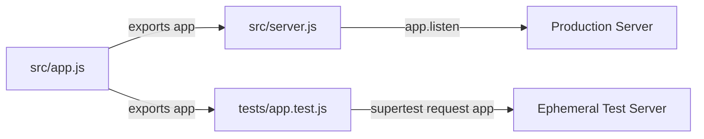

# Technical Specification

# 0. Agent Action Plan

## 0.1 Intent Clarification

### 0.1.1 Core Testing Objective

Based on the provided requirements, the Blitzy platform understands that the testing objective is to **add new tests** for a greenfield Node.js server application that introduces Express.js as the web framework and serves two HTTP endpoints:

- **Endpoint 1 (Tutorial Baseline):** An endpoint that returns the plain-text response `"Hello world"`
- **Endpoint 2 (New Feature):** An endpoint that returns the plain-text response `"Good evening"`

**Request Category:** Add new tests (greenfield application — no existing tests or source code in the repository)

**Testing Requirements with Enhanced Clarity:**

- Create a complete test suite for a new Express.js application built from scratch
- Verify that each endpoint returns the correct response body and HTTP status code
- Validate proper Express.js server initialization and configuration
- Test HTTP response headers (Content-Type) for correctness
- Cover negative scenarios such as requests to undefined routes (404 handling) and unsupported HTTP methods
- Ensure the Express.js app module exports the application instance separately from the server listener to enable testability via Supertest

**Implicit Testing Needs Surfaced:**

- Edge case testing for malformed requests and unexpected HTTP methods on defined routes
- Boundary condition testing for response content integrity (exact string matching)
- Error handling verification for non-existent routes
- Server lifecycle testing to confirm the application starts and stops cleanly without port conflicts during test execution

### 0.1.2 Special Instructions and Constraints

- **Greenfield Context:** The repository currently contains only a `README.md` file (`# 12_feb_5`). All source code and test files must be created from scratch.
- **No User-Specified Constraints:** The user did not provide specific directives regarding test patterns, mocking strategies, or framework preferences. Industry-standard conventions for Node.js/Express testing will be applied.
- **Testability Architecture Requirement:** The Express `app` object must be exported separately from the `server.listen()` call so that Supertest can bind to an ephemeral port during test runs without port conflicts.
- **Tutorial Simplicity Preserved:** Given this is described as a tutorial project, tests should remain straightforward, well-documented, and suitable for educational reference.

User Example (exact requirement):
> "this is a tutorial of node js server hosting one endpoint that returns the response 'Hello world'. Could you add expressjs into the project and add another endpoint that return the reponse of 'Good evening'?"

### 0.1.3 Technical Interpretation

These testing requirements translate to the following technical test implementation strategy:

- To **test the "Hello world" endpoint**, we will create a test file `tests/app.test.js` using Jest and Supertest to issue a `GET /` request and assert a `200` status with `"Hello world"` in the response body
- To **test the "Good evening" endpoint**, we will extend the same test file to issue a `GET /good-evening` request and assert a `200` status with `"Good evening"` in the response body
- To **test 404 handling**, we will add a test case that issues a `GET /nonexistent` request and asserts a `404` status code
- To **test server configuration**, we will verify the Express app instance is properly instantiated and exported as a module
- To **ensure test isolation**, we will structure the Express application so that `app.js` exports the app without calling `.listen()`, while a separate `server.js` file handles the actual server startup

### 0.1.4 Coverage Requirements Interpretation

- **Explicit Coverage Targets:** None specified by the user
- **Implicit Coverage Expectations:**
  - Industry standard for a simple Node.js Express API: **90%+ line coverage** is achievable and expected given the minimal codebase
  - All defined route handlers must have corresponding test cases (100% route coverage)
  - Both success paths and error/edge-case paths must be exercised
- To achieve comprehensive testing, coverage should include:
  - All Express route handler functions
  - The application factory/initialization logic
  - 404 fallback behavior for undefined routes
  - Response body content and HTTP status code verification for every endpoint

## 0.2 Test Discovery and Analysis

### 0.2.1 Existing Test Infrastructure Assessment

**Repository analysis reveals an empty (greenfield) repository with zero existing test infrastructure.**

A comprehensive search of the repository located at `/tmp/blitzy/12_feb_5/main/` confirms:

| Discovery Item | Finding |
|---------------|---------|
| Repository contents | Only `README.md` (contains `# 12_feb_5`) and `.git/` directory |
| Test files matching `*test*`, `*spec*`, `test_*`, `spec_*` | None found |
| `package.json` | Not present — no Node.js project initialized |
| Testing framework configuration (`jest.config.*`, `.mocharc.*`, `pytest.ini`) | None found |
| Coverage configuration (`.coveragerc`, `.nycrc`, `.istanbul.yml`) | None found |
| CI/CD configuration (`.github/workflows/`, `.gitlab-ci.yml`) | None found |
| `.blitzyignore` files | None found |
| `.nvmrc` or `.node-version` | Not present |
| Existing source code files (`*.js`, `*.ts`, `*.mjs`) | None found |

**Infrastructure Summary:**

- **Current testing framework:** None — to be established
- **Test runner configuration:** None — to be created (`jest.config.js`)
- **Coverage tools in use:** None — to be added (Jest built-in coverage via `--coverage` flag)
- **Mock/stub libraries detected:** None — Supertest will serve as the HTTP testing layer; no additional mocking libraries required for this scope
- **Test data fixtures or factories present:** None — not required for this minimal application

**Runtime Environment Available:**

- **Node.js:** v20.20.0 (pre-installed in the environment)
- **npm:** v11.1.0 (pre-installed in the environment)

### 0.2.2 Web Search Research Conducted

The following research was conducted to establish best practices and current version compatibility for the Node.js/Express testing stack:

- **Express.js Current Version:** Express 5.2.1 is the latest version on npm. Express 5 dropped support for Node.js versions before v18 and is now the default `latest` tag on npm. For a greenfield tutorial project, Express 4.21.x (the latest v4 maintenance release) is equally suitable and offers maximum tutorial compatibility, but Express 5.x will be used as it is the current default.

- **Jest Testing Framework:** Jest 30.2.0 is the latest stable version. Jest 30 was released in mid-2025 with improved performance and TypeScript support. It provides built-in coverage reporting, assertion libraries, and mocking capabilities — no additional assertion or coverage packages are needed.

- **Supertest HTTP Testing Library:** Supertest 7.2.2 is the latest version. Supertest is a SuperAgent-driven library purpose-built for testing HTTP servers. It allows passing an Express `app` instance directly to `request(app)`, which binds to an ephemeral port automatically — eliminating port conflicts during parallel test execution.

- **Best Practice — App/Server Separation:** The established convention for testing Express applications with Supertest is to export the Express `app` object from a module without calling `.listen()`. A separate entry point file calls `.listen()` for production/development use. This pattern prevents "port in use" errors during testing.

- **Express 5 Compatibility Note:** Express 5 requires Node.js 18+. The environment's Node.js v20.20.0 satisfies this requirement. Express 5 provides native async/await error handling in middleware, which simplifies both application code and test expectations.

## 0.3 Testing Scope Analysis

### 0.3.1 Test Target Identification

**Primary Code to Be Tested:**

Since this is a greenfield project, all source files will be created as part of the feature implementation. The testing plan targets the following anticipated source modules:

- **Module:** `app` at `src/app.js` — requires unit and integration tests
  - Express application factory and route registration
  - GET `/` route handler (returns `"Hello world"`)
  - GET `/good-evening` route handler (returns `"Good evening"`)
  - 404 fallback behavior for undefined routes

- **Module:** `server` at `src/server.js` — requires minimal verification
  - Server startup logic (imports `app` and calls `.listen()`)
  - This file is intentionally thin and primarily tested indirectly

**Functions Requiring Test Coverage:**

| Function/Handler | Test Categories Needed |
|-----------------|----------------------|
| `GET /` route handler | Happy path, response body, status code, content-type |
| `GET /good-evening` route handler | Happy path, response body, status code, content-type |
| Express app initialization | App instance validation, route registration |
| 404 fallback | Edge case — undefined route handling |
| Unsupported HTTP methods | Edge case — POST/PUT/DELETE to GET-only routes |

**Existing Test File Mapping:**

| Source File | Existing Test File | Test Categories Present |
|------------|-------------------|----------------------|
| `src/app.js` (to be created) | None | None — greenfield |
| `src/server.js` (to be created) | None | None — greenfield |

**Dependencies Requiring Mocking:**

- **External services to mock:** None — the application has no external service dependencies
- **Database interactions to stub:** None — no database layer exists
- **File system operations to virtualize:** None — no file I/O operations
- **Note:** Supertest handles HTTP transport testing natively by binding directly to the Express app instance, so no HTTP mocking is needed

### 0.3.2 Version Compatibility Research

Based on the current Node.js version v20.20.0, the recommended testing stack is:

| Tool | Recommended Version | Rationale |
|------|-------------------|-----------|
| **Express.js** | `5.2.1` | Latest stable release; default on npm; requires Node.js 18+ (satisfied by v20.20.0); provides native async error handling |
| **Jest** | `30.2.0` | Latest stable release; built-in coverage, assertions, and mocking; full Node.js 20 support; no additional assertion libraries needed |
| **Supertest** | `7.2.2` | Latest stable release; purpose-built for Express HTTP testing; directly accepts Express app instances; no ephemeral port management needed |

**Version Conflict Analysis:**

- **No conflicts detected.** All three packages are compatible with Node.js v20.20.0.
- Express 5.x + Jest 30.x + Supertest 7.x is a well-tested, modern combination for Node.js API testing.
- Jest 30 uses the `node` test environment by default, which is appropriate for Express server testing (no `jsdom` needed).

## 0.4 Test Implementation Design

### 0.4.1 Test Strategy Selection

**Test Types to Implement:**

- **Unit Tests:** Focus on verifying that each Express route handler returns the correct response body and status code in isolation. The Express `app` instance is tested without starting a live server, using Supertest's ephemeral binding.
- **Integration Tests:** Cover the full HTTP request-response cycle through the Express middleware stack, verifying that routing, response formatting, and status codes work end-to-end for each endpoint.
- **Edge Case Tests:** Address boundary conditions including requests to non-existent routes (404), unsupported HTTP methods on valid routes, and empty/malformed request paths.
- **Error Handling Tests:** Verify that the application responds correctly to error conditions — specifically, that undefined routes produce appropriate 404 responses rather than crashing or hanging.

### 0.4.2 Test Case Blueprint

```
Component: Express App (src/app.js)
Test Categories:
- Happy path:
  - GET / returns 200 with body "Hello world"
  - GET /good-evening returns 200 with body "Good evening"
- Edge cases:
  - GET /nonexistent returns 404
  - GET / with trailing slash handling
  - Request to root with query parameters still returns "Hello world"
- Error cases:
  - POST / returns 404 or 405 (method not allowed)
  - PUT /good-evening returns 404 or 405
  - DELETE /good-evening returns 404 or 405
- Response validation:
  - Content-Type header is text/html or text/plain
  - Response body is an exact string match (no extra whitespace or formatting)
```

```
Component: Server Entry Point (src/server.js)
Test Categories:
- Happy path:
  - Module imports app from src/app.js without errors
  - Server module is a valid Node.js module
- Note: Direct server.listen() testing is excluded as it
  would bind a real port; Supertest handles this implicitly
```

### 0.4.3 Existing Test Extension Strategy

- **Tests to extend:** Not applicable — no existing test files in the repository
- **Tests to refactor:** Not applicable — greenfield project
- **Tests to fix:** Not applicable — no broken tests exist

All tests will be created from scratch following standard Jest + Supertest conventions for Express.js applications.

### 0.4.4 Test Data and Fixtures Design

- **Required test data structures:** None — the endpoints return static string responses and accept no input parameters
- **Fixture organization strategy:** Not applicable for this minimal scope. No fixtures directory is needed since there are no dynamic test data requirements.
- **Mock object specifications:** None required — the application has no external dependencies to mock. Supertest provides the HTTP transport layer directly.
- **Test database/state management approach:** Not applicable — no database or persistent state exists in this application

### 0.4.5 Application Architecture for Testability

The Express application must follow the app/server separation pattern to enable Supertest integration:



- `src/app.js` — Creates and configures the Express app, registers routes, and exports the `app` object without calling `.listen()`
- `src/server.js` — Imports `app` from `src/app.js` and calls `app.listen()` on a configured port for production/development use
- `tests/app.test.js` — Imports `app` from `src/app.js` and passes it to `supertest(app)` for test execution against an ephemeral port

## 0.5 Test File Transformation Mapping

### 0.5.1 File-by-File Test Plan

| Target Test File | Transformation | Source File/Test | Purpose/Changes |
|-----------------|----------------|------------------|-----------------|
| `tests/app.test.js` | CREATE | `src/app.js` | Comprehensive integration tests for all Express endpoints including GET /, GET /good-evening, 404 handling, and HTTP method validation |
| `jest.config.js` | CREATE | N/A | Jest configuration file specifying test environment, coverage thresholds, test match patterns, and coverage reporting |
| `package.json` | CREATE | N/A | Project manifest with Express, Jest, and Supertest dependencies, plus test scripts (`test`, `test:coverage`) |
| `src/app.js` | CREATE | N/A | Express application module exporting the configured app instance with route handlers (testability requirement — app/server separation) |
| `src/server.js` | CREATE | N/A | Server entry point that imports app and calls listen() — kept separate for testability |

### 0.5.2 New Test Files Detail

- **`tests/app.test.js`** — Primary test file covering all HTTP endpoint behavior
  - **Test categories:**
    - Happy path: Verify GET `/` returns `200` with `"Hello world"`; verify GET `/good-evening` returns `200` with `"Good evening"`
    - Edge cases: Non-existent routes return `404`; routes with query strings still function correctly
    - Error cases: Unsupported HTTP methods (POST, PUT, DELETE) on defined routes return appropriate error responses
    - Response validation: Correct Content-Type headers, exact response body string matching
  - **Mock dependencies:** None — Supertest handles HTTP transport directly
  - **Assertions focus:**
    - `expect(res.status).toBe(200)` for successful responses
    - `expect(res.text).toBe("Hello world")` for exact body matching
    - `expect(res.status).toBe(404)` for undefined route handling

### 0.5.3 Test Configuration Updates

- **`jest.config.js`:** Create with the following settings:
  - `testEnvironment: 'node'` (appropriate for Express server testing; no DOM required)
  - `testMatch: ['**/tests/**/*.test.js']` (standard test file discovery pattern)
  - `collectCoverage: true` with `coverageDirectory: 'coverage'`
  - `coverageThreshold` set to enforce minimum 90% line, branch, function, and statement coverage
  - `verbose: true` for detailed test output

- **`package.json` scripts section:** Define test commands:
  - `"test": "jest --watchAll=false"` for single-run test execution
  - `"test:coverage": "jest --coverage --watchAll=false"` for coverage reporting

### 0.5.4 Cross-File Test Dependencies

- **Shared fixtures:** None required — all test data is inline (static string responses)
- **Mock objects:** None required — no external dependencies to mock
- **Test utilities:** None required — Jest and Supertest provide all necessary utilities
- **Import updates required across test files:**
  - `tests/app.test.js` imports `app` from `../src/app.js`
  - `tests/app.test.js` imports `request` from `supertest`

## 0.6 Dependency Inventory

### 0.6.1 Testing Dependencies

| Registry | Package Name | Version | Purpose |
|----------|-------------|---------|---------|
| npm | `jest` | `30.2.0` | JavaScript testing framework — provides test runner, assertions, mocking, and built-in coverage reporting |
| npm | `supertest` | `7.2.2` | HTTP assertion library for testing Express endpoints — binds directly to Express app instances via ephemeral ports |

### 0.6.2 Application Dependencies

| Registry | Package Name | Version | Purpose |
|----------|-------------|---------|---------|
| npm | `express` | `5.2.1` | Web framework for Node.js — provides routing, middleware, and HTTP server capabilities for the application under test |

### 0.6.3 Runtime Requirements

| Tool | Version | Notes |
|------|---------|-------|
| Node.js | `20.20.0` | Pre-installed in the environment; satisfies Express 5's minimum requirement of Node.js 18+ |
| npm | `11.1.0` | Pre-installed in the environment; used for dependency installation and script execution |

### 0.6.4 Import Updates

Since this is a greenfield project, there are no existing import transformations required. All imports will be established fresh:

- **`src/app.js`:**
  - `const express = require('express');` — Import Express framework

- **`src/server.js`:**
  - `const app = require('./app');` — Import the configured Express app

- **`tests/app.test.js`:**
  - `const request = require('supertest');` — Import Supertest for HTTP testing
  - `const app = require('../src/app');` — Import Express app for test binding

## 0.7 Coverage and Quality Targets

### 0.7.1 Coverage Metrics

- **Current coverage:** 0% — no tests or source code exist in the repository
- **Target coverage:** 90%+ based on industry best practices for minimal Node.js Express applications
- **Rationale:** Given the small, focused codebase (two route handlers, one app configuration module), achieving 90%+ coverage is straightforward and expected. The only code likely excluded from coverage is the `server.js` file's `.listen()` call, which executes at startup and is not directly testable without spawning a real server process.

**Coverage Gaps to Address:**

| Component | Current Coverage | Target Coverage | Focus Areas |
|-----------|-----------------|-----------------|-------------|
| `src/app.js` — Route handlers | 0% | 100% | Both GET endpoints, 404 fallback, response bodies, status codes |
| `src/app.js` — App initialization | 0% | 100% | Express instance creation, route registration |
| `src/server.js` — Server startup | 0% | Excluded | `.listen()` call is intentionally excluded; tested indirectly through app import validation |

**Per-File Coverage Targets:**

| File | Line Coverage | Branch Coverage | Function Coverage | Statement Coverage |
|------|-------------|-----------------|-------------------|-------------------|
| `src/app.js` | 100% | 100% | 100% | 100% |
| `src/server.js` | Excluded from threshold | Excluded from threshold | Excluded from threshold | Excluded from threshold |

### 0.7.2 Test Quality Criteria

- **Assertion density expectations:** Each test case must contain at minimum one status code assertion and one response body assertion. Endpoint tests should include both `expect(res.status)` and `expect(res.text)` checks.
- **Test isolation requirements:** Each test case must be independent and produce the same result regardless of execution order. Supertest creates fresh connections per request, ensuring no shared state between tests.
- **Performance constraints for test execution:** The entire test suite should complete in under 5 seconds. Given the minimal scope (fewer than 10 test cases, no database, no network calls), execution time should be well under 2 seconds.
- **Maintainability standards:**
  - Test descriptions must clearly state what is being tested using `describe`/`it` blocks with human-readable names
  - Each `it` block tests exactly one behavior
  - No magic numbers — HTTP status codes and expected response strings are clearly visible in assertions
- **Repository test pattern conventions:** As a greenfield project, the conventions established in these tests become the project's standard. The pattern follows: `describe` blocks group by endpoint, `it` blocks describe individual behaviors, and Supertest chains are used for HTTP assertions.

## 0.8 Scope Boundaries

### 0.8.1 Exhaustively In Scope

**New test files:**
- `tests/app.test.js` — All unit and integration tests for Express endpoint behavior

**New source files (required for testability):**
- `src/app.js` — Express application module with route handlers, exported for Supertest consumption
- `src/server.js` — Server entry point that imports `app` and calls `.listen()`

**Test configuration:**
- `jest.config.js` — Jest test runner configuration with coverage settings
- `package.json` — Project manifest with dependencies, scripts, and metadata

**Test scope by endpoint:**
- `GET /` — Happy path, response validation, Content-Type verification
- `GET /good-evening` — Happy path, response validation, Content-Type verification
- `GET /undefined-route` — 404 status code verification
- `POST /`, `PUT /good-evening`, `DELETE /good-evening` — Unsupported method handling

**Documentation updates:**
- `README.md` — Update to reflect the project purpose, setup instructions, and test execution commands

### 0.8.2 Explicitly Out of Scope

- **Additional endpoints beyond `/` and `/good-evening`:** The user requested exactly two endpoints; no others will be created or tested
- **TypeScript configuration:** The user described a plain JavaScript tutorial; TypeScript will not be introduced
- **Database integration or ORM setup:** No data persistence is required for this application
- **Authentication, authorization, or middleware beyond routing:** Not requested and not applicable to this tutorial scope
- **Frontend or HTML rendering:** The endpoints return plain-text responses only
- **CI/CD pipeline configuration:** No continuous integration setup was requested
- **Docker/containerization:** Not part of the tutorial scope
- **Environment variable management or `.env` files:** The application is statically configured
- **Load testing or performance benchmarking:** Out of scope for a tutorial application
- **E2E (end-to-end) browser testing:** No browser-based testing is applicable to a REST API
- **Linting or code formatting configuration (ESLint, Prettier):** Not requested by the user
- **Pre-commit hooks or Husky configuration:** Not part of the tutorial scope

## 0.9 Execution Parameters

### 0.9.1 Testing-Specific Instructions

- **Test execution command:**
  ```
  npm test
  ```
  This runs `jest --watchAll=false` as defined in `package.json` scripts, executing all tests in a single pass without watch mode.

- **Coverage measurement command:**
  ```
  npm run test:coverage
  ```
  This runs `jest --coverage --watchAll=false`, generating a coverage report in the `coverage/` directory.

- **Single test execution pattern:**
  ```
  npx jest tests/app.test.js --watchAll=false
  ```
  Runs a specific test file in isolation.

- **Verbose output command:**
  ```
  npx jest --verbose --watchAll=false
  ```
  Displays individual test case results with pass/fail status for each `it` block.

- **Debug mode execution:**
  ```
  node --inspect-brk node_modules/.bin/jest --runInBand --watchAll=false
  ```
  Attaches a debugger to the Jest process for step-through debugging of test cases.

### 0.9.2 Environment Setup Requirements for Tests

- **Node.js runtime:** v20.20.0 (pre-installed)
- **Package installation:** Run `npm install` in the project root to install Express, Jest, and Supertest
- **No environment variables required:** The application uses no environment-specific configuration
- **No external services required:** All tests execute against the in-process Express app via Supertest — no running server, database, or network service is needed
- **Port binding:** Tests do not bind to any specific port. Supertest handles ephemeral port assignment automatically when passed an Express `app` object.

### 0.9.3 Test Execution Conventions

- **All tests run non-interactively:** The `--watchAll=false` flag ensures Jest exits after a single test run, making it suitable for CI environments and automated pipelines
- **No parallel test file execution conflicts:** Since there is a single test file (`tests/app.test.js`) and Supertest creates isolated server instances per test, no concurrency issues arise
- **Jest default test environment:** `node` (configured in `jest.config.js`) — no DOM simulation or browser environment is loaded

## 0.10 Special Instructions for Testing

### 0.10.1 Testing-Specific Requirements

The following directives govern the test implementation for this greenfield Express.js application:

- **App/Server separation is mandatory:** The Express `app` instance in `src/app.js` must be exported via `module.exports = app` without calling `.listen()`. The `src/server.js` file is the sole location for `app.listen()`. This pattern is essential for Supertest to function correctly and prevent port-binding errors during test runs.

- **CommonJS module format:** All files must use `require()`/`module.exports` syntax (CommonJS). The user described a standard Node.js tutorial, and no ESM (`import`/`export`) configuration was specified.

- **Response body exact matching:** Tests must validate that endpoint responses return the exact strings `"Hello world"` and `"Good evening"` — character-for-character, with correct casing and spacing.

- **Minimal dependency footprint:** Only three npm packages are introduced: `express` (production), `jest` and `supertest` (development). No additional utility libraries, assertion enhancers, or coverage reporters are needed.

- **Test naming conventions:** Test files use the `.test.js` suffix and reside in the `tests/` directory at the project root. Test descriptions use plain English in `describe`/`it` blocks (e.g., `describe('GET /')` and `it('should return Hello world')`).

- **No source code modification beyond testability requirements:** The source files (`src/app.js`, `src/server.js`) are created as part of the feature implementation. Tests must not require any changes to the application's business logic — they only observe and validate behavior.

### 0.10.2 Greenfield Project Conventions Established

Since this is the first code in the repository, the following conventions are set as project standards for all future development:

- **Project structure:** Source code in `src/`, tests in `tests/`, configuration at root
- **Testing framework:** Jest with Supertest for HTTP endpoint testing
- **Test execution:** Via `npm test` (non-interactive, single-run)
- **Coverage reporting:** Via `npm run test:coverage` with Jest built-in coverage
- **Coverage threshold:** 90% minimum for lines, branches, functions, and statements (excluding `src/server.js`)
- **Test isolation:** Each test is independent; no shared state between `it` blocks

