# Technical Specification

# 1. Introduction

## 1.1 Executive Summary

### 1.1.1 Project Overview

The **Reverse Document Generator** is an AI-powered system that automatically produces comprehensive Technical Specification documents from existing software codebases. By orchestrating a multi-agent pipeline of specialized Large Language Model (LLM) agents, the system systematically explores, analyzes, and documents a target repository's architecture, components, implementation patterns, and infrastructure — delivering a structured, enterprise-grade specification without manual engineering effort.

The project, internally tracked under the codename `12_feb_5` (as identified in `README.md`), operates as a cloud-native, event-driven batch job deployed on Google Cloud Run, triggered via Google Cloud Pub/Sub messages. The core orchestration logic, defined in `/app/lib/reverse_document/helper.py`, leverages LangGraph to coordinate a stateful workflow graph comprising search, architect, and author agents.

### 1.1.2 Core Business Problem

Creating and maintaining comprehensive technical documentation for software projects presents significant and persistent challenges across the software industry:

| Challenge | Impact |
|---|---|
| **Time-intensive process** | Senior engineers spend substantial hours manually tracing and documenting system architectures |
| **Documentation drift** | Specifications become outdated rapidly as codebases evolve, reducing their utility |
| **Incomplete coverage** | Manual efforts often miss cross-cutting concerns, edge cases, and subtle architectural patterns |
| **High cost** | Requires allocation of scarce senior engineering resources to non-feature work |

The Reverse Document Generator directly addresses these challenges by automating the end-to-end process of generating technical specifications. The system's prompt framework, defined in `/app/lib/reverse_document/prompts.py`, encodes a standardized "Master To-Do List" comprising eight major specification sections, ensuring consistent, thorough documentation output regardless of the input repository.

### 1.1.3 Key Stakeholders and Users

| Stakeholder Group | Role |
|---|---|
| **Software Development Teams** | Primary consumers of generated technical specifications for onboarding, maintenance, and architectural review |
| **Technical Architects** | Leverage generated specs to validate system designs and identify architectural concerns |
| **Project Managers / Product Owners** | Gain structured insight into system capabilities, scope, and technical debt |
| **Platform / DevOps Engineers** | Responsible for the Blitzy platform infrastructure on which the system is deployed |
| **Code Owner** | `@siddhantpp` — designated owner of the entire codebase (per `/app/CODEOWNERS`) |

### 1.1.4 Value Proposition

The Reverse Document Generator delivers measurable value through four key differentiators:

1. **Automated Documentation Generation** — Eliminates manual effort by transforming raw codebases into structured technical specifications through AI-driven analysis.
2. **Consistent, Standardized Output** — Enforces a rigorous eight-section template (defined in `/app/lib/reverse_document/prompts.py`) ensuring uniform quality and completeness across all generated documents.
3. **Multi-Agent AI Workflow** — Employs a search → architect → author pipeline (orchestrated via `/app/lib/reverse_document/helper.py`) where specialized agents collaborate to achieve comprehensive repository coverage and accurate technical synthesis.
4. **Cloud-Native, Event-Driven Architecture** — Operates as a scalable, on-demand Cloud Run Job triggered by Pub/Sub events, requiring no persistent infrastructure and integrating seamlessly into the Blitzy platform ecosystem.

---

## 1.2 System Overview

### 1.2.1 Project Context

#### Business Context and Market Positioning

The Reverse Document Generator is positioned as an internal productivity accelerator within the Blitzy platform ecosystem. It serves the growing market need for AI-augmented software engineering tooling — specifically targeting the documentation gap that exists in most software organizations. Rather than requiring teams to adopt new documentation practices, the system works backward from existing codebases, meeting engineering teams where they already are.

The system is deployed as a managed service within the Blitzy platform, leveraging the shared infrastructure library `blitzy-platform-shared==0.0.549` (as specified in `/app/requirements.txt`) for standardized integration with Google Cloud services including Pub/Sub messaging, Cloud Storage, and platform-level utilities.

#### Integration with Existing Enterprise Landscape

The Reverse Document Generator integrates into the broader Blitzy platform through several well-defined touchpoints:

```mermaid
flowchart TB
    subgraph ExternalTriggers["External Triggers"]
        PubSub["Google Cloud Pub/Sub"]
    end

    subgraph ReverseDocGen["Reverse Document Generator"]
        Main["main.py\nEvent Handler"]
        Graph["LangGraph\nWorkflow Engine"]
        Agents["Multi-Agent Pipeline\n(Search → Architect → Author)"]
        Main --> Graph --> Agents
    end

    subgraph PlatformServices["Blitzy Platform Services"]
        SharedLib["blitzy-platform-shared\nv0.0.549"]
        GCS["Google Cloud Storage"]
        AR["Google Artifact Registry"]
    end

    subgraph TargetRepo["Target Repository"]
        SourceCode["Source Code Files\n& Folders"]
    end

    PubSub -->|"Trigger Message"| Main
    Agents -->|"Read & Analyze"| SourceCode
    Agents -->|"Store Artifacts"| GCS
    Main -.->|"Uses"| SharedLib
    Graph -.->|"Uses"| SharedLib
end
```

- **Event Source:** Google Cloud Pub/Sub delivers job trigger messages containing repository metadata to the entry point defined in `/app/main.py`.
- **Shared Platform Library:** The `blitzy-platform-shared` package bundles LangGraph, Google Cloud client libraries, and platform-specific utilities, ensuring consistent dependency management across Blitzy services.
- **Artifact Storage:** Google Cloud Storage serves as the persistence layer for generated specifications and intermediate artifacts.
- **Container Registry:** Docker images are published to Google Artifact Registry at `us-docker.pkg.dev` (configured in `/app/Makefile` and `/app/.github/workflows/deploy-job.yml`).

### 1.2.2 High-Level Description

#### Primary System Capabilities

The system's primary capability is the automated generation of comprehensive Technical Specification documents. The specification template, encoded in `/app/lib/reverse_document/prompts.py` as the "Master To-Do List," defines eight major documentation sections:

| # | Section | Description |
|---|---|---|
| 1 | Introduction | Executive summary, system overview, scope definition |
| 2 | Product Requirements | Feature catalog, functional requirements, feature relationships |
| 3 | Technology Stack | Languages, frameworks, dependencies, databases |
| 4 | Process Flowchart | Business processes, integration workflows, state management, error handling |
| 5 | System Architecture | High-level architecture, component details, technical decisions, cross-cutting concerns |
| 6 | System Components Design | Core services, database design, integration architecture, security, monitoring, testing |
| 7 | User Interface Design | UI architecture, components, workflows, state management |
| 8 | Infrastructure | Deployment environment, cloud services, containerization, CI/CD pipeline |

The quality and depth of these sections is benchmarked against the mock specification in `/app/mock_tech_spec.py` — a 9,400+ line reference document demonstrating the system's target output fidelity, including Markdown tables, Mermaid diagrams, detailed prose, and source file attribution patterns.

#### Major System Components

The system is composed of six principal components, each with clearly delineated responsibilities:

| Component | Source Location | Responsibility |
|---|---|---|
| Entry Point / Event Handler | `/app/main.py` | Receives Pub/Sub messages, initializes the LangGraph workflow, orchestrates end-to-end generation |
| Workflow Orchestrator | `/app/lib/reverse_document/helper.py` | Defines the `StateGraph`, manages agent transitions, binds tools to agents |
| State Management | `/app/lib/reverse_document/state.py` | Maintains `ReverseDocumentState` (a `TypedDict`) tracking workflow progress across agent transitions |
| Data Models | `/app/lib/reverse_document/models.py` | Pydantic models for section assignments, document sections, and structured data exchange |
| Prompt Templates | `/app/lib/reverse_document/prompts.py` | System prompts, agent personas, the Master To-Do List, and workflow instructions |
| Shared Platform Library | `blitzy-platform-shared` (v0.0.549) | Platform integration utilities for GCS, Pub/Sub, and shared infrastructure |

#### Core Technical Approach

The system implements a **stateful, multi-agent AI pipeline** using LangGraph's `StateGraph` abstraction. The `ReverseDocumentHelper` class in `/app/lib/reverse_document/helper.py` defines the workflow graph with three primary agent nodes connected by conditional routing edges:

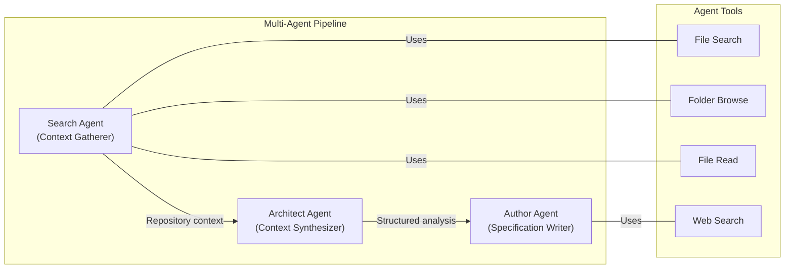

1. **Search Agent (Context Gatherer):** Systematically explores the target repository using bound tools — file search, folder browsing, and file reading — to collect comprehensive codebase context.
2. **Architect Agent (Context Synthesizer):** Synthesizes the raw exploration results into structured, section-specific technical context suitable for documentation authoring.
3. **Author Agent (Specification Writer):** Transforms the architect's structured analysis into polished, enterprise-grade Technical Specification prose, following the templates and formatting conventions defined in the prompt framework.

State is managed through the `ReverseDocumentState` TypedDict (defined in `/app/lib/reverse_document/state.py`), which tracks workflow progress, agent outputs, section assignments, and inter-agent data flow across the entire pipeline execution.

#### Technology Stack Summary

| Layer | Technology | Version / Details |
|---|---|---|
| Language | Python | 3.12 |
| AI Orchestration | LangGraph | Via `blitzy-platform-shared` |
| Cloud Messaging | Google Cloud Pub/Sub | Event-driven job triggering |
| Cloud Storage | Google Cloud Storage | Artifact persistence |
| Compute | Google Cloud Run Jobs | Serverless batch execution |
| Container Base | Ubuntu | 24.04 |
| Container Runtime | Node.js | 20 (available in container via `/app/Dockerfile`) |
| Container Registry | Google Artifact Registry | `us-docker.pkg.dev` |
| CI/CD | GitHub Actions | Automated build and deploy (on push to `main`) |
| Code Quality | Ruff | Python linting via pre-commit hooks |
| Dependencies | pip + blitzy-platform-shared | v0.0.549 |

### 1.2.3 Success Criteria

#### Measurable Objectives

| Objective | Metric | Target |
|---|---|---|
| Complete Specification Generation | All 8 defined sections successfully produced | 100% section completion per execution |
| Execution Reliability | Job completes within Cloud Run timeout limits | Consistent completion without timeout failures |
| Evidence-Based Output | Generated documentation includes source file attributions | Every technical claim references originating files |
| Cross-Section Consistency | Shared state management ensures coherent output | No contradictions between generated sections |

#### Critical Success Factors

1. **LLM Agent Accuracy** — The search agent must correctly identify and extract relevant code structures, while the architect agent must accurately interpret architectural patterns and design decisions.
2. **Comprehensive Repository Exploration** — The search agent must achieve sufficient coverage of the target repository to support complete and accurate specification generation across all eight sections.
3. **Architectural Pattern Recognition** — The system must correctly identify and articulate design patterns, component relationships, and cross-cutting concerns present in the target codebase.
4. **Output Quality Fidelity** — Generated specifications must meet the quality benchmark established by the reference document in `/app/mock_tech_spec.py`, including proper use of Markdown formatting, Mermaid diagrams, and structured tables.

#### Key Performance Indicators (KPIs)

| KPI | Description |
|---|---|
| **Section Completion Rate** | Percentage of the 8 specification sections successfully generated per job execution |
| **Source File Coverage** | Ratio of relevant repository files examined to total files in the target codebase |
| **Document Accuracy** | Correctness of technical claims as verifiable against the source repository |
| **Generation Throughput** | Total time elapsed from Pub/Sub trigger to completed specification output |

---

## 1.3 Scope

### 1.3.1 In-Scope

#### Core Features and Functionalities

**Must-Have Capabilities:**

- **Automated Repository Analysis** — AI agents explore target repositories using file search, folder browsing, and file reading tools (bound in `/app/lib/reverse_document/helper.py`).
- **Eight-Section Specification Generation** — Complete Technical Specification covering Introduction, Product Requirements, Technology Stack, Process Flowchart, System Architecture, System Components Design, User Interface Design, and Infrastructure (as defined in the Master To-Do List within `/app/lib/reverse_document/prompts.py`).
- **Multi-Agent Orchestration** — Stateful LangGraph workflow coordinating search, architect, and author agents with conditional routing (defined in `/app/lib/reverse_document/helper.py`).
- **Structured State Management** — `ReverseDocumentState` TypedDict (in `/app/lib/reverse_document/state.py`) tracks workflow progress, section dependencies, and inter-agent data.
- **Pydantic Data Validation** — Strongly typed data models for section assignments, document sections, and structured interchange (defined in `/app/lib/reverse_document/models.py`).

**Primary User Workflows:**

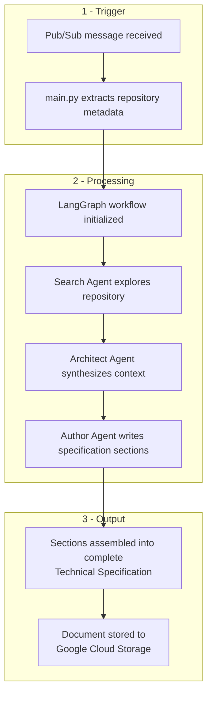

**Essential Integrations:**

| Integration Point | Purpose | Evidence |
|---|---|---|
| Google Cloud Pub/Sub | Event-driven job triggering and message ingestion | `/app/main.py` |
| Google Cloud Storage | Persistent storage for generated specifications and artifacts | Via `blitzy-platform-shared` |
| LLM API | AI reasoning for search, analysis, and authoring agents | Via LangGraph/LangChain in `blitzy-platform-shared` |
| Target Repository | Source codebase to be analyzed and documented | Accessed via agent tools in `/app/lib/reverse_document/helper.py` |

**Key Technical Requirements:**

- Stateful workflow management across multiple agent transitions using LangGraph's `StateGraph`
- Tool-use capabilities enabling agents to interact with target repositories (file search, folder browse, file read) and external sources (web search)
- Section-by-section document generation with dependency tracking between sections
- Error handling and retry mechanisms for LLM interactions and cloud service calls

#### Implementation Boundaries

| Boundary | Definition |
|---|---|
| **System Boundary** | Self-contained Google Cloud Run Job triggered exclusively via Pub/Sub events |
| **User Groups** | Blitzy platform users who submit codebases for automated documentation |
| **Data Domains** | Source code repositories (input) and generated Technical Specifications (output) |
| **Deployment Region** | `us-central1` (as configured in `/app/Makefile` and `/app/.github/workflows/deploy-job.yml`) |
| **Runtime Environment** | Docker container on Ubuntu 24.04 with Python 3.12 and Node.js 20 (per `/app/Dockerfile`) |

### 1.3.2 Out-of-Scope

The following capabilities and concerns are explicitly **excluded** from the current system implementation:

| Excluded Item | Rationale |
|---|---|
| **Manual Document Editing UI** | No user-facing interface exists; the system operates as a headless backend job |
| **Real-Time Collaboration** | Document generation is a batch process; concurrent editing is not supported |
| **Document Version Control** | Generated specifications are stored but not versioned; no diff or history tracking |
| **Multi-Language Output** | All prompts and generated documentation are English-only (per `/app/lib/reverse_document/prompts.py`) |
| **Custom Template Definitions** | The eight-section specification template is hardcoded in `/app/lib/reverse_document/prompts.py`; user-defined templates are not supported |
| **Direct Repository Hosting** | The system reads and analyzes repositories but does not host, clone, or store source code |
| **User Authentication / Authorization** | Identity and access management is handled by the broader Blitzy platform; this system does not implement its own auth layer |
| **Incremental / Partial Regeneration** | Each execution produces a full specification; targeted re-generation of individual sections is not currently supported |

#### Future Phase Considerations

The following capabilities represent potential evolution paths but are not part of the current implementation:

- **User-configurable specification templates** — Allowing customization of the Master To-Do List and section structure
- **Incremental regeneration** — Re-generating only specific sections when source code changes
- **Multi-language documentation output** — Supporting specification generation in languages other than English
- **Interactive review workflows** — Enabling stakeholder feedback loops within the generation pipeline
- **Cross-repository analysis** — Generating specifications that span multiple related repositories

---

#### References

- `README.md` — Project identifier (`12_feb_5`)
- `/app/main.py` — Entry point, Pub/Sub event handler, LangGraph workflow initialization, document generation orchestration
- `/app/requirements.txt` — Dependency declaration (`blitzy-platform-shared==0.0.549`)
- `/app/lib/reverse_document/helper.py` — `ReverseDocumentHelper` class, `StateGraph` definition, agent node definitions, tool binding
- `/app/lib/reverse_document/state.py` — `ReverseDocumentState` TypedDict definition for workflow state management
- `/app/lib/reverse_document/models.py` — Pydantic data models for section assignments, document sections, and structured data
- `/app/lib/reverse_document/prompts.py` — System prompts, agent personas, Master To-Do List (eight-section template), workflow instructions
- `/app/Dockerfile` — Container build configuration (Ubuntu 24.04, Python 3.12, Node.js 20)
- `/app/Makefile` — Build and deploy commands targeting Google Cloud Run Jobs in `us-central1`
- `/app/.github/workflows/deploy-job.yml` — CI/CD pipeline (GitHub Actions → Artifact Registry → Cloud Run Jobs)
- `/app/.pre-commit-config.yaml` — Development quality standards (Ruff linter configuration)
- `/app/.dockerignore` — Docker build exclusion rules
- `/app/CODEOWNERS` — Code ownership assignment (`@siddhantpp`)
- `/app/mock_tech_spec.py` — Reference Technical Specification output (9,400+ lines) demonstrating target quality and format

# 2. Product Requirements

This section provides a complete catalog of the Reverse Document Generator's product features, functional requirements, inter-feature relationships, and implementation considerations. Every feature documented herein is grounded in evidence from the system's codebase — primarily `/app/main.py`, `/app/lib/reverse_document/helper.py`, `/app/lib/reverse_document/state.py`, `/app/lib/reverse_document/models.py`, and `/app/lib/reverse_document/prompts.py` — and the shared platform library `blitzy-platform-shared` (v0.0.549). No speculative or aspirational features are included.

---

## 2.1 Feature Catalog

### 2.1.1 Feature Summary

The system comprises twenty discrete features organized into six functional categories. The following master table provides a consolidated view of all features, their priorities, and categories.

| Feature ID | Feature Name | Category |
|---|---|---|
| F-001 | Event-Driven Job Triggering | Core Infrastructure |
| F-002 | Multi-Agent Workflow Orchestration | Core Infrastructure |
| F-007 | Stateful Workflow Management | Core Infrastructure |
| F-013 | Code Graph Integration | Core Infrastructure |
| F-003 | Automated Repository Analysis (Search Agent) | AI Agent Pipeline |
| F-004 | Context Synthesis (Architect Agent) | AI Agent Pipeline |
| F-005 | Specification Writing (Author Agent) | AI Agent Pipeline |
| F-018 | Document Section Authoring with Tool-in-Loop | AI Agent Pipeline |
| F-006 | Eight-Section Specification Generation | Document Generation |
| F-016 | Document Update Mode | Document Generation |
| F-017 | Agent Action Plan Generation | Document Generation |
| F-009 | Cloud Storage Integration | Integration |
| F-010 | Progress Notification System | Integration |
| F-011 | Attachment Processing | Integration |
| F-012 | Figma Integration | Integration |
| F-020 | Environment/Build Info Integration | Integration |
| F-015 | Bash Session Management | Agent Tooling |
| F-019 | Chrome DevTools MCP | Agent Tooling |
| F-008 | Pydantic Data Models | Data Validation & Reliability |
| F-014 | Error Handling & Retry Mechanism | Data Validation & Reliability |

| Feature ID | Priority | Status |
|---|---|---|
| F-001 | Critical | Completed |
| F-002 | Critical | Completed |
| F-007 | Critical | Completed |
| F-013 | Critical | Completed |
| F-003 | Critical | Completed |
| F-004 | High | Completed |
| F-005 | Critical | Completed |
| F-018 | High | Completed |
| F-006 | Critical | Completed |
| F-016 | High | Completed |
| F-017 | High | Completed |
| F-009 | Critical | Completed |
| F-010 | High | Completed |
| F-011 | Medium | Completed |
| F-012 | Medium | Completed |
| F-020 | Medium | Completed |
| F-015 | Medium | Completed |
| F-019 | Low | Completed |
| F-008 | High | Completed |
| F-014 | High | Completed |

### 2.1.2 Core Infrastructure Features

#### F-001: Event-Driven Job Triggering

| Attribute | Detail |
|---|---|
| **Feature ID** | F-001 |
| **Category** | Core Infrastructure |
| **Priority** | Critical |
| **Status** | Completed |

**Overview:** The system's entry point receives Google Cloud Pub/Sub messages containing repository metadata to initiate document generation jobs. The `generate_reverse_document()` async function in `/app/main.py` decodes and validates the event payload, extracting fields including `repo_name`, `project_id`, `job_id`, `branch_id`, `company_id`, `user_id`, `head_commit_hash`, `document_mode`, `tech_spec_id`, and `previous_tech_spec_id`.

**Business Value:** Enables fully automated, on-demand technical specification generation without manual intervention. The event-driven architecture ensures the system integrates seamlessly into the Blitzy platform's asynchronous processing pipeline.

**User Benefits:** Platform users trigger documentation jobs through the Blitzy interface, with the Pub/Sub message acting as the bridge between user intent and system execution. No direct interaction with the generation engine is required.

**Technical Context:** The event payload is sourced from the `EVENT_DATA` environment variable, parsed as JSON, and validated before initializing the workflow. The system also requires configuration through approximately 17 environment variables covering API keys, service endpoints, and storage configuration (as defined in `/app/main.py` and `/app/set_env.py`).

**Dependencies:**

| Dependency Type | Detail |
|---|---|
| System Dependencies | Google Cloud Pub/Sub, Cloud Run Jobs |
| External Dependencies | `blitzy-platform-shared` (Pub/Sub utilities) |
| Integration Requirements | Platform event bus, `PLATFORM_EVENTS_TOPIC` |

---

#### F-002: Multi-Agent Workflow Orchestration

| Attribute | Detail |
|---|---|
| **Feature ID** | F-002 |
| **Category** | Core Infrastructure |
| **Priority** | Critical |
| **Status** | Completed |

**Overview:** The core processing engine uses LangGraph's `StateGraph` abstraction to define and execute a directed workflow graph with seven nodes and conditional routing logic. The graph is constructed in `/app/lib/reverse_document/helper.py` (lines 263–316) with nodes: `setup`, `gather_context`, `document_section`, `summarize_changes`, `copy_old_tech_spec_section`, `identify_changes`, and `update_section`.

**Business Value:** Provides a reliable, deterministic execution framework for coordinating multiple AI agents, ensuring that each agent receives properly prepared context and that outputs flow correctly through the pipeline.

**User Benefits:** The orchestration ensures consistent, complete output regardless of repository complexity — every execution follows the same rigorous multi-stage analysis and writing process.

**Technical Context:** Two distinct execution paths are supported:
- **GENERATE path:** `START → setup → gather_context → document_section` (loops back to `gather_context` until all sections are processed, then → `END`)
- **UPDATE path:** `START → setup → summarize_changes → END` for action plan generation, then `identify_changes → update_section` (or `copy_old_tech_spec_section`) per section

Router functions (`setup_router`, `document_router`) control conditional transitions based on `BackpropChangeMode` (GENERATE or UPDATE). The workflow streams results via `app.astream()` with a `recursion_limit` of 500.

**Dependencies:**

| Dependency Type | Detail |
|---|---|
| Prerequisite Features | F-001 (trigger), F-007 (state) |
| System Dependencies | LangGraph (`StateGraph`) |
| External Dependencies | `blitzy-platform-shared` (LangGraph bindings) |

---

#### F-007: Stateful Workflow Management

| Attribute | Detail |
|---|---|
| **Feature ID** | F-007 |
| **Category** | Core Infrastructure |
| **Priority** | Critical |
| **Status** | Completed |

**Overview:** The `ReverseDocumentState` TypedDict, defined in `/app/lib/reverse_document/state.py`, provides a comprehensive state container that persists across all workflow nodes. It tracks repository metadata, processing state, document content, structured data, flow control variables, and infrastructure references.

**Business Value:** Enables coherent, context-aware document generation by ensuring all agents share a consistent view of workflow progress, prior outputs, and repository metadata throughout the entire pipeline execution.

**Technical Context:** Key state categories include:
- **Repository metadata:** `branch_id`, `branch_name`, `company_id`, `repo_id`, `repo_name`, `head_commit_hash`, `user_id`, `git_project_repo_id`
- **Processing state:** `mode`, `section_index`, `total_sections`, `section_headings`, `section_prompts`, `section_context`
- **Document state:** `updated_tech_spec`, `previous_tech_spec`, `tech_spec_parsed`, `current_tech_spec`, `current_tech_spec_sections`, `parsed_sub_sections`
- **Structured data:** `structured_sections` (List[DocumentSection]), `previous_structured_sections`
- **Flow control:** `retry_count`, `agent_action_plan`, `new_requirements`
- **User input:** `user_context`, `root_folder_contents`

The `get_state()` function provides serialization of the full state for inter-node transfer.

**Dependencies:**

| Dependency Type | Detail |
|---|---|
| System Dependencies | Python `TypedDict` |
| Integration Requirements | Used by all seven graph nodes |

---

#### F-013: Code Graph Integration

| Attribute | Detail |
|---|---|
| **Feature ID** | F-013 |
| **Category** | Core Infrastructure |
| **Priority** | Critical |
| **Status** | Completed |

**Overview:** The system integrates a Neo4j-backed `CodeGraphBuilder` for efficient, structured querying of target repository contents. Initialized in `/app/main.py`, the code graph enables agents to navigate folder hierarchies and retrieve file summaries without raw filesystem traversal.

**Business Value:** Provides a semantically enriched view of the codebase, enabling agents to rapidly locate relevant files and understand repository structure — dramatically reducing the search space for context gathering.

**Technical Context:** Agent tools including `get_source_folder_contents`, `get_file_summary`, `search_files`, and `search_folders` query the Neo4j code graph. The `get_folder_contents` method is invoked during the `setup` node to populate the root folder structure into state. Neo4j credentials are provided via `NEO4J_SERVER`, `NEO4J_USERNAME`, and `NEO4J_PASSWORD` environment variables.

**Dependencies:**

| Dependency Type | Detail |
|---|---|
| System Dependencies | Neo4j database |
| External Dependencies | `blitzy-platform-shared` (`CodeGraphBuilder`) |
| Integration Requirements | Neo4j server access, valid credentials |

---

### 2.1.3 AI Agent Pipeline Features

#### F-003: Automated Repository Analysis (Search Agent)

| Attribute | Detail |
|---|---|
| **Feature ID** | F-003 |
| **Category** | AI Agent Pipeline |
| **Priority** | Critical |
| **Status** | Completed |

**Overview:** The Search Agent (Context Gatherer) systematically explores the target repository to collect comprehensive, section-specific context. Implemented as the `gather_context` node in `/app/lib/reverse_document/helper.py` (lines 378–500), the agent receives a section heading, section prompt, user context, previously generated tech spec sections, and project attachments.

**Business Value:** Ensures every specification section is grounded in actual codebase evidence, eliminating hallucination and ensuring traceability of every technical claim to source files.

**User Benefits:** Users receive documentation that accurately reflects their codebase's actual implementation rather than generic or inferred descriptions.

**Technical Context:** The Search Agent is powered by `llm_claude_opus_4_6_thinking_max` (Claude claude-opus-4-6 with max_tokens=32,000, temperature=1.0, timeout=900s, extended thinking enabled). It has access to the following tools:
- **Search node tools:** `get_tech_spec_section`, `get_source_folder_contents`, `get_file_summary`, `read_file`, `search_files`, `search_folders`
- **Extended tools:** Anthropic web search tool, Anthropic bash tool

The agent processes tool calls in a loop until no further tool invocations are needed. Results are stored in `state["section_context"][section_heading]`. The agent respects `.blitzyignore` patterns during file exploration. Agent persona and behavioral rules are defined by `SEARCH_PERSONA_PROMPTLET` and `SEARCH_RULES_PROMPTLET` in `/app/lib/reverse_document/prompts.py`.

**Dependencies:**

| Dependency Type | Detail |
|---|---|
| Prerequisite Features | F-002 (orchestration), F-007 (state), F-013 (code graph) |
| System Dependencies | Anthropic API (Claude claude-opus-4-6) |
| External Dependencies | Target repository (via code graph and bash) |

---

#### F-004: Context Synthesis (Architect Agent)

| Attribute | Detail |
|---|---|
| **Feature ID** | F-004 |
| **Category** | AI Agent Pipeline |
| **Priority** | High |
| **Status** | Completed |

**Overview:** The Architect Agent synthesizes raw search context into structured, section-specific analysis. In UPDATE mode, it identifies which subsections require changes versus those that remain unchanged. Implemented in the `identify_changes` node of `/app/lib/reverse_document/helper.py` (lines 948–1030).

**Business Value:** Reduces unnecessary LLM processing in update scenarios by precisely identifying changed subsections, optimizing both cost and execution time.

**Technical Context:** Powered by `llm_gpt5_mini` (GPT-5-mini, max_tokens=64,000, reasoning_effort='high', timeout=900s). The agent produces structured output conforming to the `DocumentSections` Pydantic model (via `with_structured_output(DocumentSections, strict=True)`), where each section entry contains a heading, a status (`CHANGED` or `UNCHANGED`), and a list of change descriptions.

**Dependencies:**

| Dependency Type | Detail |
|---|---|
| Prerequisite Features | F-003 (search context), F-008 (Pydantic models) |
| System Dependencies | OpenAI API (GPT-5-mini) |
| Integration Requirements | Structured output validation |

---

#### F-005: Specification Writing (Author Agent)

| Attribute | Detail |
|---|---|
| **Feature ID** | F-005 |
| **Category** | AI Agent Pipeline |
| **Priority** | Critical |
| **Status** | Completed |

**Overview:** The Author Agent transforms structured analysis into polished Technical Specification prose. It operates in both GENERATE mode (full section creation via `document_section` node) and UPDATE mode (selective subsection updates via `update_section` node), as implemented in `/app/lib/reverse_document/helper.py` (lines 640–800 for generation, 1030+ for updates).

**Business Value:** Produces enterprise-grade documentation that meets the quality benchmark established by the reference specification in `/app/mock_tech_spec.py` (9,400+ lines), including proper Markdown formatting, Mermaid diagrams, and structured tables.

**Technical Context:** Powered by `llm_claude_opus_4_6_thinking_max`. The Author Agent has access to `get_tech_spec_section` (for cross-referencing previously generated sections) and the Anthropic web search tool. Content validation includes checking for non-empty output and verifying paired code block delimiters (ensuring `` ``` `` count is even). In UPDATE mode, changed sections are highlighted with a purple background color (`rgba(91, 57, 243, 0.2)`).

**Dependencies:**

| Dependency Type | Detail |
|---|---|
| Prerequisite Features | F-003 (search context), F-002 (orchestration) |
| System Dependencies | Anthropic API (Claude claude-opus-4-6) |
| Integration Requirements | F-009 (progressive upload after each section) |

---

#### F-018: Document Section Authoring with Tool-in-Loop

| Attribute | Detail |
|---|---|
| **Feature ID** | F-018 |
| **Category** | AI Agent Pipeline |
| **Priority** | High |
| **Status** | Completed |

**Overview:** The master execution protocol for section generation, implemented within the `process_section` method in `/app/lib/reverse_document/helper.py`. The agent uses `add_tech_spec_sub_section` and `mark_tech_spec_sub_section_complete` tools to manage its own writing process through a structured seven-step workflow.

**Business Value:** Ensures systematic, complete coverage of each specification section by enforcing a disciplined authoring workflow with built-in progress tracking.

**Technical Context:** The seven-step authoring protocol:
1. **Setup** — Initialize section workspace
2. **Section Analysis** — Analyze section prompt and context
3. **Context Gathering** — Review available repository context
4. **Sub-section Identification** — Identify required sub-sections
5. **Content Generation** — Write each sub-section
6. **Quality Validation** — Validate output formatting and completeness
7. **Section Completion** — Finalize and mark section complete

The agent maintains a to-do list with `[PENDING]`, `[IN PROGRESS]`, and `[COMPLETE]` status tracking. Content follows hierarchical Markdown conventions: `##` for X.Y headings, `###` for X.Y.Z, and `####` for X.Y.Z.W.

**Dependencies:**

| Dependency Type | Detail |
|---|---|
| Prerequisite Features | F-005 (Author Agent) |
| System Dependencies | Tool-call processing loop |

---

### 2.1.4 Document Generation Features

#### F-006: Eight-Section Specification Generation

| Attribute | Detail |
|---|---|
| **Feature ID** | F-006 |
| **Category** | Document Generation |
| **Priority** | Critical |
| **Status** | Completed |

**Overview:** The system generates a complete Technical Specification organized into eight major sections (with subsections), as defined in the `TECHNICAL_SECTION_PROMPTS` configuration from `blitzy_platform_shared.document.prompts`. This constitutes the primary output artifact of the Reverse Document Generator.

**Business Value:** Delivers a standardized, comprehensive documentation artifact that covers every critical aspect of a software system — from requirements to infrastructure — enabling consistent documentation quality across all projects.

**Technical Context:** The full section manifest comprises fifteen headings:

| Section # | Heading |
|---|---|
| 1 | Introduction |
| 2 | Product Requirements |
| 3 | Technology Stack |
| 4 | Process Flowchart |
| 5 | System Architecture |
| 6 | SYSTEM COMPONENTS DESIGN (heading only) |
| 6.1 | Core Services Architecture |
| 6.2 | Database Design |

| Section # | Heading |
|---|---|
| 6.3 | Integration Architecture |
| 6.4 | Security Architecture |
| 6.5 | Monitoring and Observability |
| 6.6 | Testing Strategy |
| 7 | User Interface Design |
| 8 | Infrastructure |
| 9 | Appendices |

Section `6. SYSTEM COMPONENTS DESIGN` has an empty prompt and serves as a structural heading only — no content is generated for it. All other sections receive dedicated section prompts and undergo the full search → author pipeline.

**Dependencies:**

| Dependency Type | Detail |
|---|---|
| Prerequisite Features | F-002 (orchestration), F-003 (search), F-005 (author) |
| System Dependencies | Section prompts (`TECHNICAL_SECTION_PROMPTS`) |

---

#### F-016: Document Update Mode

| Attribute | Detail |
|---|---|
| **Feature ID** | F-016 |
| **Category** | Document Generation |
| **Priority** | High |
| **Status** | Completed |

**Overview:** Enables selective updates to an existing Technical Specification rather than full regeneration. Triggered when `document_mode == BackpropChangeMode.UPDATE`, the system downloads the existing spec, cleans and parses it at heading levels 1 and 2, downloads the input prompt containing new requirements, and processes only sections identified as changed.

**Business Value:** Reduces generation cost and time by targeting only affected sections, while preserving unchanged content from the prior specification.

**Technical Context:** The update workflow in `/app/main.py` and `/app/lib/reverse_document/helper.py` follows the path: `setup → summarize_changes → END`, then iterates through sections via `identify_changes → update_section` (for changed subsections) or `copy_old_tech_spec_section` (for unchanged subsections). Changed content is highlighted with a purple background color (`rgba(91, 57, 243, 0.2)`). Document parsing uses `clean_document()` and `parse_sections_at_heading_level()` utilities from `blitzy_platform_shared.document.utils`.

**Dependencies:**

| Dependency Type | Detail |
|---|---|
| Prerequisite Features | F-001 (triggering with UPDATE mode), F-004 (architect for change detection) |
| System Dependencies | Existing tech spec in GCS |
| External Dependencies | `AdminStorageService.download_tech_spec()` |

---

#### F-017: Agent Action Plan Generation

| Attribute | Detail |
|---|---|
| **Feature ID** | F-017 |
| **Category** | Document Generation |
| **Priority** | High |
| **Status** | Completed |

**Overview:** In UPDATE mode, the system generates a "0. Agent Action Plan" section as the first output, transforming user-provided change requirements into a structured technical implementation plan. Implemented in the `summarize_changes` node of `/app/lib/reverse_document/helper.py`.

**Business Value:** Provides transparency into how the system interprets and plans to execute specification updates, enabling stakeholders to validate the update scope before processing begins.

**Technical Context:** The action plan is generated using `llm_claude_opus_4_6_thinking_max` with the full summarizer tool set. The system supports multiple specialized prompt templates based on change type, as defined in `/app/lib/reverse_document/prompts.py`:
- `DEFAULT_SUMMARY_PROMPT`, `BUG_FIX_SUMMARY_PROMPT`, `SECURITY_VULNERABILITY_FIX_PROMPT`
- `TESTING_SUMMARY_PROMPT`, `DOCUMENTATION_SUMMARY_PROMPT`, `NEW_PRODUCT_SUMMARY_PROMPT`
- `ADD_FEATURE_SUMMARY_PROMPT`, `REFACTOR_SUMMARY_PROMPT`

Typical sub-sections include: Intent Clarification (0.1–0.2), Technical Scope (0.3–0.4), Implementation Design (0.5–0.6), Special considerations (0.7–0.8), Validation (0.9), and References (0.10). Output is stored in `state["agent_action_plan"]`.

**Dependencies:**

| Dependency Type | Detail |
|---|---|
| Prerequisite Features | F-016 (update mode), F-003 (search tools) |
| System Dependencies | Anthropic API, specialized prompt templates |

---

### 2.1.5 Integration Features

#### F-009: Cloud Storage Integration

| Attribute | Detail |
|---|---|
| **Feature ID** | F-009 |
| **Category** | Integration |
| **Priority** | Critical |
| **Status** | Completed |

**Overview:** All persistent artifact operations — downloading existing specs, uploading generated specs, downloading document prompts, and downloading input prompts — are handled through the `AdminStorageService` from `blitzy-platform-shared`. Implemented in `/app/main.py`.

**Business Value:** Ensures reliable persistence of generated documentation and enables progressive delivery of results during long-running generation jobs.

**Technical Context:** Key operations include `download_document_prompt()`, `download_tech_spec()`, `upload_tech_spec()`, and `download_input_prompt()`. Progressive uploads occur after each section's generation during the `app.astream()` loop, enabling downstream consumers to access partial results. `StorageFileNotFoundError` is handled gracefully with an empty prompt fallback. Storage configuration is provided via the `GCS_BUCKET_NAME` and `PRIVATE_BLOB_NAME` environment variables.

**Dependencies:**

| Dependency Type | Detail |
|---|---|
| System Dependencies | Google Cloud Storage |
| External Dependencies | `blitzy-platform-shared` (`AdminStorageService`) |

---

#### F-010: Progress Notification System

| Attribute | Detail |
|---|---|
| **Feature ID** | F-010 |
| **Category** | Integration |
| **Priority** | High |
| **Status** | Completed |

**Overview:** The system publishes structured notifications via Google Cloud Pub/Sub at key workflow milestones, enabling the Blitzy platform to track job progress in real time. Implemented in `/app/main.py`.

**Business Value:** Provides real-time visibility into job execution status, enabling platform dashboards and user interfaces to display progress indicators and completion notifications.

**Technical Context:** Three notification types are published:
1. **IN_PROGRESS** at job start — includes metadata such as `propagate`, `repo_name`, `document_mode`
2. **IN_PROGRESS** after each section — includes `current_index` and `total_steps` for progress tracking
3. **DONE** at completion — includes `estimated_lines_generated` and `estimated_hours_saved` metrics

Notifications are published via `publish_notification(publisher, notification_data, PROJECT_ID, PLATFORM_EVENTS_TOPIC)` and include fields: `projectId`, `jobId`, `tech_spec_id`, `org_name`, `repo_id`, `branch_name`, `branch_id`, `head_commit_hash`, `phase` (TECHNICAL_SPECIFICATION), `status`, `user_id`, `team_id`, `company_id`, and `git_project_repo_id`.

**Dependencies:**

| Dependency Type | Detail |
|---|---|
| System Dependencies | Google Cloud Pub/Sub publisher |
| External Dependencies | `PLATFORM_EVENTS_TOPIC` |

---

#### F-011: Attachment Processing

| Attribute | Detail |
|---|---|
| **Feature ID** | F-011 |
| **Category** | Integration |
| **Priority** | Medium |
| **Status** | Completed |

**Overview:** The system retrieves and caches project attachments (e.g., design files, reference documents) via a REST API call to the `archie-service-admin` service (`/v1/attachments?project_id=X&tech_spec_id=Y`). Implemented in `/app/main.py` (lines ~180–200) and `/app/lib/reverse_document/helper.py`.

**Technical Context:** Each attachment is downloaded as base64 and cached in `rd_helper.attachment_base64_cache`. Cached data is made available to both Search and Author agents through `get_project_attachments_content_wrapper()`, with model-type-specific formatting (Claude vs. OpenAI). Functions `get_attachment_base64_data` and `get_project_attachments_content_wrapper` manage the retrieval and formatting pipeline.

**Dependencies:**

| Dependency Type | Detail |
|---|---|
| External Dependencies | `archie-service-admin` REST API |
| Integration Requirements | Valid `project_id`, `tech_spec_id` |

---

#### F-012: Figma Integration

| Attribute | Detail |
|---|---|
| **Feature ID** | F-012 |
| **Category** | Integration |
| **Priority** | Medium |
| **Status** | Completed |

**Overview:** The system integrates Figma design tooling through the Model Context Protocol (MCP), enabling agents to download design assets and retrieve layout information directly from Figma projects. Implemented via the `MCPManager` in `/app/lib/reverse_document/helper.py`.

**Technical Context:** Available Figma tools include `download_figma_images` (exports SVG/PNG assets to `/app/figma-assets`) and `get_figma_data` (retrieves layout information). The integration is conditionally enabled — active only when `is_figma_available=True` and Figma attachments are present. It is primarily used in the `summarize_changes` path (UPDATE mode). Agent behavioral rules for Figma interaction are defined in `FIGMA_TOOLS_PROMPTLET` within `/app/lib/reverse_document/prompts.py`.

**Dependencies:**

| Dependency Type | Detail |
|---|---|
| System Dependencies | MCP server (stdio transport) |
| External Dependencies | Figma API access |
| Integration Requirements | Figma project attachments |

---

#### F-020: Environment/Build Info Integration

| Attribute | Detail |
|---|---|
| **Feature ID** | F-020 |
| **Category** | Integration |
| **Priority** | Medium |
| **Status** | Completed |

**Overview:** Retrieves project build information and environment configuration files, providing agents with setup instructions, environment variables, and secret definitions. Implemented in `/app/main.py` via `get_project_build_info()` and `download_all_environments_files()`.

**Technical Context:** Build information is fetched via platform APIs and environment files are downloaded to the `ENVIRONMENT_FILES_DEST_FOLDER`. This data is injected into the agent context before LLM processing begins, enriching the specification with deployment and configuration details.

**Dependencies:**

| Dependency Type | Detail |
|---|---|
| External Dependencies | Platform build info APIs |
| Integration Requirements | Valid `project_id` |

---

### 2.1.6 Agent Tooling Features

#### F-015: Bash Session Management

| Attribute | Detail |
|---|---|
| **Feature ID** | F-015 |
| **Category** | Agent Tooling |
| **Priority** | Medium |
| **Status** | Completed |

**Overview:** Provides AI agents with terminal access to the target repository, enabling direct filesystem interaction, command execution, and exploration beyond the structured code graph queries. Managed within the `gather_context` and `process_section` methods of `/app/lib/reverse_document/helper.py`.

**Technical Context:** The bash session is initialized during the `setup` node via `restart_bash_session()`, following repository download to disk via `download_repository_to_disk()`. Bash tool calls are validated for required arguments (command or restart flag). Sessions can be restarted mid-workflow to recover from stale states.

**Dependencies:**

| Dependency Type | Detail |
|---|---|
| Prerequisite Features | F-013 (code graph provides download path) |
| System Dependencies | Target repository downloaded to disk |

---

#### F-019: Chrome DevTools MCP

| Attribute | Detail |
|---|---|
| **Feature ID** | F-019 |
| **Category** | Agent Tooling |
| **Priority** | Low |
| **Status** | Completed |

**Overview:** A Chrome DevTools MCP server configured for headless browser operations, enabling agents to interact with web content during specification generation. Configured in the MCP manager and supported by the container environment defined in `/app/Dockerfile`.

**Technical Context:** Transport is stdio-based, using `npx chrome-devtools-mcp@latest`. Chrome is launched with headless flags: `--headless=true`, `--no-sandbox`, `--disable-dev-shm-usage`, `--disable-gpu`. The `/app/Dockerfile` installs both Google Chrome and Node.js 20 to support this capability. The Chrome DevTools MCP configuration is sourced from `blitzy_platform_shared.mcp.consts.CHROME_DEVTOOLS_MCP` and is enabled by default in the MCP manager.

**Dependencies:**

| Dependency Type | Detail |
|---|---|
| System Dependencies | Google Chrome, Node.js 20 |
| External Dependencies | `chrome-devtools-mcp` npm package |

---

### 2.1.7 Data Validation & Reliability Features

#### F-008: Pydantic Data Models

| Attribute | Detail |
|---|---|
| **Feature ID** | F-008 |
| **Category** | Data Validation & Reliability |
| **Priority** | High |
| **Status** | Completed |

**Overview:** Strongly typed data models defined in `/app/lib/reverse_document/models.py` enforce data integrity for structured interchange between agents. Three models are defined:
- `DocumentSectionStatus` (Enum): `CHANGED`, `UNCHANGED`
- `DocumentSection` (BaseModel): `heading` (str), `status` (DocumentSectionStatus), `changes` (List[str])
- `DocumentSections` (BaseModel): `sections` (List[DocumentSection])

**Technical Context:** The `DocumentSections` model is used as the structured output schema for the Architect Agent's `identify_changes` node, enforced via `with_structured_output(DocumentSections, strict=True)`. This guarantees that change detection output conforms to a predictable schema, enabling downstream routing logic to process results deterministically.

**Dependencies:**

| Dependency Type | Detail |
|---|---|
| System Dependencies | Pydantic v2 (via `blitzy-platform-shared`) |

---

#### F-014: Error Handling & Retry Mechanism

| Attribute | Detail |
|---|---|
| **Feature ID** | F-014 |
| **Category** | Data Validation & Reliability |
| **Priority** | High |
| **Status** | Completed |

**Overview:** A comprehensive error handling and exponential retry framework applied to all agent methods, ensuring resilience against transient failures from LLM providers, cloud services, and network conditions. Implemented via the `@archie_exponential_retry()` decorator in `/app/lib/reverse_document/helper.py`.

**Business Value:** Maximizes job completion rates despite the inherently unreliable nature of distributed API calls to multiple external services (Anthropic, OpenAI, Neo4j, GitHub, GCS).

**Technical Context:** The retry mechanism is applied to all five async agent methods: `gather_context`, `document_section`, `summarize_changes`, `identify_changes`, and `update_section`. The default maximum retry count is 17 (`DEFAULT_MAX_RETRIES`).

Retryable exceptions include:
- **Anthropic errors:** InternalServer, APIConnection, ServiceUnavailable, Overloaded, RateLimit, DeadlineExceeded
- **OpenAI errors:** InternalServer, APIConnection, RateLimit
- **Infrastructure errors:** Google API TooManyRequests, Neo4j ServiceUnavailable/TransientError/DriverError/SessionExpired, SSLError, ConnectionResetError, httpx ReadTimeout, UnicodeError
- **Application errors:** FormattingError, GitHub exceptions, Voyage API errors
- **Supplementary retryable** (for `identify_changes`): Pydantic `ValidationError`, `ValueError`

A `FormattingError` is raised for invalid content conditions such as empty content or unpaired code block delimiters. On retry, state rollback restores `previous_tech_spec` and `previous_structured_sections` to ensure consistency.

**Dependencies:**

| Dependency Type | Detail |
|---|---|
| System Dependencies | `blitzy-platform-shared` (retry decorator, exception definitions) |

---

## 2.2 Functional Requirements

### 2.2.1 Core Infrastructure Requirements

#### F-001: Event-Driven Job Triggering Requirements

| Requirement ID | Description | Priority |
|---|---|---|
| F-001-RQ-001 | System shall decode Pub/Sub messages from `EVENT_DATA` environment variable as JSON | Must-Have |
| F-001-RQ-002 | System shall extract and validate all required event fields (repo_name, project_id, job_id, document_mode) | Must-Have |
| F-001-RQ-003 | System shall fetch `head_commit_hash` from the repository if not provided in the event payload | Should-Have |
| F-001-RQ-004 | System shall publish an IN_PROGRESS notification immediately upon job initialization | Must-Have |

| Requirement ID | Acceptance Criteria | Complexity |
|---|---|---|
| F-001-RQ-001 | Event data successfully parsed into a Python dictionary with all expected keys | Low |
| F-001-RQ-002 | Workflow initialization proceeds only when all required fields are present and non-null | Medium |
| F-001-RQ-003 | Valid commit hash is resolved and stored in state when not provided in the trigger payload | Medium |
| F-001-RQ-004 | Notification is published to `PLATFORM_EVENTS_TOPIC` before any LLM processing begins | Low |

**Technical Specifications:**

| Requirement ID | Input | Output |
|---|---|---|
| F-001-RQ-001 | `EVENT_DATA` JSON string | Parsed dictionary |
| F-001-RQ-002 | Parsed event dictionary | Validated metadata |
| F-001-RQ-003 | `repo_name`, `branch_name` | `head_commit_hash` |
| F-001-RQ-004 | Job metadata | Pub/Sub notification |

---

#### F-002: Multi-Agent Workflow Orchestration Requirements

| Requirement ID | Description | Priority |
|---|---|---|
| F-002-RQ-001 | System shall construct a LangGraph `StateGraph` with seven named nodes and conditional edges | Must-Have |
| F-002-RQ-002 | `setup_router` shall return "generate" or "update" based on `BackpropChangeMode` | Must-Have |
| F-002-RQ-003 | GENERATE path shall iterate through all section headings sequentially until completion | Must-Have |
| F-002-RQ-004 | UPDATE path shall process one section at a time through identify → update/copy routing | Must-Have |
| F-002-RQ-005 | Workflow execution shall not exceed a recursion limit of 500 | Must-Have |

| Requirement ID | Acceptance Criteria | Complexity |
|---|---|---|
| F-002-RQ-001 | Graph compiles without errors and all nodes are reachable via edges | High |
| F-002-RQ-002 | Correct workflow path is selected based on document_mode field | Medium |
| F-002-RQ-003 | All non-empty-prompt sections produce output in the generated spec | High |
| F-002-RQ-004 | Only CHANGED sections are regenerated; UNCHANGED sections are copied verbatim | High |
| F-002-RQ-005 | Workflow completes within 500 recursive state transitions | Medium |

---

#### F-007: Stateful Workflow Management Requirements

| Requirement ID | Description | Priority |
|---|---|---|
| F-007-RQ-001 | `ReverseDocumentState` shall persist all metadata, processing, and document state fields across node transitions | Must-Have |
| F-007-RQ-002 | `get_state()` shall serialize the full state into a transferable format | Must-Have |
| F-007-RQ-003 | State shall support rollback of `previous_tech_spec` and `previous_structured_sections` on retry | Should-Have |

| Requirement ID | Acceptance Criteria | Complexity |
|---|---|---|
| F-007-RQ-001 | All TypedDict fields are populated correctly at each workflow stage | Medium |
| F-007-RQ-002 | Serialized state can be consumed by any downstream node without data loss | Medium |
| F-007-RQ-003 | After retry, state reflects pre-failure values for rollback-eligible fields | Medium |

---

#### F-013: Code Graph Integration Requirements

| Requirement ID | Description | Priority |
|---|---|---|
| F-013-RQ-001 | System shall initialize `CodeGraphBuilder` with Neo4j credentials on startup | Must-Have |
| F-013-RQ-002 | Root folder contents shall be fetched during setup and stored in state | Must-Have |
| F-013-RQ-003 | All code graph tool calls shall return valid results or graceful errors | Must-Have |

| Requirement ID | Acceptance Criteria | Complexity |
|---|---|---|
| F-013-RQ-001 | Connection to Neo4j succeeds; graph builder is passed into workflow state | Medium |
| F-013-RQ-002 | `root_folder_contents` field in state contains the repository's top-level structure | Low |
| F-013-RQ-003 | Invalid queries return empty results rather than crashing the workflow | Medium |

---

### 2.2.2 AI Agent Pipeline Requirements

#### F-003: Automated Repository Analysis Requirements

| Requirement ID | Description | Priority |
|---|---|---|
| F-003-RQ-001 | Search Agent shall receive section heading, section prompt, user context, tech spec sections, and attachments as input | Must-Have |
| F-003-RQ-002 | Agent shall iterate through tool calls until no further tools are invoked | Must-Have |
| F-003-RQ-003 | Agent shall store collected context in `state["section_context"][section_heading]` | Must-Have |
| F-003-RQ-004 | Agent shall respect `.blitzyignore` patterns when exploring files | Should-Have |
| F-003-RQ-005 | Agent shall complete within the 900-second LLM timeout | Must-Have |

| Requirement ID | Acceptance Criteria | Complexity |
|---|---|---|
| F-003-RQ-001 | All five input components are present in the agent's system message | Medium |
| F-003-RQ-002 | Tool-call loop terminates when agent produces a final text response | High |
| F-003-RQ-003 | Non-empty context string is stored for every processed section | High |
| F-003-RQ-004 | Files matching ignore patterns are excluded from search results | Medium |
| F-003-RQ-005 | Agent response is received within the configured timeout window | Medium |

**Data Requirements:**

| Requirement ID | Input Parameters | Output/Response |
|---|---|---|
| F-003-RQ-001 | Section heading (str), prompt (str), user context (str) | Structured agent context |
| F-003-RQ-002 | Tool call messages | Tool execution results |
| F-003-RQ-003 | Accumulated tool results | `section_context` dictionary entry |

---

#### F-004: Context Synthesis Requirements

| Requirement ID | Description | Priority |
|---|---|---|
| F-004-RQ-001 | Architect Agent shall produce output conforming to `DocumentSections` Pydantic schema | Must-Have |
| F-004-RQ-002 | Each output section shall have a `CHANGED` or `UNCHANGED` status | Must-Have |
| F-004-RQ-003 | Changed sections shall include a non-empty list of change descriptions | Should-Have |

| Requirement ID | Acceptance Criteria | Complexity |
|---|---|---|
| F-004-RQ-001 | Output passes Pydantic `strict=True` validation without errors | High |
| F-004-RQ-002 | Status field contains only valid enum values | Low |
| F-004-RQ-003 | At least one change description is provided for each CHANGED section | Medium |

---

#### F-005: Specification Writing Requirements

| Requirement ID | Description | Priority |
|---|---|---|
| F-005-RQ-001 | Author Agent shall generate non-empty Markdown content for each assigned section | Must-Have |
| F-005-RQ-002 | Generated content shall contain properly paired code block delimiters | Must-Have |
| F-005-RQ-003 | Author Agent shall cross-reference previously generated sections via `get_tech_spec_section` tool | Should-Have |
| F-005-RQ-004 | In UPDATE mode, only CHANGED subsections shall be regenerated | Must-Have |
| F-005-RQ-005 | Changed content in UPDATE mode shall be highlighted with `rgba(91, 57, 243, 0.2)` background | Should-Have |

| Requirement ID | Acceptance Criteria | Complexity |
|---|---|---|
| F-005-RQ-001 | Content length > 0 after JSON extraction and trimming | Medium |
| F-005-RQ-002 | Count of `` ``` `` sequences is even (validated by code block delimiter check) | Low |
| F-005-RQ-003 | Section references are consistent with previously generated content | Medium |
| F-005-RQ-004 | UNCHANGED subsections are copied verbatim from previous spec | High |
| F-005-RQ-005 | Diff highlights render correctly with the specified RGBA value | Low |

---

#### F-018: Document Section Authoring with Tool-in-Loop Requirements

| Requirement ID | Description | Priority |
|---|---|---|
| F-018-RQ-001 | Agent shall follow the seven-step authoring protocol sequentially | Must-Have |
| F-018-RQ-002 | Agent shall use `add_tech_spec_sub_section` to write each sub-section | Must-Have |
| F-018-RQ-003 | Agent shall call `mark_tech_spec_sub_section_complete` upon finishing all sub-sections | Must-Have |
| F-018-RQ-004 | Agent shall maintain a to-do list with status tracking for all sub-sections | Should-Have |

| Requirement ID | Acceptance Criteria | Complexity |
|---|---|---|
| F-018-RQ-001 | All seven steps execute in order without skipping | High |
| F-018-RQ-002 | Each sub-section's content is added via the designated tool | Medium |
| F-018-RQ-003 | Completion tool is invoked exactly once per section | Medium |
| F-018-RQ-004 | All sub-sections transition from PENDING to COMPLETE | Medium |

---

### 2.2.3 Document Generation Requirements

#### F-006: Eight-Section Specification Generation Requirements

| Requirement ID | Description | Priority |
|---|---|---|
| F-006-RQ-001 | System shall generate content for all 15 section headings defined in `TECHNICAL_SECTION_PROMPTS` | Must-Have |
| F-006-RQ-002 | Section "6. SYSTEM COMPONENTS DESIGN" shall produce only a heading with no body content | Must-Have |
| F-006-RQ-003 | Each section shall follow the hierarchical Markdown heading convention | Must-Have |

| Requirement ID | Acceptance Criteria | Complexity |
|---|---|---|
| F-006-RQ-001 | 100% section completion rate per execution (all non-empty-prompt sections produced) | High |
| F-006-RQ-002 | Section 6 output contains only the heading text | Low |
| F-006-RQ-003 | Output uses `##`, `###`, `####` heading levels consistently | Medium |

---

#### F-016: Document Update Mode Requirements

| Requirement ID | Description | Priority |
|---|---|---|
| F-016-RQ-001 | System shall download and parse the existing tech spec when `document_mode == UPDATE` | Must-Have |
| F-016-RQ-002 | System shall download the input prompt containing new requirements | Must-Have |
| F-016-RQ-003 | System shall route through the update path (summarize → identify → update/copy) | Must-Have |
| F-016-RQ-004 | Unchanged sections shall be copied verbatim from the previous specification | Must-Have |

| Requirement ID | Acceptance Criteria | Complexity |
|---|---|---|
| F-016-RQ-001 | Previous spec is parsed at heading levels 1 and 2 without errors | Medium |
| F-016-RQ-002 | `new_requirements` field is populated in state from the input prompt | Medium |
| F-016-RQ-003 | Workflow follows the update path without entering the generate path | High |
| F-016-RQ-004 | Copied sections are byte-identical to the original content | Medium |

---

#### F-017: Agent Action Plan Generation Requirements

| Requirement ID | Description | Priority |
|---|---|---|
| F-017-RQ-001 | System shall generate "0. Agent Action Plan" as the first section in UPDATE mode | Must-Have |
| F-017-RQ-002 | Plan shall be generated using an appropriate specialized prompt template | Should-Have |
| F-017-RQ-003 | Output shall be stored in `state["agent_action_plan"]` | Must-Have |

| Requirement ID | Acceptance Criteria | Complexity |
|---|---|---|
| F-017-RQ-001 | Section 0 appears in the output before any other updated sections | Medium |
| F-017-RQ-002 | Prompt template matches the change type (e.g., bug fix, refactor, new feature) | Medium |
| F-017-RQ-003 | Action plan is accessible to downstream nodes via state | Low |

---

### 2.2.4 Integration Requirements

#### F-009: Cloud Storage Integration Requirements

| Requirement ID | Description | Priority |
|---|---|---|
| F-009-RQ-001 | System shall upload the in-progress tech spec after each section generation | Must-Have |
| F-009-RQ-002 | System shall handle `StorageFileNotFoundError` with an empty prompt fallback | Should-Have |
| F-009-RQ-003 | System shall download existing tech spec for UPDATE mode | Must-Have |
| F-009-RQ-004 | System shall download document prompts and input prompts from GCS | Must-Have |

| Requirement ID | Acceptance Criteria | Complexity |
|---|---|---|
| F-009-RQ-001 | GCS object is updated after each section within the streaming loop | Medium |
| F-009-RQ-002 | Missing file does not crash the workflow; empty string is used as fallback | Low |
| F-009-RQ-003 | Previous spec is successfully retrieved and stored in state | Medium |
| F-009-RQ-004 | Prompt content is available for workflow initialization | Medium |

---

#### F-010: Progress Notification System Requirements

| Requirement ID | Description | Priority |
|---|---|---|
| F-010-RQ-001 | System shall publish IN_PROGRESS notification at job start | Must-Have |
| F-010-RQ-002 | System shall publish IN_PROGRESS notification with `current_index` / `total_steps` after each section | Must-Have |
| F-010-RQ-003 | System shall publish DONE notification with completion metrics upon job completion | Must-Have |

| Requirement ID | Acceptance Criteria | Complexity |
|---|---|---|
| F-010-RQ-001 | Notification published before first LLM call; contains correct metadata | Low |
| F-010-RQ-002 | Progress values accurately reflect section processing state | Medium |
| F-010-RQ-003 | Terminal notification includes `estimated_lines_generated` and `estimated_hours_saved` | Medium |

---

#### F-011: Attachment Processing Requirements

| Requirement ID | Description | Priority |
|---|---|---|
| F-011-RQ-001 | System shall retrieve attachments via REST call to `archie-service-admin` | Should-Have |
| F-011-RQ-002 | Attachments shall be cached as base64 in `attachment_base64_cache` | Should-Have |
| F-011-RQ-003 | Cached attachments shall be available to both Search and Author agents | Should-Have |

| Requirement ID | Acceptance Criteria | Complexity |
|---|---|---|
| F-011-RQ-001 | API call returns attachment list for valid project/tech_spec IDs | Medium |
| F-011-RQ-002 | All retrieved attachments are cached without data corruption | Medium |
| F-011-RQ-003 | Agent tool wrapper returns correctly formatted attachment content | Medium |

---

#### F-012: Figma Integration Requirements

| Requirement ID | Description | Priority |
|---|---|---|
| F-012-RQ-001 | Figma tools shall be available only when `is_figma_available=True` and Figma attachments exist | Must-Have |
| F-012-RQ-002 | `download_figma_images` shall export SVG/PNG assets to `/app/figma-assets` | Could-Have |
| F-012-RQ-003 | `get_figma_data` shall return layout information from Figma projects | Could-Have |

| Requirement ID | Acceptance Criteria | Complexity |
|---|---|---|
| F-012-RQ-001 | Figma tools are excluded from tool set when conditions are not met | Medium |
| F-012-RQ-002 | Exported assets are accessible on the local filesystem | Medium |
| F-012-RQ-003 | Layout data is returned in a structured, agent-consumable format | Medium |

---

#### F-020: Environment/Build Info Integration Requirements

| Requirement ID | Description | Priority |
|---|---|---|
| F-020-RQ-001 | System shall retrieve project build info before LLM processing | Should-Have |
| F-020-RQ-002 | Environment files shall be downloaded to `ENVIRONMENT_FILES_DEST_FOLDER` | Should-Have |

| Requirement ID | Acceptance Criteria | Complexity |
|---|---|---|
| F-020-RQ-001 | Build info is available in agent context | Medium |
| F-020-RQ-002 | Environment files are accessible at the expected filesystem path | Low |

---

### 2.2.5 Tooling & Reliability Requirements

#### F-015: Bash Session Management Requirements

| Requirement ID | Description | Priority |
|---|---|---|
| F-015-RQ-001 | Bash session shall be initialized during setup with `restart_bash_session()` | Must-Have |
| F-015-RQ-002 | Target repository shall be downloaded to disk via `download_repository_to_disk()` | Must-Have |
| F-015-RQ-003 | Bash tool calls shall validate for required arguments (command or restart flag) | Should-Have |
| F-015-RQ-004 | Session shall support mid-workflow restart | Could-Have |

| Requirement ID | Acceptance Criteria | Complexity |
|---|---|---|
| F-015-RQ-001 | Bash session is active and responsive after setup node | Medium |
| F-015-RQ-002 | Repository files are accessible on the local filesystem | Medium |
| F-015-RQ-003 | Malformed bash tool calls are rejected without crashing the workflow | Low |
| F-015-RQ-004 | Session restart restores functional terminal access | Medium |

---

#### F-014: Error Handling & Retry Mechanism Requirements

| Requirement ID | Description | Priority |
|---|---|---|
| F-014-RQ-001 | All five async agent methods shall be decorated with `@archie_exponential_retry()` | Must-Have |
| F-014-RQ-002 | Retry mechanism shall support up to 17 attempts with exponential backoff | Must-Have |
| F-014-RQ-003 | `FormattingError` shall be raised for empty content or unpaired code block delimiters | Must-Have |
| F-014-RQ-004 | State shall rollback `previous_tech_spec` and `previous_structured_sections` on retry | Should-Have |
| F-014-RQ-005 | `identify_changes` shall retry on Pydantic `ValidationError` and `ValueError` in addition to standard retryable exceptions | Should-Have |

| Requirement ID | Acceptance Criteria | Complexity |
|---|---|---|
| F-014-RQ-001 | Decorator is applied to `gather_context`, `document_section`, `summarize_changes`, `identify_changes`, `update_section` | Low |
| F-014-RQ-002 | Transient failures are recovered within 17 retries | Medium |
| F-014-RQ-003 | Invalid content triggers FormattingError and enters retry cycle | Medium |
| F-014-RQ-004 | After retry, state contains pre-failure document and section data | High |
| F-014-RQ-005 | Structured output validation failures trigger retries for the Architect Agent | Medium |

---

#### F-008: Pydantic Data Models Requirements

| Requirement ID | Description | Priority |
|---|---|---|
| F-008-RQ-001 | `DocumentSectionStatus` enum shall define `CHANGED` and `UNCHANGED` values | Must-Have |
| F-008-RQ-002 | `DocumentSection` model shall enforce `heading` (str), `status` (enum), `changes` (List[str]) | Must-Have |
| F-008-RQ-003 | `DocumentSections` model shall enforce `sections` (List[DocumentSection]) | Must-Have |

| Requirement ID | Acceptance Criteria | Complexity |
|---|---|---|
| F-008-RQ-001 | Enum rejects any value other than CHANGED or UNCHANGED | Low |
| F-008-RQ-002 | Model validation raises `ValidationError` for missing or mistyped fields | Low |
| F-008-RQ-003 | Structured output from GPT-5-mini is deserialized without errors | Medium |

---

## 2.3 Feature Relationships

### 2.3.1 Feature Dependency Map

The following diagram illustrates the dependency relationships between all twenty features, organized by functional category. Arrows indicate "depends on" relationships, flowing from the dependent feature to its prerequisite.

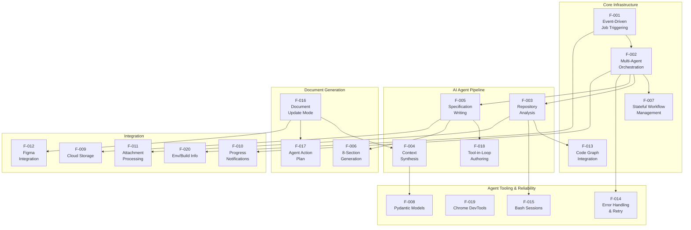

### 2.3.2 Integration Points

The system interfaces with external services through well-defined integration boundaries. The following table documents each integration point with its source feature, target system, and communication mechanism.

| Source Feature | Target System | Mechanism |
|---|---|---|
| F-001 | Google Cloud Pub/Sub | Message consumption via `EVENT_DATA` |
| F-003 | Neo4j Code Graph | Query via `CodeGraphBuilder` tools |
| F-003 | Target Repository | Bash session + code graph tools |
| F-005 | Anthropic API | Claude claude-opus-4-6 LLM requests |
| F-004 | OpenAI API | GPT-5-mini structured output |

| Source Feature | Target System | Mechanism |
|---|---|---|
| F-009 | Google Cloud Storage | `AdminStorageService` CRUD operations |
| F-010 | Google Cloud Pub/Sub | `publish_notification()` publishing |
| F-011 | archie-service-admin | REST API (`/v1/attachments`) |
| F-012 | Figma | MCP server (stdio transport) |
| F-019 | Chrome Browser | Chrome DevTools MCP (headless) |

### 2.3.3 Shared Components and Common Services

Multiple features share common infrastructure components, reducing duplication and ensuring behavioral consistency.

#### Shared LLM Instances

| LLM Instance | Configuration | Used By |
|---|---|---|
| `llm_claude_opus_4_6_thinking_max` | Claude claude-opus-4-6, max_tokens=32,000, temp=1.0, timeout=900s | F-003, F-005, F-017 |
| `llm_gpt5_mini` | GPT-5-mini, max_tokens=64,000, reasoning_effort='high' | F-004 |

#### Shared Processing Utilities

| Component | Description | Used By |
|---|---|---|
| `process_tool_call()` | Executes individual tool calls | F-003, F-005, F-017 |
| `process_messages_with_tool_call()` | Tool-call loop processor | F-003, F-005, F-017 |
| `@archie_exponential_retry()` | Retry decorator | F-003, F-004, F-005, F-016, F-017 |
| `clean_document()` | Document text normalization | F-006, F-016 |
| `parse_sections_at_heading_level()` | Heading-level section parser | F-006, F-016 |
| `format_document_heading()` | Heading formatter | F-006, F-016 |

#### Common State Dependencies

All seven graph nodes (`setup`, `gather_context`, `document_section`, `summarize_changes`, `identify_changes`, `update_section`, `copy_old_tech_spec_section`) read from and write to the shared `ReverseDocumentState` (F-007), making state management the single most interconnected component in the system.

---

## 2.4 Implementation Considerations

### 2.4.1 Technical Constraints

The following technical constraints govern the system's operational boundaries, as derived from configuration in `/app/lib/reverse_document/helper.py`, `/app/main.py`, and the `blitzy-platform-shared` library.

| Constraint | Value | Source |
|---|---|---|
| Context window limit | 300,000 tokens (CONTEXT_300K) | `blitzy_platform_shared.common.consts` |
| Claude claude-opus-4-6 max input tokens | 1,000,000 | LLM configuration |
| Claude claude-opus-4-6 max output tokens | 32,000 (configured) | `llm_claude_opus_4_6_thinking_max` |
| GPT-5-mini max output tokens | 64,000 | `llm_gpt5_mini` |
| LLM request timeout | 900 seconds (15 minutes) | All LLM instances |
| Graph recursion limit | 500 transitions | `app.astream()` config |
| Maximum retry attempts | 17 | `DEFAULT_MAX_RETRIES` |
| Parallel tool calls | Disabled (`parallel_tool_calls=False`) | Tool configuration |

### 2.4.2 Performance Requirements

| Requirement | Detail |
|---|---|
| **Streaming execution** | Results are streamed via `app.astream()` for progressive delivery; partial specs are uploaded to GCS after each section |
| **Sequential tool processing** | Tool calls are processed sequentially to ensure deterministic agent behavior |
| **Attachment caching** | Attachment data is downloaded once and cached in `attachment_base64_cache` to avoid redundant API calls |
| **Root folder pre-fetch** | Repository root contents are fetched once during `setup` and stored in state for reuse across all search iterations |
| **Progressive upload** | After each section completes, the in-progress spec is uploaded to GCS, enabling consumers to access partial results |

### 2.4.3 Scalability Considerations

| Consideration | Detail |
|---|---|
| **Serverless execution** | Deployed as a Google Cloud Run Job, providing automatic scaling to zero when idle and on-demand instantiation per trigger |
| **Stateless between runs** | Each execution is fully independent with no persistent state between runs; all context is initialized from the Pub/Sub message and external services |
| **Container specification** | Docker container based on Ubuntu 24.04 with Python 3.12, Node.js 20, and Google Chrome (per `/app/Dockerfile`) |
| **Regional deployment** | Deployed to `us-central1` (configured in `/app/Makefile` and `/app/.github/workflows/deploy-job.yml`) |
| **Network isolation** | VPC egress configured for network-level isolation of outbound traffic |

### 2.4.4 Security Implications

| Security Concern | Mitigation |
|---|---|
| **API key management** | All API keys (`ANTHROPIC_API_KEY`, `OPENAI_API_KEY`, `VOYAGE_API_KEY`) are stored as environment variables, not hardcoded |
| **Database credentials** | Neo4j credentials (`NEO4J_SERVER`, `NEO4J_USERNAME`, `NEO4J_PASSWORD`) managed via environment variables |
| **Cloud authentication** | GCS authentication uses Google service account credentials |
| **Repository access** | GitHub access managed through a dedicated secret server (`GITHUB_SECRET_SERVER`) |
| **User authentication** | Delegated to the Blitzy platform; no direct user auth is implemented in this system |
| **Source code protection** | Agents are explicitly instructed (via prompts) to never expose `/app/` source code in generated output |

### 2.4.5 Maintenance Requirements

| Area | Detail |
|---|---|
| **Dependency management** | Single external dependency: `blitzy-platform-shared==0.0.549` (pinned version in `/app/requirements.txt`) |
| **Code quality** | Pre-commit hooks enforce: trailing-whitespace removal, end-of-file fixing, YAML validation, large-file prevention, debug-statement detection, black formatting (line-length=120), isort import ordering (per `/app/.pre-commit-config.yaml`) |
| **CI/CD pipeline** | GitHub Actions workflow triggered on push to `qa` branch; builds Docker image, pushes to Artifact Registry, deploys to Cloud Run (per `/app/.github/workflows/deploy-job.yml`) |
| **Code ownership** | Entire codebase owned by `@siddhantpp` (per `/app/CODEOWNERS`) |
| **Prompt maintenance** | All agent prompts, personas, and rules are centralized in `/app/lib/reverse_document/prompts.py` for unified modification |

---

## 2.5 Traceability Matrix

The following matrix maps features to their functional requirements, source files, and related specification sections.

| Feature ID | Requirement IDs | Primary Source File |
|---|---|---|
| F-001 | F-001-RQ-001 to RQ-004 | `/app/main.py` |
| F-002 | F-002-RQ-001 to RQ-005 | `/app/lib/reverse_document/helper.py` |
| F-003 | F-003-RQ-001 to RQ-005 | `/app/lib/reverse_document/helper.py` |
| F-004 | F-004-RQ-001 to RQ-003 | `/app/lib/reverse_document/helper.py` |
| F-005 | F-005-RQ-001 to RQ-005 | `/app/lib/reverse_document/helper.py` |
| F-006 | F-006-RQ-001 to RQ-003 | `/app/lib/reverse_document/prompts.py` |
| F-007 | F-007-RQ-001 to RQ-003 | `/app/lib/reverse_document/state.py` |
| F-008 | F-008-RQ-001 to RQ-003 | `/app/lib/reverse_document/models.py` |
| F-009 | F-009-RQ-001 to RQ-004 | `/app/main.py` |
| F-010 | F-010-RQ-001 to RQ-003 | `/app/main.py` |

| Feature ID | Requirement IDs | Primary Source File |
|---|---|---|
| F-011 | F-011-RQ-001 to RQ-003 | `/app/main.py`, `/app/lib/reverse_document/helper.py` |
| F-012 | F-012-RQ-001 to RQ-003 | `/app/lib/reverse_document/helper.py` |
| F-013 | F-013-RQ-001 to RQ-003 | `/app/main.py` |
| F-014 | F-014-RQ-001 to RQ-005 | `/app/lib/reverse_document/helper.py` |
| F-015 | F-015-RQ-001 to RQ-004 | `/app/lib/reverse_document/helper.py` |
| F-016 | F-016-RQ-001 to RQ-004 | `/app/main.py`, `/app/lib/reverse_document/helper.py` |
| F-017 | F-017-RQ-001 to RQ-003 | `/app/lib/reverse_document/helper.py` |
| F-018 | F-018-RQ-001 to RQ-004 | `/app/lib/reverse_document/helper.py` |
| F-019 | — (no formal requirements) | `/app/Dockerfile`, `/app/lib/reverse_document/helper.py` |
| F-020 | F-020-RQ-001 to RQ-002 | `/app/main.py` |

| Feature ID | Related Spec Sections | Category |
|---|---|---|
| F-001 | §1.1.1 (Project Overview), §1.3.1 (In-Scope) | Core Infrastructure |
| F-002 | §1.2.2 (High-Level Description), §4 (Process Flowchart) | Core Infrastructure |
| F-003 | §1.2.2 (Core Technical Approach) | AI Agent Pipeline |
| F-004 | §1.2.2 (Core Technical Approach) | AI Agent Pipeline |
| F-005 | §1.2.2 (Core Technical Approach), §1.1.4 (Value Proposition) | AI Agent Pipeline |
| F-006 | §1.2.2 (Primary System Capabilities), §1.3.1 (Core Features) | Document Generation |
| F-007 | §1.2.2 (Major System Components) | Core Infrastructure |
| F-008 | §1.2.2 (Major System Components) | Data Validation |
| F-009 | §1.2.1 (Integration with Enterprise Landscape) | Integration |
| F-010 | §1.3.1 (Essential Integrations) | Integration |
| F-014 | §1.3.1 (Key Technical Requirements) | Reliability |
| F-016 | §1.3.2 (Future Considerations) | Document Generation |

---

## 2.6 Assumptions and Constraints

### 2.6.1 Assumptions

| ID | Assumption |
|---|---|
| A-001 | The target repository is accessible via the Neo4j code graph and downloadable to disk at the time of job execution |
| A-002 | All required API keys and service credentials are valid and have sufficient quota for the duration of the job |
| A-003 | The Blitzy platform handles user authentication and authorization before publishing the Pub/Sub trigger message |
| A-004 | The `blitzy-platform-shared` library (v0.0.549) provides stable, backward-compatible interfaces for all shared utilities |
| A-005 | The Neo4j database contains an up-to-date code graph representation of the target repository at the specified commit hash |

### 2.6.2 Constraints

| ID | Constraint |
|---|---|
| C-001 | All generated documentation is English-only; multi-language output is not supported (per `/app/lib/reverse_document/prompts.py`) |
| C-002 | The eight-section specification template is hardcoded and not user-configurable |
| C-003 | Each execution produces either a full specification (GENERATE) or a selective update (UPDATE); hybrid modes are not supported |
| C-004 | The system operates as a headless backend job with no user-facing interface |
| C-005 | Sequential tool processing limits parallelism within a single agent execution |

---

## 2.7 References

#### Source Files

- `/app/main.py` — Entry point, Pub/Sub event handling, workflow initialization, notification publishing, attachment retrieval, progressive upload logic
- `/app/lib/reverse_document/helper.py` — `ReverseDocumentHelper` class, `StateGraph` definition with 7 nodes, all agent implementations (gather_context, document_section, summarize_changes, identify_changes, update_section), routing logic, tool definitions, tool processing, MCP management
- `/app/lib/reverse_document/state.py` — `ReverseDocumentState` TypedDict definition, `get_state()` serialization function
- `/app/lib/reverse_document/models.py` — Pydantic models: `DocumentSectionStatus`, `DocumentSection`, `DocumentSections`
- `/app/lib/reverse_document/prompts.py` — All prompt templates, agent personas (SEARCH_PERSONA_PROMPTLET, SEARCH_RULES_PROMPTLET), workflow protocols, Master To-Do List, specialized summary prompts, FIGMA_TOOLS_PROMPTLET
- `/app/requirements.txt` — Dependency declaration (`blitzy-platform-shared==0.0.549`)
- `/app/Dockerfile` — Container build configuration (Ubuntu 24.04, Python 3.12, Node.js 20, Google Chrome)
- `/app/Makefile` — Build and deploy commands (Artifact Registry, Cloud Run Jobs, `us-central1`)
- `/app/.github/workflows/deploy-job.yml` — CI/CD pipeline (GitHub Actions → Artifact Registry → Cloud Run)
- `/app/.pre-commit-config.yaml` — Code quality hooks (black, isort, trailing-whitespace, YAML, debug-statements)
- `/app/CODEOWNERS` — Code ownership (`@siddhantpp`)
- `/app/set_env.py` — Development environment configuration
- `/app/mock_tech_spec.py` — Reference output specification (9,400+ lines)

#### Shared Library References

- `blitzy_platform_shared.document.prompts.TECHNICAL_SECTION_PROMPTS` — 15 section headings with associated prompts
- `blitzy_platform_shared.common.llms` — Claude claude-opus-4-6 and GPT-5-mini LLM configurations
- `blitzy_platform_shared.common.consts` — Retryable exception lists, `DEFAULT_MAX_RETRIES` (17), `CONTEXT_300K`
- `blitzy_platform_shared.common.storage.AdminStorageService` — GCS operations (download/upload tech spec, prompts)
- `blitzy_platform_shared.document.utils` — Document cleaning and parsing utilities
- `blitzy_platform_shared.mcp.consts.CHROME_DEVTOOLS_MCP` — Chrome MCP server configuration
- `blitzy_utils.enums` — `BackpropChangeMode` (GENERATE/UPDATE), `JobStatus`, `ProjectPhase`

#### Cross-Referenced Specification Sections

- §1.1 Executive Summary — Project overview, business problem, value proposition
- §1.2 System Overview — System capabilities, major components, technology stack, success criteria
- §1.3 Scope — In-scope features, implementation boundaries, out-of-scope items

# 3. Technology Stack

This section provides a complete, evidence-based catalog of all technologies, frameworks, libraries, services, and infrastructure components comprising the Reverse Document Generator. Every entry is grounded in direct evidence from the system's source files, container configuration, CI/CD pipeline, and runtime environment. The system operates as a headless, cloud-native AI batch job — it contains no frontend, no web framework, no user-facing interface, and no native application components.

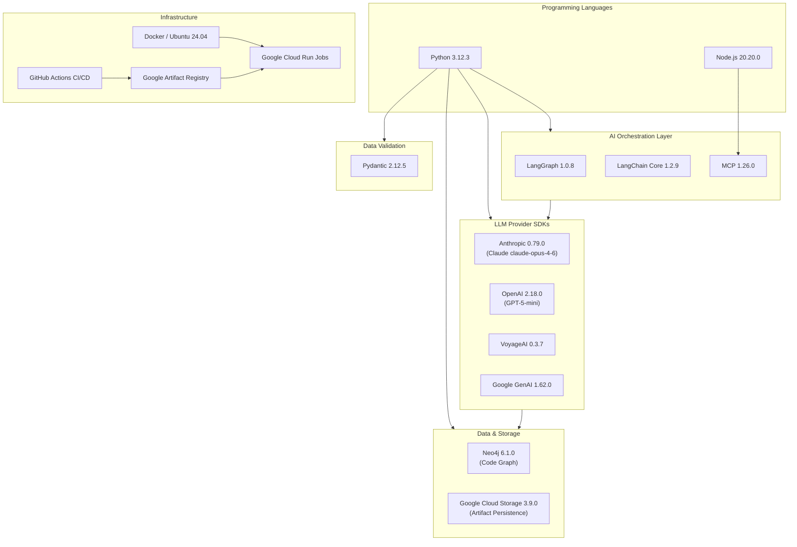

---

## 3.1 PROGRAMMING LANGUAGES

The Reverse Document Generator employs two runtime languages, each serving a distinct and well-scoped purpose within the system's container environment.

### 3.1.1 Primary Language: Python 3.12

| Attribute | Detail |
|---|---|
| **Version** | 3.12.3 |
| **Source** | `ppa:deadsnakes/ppa` (installed in `/app/Dockerfile`) |
| **Runtime Packages** | `python3.12`, `python3.12-venv`, `python3.12-dev` |
| **Package Manager** | pip 25.3 (explicitly set via `get-pip.py` in `/app/Dockerfile`) |
| **Entry Point** | `CMD ["python", "main.py"]` in `/app/Dockerfile` |

Python 3.12 serves as the sole application language, powering all core logic including:

- **AI Agent Orchestration** — The multi-agent pipeline (Search → Architect → Author) implemented in `/app/lib/reverse_document/helper.py` using LangGraph's `StateGraph`
- **Event Handling** — Pub/Sub message decoding and job initialization in `/app/main.py`
- **Data Modeling** — Pydantic-based data validation models in `/app/lib/reverse_document/models.py`
- **State Management** — `ReverseDocumentState` TypedDict in `/app/lib/reverse_document/state.py`
- **Cloud Service Integration** — Google Cloud Storage, Neo4j, and platform API interactions

#### Selection Justification

Python 3.12 is selected for its first-class support in the LangChain and LangGraph ecosystems, which form the foundation of the system's AI orchestration layer. The entire `blitzy-platform-shared` library and its 173 transitive dependencies are Python-native. Python 3.12 specifically provides performance improvements through the adaptive specializing interpreter and enhanced type annotation support used extensively in the system's `TypedDict`-based state management.

### 3.1.2 Supporting Runtime: Node.js 20

| Attribute | Detail |
|---|---|
| **Version** | 20.20.0 (LTS) |
| **Source** | NodeSource (`https://deb.nodesource.com/setup_20.x`) |
| **npm Version** | 11.1.0 (explicitly upgraded in `/app/Dockerfile`: `npm install -g npm@11.1.0`) |
| **Purpose** | Chrome DevTools MCP server execution |

Node.js is present exclusively to support the Chrome DevTools Model Context Protocol (MCP) integration. The MCP server is launched via `npx chrome-devtools-mcp@latest`, which requires a Node.js runtime. Node.js plays no role in application logic, data processing, or agent orchestration.

#### Selection Justification

Node.js 20 LTS is required because the `chrome-devtools-mcp` package is distributed as an npm package and executes as a Node.js process. The LTS channel ensures stability and long-term security support within the container environment.

### 3.1.3 Language Platform Summary

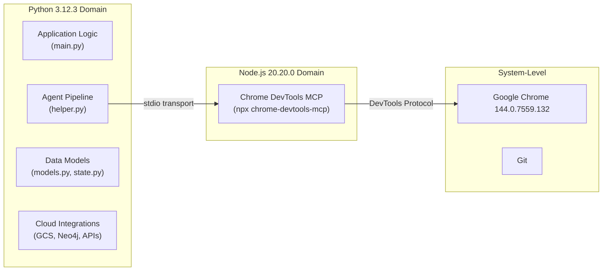

| Language | Scope | Lines of Application Code | Dependency Count |
|---|---|---|---|
| Python 3.12.3 | All application logic, AI orchestration, data models, cloud integrations | ~100% of application source | 173 pip packages |
| Node.js 20.20.0 | Chrome DevTools MCP server only | 0 (uses `npx` runtime) | 1 npm package (runtime) |

---

## 3.2 FRAMEWORKS & LIBRARIES

All frameworks and libraries are installed as transitive dependencies of the single declared dependency `blitzy-platform-shared==0.0.549` (as specified in `/app/requirements.txt`). Exact versions are confirmed via `pip list` output from the production container.

### 3.2.1 AI Orchestration Frameworks

The AI orchestration layer is built on the LangGraph and LangChain ecosystem, which provides the foundational abstractions for stateful multi-agent workflows, tool binding, and LLM integration.

| Package | Version | Purpose | Source Evidence |
|---|---|---|---|
| `langgraph` | 1.0.8 | Core workflow orchestration via `StateGraph` with 7 nodes and conditional routing | `/app/lib/reverse_document/helper.py` — imports `StateGraph`, `START`, `END` |
| `langgraph-checkpoint` | 4.0.0 | State checkpointing for workflow persistence | Transitive dependency |
| `langgraph-prebuilt` | 1.0.7 | Prebuilt LangGraph components and agent patterns | Transitive dependency |
| `langgraph-sdk` | 0.3.4 | LangGraph client SDK | Transitive dependency |
| `langchain-core` | 1.2.9 | Foundation abstractions: `BaseChatModel`, `AIMessage`, `HumanMessage`, `SystemMessage`, `ToolMessage`, `BaseMessage`, `BaseTool` | `/app/lib/reverse_document/helper.py` — direct imports |
| `langchain-anthropic` | 1.3.2 | Anthropic Claude integration provider | Powers `llm_claude_opus_4_6_thinking_max` |
| `langchain-openai` | 1.1.8 | OpenAI GPT integration provider | Powers `llm_gpt5_mini` |
| `langchain-voyageai` | 0.3.2 | VoyageAI embedding and semantic search | Semantic search over code graphs |
| `langchain-neo4j` | 0.8.0 | Neo4j graph database querying via LangChain | Code graph tool implementations |
| `langchain-google-genai` | 4.2.0 | Google Generative AI integration | Available via `GOOGLE_API_KEY` |
| `langchain-aws` | 1.2.2 | AWS service integrations via LangChain | Transitive dependency |
| `langchain-mcp-adapters` | 0.2.1 | Model Context Protocol tool adaptation | Figma and Chrome DevTools MCP integration |
| `langchain-text-splitters` | 1.1.0 | Text chunking utilities | Document processing |
| `langchain-classic` | 1.0.1 | Legacy LangChain compatibility layer | Backward compatibility |

#### LangGraph Justification

LangGraph is the central framework choice, enabling the system to model its multi-agent pipeline as a compiled, directed state graph. The `StateGraph` abstraction in `/app/lib/reverse_document/helper.py` defines the complete workflow — from event-driven setup through search, architect, and author agents — with conditional routing logic (`setup_router`, `document_router`) that supports both GENERATE and UPDATE execution paths. This approach provides deterministic control flow, built-in state management, and seamless tool binding, all critical requirements for the system's reliable, multi-step AI pipeline.

### 3.2.2 LLM Provider SDKs

Direct API client libraries for each AI provider, used by the LangChain integration layers to communicate with external LLM services.

| Package | Version | LLM Model | Configuration | Evidence |
|---|---|---|---|---|
| `anthropic` | 0.79.0 | Claude claude-opus-4-6 | `max_tokens=32,000`, `temperature=1.0`, `timeout=900s`, extended thinking enabled | `blitzy_platform_shared.common.llms.llm_claude_opus_4_6_thinking_max` |
| `openai` | 2.18.0 | GPT-5-mini | `max_tokens=64,000`, `reasoning_effort='high'`, `timeout=900s` | `blitzy_platform_shared.common.llms.llm_gpt5_mini` |
| `voyageai` | 0.3.7 | Voyage embeddings | Embedding model for semantic code search | `VOYAGE_API_KEY` environment variable |
| `google-genai` | 1.62.0 | Google Generative AI | Available as alternate provider | `GOOGLE_API_KEY` environment variable |
| `mcp` | 1.26.0 | Model Context Protocol | Stdio transport for tool servers (Figma, Chrome DevTools) | `blitzy_platform_shared.mcp.manager.MCPManager` |

#### Provider Allocation by Agent

| Agent | Primary LLM | Justification |
|---|---|---|
| Search Agent (Context Gatherer) | Claude claude-opus-4-6 (`llm_claude_opus_4_6_thinking_max`) | Extended thinking capability enables deep repository exploration with tool-use reasoning |
| Architect Agent (Context Synthesizer) | GPT-5-mini (`llm_gpt5_mini`) | Structured output with `strict=True` enforcement via `with_structured_output(DocumentSections)` |
| Author Agent (Specification Writer) | Claude claude-opus-4-6 (`llm_claude_opus_4_6_thinking_max`) | High-quality long-form prose generation with cross-reference tool access |
| Summarizer Agent (Action Plans) | Claude claude-opus-4-6 (`llm_claude_opus_4_6_thinking_max`) | Comprehensive action plan synthesis with full tool set |

### 3.2.3 Data Validation & Serialization

| Package | Version | Purpose | Source Evidence |
|---|---|---|---|
| `pydantic` | 2.12.5 | Data validation for structured agent outputs and document models | `/app/lib/reverse_document/models.py` — `DocumentSectionStatus`, `DocumentSection`, `DocumentSections` |
| `pydantic-settings` | 2.12.0 | Environment-based settings management | Platform configuration |
| `pydantic_core` | 2.41.5 | Rust-backed Pydantic core validation engine | Performance-critical validation layer |

Pydantic v2 is the data validation backbone, enforcing strict schema conformance for the Architect Agent's structured output. The `with_structured_output(DocumentSections, strict=True)` pattern in `/app/lib/reverse_document/helper.py` guarantees that GPT-5-mini's change detection output conforms to the `DocumentSections` model, where each section entry contains a heading, a `CHANGED`/`UNCHANGED` status (via `DocumentSectionStatus` enum), and a list of change descriptions. Validation failures trigger retries through the `@archie_exponential_retry()` mechanism.

### 3.2.4 Text Processing & Tokenization

| Package | Version | Purpose | Source Evidence |
|---|---|---|---|
| `transformers` | 5.1.0 | GPT-2 tokenizer for token counting | Pre-downloaded during Docker build: `GPT2TokenizerFast.from_pretrained('gpt2')` in `/app/Dockerfile` |
| `tiktoken` | 0.12.0 | OpenAI-compatible token counting | Token budget management for LLM requests |
| `tokenizers` | 0.22.2 | Rust-based tokenizer backend (HuggingFace) | Performance backend for `transformers` |
| `thefuzz` | 0.22.1 | Fuzzy string matching | `/app/lib/reverse_document/helper.py` — `from thefuzz import process` |

#### Tokenization Strategy

The system employs a dual tokenization approach: `transformers` with a pre-cached GPT-2 tokenizer provides general token counting, while `tiktoken` handles OpenAI-specific token budget calculations. The GPT-2 tokenizer files are pre-downloaded during the Docker build phase to eliminate runtime download latency. The `CONTEXT_300K` constant from `blitzy_platform_shared.common.consts` governs the 300,000-token context window limit applied across all agent interactions.

### 3.2.5 HTTP & Networking

| Package | Version | Purpose |
|---|---|---|
| `httpx` | 0.28.1 | Async HTTP client for LLM API communication |
| `httpx-sse` | 0.4.3 | Server-sent events support for streaming LLM responses |
| `aiohttp` | 3.13.3 | Async HTTP client/server for platform service calls |
| `requests` | 2.32.5 | Synchronous HTTP client for simple REST API calls |
| `grpcio` | 1.78.0 | gRPC client for Google Cloud service communication |
| `grpcio-status` | 1.78.0 | gRPC status code handling |

The networking stack supports both synchronous and asynchronous HTTP patterns. The system's primary execution flow is asynchronous (via `app.astream()` and `async` agent methods in `/app/lib/reverse_document/helper.py`), making `httpx` and `aiohttp` the primary HTTP clients. Synchronous `requests` is used for simpler, non-streaming API calls such as attachment retrieval from `archie-service-admin`.

### 3.2.6 Image & Numerical Processing

| Package | Version | Purpose |
|---|---|---|
| `pillow` | 12.1.0 | Image processing for attachment handling (format conversion, encoding) |
| `numpy` | 2.4.2 | Numerical computing (transitive dependency for ML libraries) |

These libraries support the attachment processing pipeline (Feature F-011), where project attachments — including design files and reference images — are downloaded, processed, and encoded as base64 for inclusion in agent context.

---

## 3.3 OPEN SOURCE DEPENDENCIES

### 3.3.1 Dependency Architecture

The Reverse Document Generator employs a distinctive **single-dependency architecture** — the application's `/app/requirements.txt` declares exactly one direct dependency, which serves as the sole entry point for all 173 installed packages in the production container.

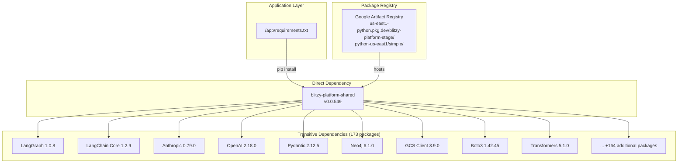

#### Justification

This architecture centralizes dependency management across all Blitzy platform services. By funneling all transitive dependencies through a single, version-pinned shared library, the platform ensures:

- **Version consistency** across all Blitzy microservices and jobs
- **Centralized security patching** — vulnerable packages are updated once in the shared library
- **Reduced dependency conflicts** — a single resolution tree eliminates version incompatibilities
- **Simplified application maintenance** — updating `blitzy-platform-shared` propagates all dependency changes

### 3.3.2 Primary Dependencies

#### blitzy-platform-shared (v0.0.549)

| Attribute | Detail |
|---|---|
| **Version** | 0.0.549 |
| **Registry** | Google Artifact Registry (`us-east1-python.pkg.dev/blitzy-platform-stage/python-us-east1/simple/`) |
| **Declaration** | `/app/requirements.txt` — sole entry |

This package bundles the complete platform integration layer, including all shared modules consumed by the application. The following module families are imported across `/app/main.py` and `/app/lib/reverse_document/helper.py`:

| Module Namespace | Capabilities Provided |
|---|---|
| `blitzy_platform_shared.common.llms` | Pre-configured LLM instances (`llm_claude_opus_4_6_thinking_max`, `llm_gpt5_mini`) |
| `blitzy_platform_shared.common.consts` | System constants (`CONTEXT_300K`, `RETRYABLE_EXCEPTIONS`, `DEFAULT_MAX_RETRIES`) |
| `blitzy_platform_shared.common.storage` | `AdminStorageService` for GCS operations (upload/download tech specs, prompts) |
| `blitzy_platform_shared.common.tools` | Tool definitions (`ANTHROPIC_WEB_SEARCH_TOOL_DEFINITION`, `read_file`) |
| `blitzy_platform_shared.common.utils` | Retry decorators, LLM request helpers, attachment processing, model type detection |
| `blitzy_platform_shared.common.bash` | Bash tool response handling (`handle_bash_tool_response`) |
| `blitzy_platform_shared.common.models` | Error types (`FormattingError`) |
| `blitzy_platform_shared.common.environments` | Build info retrieval, environment file management |
| `blitzy_platform_shared.code_graph.builder` | `CodeGraphBuilder` for Neo4j code graph access |
| `blitzy_platform_shared.code_graph.tools` | Code graph query tools (`get_file_summary`, `search_files`, `search_folders`, `get_source_folder_contents`) |
| `blitzy_platform_shared.document.prompts` | Section prompts (`TECH_SPEC_SECTIONS_INPUT`, `TECHNICAL_SECTION_PROMPTS`) |
| `blitzy_platform_shared.document.models` | Document models (`TechSpecSubSection`) |
| `blitzy_platform_shared.document.tools` | Document management tools (`get_tech_spec_section`, `add_tech_spec_sub_section`, `mark_tech_spec_sub_section_complete`) |
| `blitzy_platform_shared.document.utils` | Document utilities (`clean_document`, `parse_sections_at_heading_level`, `format_document_heading`) |
| `blitzy_platform_shared.document.mermaid_fixer` | `MermaidFixer` for diagram validation and correction |
| `blitzy_platform_shared.mcp.manager` | `MCPManager` for MCP server lifecycle management |
| `blitzy_platform_shared.mcp.utils` | Figma MCP configuration (`get_figma_mcp`) |
| `blitzy_platform_shared.mcp.consts` | MCP server definitions (`CHROME_DEVTOOLS_MCP`) |
| `blitzy_platform_shared.code_generation.tools` | Bash tool definitions (`ANTHROPIC_BASH_TOOL_DEFINITION`) |

#### blitzy-utils (v0.0.504)

| Attribute | Detail |
|---|---|
| **Version** | 0.0.504 |
| **Source** | Bundled with `blitzy-platform-shared` |

| Module Namespace | Capabilities Provided |
|---|---|
| `blitzy_utils.common` | Pub/Sub notification publishing (`publish_notification`), JSON content extraction (`get_json_content`) |
| `blitzy_utils.enums` | Execution mode enums (`BackpropChangeMode`, `JobStatus`, `ProjectPhase`) |
| `blitzy_utils.logger` | Centralized logging (`logger`) |
| `blitzy_utils.scm` | Repository operations (`download_repository_to_disk`, `get_head_commit_hash`) |
| `blitzy_utils.service_client` | Platform service HTTP client (`ServiceClient`) |
| `blitzy_utils.figma` | Figma metadata retrieval (`get_figma_info_for_tech_spec`, `get_figma_attachment_info`) |

### 3.3.3 Transitive Dependency Catalog

The production container contains 173 total installed packages. The following table highlights architecturally significant transitive dependencies organized by functional category.

| Category | Package | Version | Purpose |
|---|---|---|---|
| **AWS** | `boto3` | 1.42.45 | AWS SDK (via `langchain-aws`) |
| **AWS** | `botocore` | 1.42.45 | AWS SDK core |
| **Google Cloud** | `google-api-core` | 2.29.0 | Google API foundation |
| **Google Cloud** | `google-auth` | 2.48.0 | Google authentication |
| **Google Cloud** | `google-cloud-core` | 2.5.0 | Google Cloud foundation |
| **Google Cloud** | `google-cloud-storage` | 3.9.0 | GCS client library |
| **Security** | `cryptography` | 41.0.7 | Cryptographic primitives |
| **Security** | `certifi` | 2026.1.4 | SSL certificate bundle |
| **Serialization** | `protobuf` | 6.33.5 | Protocol Buffers for gRPC |
| **Serialization** | `proto-plus` | 1.27.1 | Protobuf wrapper |
| **Graph Database** | `neo4j` | 6.1.0 | Neo4j Bolt driver |
| **Graph Database** | `neo4j-graphrag` | 1.13.0 | Neo4j graph RAG utilities |
| **Server** | `uvicorn` | 0.40.0 | ASGI server (MCP support) |
| **Setuptools** | `setuptools` | ≥70.0.0 | Upgraded for security (CVE mitigation, per `/app/Dockerfile`) |

#### Security Considerations

The `/app/Dockerfile` explicitly addresses dependency security:
- **setuptools** is upgraded to ≥70.0.0 to mitigate known vulnerabilities in earlier versions
- **PAM packages** are upgraded within the container build
- **SSL certificates** (`certifi` 2026.1.4) are current, ensuring secure HTTPS communication with all external APIs
- **Build secrets** — Google credentials are mounted via `--mount=type=secret,id=google_credentials` rather than being embedded in the image layer

---

## 3.4 THIRD-PARTY SERVICES

The system integrates with multiple external services spanning AI providers, platform microservices, design tooling, and observability infrastructure. All service credentials are managed via environment variables — no secrets are hardcoded in the codebase.

### 3.4.1 AI/LLM API Providers

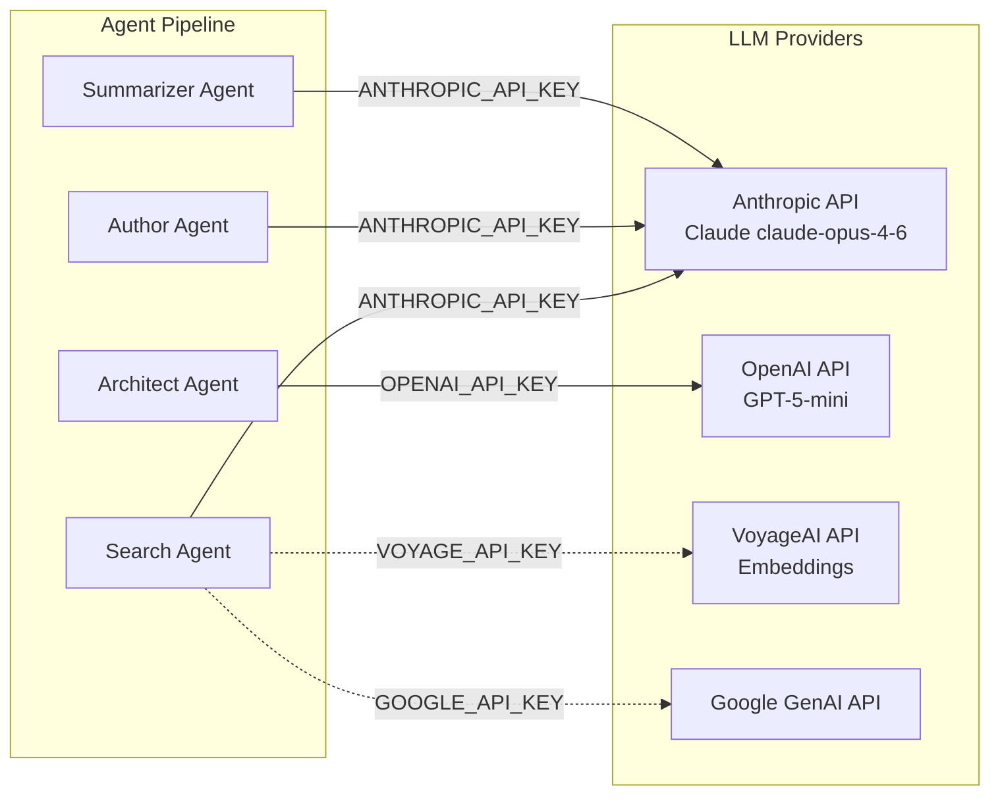

| Provider | API Key Variable | Model | Agent Usage | Configuration |
|---|---|---|---|---|
| **Anthropic** | `ANTHROPIC_API_KEY` | Claude claude-opus-4-6 | Search Agent, Author Agent, Summarizer Agent | `max_tokens=32,000`, `temperature=1.0`, `timeout=900s`, extended thinking |
| **OpenAI** | `OPENAI_API_KEY` | GPT-5-mini | Architect Agent (change detection) | `max_tokens=64,000`, `reasoning_effort='high'`, `timeout=900s` |
| **VoyageAI** | `VOYAGE_API_KEY` | Voyage embeddings | Semantic search over code graphs | Embedding model for vector similarity |
| **Google** | `GOOGLE_API_KEY` | Google Generative AI | Available as alternate provider | Via `langchain-google-genai` 4.2.0 |

#### Provider Selection Rationale

- **Anthropic Claude claude-opus-4-6** is chosen as the primary LLM for three of four agent roles due to its extended thinking capability, which enables deep, multi-step reasoning during repository exploration (Search Agent) and long-form prose generation (Author Agent). The 1,000,000-token input context window accommodates large repository contexts.
- **OpenAI GPT-5-mini** is dedicated to the Architect Agent's change detection task because it provides native structured output enforcement (`with_structured_output(DocumentSections, strict=True)`), guaranteeing Pydantic-compliant responses without post-hoc parsing. The `reasoning_effort='high'` setting optimizes for accuracy in subsection-level change classification.
- **VoyageAI** provides specialized code embedding models for semantic similarity search within Neo4j code graphs, enabling agents to find relevant files by conceptual meaning rather than keyword matching alone.

### 3.4.2 Blitzy Platform Internal Services

These are microservices within the Blitzy platform ecosystem that the Reverse Document Generator consumes via REST APIs.

| Service | Environment Variable | Base URL Pattern | Purpose | Evidence |
|---|---|---|---|---|
| **archie-service-admin** | `SERVICE_URL_ADMIN` | `https://archie-service-admin-*.us-central1.run.app` | Project attachment retrieval (`/v1/attachments`), storage operations | `/app/main.py` — `ServiceClient().async_get(service_name="admin")` |
| **archie-secret-manager** | `GITHUB_SECRET_SERVER` | `https://archie-secret-manager-*.us-central1.run.app` | GitHub credential management for repository access | `/app/main.py` — `get_head_commit_hash()` |
| **archie-service-markdown** | `MARKDOWN_SERVER` | `https://archie-service-markdown-*.us-central1.run.app/v1/mermaid/validate` | Mermaid diagram syntax validation | `/app/set_env.py`, `MermaidFixer` usage in helper.py |

#### Integration Pattern

All platform service communication follows a consistent pattern: the `ServiceClient` from `blitzy_utils` provides authenticated HTTP access, while service URLs are injected as environment variables during Cloud Run deployment. Service account credentials handle authentication automatically within the Google Cloud environment.

### 3.4.3 External Tool Integrations

| Service | Integration Method | Transport | Purpose | Evidence |
|---|---|---|---|---|
| **Figma** | MCP Server | stdio | Design file access, image export (SVG/PNG to `/app/figma-assets`) | `MCPManager` + `get_figma_mcp()` in `/app/lib/reverse_document/helper.py` |
| **Chrome DevTools** | MCP Server | stdio | Headless browser interaction for web content analysis | `npx chrome-devtools-mcp@latest` via `CHROME_DEVTOOLS_MCP` config |
| **GitHub** | REST API (via secret server) | HTTPS | Source code repository download and commit hash resolution | `download_repository_to_disk()`, `get_head_commit_hash()` in `blitzy_utils.scm` |
| **Slack** | GitHub Action | Webhook | CI/CD deployment notifications | `slackapi/slack-github-action@v1.24.0` in `/app/.github/workflows/deploy-job.yml` |

#### MCP Integration Pattern

The Model Context Protocol (MCP) integration follows a consistent pattern managed by `MCPManager` from `blitzy_platform_shared.mcp.manager`:

1. MCP servers are configured with stdio transport for in-container process communication
2. `MCPManager` handles server lifecycle (start, stop, health monitoring)
3. MCP tools are adapted to LangChain-compatible tools via `langchain-mcp-adapters` 0.2.1
4. Figma MCP is conditionally enabled only when `is_figma_available=True` and Figma attachments exist
5. Chrome DevTools MCP is enabled by default, supported by Google Chrome 144.0.7559.132 installed in the container

### 3.4.4 Observability & Monitoring

| Service | Environment Variables | Purpose |
|---|---|---|
| **LangSmith** | `LANGSMITH_TRACING`, `LANGSMITH_ENDPOINT`, `LANGSMITH_API_KEY`, `LANGSMITH_PROJECT` | LLM call tracing, agent pipeline observability, cost tracking |

LangSmith provides end-to-end visibility into the multi-agent pipeline, tracing individual LLM calls, tool invocations, and agent state transitions. Tracing is toggled via the `LANGSMITH_TRACING` environment variable, enabling it in staging/production while allowing it to be disabled for local development.

---

## 3.5 DATABASES & STORAGE

The system employs a purpose-built storage strategy with no traditional relational database. Data persistence is achieved through a combination of a graph database for code structure and object storage for document artifacts.

### 3.5.1 Neo4j Graph Database

| Attribute | Detail |
|---|---|
| **Driver Package** | `neo4j` 6.1.0 |
| **Graph RAG** | `neo4j-graphrag` 1.13.0 |
| **LangChain Adapter** | `langchain-neo4j` 0.8.0 |
| **Protocol** | Bolt (`neo4j://`) |
| **Credentials** | `NEO4J_SERVER`, `NEO4J_USERNAME`, `NEO4J_PASSWORD` environment variables |
| **Access Pattern** | `CodeGraphBuilder(uri=NEO4J_SERVER, username=NEO4J_USERNAME, password=NEO4J_PASSWORD, ...)` |

#### Purpose and Usage

Neo4j stores pre-indexed code graph representations of target repositories. It is a **read-only** data source from the perspective of this system — code graphs are built and populated by an upstream platform service before the Reverse Document Generator is triggered. The system queries the graph through four bound tools:

| Tool | Function | Description |
|---|---|---|
| `get_source_folder_contents` | Folder hierarchy navigation | Returns directory listings and subfolder structures |
| `get_file_summary` | File summary retrieval | Returns AI-generated summaries of individual source files |
| `search_files` | Semantic file search | Finds files matching conceptual queries via VoyageAI embeddings |
| `search_folders` | Semantic folder search | Finds folders matching conceptual queries |

#### Justification

A graph database is the natural fit for code structure representation, where files, folders, and their relationships form a hierarchical directed graph. Neo4j's Cypher query language efficiently supports the traversal patterns required by agent tools — folder drilling, file lookup, and semantic similarity search — without the impedance mismatch that would occur with a relational or document database.

### 3.5.2 Google Cloud Storage (GCS)

| Attribute | Detail |
|---|---|
| **Client Package** | `google-cloud-storage` 3.9.0 |
| **Access Layer** | `AdminStorageService` from `blitzy_platform_shared.common.storage` |
| **Configuration** | `GCS_BUCKET_NAME`, `PRIVATE_BLOB_NAME` environment variables |
| **Authentication** | Google service account credentials |

#### Operations and Data Flow

| Operation | Method | Timing | Description |
|---|---|---|---|
| Download document prompt | `download_document_prompt()` | Job initialization | Retrieves the document generation prompt |
| Download existing spec | `download_tech_spec()` | UPDATE mode initialization | Retrieves previous specification for differential update |
| Download input prompt | `download_input_prompt()` | UPDATE mode initialization | Retrieves new requirements for update processing |
| Upload tech spec | `upload_tech_spec()` | After each section completion | Progressive upload of in-progress specification |

#### Progressive Upload Strategy

A key architectural pattern is the progressive upload of partial specifications to GCS. During the `app.astream()` loop in `/app/main.py`, the current state of the generated specification is uploaded after each section's completion. This enables:

- **Real-time progress visibility** — downstream consumers can access the most recently completed sections
- **Failure recovery context** — if the job fails mid-execution, previously completed sections are already persisted
- **Concurrent consumption** — platform dashboards can display partial results while generation continues

### 3.5.3 In-Memory Caching Strategy

The system employs targeted in-memory caching to avoid redundant external API calls during a single job execution.

| Cache | Data Structure | Scope | Purpose |
|---|---|---|---|
| `attachment_base64_cache` | Python dictionary | `ReverseDocumentHelper` instance | Caches base64-encoded attachment data fetched from `archie-service-admin` |
| `root_folder_contents` | String (in `ReverseDocumentState`) | Full workflow execution | Pre-fetched repository root folder contents stored during `setup` node |

No external caching infrastructure (Redis, Memcached) is used. Each Cloud Run Job execution is fully independent and stateless between runs — all caches exist only within the lifetime of a single container execution and are discarded when the job completes.

### 3.5.4 Data Persistence Summary

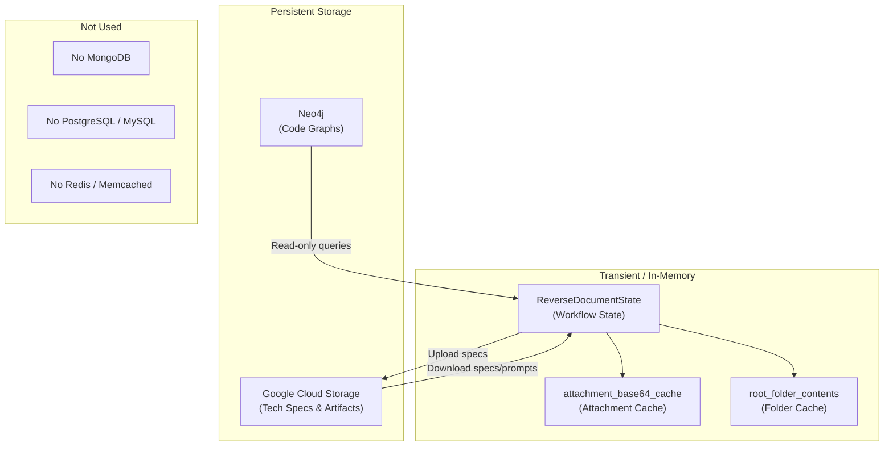

| Storage Type | Technology | Data Scope | Persistence |
|---|---|---|---|
| Graph Database | Neo4j 6.1.0 | Code structure, file summaries, folder hierarchies | Persistent (read-only from this system) |
| Object Storage | Google Cloud Storage 3.9.0 | Generated specifications, document prompts, input prompts | Persistent (read-write) |
| Workflow State | Python `TypedDict` (in-memory) | Agent outputs, section context, processing metadata | Transient (single execution) |
| Attachment Cache | Python `dict` (in-memory) | Base64-encoded project attachments | Transient (single execution) |

---

## 3.6 DEVELOPMENT & DEPLOYMENT

### 3.6.1 Container Configuration

The production container is defined in `/app/Dockerfile` using a single-stage build on Ubuntu 24.04.

| Component | Version / Detail | Purpose |
|---|---|---|
| **Base Image** | `ubuntu:24.04` | Stable LTS base with full system package support |
| **Python** | 3.12 (`ppa:deadsnakes/ppa`) | Application runtime |
| **Node.js** | 20 LTS (NodeSource) | Chrome DevTools MCP execution |
| **npm** | 11.1.0 (explicitly upgraded) | MCP package management |
| **pip** | 25.3 (via `get-pip.py`) | Python package installation |
| **setuptools** | ≥70.0.0 (upgraded) | Security patch for dependency installation |
| **Google Chrome** | Stable (144.0.7559.132) | Headless browser for Chrome DevTools MCP |
| **Docker BuildKit** | Enabled (`DOCKER_BUILDKIT=1`) | Efficient layer caching and secret mounting |

#### System Packages

The container includes the following system-level packages installed via `apt-get`: `git`, `xz-utils`, `sudo`, `wget`, `ca-certificates`, `curl`, `gnupg`, `lsb-release`, `iptables`, `supervisor`, `fuse-overlayfs`.

#### Build-Time Optimizations

| Optimization | Implementation | Benefit |
|---|---|---|
| GPT-2 tokenizer pre-download | `GPT2TokenizerFast.from_pretrained('gpt2')` during build | Eliminates ~500MB runtime download on first invocation |
| Build secrets | `--mount=type=secret,id=google_credentials` | Google Artifact Registry auth without embedding credentials in image layers |
| PAM security upgrade | Explicit package upgrade in build | Mitigates container-level security vulnerabilities |

#### Container Environment Variables

| Variable | Value | Purpose |
|---|---|---|
| `DBUS_SESSION_BUS_ADDRESS` | `/dev/null` | Prevents D-Bus errors in headless container |
| `CHROME_DEVEL_SANDBOX` | `0` | Disables Chrome sandbox for containerized execution |
| `TOKENIZERS_PARALLELISM` | Configurable | Controls HuggingFace tokenizer thread parallelism |

### 3.6.2 Build System

The build system is defined in `/app/Makefile` with the following targets:

| Target | Command | Purpose |
|---|---|---|
| `build` (default) | `docker build` with BuildKit | Builds the production Docker image |
| `deploy` | `deploy-to-cloud-run` | Deploys to Google Cloud Run Jobs via `deployment-utils` |

| Attribute | Detail |
|---|---|
| **Artifact Registry** | `us-east1-docker.pkg.dev/blitzy-platform-stage/gcf-artifacts/archie-job-reverse-document-generator` |
| **Image Tagging** | Git SHA + `latest` |
| **Environment Config** | `env_config/env-$(ENV).yaml` |
| **Python Registry** | `us-east1-python.pkg.dev/blitzy-platform-stage/python-us-east1/simple/` (for pip packages) |

### 3.6.3 CI/CD Pipeline

The continuous integration and deployment pipeline is defined in `/app/.github/workflows/deploy-job.yml`.

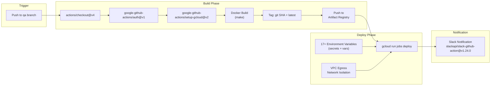

| Attribute | Detail |
|---|---|
| **Platform** | GitHub Actions |
| **Trigger** | Push to `qa` branch |
| **Runner** | `ubuntu-latest` |
| **Concurrency** | `qa-deployments` group with cancel-in-progress |
| **GCP Authentication** | `google-github-actions/auth@v1` with JSON service account credentials |
| **Cloud SDK** | `google-github-actions/setup-gcloud@v2` |
| **Deployment Target** | Google Cloud Run Job: `reverse-document-generator` |
| **Deployment Region** | Configurable via `${{ vars.REGION }}` (default: `us-central1`) |
| **Network Isolation** | VPC egress, dedicated network and subnet |
| **Identity** | Dedicated Cloud Run service account |
| **Notification** | Slack via `slackapi/slack-github-action@v1.24.0` |

#### Cloud Run Job Configuration

The deployment command (`gcloud run jobs deploy`) configures:
- CPU, memory, and timeout limits (configurable per environment)
- Maximum retry attempts for failed job executions
- VPC egress for network-level traffic isolation
- Service account binding for identity management
- 17+ environment variables injected as secrets (API keys) and variables (service URLs, project IDs)

### 3.6.4 Development Tools & Code Quality

Development quality standards are enforced through pre-commit hooks defined in `/app/.pre-commit-config.yaml`.

| Tool | Version | Configuration | Purpose |
|---|---|---|---|
| `pre-commit-hooks` | v4.5.0 | Multiple hooks (see below) | Baseline file hygiene |
| `black` | 24.3.0 | `--line-length=120` | Python code formatting |
| `isort` | 5.13.2 | `--profile=black`, `--line-length=120` | Python import ordering |
| `pretty-format-yaml` | v2.12.0 | `--autofix`, `--indent 2` (excludes `service.yaml`) | YAML formatting |

#### Pre-Commit Hook Details

| Hook | Source | Behavior |
|---|---|---|
| `trailing-whitespace` | `pre-commit-hooks` v4.5.0 | Removes trailing whitespace from all files |
| `end-of-file-fixer` | `pre-commit-hooks` v4.5.0 | Ensures files end with a single newline |
| `check-yaml` | `pre-commit-hooks` v4.5.0 | Validates YAML syntax (excludes `service.yaml`) |
| `check-added-large-files` | `pre-commit-hooks` v4.5.0 | Prevents accidental commit of large binaries |
| `debug-statements` | `pre-commit-hooks` v4.5.0 | Detects leftover `breakpoint()` / `pdb` statements |
| `requirements-txt-fixer` | `pre-commit-hooks` v4.5.0 | Sorts and normalizes `requirements.txt` |

#### Code Ownership

As defined in `/app/CODEOWNERS`, the entire repository is owned by `@siddhantpp` (`* @siddhantpp`), establishing a single point of accountability for all code review and merge decisions.

---

## 3.7 ENVIRONMENT CONFIGURATION

All runtime configuration is externalized via environment variables, supporting the twelve-factor app methodology. No configuration values are hardcoded in the application source.

### 3.7.1 Environment Variable Catalog

| Variable | Category | Purpose | Source |
|---|---|---|---|
| `EVENT_DATA` | Core | JSON-encoded Pub/Sub event payload | `/app/main.py` |
| `PROJECT_ID` | Infrastructure | GCP project identifier | `/app/.github/workflows/deploy-job.yml` |
| `GCS_BUCKET_NAME` | Storage | GCS bucket for artifact persistence | `/app/main.py` |
| `PRIVATE_BLOB_NAME` | Storage | GCS blob name prefix for storage paths | `/app/main.py` |
| `PLATFORM_EVENTS_TOPIC` | Messaging | Pub/Sub topic for progress notifications | `/app/main.py` |
| `NEO4J_SERVER` | Database | Neo4j connection URI (Bolt protocol) | `/app/main.py` |
| `NEO4J_USERNAME` | Database | Neo4j authentication username | `/app/main.py` |
| `NEO4J_PASSWORD` | Database | Neo4j authentication password | `/app/main.py` |
| `MARKDOWN_SERVER` | Service | Mermaid diagram validation endpoint | `/app/set_env.py` |
| `GITHUB_SECRET_SERVER` | Service | GitHub credential management endpoint | `/app/main.py` |
| `SERVICE_URL_GITHUB` | Service | GitHub service URL | `/app/.github/workflows/deploy-job.yml` |
| `SERVICE_URL_ADMIN` | Service | Admin service URL | `/app/.github/workflows/deploy-job.yml` |
| `ANTHROPIC_API_KEY` | AI | Anthropic Claude API authentication | `/app/.github/workflows/deploy-job.yml` (secret) |
| `OPENAI_API_KEY` | AI | OpenAI GPT API authentication | `/app/.github/workflows/deploy-job.yml` (secret) |
| `VOYAGE_API_KEY` | AI | VoyageAI embedding API authentication | `/app/.github/workflows/deploy-job.yml` (secret) |
| `GOOGLE_API_KEY` | AI | Google Generative AI API authentication | `/app/.github/workflows/deploy-job.yml` (secret) |
| `LANGSMITH_TRACING` | Observability | LangSmith tracing toggle | `/app/.github/workflows/deploy-job.yml` |
| `LANGSMITH_ENDPOINT` | Observability | LangSmith API endpoint | `/app/.github/workflows/deploy-job.yml` |
| `LANGSMITH_API_KEY` | Observability | LangSmith authentication | `/app/.github/workflows/deploy-job.yml` (secret) |
| `LANGSMITH_PROJECT` | Observability | LangSmith project identifier | `/app/.github/workflows/deploy-job.yml` |
| `SERVICE_NAME` | Infrastructure | Cloud Run service name identifier | `/app/.github/workflows/deploy-job.yml` |
| `TOKENIZERS_PARALLELISM` | Performance | HuggingFace tokenizer thread control | Container runtime |

### 3.7.2 Security Classification

| Classification | Variables | Deployment Method |
|---|---|---|
| **Secrets** (sensitive credentials) | `ANTHROPIC_API_KEY`, `OPENAI_API_KEY`, `VOYAGE_API_KEY`, `GOOGLE_API_KEY`, `LANGSMITH_API_KEY`, `NEO4J_PASSWORD` | GitHub Actions secrets → Cloud Run secret references |
| **Variables** (non-sensitive config) | `PROJECT_ID`, `SERVICE_URL_*`, `GCS_BUCKET_NAME`, `LANGSMITH_ENDPOINT` | GitHub Actions variables → Cloud Run environment variables |
| **Runtime** (job-specific) | `EVENT_DATA` | Injected per Pub/Sub trigger message |

---

#### References

#### Source Files

- `/app/requirements.txt` — Single dependency declaration (`blitzy-platform-shared==0.0.549`)
- `/app/Dockerfile` — Container build configuration (Ubuntu 24.04, Python 3.12, Node.js 20, Chrome, npm, pip, build secrets)
- `/app/Makefile` — Build and deploy targets, Artifact Registry paths
- `/app/.github/workflows/deploy-job.yml` — Complete CI/CD pipeline with environment variables and Cloud Run deployment
- `/app/.pre-commit-config.yaml` — Development tools (black 24.3.0, isort 5.13.2, pre-commit-hooks v4.5.0, YAML formatter v2.12.0)
- `/app/main.py` — Entry point with all imports, environment variable consumption, service integrations
- `/app/lib/reverse_document/helper.py` — Core orchestration (LangGraph StateGraph, agent nodes, tool definitions, LLM binding, MCP management)
- `/app/lib/reverse_document/models.py` — Pydantic data models (DocumentSectionStatus, DocumentSection, DocumentSections)
- `/app/lib/reverse_document/state.py` — ReverseDocumentState TypedDict definition
- `/app/set_env.py` — Development environment configuration with service URLs
- `/app/CODEOWNERS` — Code ownership (`@siddhantpp`)
- `/app/.dockerignore` — Docker build exclusion rules

#### Runtime Verification

- `pip list` — 173 installed packages with exact versions (production container)
- `python3 --version` — Python 3.12.3
- `node --version` — v20.20.0
- `npm --version` — 11.1.0
- `google-chrome --version` — Google Chrome 144.0.7559.132

#### Cross-Referenced Specification Sections

- §1.1 Executive Summary — Project overview, business context
- §1.2 System Overview — Architecture summary, technology stack overview, component catalog
- §1.3 Scope — Implementation boundaries, runtime environment constraints
- §2.1 Feature Catalog — Feature-level technology dependencies and integration points
- §2.3 Feature Relationships — Shared LLM instances, component dependencies
- §2.4 Implementation Considerations — Technical constraints, performance requirements, security implications
- §2.5 Traceability Matrix — Feature-to-source file mapping
- §2.6 Assumptions and Constraints — Operational assumptions and system constraints
- §2.7 References — Complete source file and shared library reference list

# 4. Process Flowchart

This section documents the complete process workflows of the Reverse Document Generator, providing detailed flowcharts, sequence diagrams, and state transition diagrams for every major business process. All workflows described herein are grounded in the system's codebase — primarily `/app/main.py` for the entry point orchestration, `/app/lib/reverse_document/helper.py` for the LangGraph `StateGraph` definition and agent node implementations, `/app/lib/reverse_document/state.py` for state management, `/app/lib/reverse_document/models.py` for data validation models, and `/app/lib/reverse_document/prompts.py` for agent behavioral rules and prompt templates.

---

## 4.1 SYSTEM WORKFLOW OVERVIEW

### 4.1.1 High-Level End-to-End Workflow

The Reverse Document Generator operates as an event-driven batch processing system deployed on Google Cloud Run Jobs, triggered exclusively via Google Cloud Pub/Sub messages. The complete end-to-end workflow spans four sequential phases: **Event Ingestion**, **Service Initialization**, **Workflow Execution**, and **Progressive Delivery**. Each phase has clearly defined entry conditions, processing steps, and output artifacts.

```mermaid
flowchart TD
    subgraph Phase1["Phase 1: Event Ingestion"]
        A([Cloud Pub/Sub<br/>EVENT_DATA Trigger]) --> B["Decode JSON Payload"]
        B --> C["Extract Metadata:<br/>repo_name, project_id, job_id,<br/>document_mode, branch_id,<br/>company_id, user_id"]
        C --> D["set_env&#40;&#41;<br/>Initialize Environment Variables"]
    end

    subgraph Phase2["Phase 2: Service Initialization"]
        E["Initialize AdminStorageService<br/>&#40;GCS Operations&#41;"] --> F["Download Document Prompt<br/>from GCS"]
        F --> G["Fetch Project Attachments<br/>from archie-service-admin"]
        G --> H["Initialize CodeGraphBuilder<br/>&#40;Neo4j Connection&#41;"]
        H --> I["Query Folder and File<br/>Summaries from Neo4j"]
        I --> J["Download Repository to Disk<br/>&#40;GitHub&#41;"]
        J --> K["Fetch Build Info and<br/>Environment Files"]
    end

    subgraph Phase3["Phase 3: Workflow Execution"]
        L["Create ReverseDocumentHelper<br/>with all context"] --> M["Compile LangGraph<br/>StateGraph"]
        M --> N["Publish IN_PROGRESS<br/>Notification via Pub/Sub"]
        N --> O["Execute Graph via<br/>app.astream&#40;&#41;<br/>recursion_limit=500"]
    end

    subgraph Phase4["Phase 4: Progressive Delivery"]
        P["Process Streamed<br/>Section Output"] --> Q["Upload Partial Spec<br/>to GCS"]
        Q --> R["Publish Section Progress<br/>Notification"]
        R --> S{"All Sections<br/>Processed?"}
        S -->|"No"| P
        S -->|"Yes"| T["Publish DONE Notification<br/>with Completion Metrics"]
        T --> U([Job Complete])
    end

    D --> E
    K --> L
    O --> P
```

The workflow begins when the `generate_reverse_document()` async function in `/app/main.py` receives a Pub/Sub message via the `EVENT_DATA` environment variable. The payload contains all metadata required to initiate the job, including `repo_name`, `project_id`, `job_id`, `branch_id`, `company_id`, `user_id`, `head_commit_hash`, `document_mode`, `tech_spec_id`, and `previous_tech_spec_id`, as defined by Feature F-001 (Event-Driven Job Triggering). If `head_commit_hash` is not provided in the payload, the system resolves it automatically from the repository via the GitHub secret server.

During Service Initialization, the system establishes connections to all required external services: `AdminStorageService` for Google Cloud Storage operations, `CodeGraphBuilder` for Neo4j code graph queries, the `archie-service-admin` REST API for project attachments, and the GitHub API for repository download. Approximately 17 environment variables are consumed during this phase, covering API keys, service endpoints, and storage configuration as managed through `/app/main.py` and `/app/set_env.py`.

The Workflow Execution phase compiles a LangGraph `StateGraph` and streams results through `app.astream()` with a recursion limit of 500 transitions. During Progressive Delivery, each completed section is immediately uploaded to Google Cloud Storage and a progress notification is published to the platform's Pub/Sub event topic, enabling real-time visibility into job status through the Blitzy platform dashboard.

### 4.1.2 LangGraph State Machine Architecture

The core processing engine is built on LangGraph's `StateGraph` abstraction, defined in the `create_graph()` method of `/app/lib/reverse_document/helper.py` (lines 263–316). The graph contains **seven named nodes** connected by **conditional routing edges** that support two mutually exclusive execution paths based on the `document_mode` field.

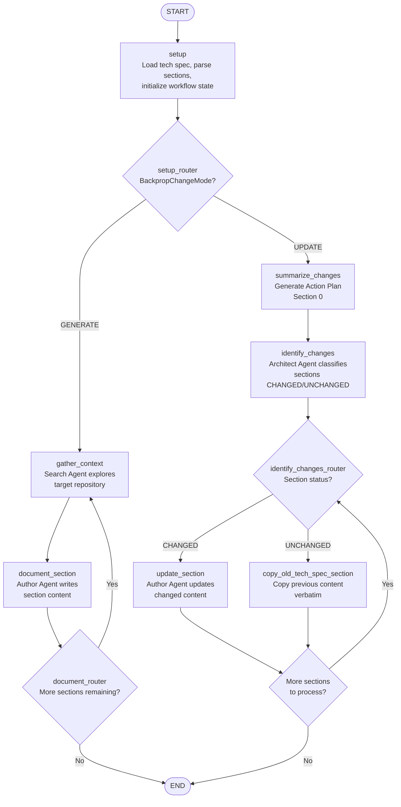

The seven graph nodes are organized as follows:

| Node | Agent/Role | Purpose | Execution Path |
|---|---|---|---|
| `setup` | System initialization | Loads existing tech spec, parses section headings and prompts from `TECHNICAL_SECTION_PROMPTS`, initializes state fields | Both |
| `gather_context` | Search Agent (Claude claude-opus-4-6) | Systematically explores repository to collect section-specific context | GENERATE only |
| `document_section` | Author Agent (Claude claude-opus-4-6) | Writes full section content from gathered context | GENERATE only |
| `summarize_changes` | Summarizer Agent (Claude claude-opus-4-6) | Generates "0. Agent Action Plan" from user requirements | UPDATE only |
| `identify_changes` | Architect Agent (GPT-5-mini) | Classifies each section as CHANGED or UNCHANGED | UPDATE only |
| `update_section` | Author Agent (Claude claude-opus-4-6) | Regenerates content for changed sections with highlights | UPDATE only |
| `copy_old_tech_spec_section` | System operation (no LLM) | Copies unchanged section content verbatim | UPDATE only |

Three conditional router functions control the graph's branching logic: `setup_router` directs traffic based on `BackpropChangeMode` (GENERATE or UPDATE), `document_router` manages the section-by-section iteration loop in Generate mode, and `identify_changes_router` routes individual sections to the appropriate processing node based on their `DocumentSectionStatus` in Update mode.

### 4.1.3 Operating Mode Selection

The system supports two mutually exclusive operating modes, determined by the `document_mode` field in the incoming Pub/Sub payload. The `setup_router` function in `/app/lib/reverse_document/helper.py` evaluates this field and routes the workflow accordingly.

| Mode | Trigger Condition | Behavior | Typical Duration |
|---|---|---|---|
| **GENERATE** | `document_mode == BackpropChangeMode.GENERATE` | Creates a brand-new Technical Specification from scratch, processing all 15 section headings sequentially | 30–60 minutes |
| **UPDATE** | `document_mode == BackpropChangeMode.UPDATE` | Updates an existing specification based on new requirements, processing only changed sections | 10–30 minutes |

#### Mode-Specific Initialization

In **Generate mode**, the `setup` node loads the Master To-Do List of 15 section headings from `TECHNICAL_SECTION_PROMPTS`, initializes `section_index` to 0, and prepares the state for the gather-write loop. The system processes every section that has a non-empty prompt; the structural heading "6. SYSTEM COMPONENTS DESIGN" is emitted as a heading only with no body content.

In **Update mode**, the `setup` node additionally downloads the existing specification from Google Cloud Storage via `AdminStorageService.download_tech_spec()`, cleans and parses it at heading levels 1 and 2 using `clean_document()` and `parse_sections_at_heading_level()` utilities from `blitzy_platform_shared.document.utils`, and downloads the input prompt containing new requirements via `download_input_prompt()`. The parsed previous specification is stored in state as `previous_tech_spec` and `previous_structured_sections` for comparison during change detection. A `StorageFileNotFoundError` during prompt download is handled gracefully with an empty string fallback.

---

## 4.2 CORE BUSINESS PROCESSES

### 4.2.1 Generate Mode Process Flow

The Generate mode implements a sequential, section-by-section document creation pipeline. For each of the 15 defined sections, a Search Agent gathers comprehensive repository context, followed by an Author Agent that transforms that context into polished specification prose. This two-phase approach per section ensures that every technical claim is grounded in actual codebase evidence.

```mermaid
flowchart TD
    subgraph InitPhase["Setup Phase"]
        S1([START]) --> S2["setup node executes"]
        S2 --> S3["Load Master To-Do List<br/>15 section headings from<br/>TECHNICAL_SECTION_PROMPTS"]
        S3 --> S4["Set section_index = 0<br/>total_sections = 15"]
    end

    subgraph ContextPhase["Context Gathering Phase"]
        C1["gather_context node<br/>Search Agent &#40;Claude claude-opus-4-6&#41;"]
        C2["Receive section heading,<br/>prompt, user context,<br/>previous sections, attachments"]
        C3["Execute tool-call loop:<br/>get_source_folder_contents,<br/>get_file_summary, read_file,<br/>search_files, search_folders,<br/>bash tool, web search"]
        C4["Store gathered context in<br/>state section_context"]
        C1 --> C2 --> C3 --> C4
    end

    subgraph WritingPhase["Document Writing Phase"]
        W1["document_section node<br/>Author Agent &#40;Claude claude-opus-4-6&#41;"]
        W2["Receive gathered context<br/>and section prompt"]
        W3["Execute 7-step authoring<br/>protocol with tools:<br/>add_tech_spec_sub_section,<br/>mark_tech_spec_sub_section_complete"]
        W4["Validate: non-empty content,<br/>paired code block delimiters"]
        W5["Append section to<br/>updated_tech_spec in state"]
        W6["Increment section_index"]
        W1 --> W2 --> W3 --> W4 --> W5 --> W6
    end

    subgraph DeliveryPhase["Progressive Delivery"]
        D1["Upload partial spec<br/>to GCS"]
        D2["Publish progress<br/>notification with<br/>current_index / total_steps"]
    end

    S4 --> C1
    C4 --> W1
    W6 --> D1
    D1 --> D2
    D2 --> Check{"section_index<br/>equals total_sections?"}
    Check -->|"No - Next Section"| C1
    Check -->|"Yes - All Complete"| Done([END])
```

#### Generate Mode Step-by-Step

1. **Setup**: The `setup` node retrieves the full section manifest from `TECHNICAL_SECTION_PROMPTS`, producing 15 headings ranging from "1. Introduction" through "9. Appendices". The system sets `section_index = 0` and prepares the initial state with repository metadata, root folder contents, and attachment references.

2. **Context Gathering** (`gather_context`): For the current section, the Search Agent (powered by `llm_claude_opus_4_6_thinking_max` with max_tokens=32,000, temperature=1.0, and a 900-second timeout with extended thinking enabled) systematically explores the target repository. The agent has access to seven tools: `get_tech_spec_section` (for cross-referencing earlier sections), `get_source_folder_contents`, `get_file_summary`, `read_file`, `search_files`, `search_folders` (all querying the Neo4j code graph), the Anthropic bash tool (for direct filesystem access), and the Anthropic web search tool. The agent processes tool calls in a loop via `process_messages_with_tool_call()` until it produces a final text response, which is stored in `state["section_context"][section_heading]`. The agent respects `.blitzyignore` patterns during file exploration.

3. **Document Writing** (`document_section`): The Author Agent (also using `llm_claude_opus_4_6_thinking_max`) receives the gathered context and writes the section following the seven-step authoring protocol defined by Feature F-018. The agent uses `add_tech_spec_sub_section` to build the section incrementally and `mark_tech_spec_sub_section_complete` to finalize it. Content validation checks ensure non-empty output and properly paired code block delimiters (even count of `` ``` `` sequences).

4. **Progressive Delivery**: After each section completes, the in-progress specification is uploaded to GCS via `AdminStorageService.upload_tech_spec()`, and a progress notification containing `current_index` and `total_steps` is published to the platform's Pub/Sub topic.

5. **Loop or Complete**: The `document_router` checks whether `section_index < total_sections`. If more sections remain, the workflow loops back to `gather_context` for the next section. When all sections are processed, the workflow transitions to `END`.

### 4.2.2 Update Mode Process Flow

The Update mode implements a targeted, differential update pipeline that avoids full regeneration by processing only sections identified as changed. This mode operates in three distinct phases: Action Plan generation, Change Detection, and Selective Section Processing.

```mermaid
flowchart TD
    subgraph SetupPhase["Setup Phase"]
        U1([START]) --> U2["setup node executes"]
        U2 --> U3["Download existing tech spec<br/>from GCS via<br/>AdminStorageService"]
        U3 --> U4["Clean and parse at<br/>heading levels 1 and 2"]
        U4 --> U5["Download input prompt<br/>with new requirements"]
        U5 --> U6["Store previous_tech_spec and<br/>previous_structured_sections<br/>in state"]
    end

    subgraph ActionPlanPhase["Action Plan Phase"]
        AP1["summarize_changes node<br/>Summarizer Agent<br/>&#40;Claude claude-opus-4-6&#41;"]
        AP2["Select specialized prompt<br/>based on change type"]
        AP3["Generate Section 0:<br/>Agent Action Plan<br/>with sub-sections 0.1 through 0.10"]
        AP4["Store in state<br/>agent_action_plan"]
        AP1 --> AP2 --> AP3 --> AP4
    end

    subgraph DetectionPhase["Change Detection Phase"]
        CD1["identify_changes node<br/>Architect Agent &#40;GPT-5-mini&#41;"]
        CD2["Analyze action plan vs<br/>existing section headings"]
        CD3["Produce DocumentSections<br/>structured output via<br/>with_structured_output&#40;strict=True&#41;"]
        CD4["Each section: CHANGED<br/>with change descriptions<br/>or UNCHANGED"]
        CD1 --> CD2 --> CD3 --> CD4
    end

    subgraph ProcessingPhase["Section Processing Phase"]
        SP1{"Section status?"}
        SP2["update_section node<br/>Author Agent regenerates<br/>with purple highlight<br/>rgba&#40;91, 57, 243, 0.2&#41;"]
        SP3["copy_old_tech_spec_section<br/>Copy verbatim from<br/>previous specification"]
        SP4["Upload updated spec<br/>to GCS"]
        SP5{"More sections?"}
        SP1 -->|"CHANGED"| SP2
        SP1 -->|"UNCHANGED"| SP3
        SP2 --> SP4
        SP3 --> SP4
        SP4 --> SP5
        SP5 -->|"Yes"| SP1
    end

    U6 --> AP1
    AP4 --> CD1
    CD4 --> SP1
    SP5 -->|"No"| Done([END])
```

#### Update Mode Step-by-Step

1. **Setup**: Identical to Generate mode initialization, plus downloading and parsing the existing specification from GCS. The system also retrieves the input prompt containing new requirements, storing it in `state["new_requirements"]`.

2. **Action Plan Generation** (`summarize_changes`): The Summarizer Agent selects from eight specialized prompt templates defined in `/app/lib/reverse_document/prompts.py` based on the nature of the changes:

   | Prompt Template | Change Type |
   |---|---|
   | `DEFAULT_SUMMARY_PROMPT` | General changes |
   | `BUG_FIX_SUMMARY_PROMPT` | Bug fix changes |
   | `SECURITY_VULNERABILITY_FIX_PROMPT` | Security patches |
   | `TESTING_SUMMARY_PROMPT` | Test-related changes |
   | `DOCUMENTATION_SUMMARY_PROMPT` | Documentation updates |
   | `NEW_PRODUCT_SUMMARY_PROMPT` | New product features |
   | `ADD_FEATURE_SUMMARY_PROMPT` | Feature additions |
   | `REFACTOR_SUMMARY_PROMPT` | Code refactoring |

   The agent generates "0. Agent Action Plan" with sub-sections covering Intent Clarification (0.1–0.2), Technical Scope (0.3–0.4), Implementation Design (0.5–0.6), Special Considerations (0.7–0.8), Validation (0.9), and References (0.10). The output is stored in `state["agent_action_plan"]` and provides transparency into how the system interprets the update requirements.

3. **Change Detection** (`identify_changes`): The Architect Agent, powered by `llm_gpt5_mini` (GPT-5-mini with max_tokens=64,000 and reasoning_effort='high'), analyzes the action plan against the existing section headings and produces a structured `DocumentSections` Pydantic model via `with_structured_output(DocumentSections, strict=True)`. Each section entry contains a `heading` (str), a `status` (`DocumentSectionStatus.CHANGED` or `DocumentSectionStatus.UNCHANGED`), and a `changes` list describing what changed. This strict schema enforcement guarantees deterministic downstream routing.

4. **Selective Processing**: For each section, the `identify_changes_router` evaluates the status:
   - **CHANGED sections** are routed to the `update_section` node, where the Author Agent regenerates the content with access to the old section content, the action plan, and the change descriptions. Changed passages are highlighted with a purple background (`<span style="background-color: rgba(91, 57, 243, 0.2)">`) to visually distinguish updates.
   - **UNCHANGED sections** are routed to `copy_old_tech_spec_section`, which copies the previous content verbatim with no LLM invocation, minimizing cost and execution time.

5. **Progressive Delivery**: Identical to Generate mode — each processed section triggers a GCS upload and progress notification.

### 4.2.3 Decision Points and Routing Logic

The workflow contains four principal decision points, each implemented as a conditional routing function within the LangGraph `StateGraph`. Every decision is deterministic and based on explicit state field evaluation.

| Decision Point | Router Function | Location | Condition | Outcome A | Outcome B |
|---|---|---|---|---|---|
| Mode Selection | `setup_router` | After `setup` node | `document_mode == GENERATE` | Route to `gather_context` | Route to `summarize_changes` |
| Generate Section Loop | `document_router` | After `document_section` | `section_index < total_sections` | Loop to `gather_context` | Route to `END` |
| Section Change Status | `identify_changes_router` | After `identify_changes` | `section.status == CHANGED` | Route to `update_section` | Route to `copy_old_tech_spec_section` |
| Update Section Loop | (implicit in router) | After `update_section` / `copy_old` | More sections remaining | Loop to next section status check | Route to `END` |

#### Validation Rules at Decision Points

| Decision Point | Validation Applied |
|---|---|
| Mode Selection | `document_mode` must be a valid `BackpropChangeMode` enum value (GENERATE or UPDATE) |
| Generate Section Loop | `section_index` must be a non-negative integer; `total_sections` must match the count of section headings from `TECHNICAL_SECTION_PROMPTS` |
| Section Change Status | Status must be a valid `DocumentSectionStatus` enum value (CHANGED or UNCHANGED), enforced by Pydantic `strict=True` validation |
| Update Section Loop | Section index bounds checking ensures no out-of-range access |

---

## 4.3 INTEGRATION WORKFLOWS

### 4.3.1 External Service Interaction Sequence

The system interacts with six categories of external services during a single job execution. The following sequence diagram illustrates the chronological order and communication patterns for the Generate mode (the primary workflow). Update mode follows an identical initialization sequence with additional GCS downloads for the existing specification and input prompt.

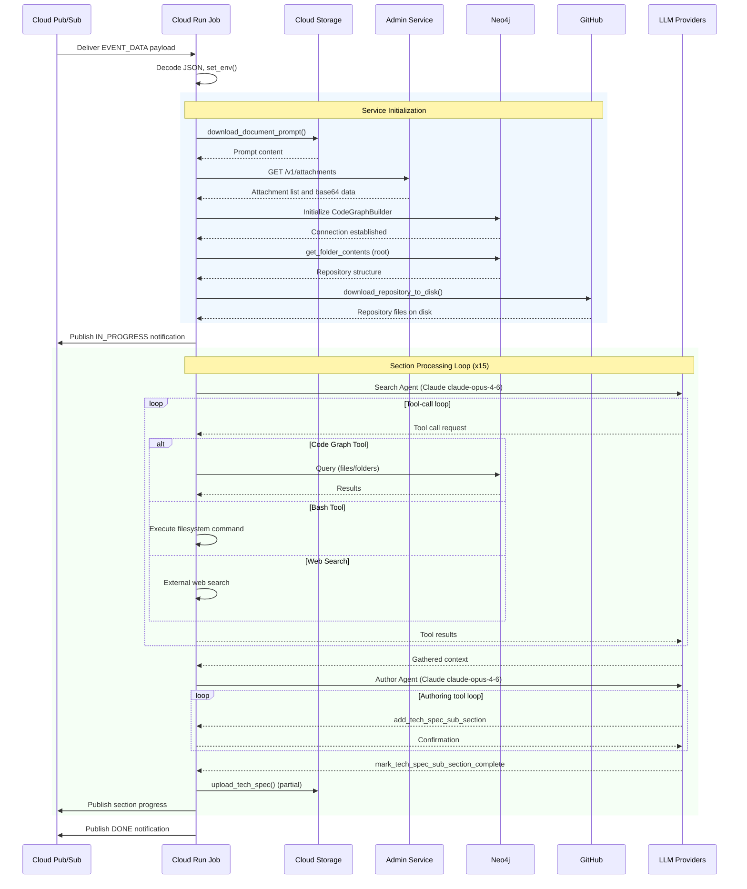

#### Service Communication Summary

| Service | Protocol | Authentication | Direction | Operations |
|---|---|---|---|---|
| Google Cloud Pub/Sub | gRPC | Service account | Bidirectional | Receive trigger, publish notifications |
| Google Cloud Storage | REST/gRPC | Service account | Read/Write | Download prompts/specs, upload generated specs |
| Neo4j | Bolt protocol | Username/password | Read-only | Folder contents, file summaries, semantic search |
| GitHub | HTTPS REST | PAT via secret server | Read-only | Repository download, commit hash resolution |
| archie-service-admin | HTTPS REST | Service client auth | Read-only | Attachment retrieval |
| Anthropic API | HTTPS REST | `ANTHROPIC_API_KEY` | Request/Response | Search Agent, Author Agent, Summarizer Agent |
| OpenAI API | HTTPS REST | `OPENAI_API_KEY` | Request/Response | Architect Agent (structured output) |

### 4.3.2 Event Processing and Notification Flow

The system implements a structured notification protocol that publishes three types of events to the `PLATFORM_EVENTS_TOPIC` via Google Cloud Pub/Sub, enabling the Blitzy platform to track job progress in real time.

```mermaid
flowchart LR
    subgraph Triggers["Notification Triggers"]
        T1["Job Start"]
        T2["Section Complete"]
        T3["Job Done"]
    end

    subgraph NotificationEngine["Notification Assembly"]
        N1["Build IN_PROGRESS<br/>payload with metadata"]
        N2["Build IN_PROGRESS<br/>payload with progress"]
        N3["Build DONE payload<br/>with completion metrics"]
    end

    subgraph Delivery["Pub/Sub Delivery"]
        P1["publish_notification&#40;&#41;<br/>to PLATFORM_EVENTS_TOPIC"]
    end

    T1 --> N1 --> P1
    T2 --> N2 --> P1
    T3 --> N3 --> P1
```

| Notification Type | Trigger | Status | Key Payload Fields |
|---|---|---|---|
| **Job Start** | Before first LLM call | `IN_PROGRESS` | `projectId`, `jobId`, `tech_spec_id`, `repo_id`, `branch_name`, `document_mode`, `propagate` |
| **Section Progress** | After each section completes | `IN_PROGRESS` | `current_index`, `total_steps`, `phase` (TECHNICAL_SPECIFICATION) |
| **Job Completion** | After all sections processed | `DONE` | `estimated_lines_generated`, `estimated_hours_saved`, `user_id`, `team_id`, `company_id` |

All notification payloads include common metadata fields: `projectId`, `jobId`, `tech_spec_id`, `org_name`, `repo_id`, `branch_name`, `branch_id`, `head_commit_hash`, `phase`, `status`, `user_id`, `team_id`, `company_id`, and `git_project_repo_id`, as documented in Feature F-010 (Progress Notification System).

### 4.3.3 Progressive Delivery Pipeline

A key architectural pattern is the progressive upload of partial specifications to Google Cloud Storage during the `app.astream()` loop in `/app/main.py`. This strategy provides three critical benefits:

1. **Real-time progress visibility**: Downstream consumers (platform dashboards, user interfaces) can access the most recently completed sections while generation continues.
2. **Failure recovery context**: If the job fails mid-execution, all previously completed sections are already persisted in GCS, preserving partial results.
3. **Concurrent consumption**: Platform services can begin processing partial specifications without waiting for the full document.

| Event | Storage Operation | Notification | Frequency |
|---|---|---|---|
| Section generation complete | `upload_tech_spec()` to GCS | `IN_PROGRESS` with `current_index`/`total_steps` | After each of 15 sections |
| All sections complete | Final `upload_tech_spec()` | `DONE` with completion metrics | Once per job |

The progressive delivery pipeline operates within the streaming loop of `app.astream()`. As each node produces output and the state is updated, the main loop detects section completion, triggers the GCS upload, and publishes the progress notification. This design ensures that the longest possible gap between persisted states equals the duration of a single section's processing (typically 2–5 minutes).

---

## 4.4 AGENT EXECUTION WORKFLOWS

### 4.4.1 Agent Tool-Call Processing Loop

All LLM-powered agents (Search, Author, Summarizer) share a common tool-call processing pattern implemented via `process_messages_with_tool_call()` in `/app/lib/reverse_document/helper.py`. This loop processes sequential tool invocations until the agent produces a final text response. Tool calls are processed one at a time (`parallel_tool_calls=False`), ensuring deterministic agent behavior.

```mermaid
flowchart TD
    Start([Agent Method Invoked]) --> Prep["Prepare System Message:<br/>Agent Persona +<br/>Behavioral Rules +<br/>Section Context +<br/>User Context"]
    Prep --> SendLLM["Send to LLM Provider<br/>Claude claude-opus-4-6 or GPT-5-mini"]
    SendLLM --> CheckResp{"Response contains<br/>tool calls?"}

    CheckResp -->|"Yes"| ValidateTool["Validate tool call<br/>arguments"]
    ValidateTool --> ProcTool["process_tool_call&#40;&#41;<br/>Execute requested tool"]
    ProcTool --> AppendMsg["Append tool result<br/>to message history"]
    AppendMsg --> SendLLM

    CheckResp -->|"No - Text Response"| ExtractContent["Extract content from<br/>agent response"]
    ExtractContent --> CheckEmpty{"Content<br/>non-empty?"}
    CheckEmpty -->|"No"| FormatErr["Raise FormattingError"]
    CheckEmpty -->|"Yes"| CheckDelim{"Code block<br/>delimiters paired?<br/>&#40;even count&#41;"}
    CheckDelim -->|"No"| FormatErr
    CheckDelim -->|"Yes"| StoreResult["Store result in<br/>ReverseDocumentState"]

    FormatErr --> RetryPath["Enter retry path<br/>via @archie_exponential_retry"]
    StoreResult --> Success([Agent Complete])
```

#### Tool Availability by Agent

| Tool | Search Agent | Author Agent | Summarizer Agent | Description |
|---|---|---|---|---|
| `get_tech_spec_section` | ✓ | ✓ | ✓ | Cross-reference previously generated sections |
| `get_source_folder_contents` | ✓ | — | ✓ | Navigate folder hierarchy via Neo4j |
| `get_file_summary` | ✓ | — | ✓ | Retrieve AI-generated file summaries |
| `read_file` | ✓ | — | ✓ | Read full file contents |
| `search_files` | ✓ | — | ✓ | Semantic file search via VoyageAI embeddings |
| `search_folders` | ✓ | — | ✓ | Semantic folder search |
| `bash` (Anthropic tool) | ✓ | — | ✓ | Direct filesystem command execution |
| `web_search` (Anthropic tool) | ✓ | ✓ | ✓ | Internet search for external references |
| `add_tech_spec_sub_section` | — | ✓ | — | Write a sub-section to the specification |
| `mark_tech_spec_sub_section_complete` | — | ✓ | — | Finalize the current section |
| `download_figma_images` | — | — | ✓* | Export Figma assets (when available) |
| `get_figma_data` | — | — | ✓* | Retrieve Figma layout info (when available) |

*Figma tools are conditionally enabled only when `is_figma_available=True` and Figma attachments are present, managed through the `MCPManager`.

### 4.4.2 Search Agent Context Gathering Workflow

The Search Agent (Feature F-003), implemented as the `gather_context` node, follows a systematic deep-search strategy governed by behavioral rules defined in `SEARCH_PERSONA_PROMPTLET` and `SEARCH_RULES_PROMPTLET` within `/app/lib/reverse_document/prompts.py`. The agent persona is that of an "Elite Software Architect specializing in repository analysis" and enforces a 2:1 deep-to-broad search ratio, deduplication of results, and path validation.

The Search Agent receives five inputs for each section:
1. The current **section heading** (e.g., "3. Technology Stack")
2. The **section prompt** defining what content to gather
3. **User context** providing project-specific guidance
4. **Previously generated tech spec sections** for cross-referencing
5. **Project attachments** (e.g., Figma designs) formatted for the model type

The agent iterates through tool calls until no further invocations are needed, at which point it produces a comprehensive text summary of findings. This summary is stored in `state["section_context"][section_heading]` for consumption by the Author Agent.

### 4.4.3 Author Agent Seven-Step Authoring Protocol

The Author Agent (Feature F-005) operates under a structured seven-step authoring protocol defined by Feature F-018 (Document Section Authoring with Tool-in-Loop). This protocol enforces disciplined, systematic section creation with built-in progress tracking through a to-do list mechanism.

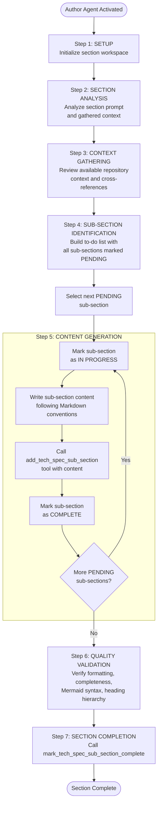

#### Authoring Protocol Details

| Step | Action | Tools Used | Validation |
|---|---|---|---|
| 1. Setup | Initialize workspace for the section | None | Section heading and prompt available |
| 2. Section Analysis | Analyze prompt requirements and context | `get_tech_spec_section` | Context sufficiency check |
| 3. Context Gathering | Review repository context from Search Agent | `get_tech_spec_section`, `web_search` | Cross-reference consistency |
| 4. Sub-section Identification | Enumerate all required sub-sections | None | Hierarchical heading convention (##, ###, ####) |
| 5. Content Generation | Write each sub-section iteratively | `add_tech_spec_sub_section` | Non-empty content per sub-section |
| 6. Quality Validation | Verify output completeness and formatting | None | Paired code blocks, valid Mermaid, heading levels |
| 7. Section Completion | Finalize and mark complete | `mark_tech_spec_sub_section_complete` | All sub-sections marked COMPLETE |

The to-do list uses three status markers: `[PENDING]` for unstarted sub-sections, `[IN PROGRESS]` for the currently active sub-section, and `[COMPLETE]` for finished sub-sections. Content follows hierarchical Markdown conventions: `##` for X.Y headings, `###` for X.Y.Z, and `####` for X.Y.Z.W.

### 4.4.4 Architect Agent Change Detection Workflow

The Architect Agent (Feature F-004), implemented in the `identify_changes` node, operates exclusively in Update mode. Unlike the Search and Author agents, the Architect Agent does not use a tool-call loop — instead, it produces a single structured output conforming to the `DocumentSections` Pydantic model.

The workflow is straightforward:
1. The agent receives the action plan (`state["agent_action_plan"]`), the list of existing section headings, and the new requirements.
2. GPT-5-mini (with `max_tokens=64,000`, `reasoning_effort='high'`, and a 900-second timeout) analyzes which sections are affected by the changes.
3. The output is produced via `with_structured_output(DocumentSections, strict=True)`, guaranteeing that each section entry contains a `heading` (str), a `status` (`CHANGED` or `UNCHANGED`), and a `changes` list (List[str]).
4. If the output fails Pydantic validation, a `ValidationError` is raised and the retry mechanism (see Section 4.6) re-executes the agent.

This structured output approach eliminates the need for post-hoc parsing and ensures that downstream routing logic in `identify_changes_router` can process results deterministically.

---

## 4.5 STATE MANAGEMENT

### 4.5.1 State Transition Diagram

The `ReverseDocumentState` TypedDict, defined in `/app/lib/reverse_document/state.py`, serves as the single shared data container that flows through all seven graph nodes. The following state diagram illustrates the lifecycle of a job execution, from initial trigger through completion.

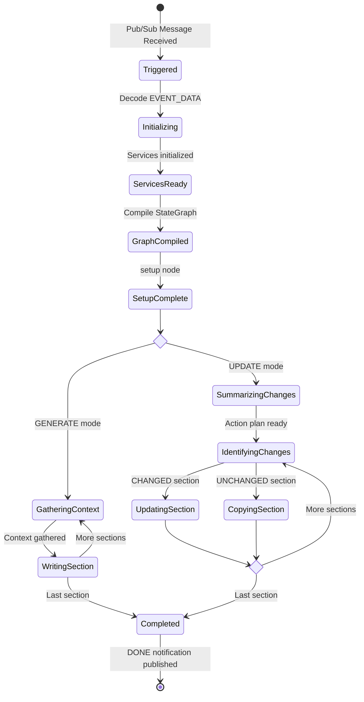

#### State Field Categories

The `ReverseDocumentState` TypedDict organizes its fields into five functional categories, each populated and consumed at specific workflow stages:

| Category | Key Fields | Populated During | Consumed By |
|---|---|---|---|
| **Repository Metadata** | `branch_id`, `branch_name`, `company_id`, `repo_id`, `repo_name`, `head_commit_hash`, `user_id`, `git_project_repo_id` | Event Ingestion (main.py) | All nodes (metadata propagation) |
| **Processing State** | `mode`, `section_index`, `total_sections`, `section_headings`, `section_prompts`, `section_context` | `setup` node | `gather_context`, `document_section`, routers |
| **Document Content** | `updated_tech_spec`, `previous_tech_spec`, `tech_spec_parsed`, `current_tech_spec`, `current_tech_spec_sections`, `parsed_sub_sections` | `setup` (previous), `document_section`/`update_section` (current) | Author Agent, progressive upload |
| **Structured Data** | `structured_sections` (List[DocumentSection]), `previous_structured_sections` | `identify_changes` node | `identify_changes_router`, state rollback |
| **Flow Control** | `retry_count`, `agent_action_plan`, `new_requirements`, `user_context`, `root_folder_contents` | Various (setup, summarize_changes) | Error handling, agent context |

### 4.5.2 Data Persistence and Caching Strategy

The system employs a tiered storage architecture with three distinct persistence layers, each serving a specific purpose within the workflow.

```mermaid
flowchart TB
    subgraph PersistentLayer["Persistent Storage (Survives Job)"]
        N4J["Neo4j Graph Database<br/>Code graphs, file summaries<br/>&#40;READ-ONLY&#41;"]
        GCS["Google Cloud Storage<br/>Tech specs, prompts, artifacts<br/>&#40;READ-WRITE&#41;"]
    end

    subgraph TransientLayer["Transient Storage (Job Lifetime Only)"]
        State["ReverseDocumentState<br/>Workflow state, agent outputs,<br/>section context, processing metadata"]
        AttCache["attachment_base64_cache<br/>Base64-encoded project<br/>attachments"]
        RootCache["root_folder_contents<br/>Pre-fetched repository<br/>root structure"]
    end

    N4J -->|"Code graph queries<br/>&#40;folder/file tools&#41;"| State
    GCS -->|"Download specs<br/>and prompts"| State
    State -->|"upload_tech_spec&#40;&#41;<br/>after each section"| GCS
    State -.-> AttCache
    State -.-> RootCache
```

| Storage Type | Technology | Data Scope | Persistence | Access Pattern |
|---|---|---|---|---|
| Graph Database | Neo4j 6.1.0 (Bolt) | Code structure, file summaries, folder hierarchies | Persistent (read-only) | Queried by agent tools during context gathering |
| Object Storage | Google Cloud Storage 3.9.0 | Generated specs, document prompts, input prompts | Persistent (read-write) | Downloaded at setup, uploaded progressively |
| Workflow State | Python TypedDict (in-memory) | Agent outputs, section context, processing metadata | Transient (single execution) | Read/written by all graph nodes |
| Attachment Cache | Python dict (in-memory) | Base64-encoded project attachments | Transient (single execution) | Populated once during setup, read by agents |
| Root Folder Cache | String in state | Repository top-level directory listing | Transient (single execution) | Populated during setup, reused across all searches |

Each Cloud Run Job execution is fully independent and stateless between runs. No external caching infrastructure (Redis, Memcached) is used. All in-memory caches are discarded when the container execution completes.

### 4.5.3 Transaction Boundaries

The system does not employ traditional database transactions. Instead, it relies on a combination of idempotent state updates and progressive persistence to maintain data integrity.

| Boundary | Mechanism | Recovery Strategy |
|---|---|---|
| **Per-section boundary** | State is updated atomically after each node completes; partial spec uploaded to GCS | If failure occurs mid-section, previously completed sections are preserved in GCS |
| **Agent tool-call boundary** | Each tool result is appended to message history before the next LLM call | Tool results are maintained in the agent's conversation context |
| **State rollback boundary** | On retry, `previous_tech_spec` and `previous_structured_sections` are restored from their pre-failure values | Ensures consistency between retries without corrupting completed work |
| **Graph recursion boundary** | LangGraph enforces a recursion limit of 500 transitions | Prevents infinite loops in the state machine; exceeding the limit terminates execution |

---

## 4.6 ERROR HANDLING AND RECOVERY

### 4.6.1 Retry Mechanism Flowchart

All five asynchronous agent methods — `gather_context`, `document_section`, `summarize_changes`, `identify_changes`, and `update_section` — are protected by the `@archie_exponential_retry()` decorator from `blitzy-platform-shared`. This decorator implements exponential backoff with a configurable maximum retry count of 17 (`DEFAULT_MAX_RETRIES`), as documented in Feature F-014.

```mermaid
flowchart TD
    Start([Agent Method Invoked]) --> TryExec["Execute agent logic<br/>under @archie_exponential_retry"]
    TryExec --> CheckSuccess{"Execution<br/>successful?"}

    CheckSuccess -->|"Yes"| ValidateOutput["Validate output:<br/>non-empty, paired delimiters"]
    ValidateOutput --> IsValid{"Output valid?"}
    IsValid -->|"Yes"| ReturnResult([Return Result])
    IsValid -->|"No"| RaiseFormat["Raise<br/>FormattingError"]

    CheckSuccess -->|"No"| CatchErr["Exception caught"]
    RaiseFormat --> CatchErr

    CatchErr --> Classify{"Retryable<br/>exception?"}
    Classify -->|"Yes"| CheckCount{"retry_count<br/>below 17?"}
    Classify -->|"No"| Fatal["Propagate<br/>unhandled error"]

    CheckCount -->|"Yes"| Backoff["Exponential<br/>backoff delay"]
    Backoff --> RollbackState["Rollback state:<br/>restore previous_tech_spec,<br/>previous_structured_sections"]
    RollbackState --> IncrCount["Increment<br/>retry_count"]
    IncrCount --> TryExec

    CheckCount -->|"No - Max retries<br/>exhausted"| Fatal

    Fatal --> FailNotify["Publish failure<br/>notification via Pub/Sub"]
    FailNotify --> Fail([Job Failed])
```

### 4.6.2 Error Classification and Retryable Exceptions

The retry mechanism distinguishes between retryable (transient) and fatal (permanent) exceptions. Retryable exceptions trigger exponential backoff and re-execution, while fatal exceptions propagate immediately and terminate the job.

| Exception Category | Specific Exceptions | Retryable | Applied To |
|---|---|---|---|
| **Anthropic API** | `InternalServerError`, `APIConnectionError`, `ServiceUnavailableError`, `OverloadedError`, `RateLimitError`, `DeadlineExceeded` | ✓ | All agent methods |
| **OpenAI API** | `InternalServerError`, `APIConnectionError`, `RateLimitError` | ✓ | All agent methods |
| **Google Cloud** | `TooManyRequests` | ✓ | All agent methods |
| **Neo4j** | `ServiceUnavailable`, `TransientError`, `DriverError`, `SessionExpired` | ✓ | All agent methods |
| **Network** | `SSLError`, `ConnectionResetError`, `httpx.ReadTimeout` | ✓ | All agent methods |
| **Application** | `FormattingError`, GitHub exceptions, Voyage API errors, `UnicodeError` | ✓ | All agent methods |
| **Validation** | Pydantic `ValidationError`, `ValueError` | ✓ | `identify_changes` only |
| **Unhandled** | All other exceptions | ✗ | Fatal, propagated |

The `FormattingError` is a custom application exception raised when content validation fails — specifically when the agent produces empty content or when the count of code block delimiters (`` ``` ``) is odd (indicating unpaired delimiters). This validation is applied to all Author Agent outputs in both Generate and Update modes.

### 4.6.3 State Rollback and Recovery Procedures

When a retryable exception occurs, the system performs a controlled state rollback before re-attempting the operation. This ensures that partial or corrupted state from a failed attempt does not contaminate the retry.

| State Field | Rollback Behavior | Rationale |
|---|---|---|
| `previous_tech_spec` | Restored to the value before the failed attempt | Ensures the Author Agent starts from the correct baseline document on retry |
| `previous_structured_sections` | Restored to the pre-failure list | Ensures the Architect Agent's input is consistent across retries |
| `retry_count` | Incremented by 1 | Tracks progress toward the 17-retry maximum |
| `section_index` | Not rolled back | Section iteration continues from the current position |

The rollback mechanism is particularly important for the `document_section` and `update_section` nodes, where a failed LLM call might have partially updated the document state. By restoring the previous document snapshot, the retry begins with a clean, known-good state.

#### Recovery Scenarios

| Scenario | Error Type | Recovery Path |
|---|---|---|
| LLM provider rate limit | `RateLimitError` | Exponential backoff (up to 17 retries) → automatic recovery when quota resets |
| LLM provider overload | `OverloadedError`, `ServiceUnavailableError` | Exponential backoff → recovery when provider capacity returns |
| Neo4j connection loss | `ServiceUnavailable`, `SessionExpired` | Exponential backoff → recovery when database reconnects |
| Network timeout | `httpx.ReadTimeout`, `SSLError` | Exponential backoff → recovery on next successful connection |
| Invalid agent output | `FormattingError` | Immediate retry with state rollback → agent produces valid output |
| Pydantic validation failure | `ValidationError` (identify_changes only) | Immediate retry → GPT-5-mini produces schema-conformant output |
| Max retries exhausted | Any retryable exception x17 | Job terminates → failure notification published |

---

## 4.7 TIMING AND SLA CONSIDERATIONS

### 4.7.1 Execution Timeline

The following table estimates typical execution durations for each workflow phase, based on the configured LLM timeouts, the number of sections processed, and the expected tool-call overhead.

| Phase | Generate Mode | Update Mode | Bottleneck |
|---|---|---|---|
| Event Ingestion | ~5 seconds | ~5 seconds | JSON parsing, env setup |
| Service Initialization | ~30–60 seconds | ~45–90 seconds | Neo4j connection, repo download, GCS downloads |
| Action Plan Generation | N/A | ~3–5 minutes | Single Claude claude-opus-4-6 call with tools |
| Change Detection | N/A | ~1–2 minutes | Single GPT-5-mini structured output call |
| Per-Section: Context Gathering | ~2–4 minutes | N/A | Search Agent tool-call loop (Claude claude-opus-4-6, 900s timeout) |
| Per-Section: Document Writing | ~2–4 minutes | ~2–3 minutes (changed only) | Author Agent 7-step protocol (Claude claude-opus-4-6, 900s timeout) |
| Per-Section: Copy Unchanged | N/A | ~1 second | No LLM call, simple state copy |
| Progressive Upload (per section) | ~2–5 seconds | ~2–5 seconds | GCS write + Pub/Sub publish |
| **Total Estimated Duration** | **30–60 minutes** | **10–30 minutes** | Depends on repository size, section count |

#### Key Timing Factors

- **15 sections** are processed in Generate mode. Each section requires two LLM calls (Search Agent + Author Agent), making LLM response time the dominant factor.
- **In Update mode**, only CHANGED sections incur LLM costs. UNCHANGED sections are copied in constant time, significantly reducing total duration.
- **Sequential processing**: All sections are processed sequentially. The system does not support parallel section generation within a single job execution (constraint C-005).
- **Tool-call depth**: The number of tool calls per agent invocation varies based on repository complexity. A large repository may require more tool calls for thorough exploration, extending the context gathering phase.

### 4.7.2 Timeout Configuration and Constraints

The system operates within a hierarchy of timeout boundaries, from individual LLM calls up to the Cloud Run Job execution limit.

| Timeout Layer | Value | Configuration Source | Consequence of Exceeding |
|---|---|---|---|
| **LLM Request Timeout** | 900 seconds (15 minutes) | LLM instance configuration in `helper.py` | `DeadlineExceeded` / `ReadTimeout` → retry mechanism |
| **Graph Recursion Limit** | 500 transitions | `app.astream()` config | Graph execution terminates, job may fail |
| **Max Retry Attempts** | 17 per agent method | `DEFAULT_MAX_RETRIES` constant | Agent method failure → job terminates |
| **Cloud Run Job Timeout** | Configurable per deployment | `deploy-job.yml` / `gcloud run jobs deploy` | Container terminated by Cloud Run |
| **Context Window Limit** | 300,000 tokens (CONTEXT_300K) | `blitzy_platform_shared.common.consts` | Agent context truncated or call fails |

#### Critical Path Analysis

The critical path for Generate mode is:

```
15 sections × (Search Agent call + Author Agent call + GCS upload) ≈ 15 × (3 min + 3 min + 5 sec) ≈ 90 minutes (worst case)
```

The critical path for Update mode (assuming 5 of 15 sections changed) is:

```
Action Plan (4 min) + Change Detection (2 min) + 5 × Author Agent (3 min) + 10 × Copy (1 sec) ≈ 21 minutes
```

These estimates assume average-complexity repositories and no retries. Retry events can extend individual section processing by the backoff duration multiplied by the number of retry attempts.

---

#### References

#### Source Files

- `/app/main.py` — Entry point, Pub/Sub event handling, graph execution orchestration, progressive delivery loop, notification publishing
- `/app/lib/reverse_document/helper.py` — Core workflow orchestration: `StateGraph` definition (lines 263–316), all seven graph node implementations, routing functions (`setup_router`, `document_router`, `identify_changes_router`), agent tool binding, `@archie_exponential_retry()` decorator application
- `/app/lib/reverse_document/state.py` — `ReverseDocumentState` TypedDict definition with all workflow state fields
- `/app/lib/reverse_document/models.py` — Pydantic data models: `DocumentSectionStatus` (CHANGED/UNCHANGED), `DocumentSection`, `DocumentSections`
- `/app/lib/reverse_document/prompts.py` — Agent personas (`SEARCH_PERSONA_PROMPTLET`, `SEARCH_RULES_PROMPTLET`), eight specialized summary prompt templates, Master To-Do List (`TECHNICAL_SECTION_PROMPTS`), seven-step authoring protocol, Figma tools promptlet
- `/app/set_env.py` — Environment variable configuration for development and runtime
- `/app/Dockerfile` — Container build configuration (Ubuntu 24.04, Python 3.12, Node.js 20, Google Chrome)
- `/app/.github/workflows/deploy-job.yml` — CI/CD pipeline, Cloud Run Job deployment, environment variable injection

#### Cross-Referenced Specification Sections

- §1.2 System Overview — System architecture, component catalog, multi-agent pipeline description
- §1.3 Scope — Implementation boundaries, primary user workflows, in-scope features
- §2.1 Feature Catalog — Complete feature specifications (F-001 through F-020), functional requirements
- §2.3 Feature Relationships — Feature dependency map, integration points, shared components
- §2.4 Implementation Considerations — Technical constraints (recursion limit, token limits, timeouts, parallel tool calls)
- §2.6 Assumptions and Constraints — Operational assumptions, system constraints
- §3.4 Third-Party Services — AI/LLM provider configurations, MCP integration patterns, platform services
- §3.5 Databases & Storage — Neo4j usage, GCS operations, in-memory caching strategy
- §3.6 Development & Deployment — CI/CD pipeline, Cloud Run configuration
- §3.7 Environment Configuration — Full environment variable catalog, security classification

# 5. System Architecture

This section provides a comprehensive architectural reference for the Reverse Document Generator — an AI-powered, event-driven batch processing system that automatically generates Technical Specification documents from existing software codebases. The architecture documentation herein is grounded entirely in evidence from the system's source code, primarily `/app/main.py`, `/app/lib/reverse_document/helper.py`, `/app/lib/reverse_document/state.py`, `/app/lib/reverse_document/models.py`, `/app/lib/reverse_document/prompts.py`, and supporting infrastructure files.

---

## 5.1 HIGH-LEVEL ARCHITECTURE

### 5.1.1 System Overview

#### Architecture Style and Rationale

The Reverse Document Generator is built as an **event-driven, cloud-native, stateful multi-agent AI pipeline**. This architectural style was selected to address the core requirement of transforming raw software codebases into structured, enterprise-grade Technical Specification documents through autonomous AI agent collaboration — while maintaining zero persistent infrastructure overhead between executions.

The system's architecture is governed by five foundational principles:

- **Event-Driven Activation** — The system operates exclusively as a reactive batch job, activated by Google Cloud Pub/Sub messages containing repository metadata. There is no continuously running server or listener process; the Cloud Run Job container is instantiated on demand and scales to zero when idle, as defined by the deployment configuration in `/app/.github/workflows/deploy-job.yml`.

- **Stateful Graph-Based Orchestration** — The core processing engine is modeled as a compiled, directed state graph using LangGraph's `StateGraph` abstraction (v1.0.8). This provides deterministic control flow through seven named nodes connected by conditional routing edges, with a shared `ReverseDocumentState` TypedDict flowing through all nodes. The graph is defined in the `create_graph()` method of `/app/lib/reverse_document/helper.py` (lines 263–316).

- **Multi-Agent Specialization** — Rather than employing a single monolithic LLM prompt, the system decomposes the document generation task into specialized agent roles (Search, Architect, Author, Summarizer), each optimized for its specific cognitive task and equipped with purpose-selected tools and LLM providers.

- **Progressive Delivery** — Generated content is persisted to Google Cloud Storage after each section completes, enabling real-time progress visibility, failure recovery, and concurrent downstream consumption. This pattern is implemented in the streaming loop of `app.astream()` in `/app/main.py`.

- **Serverless Isolation** — Each execution is fully independent and stateless between runs. No external caching infrastructure (Redis, Memcached) or persistent queues are used. All runtime state exists solely within the container's memory for the duration of a single job execution.

#### System Boundaries and Major Interfaces

The system boundary encompasses the Cloud Run Job container and its internal components. All external communication occurs through well-defined integration points: Google Cloud Pub/Sub for event ingestion and notification publishing, Google Cloud Storage for artifact persistence, Neo4j for code graph queries, GitHub for repository download, LLM provider APIs (Anthropic and OpenAI) for AI agent reasoning, and Blitzy platform microservices for administrative operations.

```mermaid
flowchart TB
    subgraph ExternalTriggers["External Triggers"]
        PubSub["Google Cloud Pub/Sub<br/>EVENT_DATA Trigger"]
    end

    subgraph SystemBoundary["Reverse Document Generator — Cloud Run Job"]
        direction TB
        EntryPoint["Entry Point<br/>/app/main.py"]
        Orchestrator["Workflow Orchestrator<br/>LangGraph StateGraph"]
        SearchAgent["Search Agent<br/>Claude claude-opus-4-6"]
        ArchitectAgent["Architect Agent<br/>GPT-5-mini"]
        AuthorAgent["Author Agent<br/>Claude claude-opus-4-6"]
        SummarizerAgent["Summarizer Agent<br/>Claude claude-opus-4-6"]
        StateManager["State Manager<br/>ReverseDocumentState"]

        EntryPoint --> Orchestrator
        Orchestrator --> SearchAgent
        Orchestrator --> ArchitectAgent
        Orchestrator --> AuthorAgent
        Orchestrator --> SummarizerAgent
        Orchestrator --> StateManager
    end

    subgraph ExternalServices["External Services"]
        GCS["Google Cloud Storage"]
        Neo4j["Neo4j Graph DB"]
        GitHub["GitHub API"]
        Anthropic["Anthropic API"]
        OpenAI["OpenAI API"]
        AdminSvc["archie-service-admin"]
        LangSmithSvc["LangSmith"]
    end

    PubSub -->|"Trigger Message"| EntryPoint
    EntryPoint -->|"Notifications"| PubSub
    EntryPoint -->|"Upload/Download"| GCS
    SearchAgent -->|"Code Graph Queries"| Neo4j
    EntryPoint -->|"Repo Download"| GitHub
    SearchAgent -->|"LLM Requests"| Anthropic
    AuthorAgent -->|"LLM Requests"| Anthropic
    ArchitectAgent -->|"Structured Output"| OpenAI
    EntryPoint -->|"Attachments"| AdminSvc
    Orchestrator -.->|"Tracing"| LangSmithSvc
```

#### Dual Execution Modes

The architecture supports two mutually exclusive execution paths, determined by the `document_mode` field in the incoming Pub/Sub payload:

| Mode | Activation Condition | Processing Strategy | Typical Duration |
|---|---|---|---|
| **GENERATE** | `document_mode == BackpropChangeMode.GENERATE` | Creates a new Technical Specification from scratch, processing all 15 sections sequentially through the Search → Author pipeline | 30–60 minutes |
| **UPDATE** | `document_mode == BackpropChangeMode.UPDATE` | Performs a differential update of an existing specification, processing only sections classified as CHANGED while copying UNCHANGED sections verbatim | 10–30 minutes |

The `setup_router` function in `/app/lib/reverse_document/helper.py` (lines 371–375) evaluates this field and routes the workflow to either `gather_context` (GENERATE) or `summarize_changes` (UPDATE), establishing completely separate execution paths through the state graph.

### 5.1.2 Core Components

The system comprises six principal components, each with clearly delineated responsibilities and well-defined interfaces.

| Component | Primary Responsibility | Key Dependencies |
|---|---|---|
| **Entry Point / Event Handler** (`/app/main.py`) | Receives Pub/Sub trigger, decodes JSON payload, initializes all external services, compiles and executes the LangGraph workflow, manages progressive delivery loop | `google.cloud.pubsub_v1`, `google.cloud.storage`, `langgraph`, `blitzy_platform_shared`, `blitzy_utils` |
| **Workflow Orchestrator** (`/app/lib/reverse_document/helper.py`) | Defines `StateGraph` with 7 nodes and 3 conditional routers, manages agent LLM instances, binds tools to agents, implements all node logic | `langgraph`, `langchain-core`, `langchain-anthropic`, `langchain-openai`, `pydantic`, `thefuzz` |
| **State Management** (`/app/lib/reverse_document/state.py`) | Maintains `ReverseDocumentState` TypedDict with 28 fields across 5 categories, serializes state for streaming | `typing`, `blitzy_platform_shared.code_graph.builder.CodeGraphBuilder` |
| **Data Models** (`/app/lib/reverse_document/models.py`) | Defines Pydantic v2 models for structured data exchange: `DocumentSectionStatus` enum, `DocumentSection`, `DocumentSections` | `pydantic` (v2.12.5), `enum` |
| **Prompt Templates** (`/app/lib/reverse_document/prompts.py`) | Centralizes all agent personas, behavioral rules, search strategy enforcement, Master To-Do List of 15 section prompts, and 8 specialized summary prompts for Update mode | `blitzy_platform_shared.common.prompts`, `blitzy_platform_shared.document.prompts` |
| **Shared Platform Library** (`blitzy-platform-shared` v0.0.549) | Bundles LangGraph, LangChain, Google Cloud clients, Neo4j drivers, code graph tools, document utilities, MCP manager, retry mechanisms, and pre-configured LLM instances | 173 pip packages (sole direct dependency in `/app/requirements.txt`) |

### 5.1.3 Data Flow Architecture

#### Primary Data Flow — GENERATE Mode

The following describes the end-to-end data flow for the primary Generate execution path, which produces a new Technical Specification from scratch.

**Phase 1: Event Ingestion and Service Initialization**

The workflow begins when the `generate_reverse_document()` async function in `/app/main.py` receives a Pub/Sub message via the `EVENT_DATA` environment variable. The JSON payload is decoded to extract repository metadata including `repo_name`, `project_id`, `job_id`, `branch_id`, `company_id`, `user_id`, `head_commit_hash`, and `document_mode`. The system then initializes all external service connections: `AdminStorageService` for GCS operations, `CodeGraphBuilder` for Neo4j code graph queries, REST calls to `archie-service-admin` for project attachments, and the GitHub API for repository download to disk.

**Phase 2: Graph Compilation and Execution**

The `ReverseDocumentHelper` class is instantiated with all LLMs, tools, and metadata. The `create_graph()` method compiles the `StateGraph`, and `app.astream()` begins streaming results with a recursion limit of 500 transitions.

**Phase 3: Per-Section Processing Loop (×15)**

For each of the 15 section headings defined in `TECHNICAL_SECTION_PROMPTS`:

1. The **Search Agent** (Claude claude-opus-4-6) explores the target repository through a tool-call loop, querying the Neo4j code graph (`get_source_folder_contents`, `get_file_summary`, `read_file`, `search_files`, `search_folders`), executing bash commands for direct filesystem access, and performing web searches for external context. The gathered context is stored in `state["section_context"][section_heading]`.

2. The **Author Agent** (Claude claude-opus-4-6) receives the gathered context and writes the section following a seven-step authoring protocol. Content is validated for non-empty output and properly paired code block delimiters. The section is appended to `state["updated_tech_spec"]`.

3. **Progressive Delivery** uploads the in-progress specification to GCS via `AdminStorageService.upload_tech_spec()` and publishes a progress notification with `current_index` and `total_steps` to the platform Pub/Sub topic.

**Phase 4: Completion**

After all sections are processed, a final DONE notification is published with completion metrics including `estimated_lines_generated` and `estimated_hours_saved`.

```mermaid
flowchart TD
    subgraph Ingestion["Phase 1: Event Ingestion"]
        PS["Pub/Sub Message<br/>EVENT_DATA JSON"] --> Decode["Decode Payload<br/>Extract Metadata"]
        Decode --> InitSvc["Initialize Services<br/>GCS, Neo4j, GitHub, Admin"]
    end

    subgraph Compilation["Phase 2: Graph Compilation"]
        Helper["Create<br/>ReverseDocumentHelper"] --> Compile["Compile StateGraph<br/>7 nodes, 3 routers"]
        Compile --> Stream["Execute<br/>app.astream&#40;&#41;<br/>recursion_limit=500"]
    end

    subgraph SectionLoop["Phase 3: Section Loop (×15)"]
        Search["Search Agent<br/>Neo4j + Bash + Web"] --> Context["Store in<br/>section_context"]
        Context --> Author["Author Agent<br/>7-Step Protocol"]
        Author --> Validate["Validate Output<br/>Non-empty, Paired Delimiters"]
        Validate --> Upload["Upload to GCS<br/>Publish Progress"]
    end

    subgraph Completion["Phase 4: Completion"]
        Done["Publish DONE<br/>Notification"]
    end

    InitSvc --> Helper
    Stream --> Search
    Upload --> MoreQ{{"More Sections?"}}
    MoreQ -->|"Yes"| Search
    MoreQ -->|"No"| Done
```

#### Data Flow — UPDATE Mode

Update mode follows a different three-phase processing pattern after initialization:

1. **Action Plan Generation** — The Summarizer Agent (Claude claude-opus-4-6) analyzes new requirements against the existing specification, selecting from eight specialized prompt templates in `/app/lib/reverse_document/prompts.py` based on the nature of the changes. The output is stored as `state["agent_action_plan"]`.

2. **Change Detection** — The Architect Agent (GPT-5-mini) classifies each section as CHANGED or UNCHANGED via `with_structured_output(DocumentSections, strict=True)`, producing a Pydantic-validated `DocumentSections` model containing per-section status and change descriptions.

3. **Selective Section Processing** — CHANGED sections are routed to the Author Agent for regeneration with change highlights (`rgba(91, 57, 243, 0.2)`), while UNCHANGED sections are copied verbatim from the previous specification via the `copy_old_tech_spec_section` system operation (no LLM invocation).

#### Data Transformation Points

Throughout both execution modes, data undergoes several key transformations:

| Transformation | Input | Output | Location |
|---|---|---|---|
| Event decoding | `EVENT_DATA` JSON string | Python dictionary | `/app/main.py` line 332 |
| Section parsing | Raw Markdown document | Heading-indexed dictionary | `parse_sections_at_heading_level()` |
| Document normalization | Raw Markdown text | Cleaned text | `clean_document()` |
| LLM response extraction | Raw API response | Validated content string | `get_response_content()` → `get_json_content()` |
| Structured output validation | GPT-5-mini response | `DocumentSections` Pydantic model | `with_structured_output(strict=True)` |

### 5.1.4 External Integration Points

The system integrates with thirteen external systems across four categories: cloud infrastructure, AI providers, platform microservices, and development tools. All service credentials are managed via environment variables — no secrets are hardcoded in the codebase.

| System Name | Integration Type | Data Exchange Pattern |
|---|---|---|
| **Google Cloud Pub/Sub** | gRPC messaging | Bidirectional: receive trigger via `EVENT_DATA`, publish notifications via `publish_notification()` |
| **Google Cloud Storage** | REST/gRPC object storage | Read/Write: download prompts/specs, progressive upload of generated specifications |
| **Neo4j Graph Database** | Bolt protocol (`neo4j://`) | Read-only: code graph queries for folder contents, file summaries, semantic search |
| **GitHub** | HTTPS REST API | Read-only: repository download to disk, commit hash resolution via secret server |

| System Name | Integration Type | Data Exchange Pattern |
|---|---|---|
| **Anthropic API** | HTTPS REST | Request/Response: Claude claude-opus-4-6 for Search, Author, and Summarizer agents |
| **OpenAI API** | HTTPS REST | Request/Response: GPT-5-mini for Architect Agent structured output |
| **VoyageAI API** | HTTPS REST | Request/Response: embedding-based semantic search over code graphs |
| **archie-service-admin** | HTTPS REST | Read-only: project attachment retrieval via `/v1/attachments` |

| System Name | Integration Type | Data Exchange Pattern |
|---|---|---|
| **archie-secret-manager** | HTTPS REST | Read-only: GitHub credential management for repository access |
| **archie-service-markdown** | HTTPS REST | Request/Response: Mermaid diagram validation (currently disabled in code) |
| **Figma** | MCP server (stdio transport) | Bidirectional: design file access and image export (conditional) |
| **Chrome DevTools** | MCP server (stdio transport) | Bidirectional: headless browser interaction for web content analysis |
| **LangSmith** | HTTPS REST | Write-only: LLM call tracing and agent pipeline observability |

---

## 5.2 COMPONENT DETAILS

### 5.2.1 Entry Point and Event Handler

#### Purpose and Responsibilities

The Entry Point, implemented in `/app/main.py`, serves as the system's sole interface with the external world. It is responsible for the complete lifecycle of a job execution: receiving the Pub/Sub trigger, initializing all external service connections, constructing the workflow orchestrator, executing the LangGraph state machine, managing progressive delivery of generated content, and publishing completion notifications.

#### Technologies and Frameworks

The entry point depends on `google.cloud.pubsub_v1` for notification publishing, `google.cloud.storage` (via `AdminStorageService` from `blitzy_platform_shared`) for GCS operations, `blitzy_utils` for logging, SCM utilities (`download_repository_to_disk`, `get_head_commit_hash`), and the `ServiceClient` for authenticated REST calls to platform microservices.

#### Key Interfaces

| Interface | Direction | Protocol | Purpose |
|---|---|---|---|
| `EVENT_DATA` environment variable | Inbound | JSON string | Receives the Pub/Sub trigger payload containing all job metadata |
| `AdminStorageService` | Outbound | GCS REST/gRPC | Downloads prompts, previous specifications; uploads progressive and final specifications |
| `CodeGraphBuilder` | Outbound | Neo4j Bolt | Initializes code graph connection for agent tool queries |
| `publish_notification()` | Outbound | Pub/Sub gRPC | Publishes IN_PROGRESS and DONE notifications to `PLATFORM_EVENTS_TOPIC` |
| `ServiceClient.async_get()` | Outbound | HTTPS REST | Retrieves project attachments from `archie-service-admin` |

#### Data Persistence Requirements

The entry point does not maintain any persistent data of its own. It reads from and writes to Google Cloud Storage via `AdminStorageService`, and all runtime state is delegated to the `ReverseDocumentState` TypedDict managed by the workflow orchestrator.

#### Scaling Considerations

As a Cloud Run Job, each execution runs in an isolated container. The entry point is designed for single-invocation execution — there is no connection pooling, request queuing, or shared memory between runs. CPU, memory, and timeout limits are configurable per deployment via the `gcloud run jobs deploy` command in `/app/.github/workflows/deploy-job.yml`.

### 5.2.2 Workflow Orchestrator — LangGraph StateGraph

#### Purpose and Responsibilities

The `ReverseDocumentHelper` class in `/app/lib/reverse_document/helper.py` is the system's core orchestration engine. It defines the complete LangGraph `StateGraph` with seven named nodes and three conditional routing functions, manages LLM instance allocation across agents, binds tool sets to each agent role, and implements all node logic including agent invocations, content validation, and state updates.

#### Graph Node Architecture

The `create_graph()` method (lines 263–316) constructs the following state machine:

```mermaid
flowchart TD
    StartNode(["START"]) --> SetupNode["setup<br/>Load section manifest,<br/>initialize state,<br/>download repository"]
    SetupNode --> ModeRouter{{"setup_router<br/>GENERATE or UPDATE?"}}

    ModeRouter -->|"GENERATE"| GatherCtx["gather_context<br/>Search Agent explores<br/>repository via tools"]
    GatherCtx --> DocSection["document_section<br/>Author Agent writes<br/>section content"]
    DocSection --> DocRouter{{"document_router<br/>More sections?"}}
    DocRouter -->|"Yes — next section"| GatherCtx
    DocRouter -->|"No — all complete"| EndNode(["END"])

    ModeRouter -->|"UPDATE"| SumChanges["summarize_changes<br/>Summarizer generates<br/>Action Plan"]
    SumChanges --> IdChanges["identify_changes<br/>Architect classifies<br/>sections"]
    IdChanges --> ChangeRouter{{"identify_changes_router<br/>Section status?"}}
    ChangeRouter -->|"CHANGED"| UpdateSec["update_section<br/>Author regenerates<br/>with highlights"]
    ChangeRouter -->|"UNCHANGED"| CopyOld["copy_old_tech_spec_section<br/>Copy verbatim"]
    UpdateSec --> UpdateCheck{{"More sections<br/>to process?"}}
    CopyOld --> UpdateCheck
    UpdateCheck -->|"Yes"| ChangeRouter
    UpdateCheck -->|"No"| EndNode
```

#### Node Specifications

| Node | Agent / Role | LLM Provider | Tool Access | Execution Path |
|---|---|---|---|---|
| `setup` | System initialization | None | None | Both |
| `gather_context` | Search Agent | Claude claude-opus-4-6 | Code graph tools, bash, web search | GENERATE |
| `document_section` | Author Agent | Claude claude-opus-4-6 | `get_tech_spec_section`, web search | GENERATE |
| `summarize_changes` | Summarizer Agent | Claude claude-opus-4-6 | All search tools + document tools + Figma MCP (conditional) | UPDATE |
| `identify_changes` | Architect Agent | GPT-5-mini | None (structured output only) | UPDATE |
| `update_section` | Author Agent | Claude claude-opus-4-6 | `get_tech_spec_section`, web search | UPDATE |
| `copy_old_tech_spec_section` | System operation | None | None | UPDATE |

#### Conditional Routing Functions

| Router | Location | Evaluation Criteria | Outcomes |
|---|---|---|---|
| `setup_router` (line 371) | After `setup` | `document_mode == BackpropChangeMode.GENERATE` | `gather_context` (GENERATE) or `summarize_changes` (UPDATE) |
| `document_router` (line 798) | After `document_section` | `section_index < total_sections` | `gather_context` (next section) or `END` |
| `identify_changes_router` | After `identify_changes` | `section.status == CHANGED` | `update_section` (CHANGED) or `copy_old_tech_spec_section` (UNCHANGED) |

### 5.2.3 AI Agent Pipeline

The system employs four specialized AI agents, each purpose-built for a distinct cognitive task within the document generation pipeline. All LLM-powered agents share a common tool-call processing loop implemented via `process_messages_with_tool_call()` in `/app/lib/reverse_document/helper.py`, which processes sequential tool invocations (`parallel_tool_calls=False`) until the agent produces a final text response.

```mermaid
sequenceDiagram
    participant Orch as Orchestrator
    participant SA as Search Agent<br/>(Claude claude-opus-4-6)
    participant Neo as Neo4j
    participant FS as Filesystem
    participant AA as Author Agent<br/>(Claude claude-opus-4-6)
    participant GCS as Cloud Storage

    Note over Orch,GCS: Per-Section Processing (GENERATE Mode)

    Orch->>SA: Invoke with section heading,<br/>prompt, user context
    loop Tool-call loop
        SA->>Neo: get_source_folder_contents /<br/>get_file_summary / search_files
        Neo-->>SA: Code graph results
        SA->>FS: bash tool (filesystem access)
        FS-->>SA: File contents
    end
    SA-->>Orch: Gathered context stored in state

    Orch->>AA: Invoke with context,<br/>section prompt
    loop 7-Step authoring protocol
        AA-->>Orch: add_tech_spec_sub_section
        Orch-->>AA: Confirmation
    end
    AA-->>Orch: mark_tech_spec_sub_section_complete

    Orch->>Orch: Validate (non-empty,<br/>paired delimiters)
    Orch->>GCS: upload_tech_spec()
```

#### Agent LLM Assignments

| Agent | LLM Instance | Model | Configuration |
|---|---|---|---|
| **Search Agent** | `llm_claude_opus_4_6_thinking_max` | Claude claude-opus-4-6 | max_tokens=32,000, temp=1.0, timeout=900s, extended thinking |
| **Author Agent** | `llm_claude_opus_4_6_thinking_max` | Claude claude-opus-4-6 | Same as Search Agent |
| **Summarizer Agent** | `llm_claude_opus_4_6_thinking_max` | Claude claude-opus-4-6 | Same as Search Agent |
| **Architect Agent** | `llm_gpt5_mini` | GPT-5-mini | max_tokens=64,000, reasoning_effort='high', timeout=900s |

#### Tool Allocation Matrix

| Tool | Search Agent | Author Agent | Summarizer Agent |
|---|---|---|---|
| `get_tech_spec_section` | ✓ | ✓ | ✓ |
| `get_source_folder_contents` | ✓ | — | ✓ |
| `get_file_summary` | ✓ | — | ✓ |
| `read_file` | ✓ | — | ✓ |
| `search_files` / `search_folders` | ✓ | — | ✓ |
| `bash` (Anthropic tool) | ✓ | — | ✓ |
| `web_search` (Anthropic tool) | ✓ | ✓ | ✓ |
| `add_tech_spec_sub_section` | — | ✓ | — |
| `mark_tech_spec_sub_section_complete` | — | ✓ | — |
| Figma MCP tools (conditional) | — | — | ✓* |

The Architect Agent operates without tools — it produces a single structured output conforming to the `DocumentSections` Pydantic model via `with_structured_output(DocumentSections, strict=True)`, eliminating the need for a tool-call loop entirely.

*Figma tools are conditionally enabled only when `is_figma_available=True` and Figma attachments are present, managed through `MCPManager` from `blitzy_platform_shared.mcp.manager`.

### 5.2.4 State Management Engine

#### ReverseDocumentState Architecture

The `ReverseDocumentState` TypedDict, defined in `/app/lib/reverse_document/state.py`, serves as the single shared data container that flows through all seven graph nodes. It contains 28 fields organized into five functional categories, each populated and consumed at specific workflow stages.

```mermaid
stateDiagram-v2
    [*] --> Triggered: Pub/Sub Message Received
    Triggered --> Initializing: Decode EVENT_DATA
    Initializing --> ServicesReady: Services Initialized
    ServicesReady --> GraphCompiled: Compile StateGraph

    state mode_fork <<choice>>
    GraphCompiled --> mode_fork: setup node

    mode_fork --> GatheringContext: GENERATE Mode
    mode_fork --> SummarizingChanges: UPDATE Mode

    GatheringContext --> WritingSection: Context Gathered
    WritingSection --> DeliveringSection: Section Written
    DeliveringSection --> GatheringContext: More Sections
    DeliveringSection --> Completed: Last Section

    SummarizingChanges --> IdentifyingChanges: Action Plan Ready
    IdentifyingChanges --> UpdatingSection: CHANGED
    IdentifyingChanges --> CopyingSection: UNCHANGED

    state update_merge <<choice>>
    UpdatingSection --> update_merge
    CopyingSection --> update_merge
    update_merge --> IdentifyingChanges: More Sections
    update_merge --> Completed: Last Section

    Completed --> [*]: DONE Published
```

#### State Field Categories

| Category | Key Fields | Purpose |
|---|---|---|
| **Repository Metadata** | `branch_id`, `branch_name`, `company_id`, `repo_id`, `repo_name`, `head_commit_hash`, `user_id`, `git_project_repo_id` | Identifies the target repository and job context; populated during event ingestion in `/app/main.py` |
| **Processing State** | `mode`, `section_index`, `total_sections`, `section_headings`, `section_prompts`, `section_context` | Tracks workflow progress and section iteration; managed by the `setup` node and routing functions |
| **Document Content** | `updated_tech_spec`, `previous_tech_spec`, `tech_spec_parsed`, `current_tech_spec`, `current_tech_spec_sections`, `parsed_sub_sections` | Stores raw and parsed document content for both current and previous specifications |
| **Structured Data** | `structured_sections` (List[DocumentSection]), `previous_structured_sections` | Holds Pydantic-validated change detection results from the Architect Agent |
| **Flow Control** | `retry_count`, `agent_action_plan`, `new_requirements`, `user_context`, `root_folder_contents` | Manages error recovery, agent context injection, and cached directory listings |

#### Tiered Storage Architecture

The system employs a purpose-built tiered storage strategy with no traditional relational database:

| Storage Tier | Technology | Persistence | Access Pattern |
|---|---|---|---|
| **Graph Database** | Neo4j 6.1.0 (Bolt protocol) | Persistent, read-only from this system | Queried by Search Agent tools during context gathering |
| **Object Storage** | Google Cloud Storage 3.9.0 | Persistent, read-write | Downloaded at setup, uploaded progressively after each section |
| **Workflow State** | Python TypedDict (in-memory) | Transient, single execution lifetime | Read/written by all seven graph nodes |
| **Attachment Cache** | Python dict (`attachment_base64_cache`) | Transient, single execution lifetime | Populated once during setup, read by agents |
| **Root Folder Cache** | String in state (`root_folder_contents`) | Transient, single execution lifetime | Pre-fetched during setup, reused across all search iterations |

### 5.2.5 Data Models and Validation

The data model layer, implemented in `/app/lib/reverse_document/models.py`, provides Pydantic v2 (2.12.5) schema enforcement for structured data exchange between agents and routing logic.

#### Model Hierarchy

The `DocumentSectionStatus` enum defines two states — `CHANGED` and `UNCHANGED` — used by the Architect Agent to classify each specification section during Update mode. The `DocumentSection` model captures a single section's heading (string), status (enum), and a list of change descriptions (List[str]). The `DocumentSections` model wraps a list of `DocumentSection` instances as the top-level output schema.

This model hierarchy is consumed by the Architect Agent via `with_structured_output(DocumentSections, strict=True)` on the GPT-5-mini LLM instance (line 1008 of `helper.py`), guaranteeing that every output from change detection conforms to the expected schema. Validation failures raise a Pydantic `ValidationError`, which is classified as retryable and triggers the exponential retry mechanism.

---

## 5.3 TECHNICAL DECISIONS

### 5.3.1 Architecture Style Decisions

The following Architecture Decision Records document the key technical choices made in the system's design, along with their rationale and tradeoffs.

#### ADR-001: LangGraph StateGraph for Workflow Orchestration

| Attribute | Detail |
|---|---|
| **Decision** | Use LangGraph's `StateGraph` (v1.0.8) as the core orchestration framework |
| **Context** | The system requires a deterministic, multi-step AI pipeline with conditional branching, shared state management, tool binding, and support for multiple execution paths |
| **Rationale** | LangGraph provides a compiled, directed state graph abstraction purpose-built for LLM agent orchestration. It supports conditional routing edges, built-in state management via TypedDict, seamless tool binding to LLM instances, and streaming execution via `astream()` |
| **Alternatives Considered** | Raw LangChain chains (insufficient branching support), custom orchestration (higher maintenance), CrewAI (less deterministic control flow) |
| **Tradeoffs** | Tight coupling to LangGraph abstractions; graph recursion limit (500) constrains maximum pipeline depth |

#### ADR-002: Multi-Provider LLM Strategy

| Attribute | Detail |
|---|---|
| **Decision** | Employ Anthropic Claude claude-opus-4-6 for Search, Author, and Summarizer agents; OpenAI GPT-5-mini for the Architect Agent |
| **Context** | Different agent roles have distinct cognitive requirements: deep reasoning with tool use vs. deterministic structured output |
| **Rationale** | Claude claude-opus-4-6's extended thinking capability enables deep, multi-step reasoning during repository exploration and long-form prose generation. GPT-5-mini's native `with_structured_output(strict=True)` guarantees Pydantic-compliant responses without post-hoc parsing |
| **Alternatives Considered** | Single-provider approach (would sacrifice either reasoning depth or structured output reliability) |
| **Tradeoffs** | Dual-provider dependency increases operational complexity; different rate limits and failure modes must be handled |

#### ADR-003: Serverless Batch Execution on Cloud Run Jobs

| Attribute | Detail |
|---|---|
| **Decision** | Deploy as a Google Cloud Run Job rather than a persistent service |
| **Context** | Job execution is triggered by Pub/Sub events and runs for 10–60 minutes; the system has no real-time serving requirements |
| **Rationale** | Cloud Run Jobs provide automatic scale-to-zero, on-demand instantiation, configurable CPU/memory/timeout limits, and native integration with the GCP ecosystem. No persistent infrastructure management is required |
| **Alternatives Considered** | Cloud Run Service (unnecessary always-on capacity), GKE (over-provisioned for batch workloads), Cloud Functions (execution time limits too short) |
| **Tradeoffs** | Cold start latency on first invocation; no shared state between executions |

```mermaid
flowchart TD
    Root{{"Orchestration<br/>Approach?"}}
    Root -->|"Stateful multi-agent<br/>with conditional routing"| LangGraph["LangGraph StateGraph"]
    Root -->|"Simple sequential"| Chain["LangChain Chains"]
    Root -->|"Custom control flow"| Custom["Custom Orchestrator"]

    LangGraph --> LLMChoice{{"LLM Provider<br/>Strategy?"}}
    LLMChoice -->|"Deep reasoning +<br/>tool use"| Claude["Claude claude-opus-4-6<br/>(Search, Author, Summarizer)"]
    LLMChoice -->|"Structured output<br/>with strict schema"| GPT["GPT-5-mini<br/>(Architect Agent)"]

    Claude --> ComputeChoice{{"Compute<br/>Platform?"}}
    GPT --> ComputeChoice
    ComputeChoice -->|"Event-driven batch<br/>scale to zero"| CloudRun["Cloud Run Jobs"]
    ComputeChoice -->|"Always-on"| Service["Cloud Run Service"]
    ComputeChoice -->|"Container orchestration"| GKE["GKE"]

    CloudRun --> StorageChoice{{"Primary Data<br/>Store?"}}
    StorageChoice -->|"Code structure<br/>graph traversal"| Neo4jDecision["Neo4j Graph DB"]
    StorageChoice -->|"Document artifacts<br/>progressive upload"| GCSDecision["Google Cloud Storage"]

    style LangGraph fill:#d4edda
    style Claude fill:#d4edda
    style GPT fill:#d4edda
    style CloudRun fill:#d4edda
    style Neo4jDecision fill:#d4edda
    style GCSDecision fill:#d4edda
```

### 5.3.2 Communication Pattern Choices

#### Sequential Tool Processing

All agent LLM instances are configured with `parallel_tool_calls=False`, enforcing sequential tool execution. This design decision prioritizes deterministic, reproducible agent behavior over throughput. In a multi-tool scenario, sequential processing ensures that each tool result is available in the agent's conversation context before the next tool invocation decision, preventing race conditions and enabling the agent to adapt its exploration strategy based on prior results.

#### Progressive Delivery Pattern

Rather than generating the full specification before persisting it, the system uploads each completed section to GCS immediately after writing. This pattern provides three critical benefits: real-time progress visibility for downstream consumers, failure recovery context (previously completed sections survive a mid-execution crash), and concurrent consumption capability for platform dashboards. The progressive upload is implemented in the `app.astream()` loop in `/app/main.py`.

#### Event-Driven Notification Protocol

The system publishes three notification types to the `PLATFORM_EVENTS_TOPIC` via Pub/Sub: an IN_PROGRESS notification at job start, IN_PROGRESS notifications with `current_index`/`total_steps` after each section completes, and a DONE notification with completion metrics upon job completion. All notifications include comprehensive metadata fields (`projectId`, `jobId`, `tech_spec_id`, `branch_name`, `head_commit_hash`, etc.) enabling the Blitzy platform to track job progress in real time.

### 5.3.3 Data Storage Rationale

#### Neo4j for Code Graph Representation

A graph database was selected for code structure storage because files, folders, and their relationships form a naturally hierarchical directed graph. Neo4j's Cypher query language efficiently supports the traversal patterns required by agent tools — folder drilling, file lookup, and semantic similarity search — without the impedance mismatch that would occur with a relational or document database. The system operates as a read-only consumer; code graphs are built and populated by an upstream platform service before job execution.

#### Google Cloud Storage for Document Artifacts

GCS serves as the artifact persistence layer, chosen for its native integration with the GCP ecosystem, support for the progressive upload pattern, and ability to serve as both the input source (document prompts, previous specifications) and the output destination (generated specifications). The `AdminStorageService` abstraction from `blitzy_platform_shared` encapsulates all GCS operations.

#### In-Memory State Over External State Store

The decision to use an in-memory Python TypedDict (`ReverseDocumentState`) rather than an external state store (Redis, DynamoDB) reflects the system's execution model: each Cloud Run Job execution is fully independent, state never needs to be shared between runs, and the total state size (28 fields) is well within memory constraints. This eliminates an external dependency and reduces latency for the high-frequency state reads and writes performed by graph nodes.

### 5.3.4 Security Mechanism Selection

#### Credential Management Strategy

All sensitive credentials are externalized as environment variables, following the twelve-factor app methodology. Secrets (`ANTHROPIC_API_KEY`, `OPENAI_API_KEY`, `VOYAGE_API_KEY`, `GOOGLE_API_KEY`, `LANGSMITH_API_KEY`, `NEO4J_PASSWORD`) are managed as GitHub Actions secrets and injected into Cloud Run as secret references. Non-sensitive configuration (`PROJECT_ID`, `SERVICE_URL_*`, `GCS_BUCKET_NAME`) is managed as GitHub Actions variables.

#### Authentication Delegation

The system does not implement direct user authentication or authorization. All user-facing authentication is delegated to the Blitzy platform, which validates user identity and permissions before publishing the Pub/Sub trigger message. Within the system boundary, service-level authentication is handled by Google service account credentials for GCP services, `ServiceClient` authentication for platform microservice calls, and API keys for LLM provider access.

#### Network Isolation

VPC egress is configured for the Cloud Run Job deployment, providing network-level isolation of all outbound traffic. This ensures that communication with external services traverses the Google Cloud VPC rather than the public internet where applicable.

#### Source Code Protection

Agent behavioral rules defined in `/app/lib/reverse_document/prompts.py` explicitly instruct all agents to never expose the system's own source code (the `/app/` directory) in generated output, preventing accidental leakage of proprietary implementation details into customer-facing specifications.

---

## 5.4 CROSS-CUTTING CONCERNS

### 5.4.1 Monitoring and Observability

#### LangSmith Tracing

The primary observability mechanism is LangSmith, which provides end-to-end visibility into the multi-agent pipeline. LangSmith tracing is configured via four environment variables (`LANGSMITH_TRACING`, `LANGSMITH_ENDPOINT`, `LANGSMITH_API_KEY`, `LANGSMITH_PROJECT`) defined in `/app/.github/workflows/deploy-job.yml`. Tracing captures individual LLM calls, tool invocations, agent state transitions, and token usage metrics across the entire workflow execution.

#### Application Logging

The system uses `blitzy_utils.logger.logger` for structured application logging throughout `/app/main.py` and `/app/lib/reverse_document/helper.py`. Logging captures job lifecycle events (start, section completion, finish), service initialization status, error conditions, and retry attempts.

#### Token Usage Tracking

Each LLM call's token consumption is tracked via `response.usage_metadata["total_tokens"]` and `response.usage_metadata["input_tokens"]`, providing per-call and cumulative cost visibility. This data feeds into the completion notification's `estimated_hours_saved` metric.

### 5.4.2 Error Handling Patterns

All five asynchronous agent methods — `gather_context`, `document_section`, `summarize_changes`, `identify_changes`, and `update_section` — are protected by the `@archie_exponential_retry()` decorator from `blitzy-platform-shared`, implementing exponential backoff with a maximum of 17 retries (`DEFAULT_MAX_RETRIES`).

```mermaid
flowchart TD
    Invoke(["Agent Method Invoked"]) --> TryExec["Execute Agent Logic<br/>under retry decorator"]
    TryExec --> Success{{"Execution<br/>Successful?"}}

    Success -->|"Yes"| ValidateContent["Validate Output:<br/>non-empty content,<br/>paired delimiters"]
    ValidateContent --> IsValid{{"Output<br/>Valid?"}}
    IsValid -->|"Yes"| ReturnOK(["Return Result"])
    IsValid -->|"No"| RaiseErr["Raise FormattingError"]

    Success -->|"No"| CatchEx["Exception Caught"]
    RaiseErr --> CatchEx

    CatchEx --> IsRetryable{{"Retryable<br/>Exception?"}}
    IsRetryable -->|"Yes"| UnderMax{{"Retry Count<br/>Below 17?"}}
    IsRetryable -->|"No"| Fatal["Propagate Fatal Error"]

    UnderMax -->|"Yes"| Backoff["Exponential Backoff"]
    Backoff --> Rollback["Rollback State:<br/>restore previous_tech_spec,<br/>previous_structured_sections"]
    Rollback --> IncrRetry["Increment retry_count"]
    IncrRetry --> TryExec

    UnderMax -->|"No"| Fatal
    Fatal --> FailNotify["Publish Failure<br/>Notification"]
    FailNotify --> JobFailed(["Job Failed"])
```

#### Retryable Exception Classification

| Category | Exceptions | Scope |
|---|---|---|
| **Anthropic API** | `InternalServerError`, `APIConnectionError`, `ServiceUnavailableError`, `OverloadedError`, `RateLimitError`, `DeadlineExceeded` | All agent methods |
| **OpenAI API** | `InternalServerError`, `APIConnectionError`, `RateLimitError` | All agent methods |
| **Infrastructure** | Google `TooManyRequests`; Neo4j `ServiceUnavailable`, `TransientError`, `DriverError`, `SessionExpired` | All agent methods |
| **Network** | `SSLError`, `ConnectionResetError`, `httpx.ReadTimeout` | All agent methods |
| **Application** | `FormattingError` (empty content or unpaired code block delimiters), GitHub exceptions, VoyageAI errors, `UnicodeError` | All agent methods |
| **Validation** | Pydantic `ValidationError`, `ValueError` | `identify_changes` only |

#### State Rollback on Retry

When a retryable exception occurs, the system performs a controlled state rollback before re-attempting the operation. `state["updated_tech_spec"]` is restored to `state["previous_tech_spec"]` (lines 768, 1157 of `helper.py`), and `state["structured_sections"]` is restored to `state["previous_structured_sections"]` (lines 1145, 1158). The `retry_count` is incremented to track progress toward the 17-retry maximum. This ensures that partial or corrupted state from a failed attempt does not contaminate the retry.

#### Content Validation Rules

All Author Agent outputs are subject to two validation checks before acceptance (lines 766–774 of `helper.py`):

1. **Non-empty content check** — If the extracted content string has zero length, a `FormattingError` is raised
2. **Code block delimiter pairing** — If the count of triple-backtick sequences is odd (indicating unpaired delimiters), a `FormattingError` is raised

### 5.4.3 Authentication and Authorization Framework

The system operates within a layered security model where authentication responsibilities are distributed across the platform boundary:

| Layer | Mechanism | Responsibility |
|---|---|---|
| **User Authentication** | Blitzy platform (external) | Validates user identity and permissions before publishing the Pub/Sub trigger; the Reverse Document Generator has no direct user auth |
| **GCP Service Authentication** | Google service account credentials | Authenticates Cloud Run Job to Pub/Sub, GCS, and other GCP services |
| **Platform Service Authentication** | `ServiceClient` from `blitzy_utils` | Authenticates REST calls to `archie-service-admin` and `archie-secret-manager` |
| **LLM Provider Authentication** | API keys via environment variables | `ANTHROPIC_API_KEY`, `OPENAI_API_KEY`, `VOYAGE_API_KEY`, `GOOGLE_API_KEY` |
| **Database Authentication** | Username/password | `NEO4J_USERNAME` / `NEO4J_PASSWORD` for Bolt protocol connections |
| **Build-Time Authentication** | Docker BuildKit secrets | `--mount=type=secret,id=google_credentials` for Artifact Registry access during image build |

### 5.4.4 Performance Requirements and SLAs

#### Timeout Hierarchy

The system operates within a hierarchy of timeout boundaries, from individual LLM calls up to the Cloud Run Job execution limit:

| Timeout Layer | Value | Consequence of Exceeding |
|---|---|---|
| **LLM Request Timeout** | 900 seconds (15 minutes) | `DeadlineExceeded` / `ReadTimeout` → triggers retry mechanism |
| **Graph Recursion Limit** | 500 transitions | Graph execution terminates; job may fail if sections remain unprocessed |
| **Max Retry Attempts** | 17 per agent method | Agent method failure → job terminates with failure notification |
| **Context Window Limit** | 300,000 tokens (`CONTEXT_300K`) | Agent context truncated or API call fails |
| **Cloud Run Job Timeout** | Configurable per deployment | Container terminated by Cloud Run infrastructure |

#### Critical Path Analysis

For **Generate mode**, the critical path is dominated by sequential LLM calls:

- 15 sections × (Search Agent ~3 min + Author Agent ~3 min + GCS upload ~5 sec) ≈ **90 minutes worst case**

For **Update mode** (assuming 5 of 15 sections changed):

- Action Plan ~4 min + Change Detection ~2 min + 5 × Author Agent ~3 min + 10 × Copy ~1 sec ≈ **21 minutes typical**

#### Performance Optimizations

The system implements four targeted performance optimizations as documented in `/app/main.py` and `/app/lib/reverse_document/helper.py`:

1. **Attachment Caching** — The `attachment_base64_cache` dictionary on `ReverseDocumentHelper` stores base64-encoded attachment data fetched once from `archie-service-admin`, eliminating redundant API calls across section iterations
2. **Root Folder Pre-Fetch** — Repository root directory contents are fetched once during the `setup` node and stored in `state["root_folder_contents"]` for reuse across all Search Agent invocations
3. **Progressive Delivery** — Partial specifications are persisted to GCS after each section, ensuring that a long-running failure preserves all previously completed work
4. **Unchanged Section Copy** — In Update mode, sections classified as UNCHANGED are copied verbatim with no LLM invocation, reducing both execution time and API cost

#### References

#### Source Files

- `/app/main.py` — Entry point, event handling, service initialization, graph execution loop, progressive delivery, notification publishing
- `/app/lib/reverse_document/helper.py` — Core workflow orchestrator: `StateGraph` definition (lines 263–316), 7 node implementations, 3 conditional routers, tool binding, LLM management, retry decorators, content validation
- `/app/lib/reverse_document/state.py` — `ReverseDocumentState` TypedDict definition with 28 fields across 5 functional categories
- `/app/lib/reverse_document/models.py` — Pydantic v2 data models: `DocumentSectionStatus` enum, `DocumentSection`, `DocumentSections`
- `/app/lib/reverse_document/prompts.py` — Agent personas (`SEARCH_PERSONA_PROMPTLET`, `DOCUMENTER_PERSONA_PROMPTLET`), behavioral rules, search strategy enforcement, Master To-Do List (`TECHNICAL_SECTION_PROMPTS`), 8 specialized summary prompts
- `/app/requirements.txt` — Single dependency declaration (`blitzy-platform-shared==0.0.549`)
- `/app/Dockerfile` — Container build configuration (Ubuntu 24.04, Python 3.12.3, Node.js 20.20.0, Google Chrome 144.0.7559.132)
- `/app/.github/workflows/deploy-job.yml` — CI/CD pipeline, Cloud Run Job deployment configuration, environment variable injection
- `/app/set_env.py` — Development environment configuration with service URLs and credentials
- `/app/Makefile` — Build and deploy targets, Artifact Registry paths
- `/app/CODEOWNERS` — Code ownership (`@siddhantpp`)

#### Folders Explored

- `/app/` — Main application directory containing all source files
- `/app/lib/reverse_document/` — Core library with helper.py, state.py, models.py, prompts.py

#### Cross-Referenced Specification Sections

- §1.1 Executive Summary — Project overview, business context, value proposition
- §1.2 System Overview — Architecture summary, component catalog, technology stack
- §2.3 Feature Relationships — Feature dependency map, shared components, integration points
- §2.4 Implementation Considerations — Technical constraints, performance requirements, scalability, security
- §2.6 Assumptions and Constraints — Operational assumptions (A-001 through A-005), system constraints (C-001 through C-005)
- §3.2 Frameworks & Libraries — LangGraph, LangChain, Pydantic, tokenization, networking stack
- §3.4 Third-Party Services — AI/LLM providers, platform microservices, MCP integrations, observability
- §3.5 Databases & Storage — Neo4j configuration, GCS operations, in-memory caching strategy
- §3.6 Development & Deployment — Container configuration, CI/CD pipeline, development tools
- §3.7 Environment Configuration — Complete environment variable catalog, security classification
- §4.1 System Workflow Overview — End-to-end workflow phases, LangGraph state machine, operating modes
- §4.2 Core Business Processes — Generate and Update mode process flows, agent execution workflows, state management
- §4.7 Timing and SLA Considerations — Execution timelines, timeout hierarchy, critical path analysis

# 6. SYSTEM COMPONENTS DESIGN

## 6.1 Core Services Architecture

# 6. SYSTEM COMPONENTS DESIGN

## 6.1 Core Services Architecture

### 6.1.1 Architecture Classification

#### Why Traditional Core Services Architecture Is Not Applicable

**Core Services Architecture, as conventionally defined — encompassing microservices, distributed service components, service discovery, load balancing, and circuit breaker patterns — is not applicable for the Reverse Document Generator.** The system is architected as a **single-container, event-driven batch processing application** deployed as a Google Cloud Run Job, and therefore does not implement or require the distributed infrastructure patterns associated with a services-oriented architecture.

The following evidence from the codebase substantiates this classification:

| Architectural Attribute | Evidence | Source |
|---|---|---|
| **Single Container** | One Docker image built from Ubuntu 24.04 containing Python 3.12, Node.js 20, and Google Chrome | `/app/Dockerfile` |
| **Single Process** | Sole entry point `CMD ["python", "main.py"]` running the `generate_reverse_document()` async function | `/app/main.py` |
| **Single Dependency** | Only one direct pip dependency: `blitzy-platform-shared==0.0.549` | `/app/requirements.txt` |
| **Serverless Batch Job** | Deployed via `gcloud run jobs deploy`, not `gcloud run deploy` (service) | `/app/.github/workflows/deploy-job.yml` |
| **Scale-to-Zero** | No persistent infrastructure; container instantiated on demand per Pub/Sub trigger | §5.1.1, ADR-003 in §5.3.1 |
| **Stateless Between Runs** | No external caching (Redis, Memcached) or persistent queues; all state transient in-memory | §5.1.1, §5.3.3 |

The absence of multiple independently deployable service units eliminates the need for:

- **Service discovery mechanisms** — There is only one container to locate.
- **Load balancing strategies** — Each Pub/Sub message triggers exactly one isolated container execution.
- **Circuit breaker patterns** — There are no inter-service call chains to protect.
- **Service mesh or API gateway** — No service-to-service communication exists within the system boundary.

Despite this classification, the system possesses a rich internal component architecture and integrates with numerous external services, both of which are documented in the subsections that follow.

```mermaid
flowchart TB
    subgraph Classification["Architecture Classification"]
        direction TB
        Q1{{"Does the system deploy<br/>multiple independent services?"}}
        Q1 -->|"No"| Q2{{"Does it require<br/>service discovery?"}}
        Q2 -->|"No"| Q3{{"Does it use inter-service<br/>communication protocols?"}}
        Q3 -->|"No"| Result["Single-Container<br/>Batch Processing Architecture"]
    end

    subgraph Characteristics["System Characteristics"]
        C1["Event-Driven Activation<br/>(Pub/Sub Trigger)"]
        C2["Serverless Execution<br/>(Cloud Run Job)"]
        C3["Scale-to-Zero<br/>(No Persistent Infra)"]
        C4["Stateless Between Runs<br/>(In-Memory State Only)"]
    end

    Result --> C1
    Result --> C2
    Result --> C3
    Result --> C4

    style Result fill:#d4edda,stroke:#28a745
    style Q1 fill:#fff3cd,stroke:#ffc107
    style Q2 fill:#fff3cd,stroke:#ffc107
    style Q3 fill:#fff3cd,stroke:#ffc107
```

### 6.1.2 Internal Component Architecture

Although the Reverse Document Generator is not a microservices system, it exhibits a well-defined internal component architecture organized as a **stateful, directed state graph** using LangGraph's `StateGraph` abstraction (v1.0.8). Six principal components operate within the single container process, each with clearly delineated responsibilities and interfaces.

#### 6.1.2.1 Component Boundaries and Responsibilities

The system's internal components are organized into distinct functional layers — event handling, orchestration, agent execution, state management, data modeling, and shared platform integration — as defined across the source files in `/app/` and `/app/lib/reverse_document/`.

| Component | Source Location | Responsibility |
|---|---|---|
| **Entry Point / Event Handler** | `/app/main.py` | Receives Pub/Sub trigger via `EVENT_DATA`, decodes JSON payload, initializes all external service connections (GCS, Neo4j, GitHub, Admin), compiles the LangGraph workflow, manages the progressive delivery streaming loop, and publishes completion notifications |
| **Workflow Orchestrator** | `/app/lib/reverse_document/helper.py` | Defines the `StateGraph` with 7 named nodes and 3 conditional routers (lines 263–316), manages LLM instance allocation across agents, binds tool sets to each agent role, and implements all node logic |
| **State Management Engine** | `/app/lib/reverse_document/state.py` | Maintains the `ReverseDocumentState` TypedDict with 31 fields across 5 functional categories; serves as the single shared data container flowing through all graph nodes |
| **Data Models** | `/app/lib/reverse_document/models.py` | Provides Pydantic v2 (2.12.5) schema enforcement via `DocumentSectionStatus` enum, `DocumentSection`, and `DocumentSections` models |
| **Prompt Templates** | `/app/lib/reverse_document/prompts.py` | Centralizes agent personas, behavioral rules, search strategy enforcement, the Master To-Do List of 15 section prompts, and 8 specialized summary prompts for Update mode |
| **Shared Platform Library** | `blitzy-platform-shared` v0.0.549 | Bundles 173 pip packages including LangGraph, LangChain, Google Cloud clients, Neo4j drivers, code graph tools, document utilities, MCP manager, retry mechanisms, and pre-configured LLM instances |

#### 6.1.2.2 Component Interaction Topology

All component interactions occur in-process via direct Python function calls and shared state references — there are no network calls, message queues, or serialization boundaries between internal components. The `ReverseDocumentState` TypedDict acts as the unified data contract flowing through every node in the graph.

```mermaid
flowchart TD
    subgraph ContainerBoundary["Cloud Run Job Container — Single Process"]
        direction TB
        EP["Entry Point<br/>/app/main.py"]

        subgraph OrchestrationLayer["Orchestration Layer"]
            WO["Workflow Orchestrator<br/>helper.py — StateGraph"]
        end

        subgraph AgentLayer["Agent Execution Layer"]
            SA["Search Agent<br/>Claude claude-opus-4-6"]
            AA["Author Agent<br/>Claude claude-opus-4-6"]
            SMA["Summarizer Agent<br/>Claude claude-opus-4-6"]
            ARA["Architect Agent<br/>GPT-5-mini"]
        end

        subgraph StateLayer["State & Data Layer"]
            SM["State Manager<br/>ReverseDocumentState<br/>(31 fields)"]
            DM["Data Models<br/>Pydantic v2"]
            PT["Prompt Templates<br/>prompts.py"]
        end

        subgraph PlatformLayer["Platform Integration Layer"]
            SPL["blitzy-platform-shared<br/>v0.0.549<br/>(173 packages)"]
        end

        EP --> WO
        WO --> SA
        WO --> AA
        WO --> SMA
        WO --> ARA
        WO <--> SM
        ARA --> DM
        WO --> PT
        SA --> SPL
        AA --> SPL
        SMA --> SPL
        EP --> SPL
    end

    style ContainerBoundary fill:#f8f9fa,stroke:#343a40,stroke-width:2px
    style OrchestrationLayer fill:#e3f2fd,stroke:#1565c0
    style AgentLayer fill:#fce4ec,stroke:#c62828
    style StateLayer fill:#e8f5e9,stroke:#2e7d32
    style PlatformLayer fill:#fff3e0,stroke:#e65100
```

#### 6.1.2.3 LangGraph StateGraph Architecture

The core processing engine is a compiled, directed state graph defined in the `create_graph()` method of `/app/lib/reverse_document/helper.py` (lines 263–316). It consists of seven named nodes connected by three conditional routing edges, supporting two mutually exclusive execution paths (GENERATE and UPDATE).

**Node Specifications:**

| Node | Agent Role | LLM Provider | Tool Access | Execution Path |
|---|---|---|---|---|
| `setup` | System init | None | None | Both |
| `gather_context` | Search Agent | Claude claude-opus-4-6 | Code graph, bash, web | GENERATE |
| `document_section` | Author Agent | Claude claude-opus-4-6 | Tech spec, web search | GENERATE |
| `summarize_changes` | Summarizer | Claude claude-opus-4-6 | All search + document + Figma MCP | UPDATE |
| `identify_changes` | Architect | GPT-5-mini | None (structured output) | UPDATE |
| `update_section` | Author Agent | Claude claude-opus-4-6 | Tech spec, web search | UPDATE |
| `copy_old_tech_spec_section` | System op | None | None | UPDATE |

**Conditional Routing Functions:**

| Router | Evaluation Criteria | Outcomes |
|---|---|---|
| `setup_router` (line 371) | `document_mode == GENERATE` | → `gather_context` or → `summarize_changes` |
| `document_router` (line 798) | `section_index < total_sections` | → `gather_context` (next) or → `END` |
| `identify_changes_router` | `section.status == CHANGED` | → `update_section` or → `copy_old_tech_spec_section` |

#### 6.1.2.4 Agent Communication Model

The four specialized AI agents communicate exclusively through the shared `ReverseDocumentState` — there is no direct agent-to-agent messaging. Each agent reads from and writes to specific state fields, with the Workflow Orchestrator mediating all transitions.

| Agent | LLM Instance | Configuration | Role |
|---|---|---|---|
| **Search Agent** | `llm_claude_opus_4_6_thinking_max` | max_tokens=32,000, temp=1.0, timeout=900s | Repository exploration via tool-call loop |
| **Author Agent** | `llm_claude_opus_4_6_thinking_max` | Same as Search Agent | Section writing via 7-step authoring protocol |
| **Summarizer Agent** | `llm_claude_opus_4_6_thinking_max` | Same as Search Agent | Action plan generation (UPDATE mode) |
| **Architect Agent** | `llm_gpt5_mini` | max_tokens=64,000, reasoning_effort='high', timeout=900s | Section change classification via `with_structured_output(strict=True)` |

All LLM-powered agents share a common tool-call processing loop implemented via `process_messages_with_tool_call()` in `/app/lib/reverse_document/helper.py`, which processes sequential tool invocations (`parallel_tool_calls=False`) until the agent produces a final text response. The Architect Agent is the sole exception — it produces a single structured output conforming to the `DocumentSections` Pydantic model, eliminating the tool-call loop entirely.

```mermaid
sequenceDiagram
    participant EP as Entry Point<br/>(main.py)
    participant WO as Workflow Orchestrator<br/>(StateGraph)
    participant SA as Search Agent<br/>(Claude claude-opus-4-6)
    participant AA as Author Agent<br/>(Claude claude-opus-4-6)
    participant ST as ReverseDocumentState<br/>(In-Memory)
    participant GCS as Google Cloud Storage

    Note over EP,GCS: GENERATE Mode — Per-Section Loop (×15)

    EP->>WO: astream() with recursion_limit=500
    WO->>ST: Read section_index, section_headings
    WO->>SA: Invoke gather_context node
    loop Tool-Call Loop (Sequential)
        SA->>SA: Query Neo4j / Bash / Web Search
    end
    SA->>ST: Write section_context[heading]
    WO->>AA: Invoke document_section node
    loop 7-Step Authoring Protocol
        AA->>AA: Generate section content
    end
    AA->>ST: Append to updated_tech_spec
    WO->>WO: Validate (non-empty, paired delimiters)
    WO->>EP: Stream section completion
    EP->>GCS: upload_tech_spec() (progressive)
    EP->>EP: publish_notification(IN_PROGRESS)
    Note over WO: document_router: more sections? → loop
```

### 6.1.3 External Service Integration Topology

While the system itself is a single-container application, it integrates with thirteen external services across four categories. These are **consumed dependencies**, not components of the system's own architecture. All service credentials are managed via environment variables injected during Cloud Run Job deployment — no secrets are hardcoded in the codebase.

#### 6.1.3.1 Cloud Infrastructure Services

These Google Cloud Platform services form the system's infrastructure backbone for event handling, storage, code analysis, and source code access.

| Service | Protocol | Direction | Purpose |
|---|---|---|---|
| **Google Cloud Pub/Sub** | gRPC | Bidirectional | Receives trigger via `EVENT_DATA`; publishes IN_PROGRESS and DONE notifications to `PLATFORM_EVENTS_TOPIC` |
| **Google Cloud Storage** | REST/gRPC | Read/Write | Downloads prompts and previous specs; uploads progressive and final specifications via `AdminStorageService` |
| **Neo4j Graph Database** | Bolt (`neo4j://`) | Read-only | Code graph queries for folder contents, file summaries, semantic search via `CodeGraphBuilder` |
| **GitHub API** | HTTPS REST | Read-only | Repository download to disk; commit hash resolution via `archie-secret-manager` credentials |

#### 6.1.3.2 AI Provider Services

Three AI providers supply the reasoning and embedding capabilities consumed by the agent pipeline.

| Service | Protocol | Consumer | Purpose |
|---|---|---|---|
| **Anthropic API** | HTTPS REST | Search, Author, Summarizer Agents | Claude claude-opus-4-6 with extended thinking for deep reasoning and prose generation |
| **OpenAI API** | HTTPS REST | Architect Agent | GPT-5-mini for deterministic structured output via `with_structured_output(strict=True)` |
| **VoyageAI API** | HTTPS REST | Search Agent (via tools) | Embedding-based semantic search over code graph nodes |

#### 6.1.3.3 Platform Microservices

Three Blitzy platform microservices are consumed for administrative and utility operations.

| Service | Protocol | Purpose |
|---|---|---|
| **archie-service-admin** | HTTPS REST | Project attachment retrieval via `/v1/attachments`; file metadata management |
| **archie-secret-manager** | HTTPS REST | GitHub credential management for secure repository access |
| **archie-service-markdown** | HTTPS REST | Mermaid diagram validation (currently disabled in code) |

#### 6.1.3.4 MCP Integrations

Two Model Context Protocol servers run as in-container subprocesses via stdio transport, managed by `MCPManager` from `blitzy_platform_shared.mcp.manager`.

| Service | Transport | Availability | Purpose |
|---|---|---|---|
| **Figma MCP** | stdio | Conditional (when `is_figma_available=True`) | Design file access and image export for UI-related sections |
| **Chrome DevTools MCP** | stdio | Available | Headless browser interaction for web content analysis |

```mermaid
flowchart TD
    subgraph SystemBoundary["Reverse Document Generator — Cloud Run Job Container"]
        Core["Single-Process<br/>Application Core"]
    end

    subgraph CloudInfra["Cloud Infrastructure"]
        PS["Google Cloud<br/>Pub/Sub"]
        GCS["Google Cloud<br/>Storage"]
        Neo["Neo4j<br/>Graph DB"]
        GH["GitHub<br/>API"]
    end

    subgraph AIProviders["AI Providers"]
        ANT["Anthropic API<br/>(Claude claude-opus-4-6)"]
        OAI["OpenAI API<br/>(GPT-5-mini)"]
        VOY["VoyageAI API<br/>(Embeddings)"]
    end

    subgraph PlatformSvcs["Blitzy Platform Services"]
        ADM["archie-service<br/>-admin"]
        SEC["archie-secret<br/>-manager"]
        MKD["archie-service<br/>-markdown"]
    end

    subgraph MCPSvcs["MCP Subprocesses (In-Container)"]
        FIG["Figma MCP<br/>(stdio)"]
        CHR["Chrome DevTools<br/>MCP (stdio)"]
    end

    PS <-->|"gRPC"| Core
    GCS <-->|"REST/gRPC"| Core
    Neo -->|"Bolt"| Core
    GH -->|"HTTPS"| Core
    ANT <-->|"HTTPS"| Core
    OAI <-->|"HTTPS"| Core
    VOY <-->|"HTTPS"| Core
    ADM -->|"HTTPS"| Core
    SEC -->|"HTTPS"| Core
    MKD -.->|"HTTPS (disabled)"| Core
    FIG <-->|"stdio"| Core
    CHR <-->|"stdio"| Core

    style SystemBoundary fill:#e3f2fd,stroke:#1565c0,stroke-width:2px
    style CloudInfra fill:#e8f5e9,stroke:#2e7d32
    style AIProviders fill:#fce4ec,stroke:#c62828
    style PlatformSvcs fill:#fff3e0,stroke:#e65100
    style MCPSvcs fill:#f3e5f5,stroke:#6a1b9a
```

### 6.1.4 Scalability Design

#### 6.1.4.1 Serverless Scaling Model

The Reverse Document Generator employs a **serverless batch scaling model** rather than traditional horizontal or vertical scaling. As documented in ADR-003 (§5.3.1), the system was deliberately deployed as a Google Cloud Run Job to leverage automatic scale-to-zero behavior with on-demand instantiation.

| Scaling Dimension | Approach | Rationale |
|---|---|---|
| **Inter-Job Concurrency** | Multiple independent container instances can execute simultaneously for different repositories | Each Pub/Sub trigger creates an isolated container; no shared state between jobs |
| **Intra-Job Parallelism** | Sequential processing only; 15 sections processed one at a time | `parallel_tool_calls=False` enforces deterministic agent behavior (constraint C-005) |
| **Scale-to-Zero** | Zero infrastructure exists when no jobs are running | Cloud Run Jobs terminate after execution; no idle compute cost |
| **Scale-Up** | Each job receives its own dedicated CPU and memory allocation | Configured per deployment environment in `/app/.github/workflows/deploy-job.yml` |

```mermaid
flowchart LR
    subgraph Triggers["Pub/Sub Triggers"]
        T1["Repo A<br/>Trigger"]
        T2["Repo B<br/>Trigger"]
        T3["Repo C<br/>Trigger"]
    end

    subgraph CloudRunJobs["Google Cloud Run Jobs (Independent Containers)"]
        J1["Container 1<br/>Processing Repo A"]
        J2["Container 2<br/>Processing Repo B"]
        J3["Container 3<br/>Processing Repo C"]
    end

    subgraph Idle["Idle State"]
        Zero["Zero Infrastructure<br/>(Scale-to-Zero)"]
    end

    T1 --> J1
    T2 --> J2
    T3 --> J3
    J1 -->|"Job Complete"| Zero
    J2 -->|"Job Complete"| Zero
    J3 -->|"Job Complete"| Zero

    style Zero fill:#d4edda,stroke:#28a745
    style CloudRunJobs fill:#e3f2fd,stroke:#1565c0
```

#### 6.1.4.2 Resource Allocation Strategy

Resource allocation is managed entirely through the Cloud Run Job deployment configuration defined in `/app/.github/workflows/deploy-job.yml`. All resource parameters are environment-specific and configurable via GitHub Actions variables.

| Resource | Configuration Source | Pattern |
|---|---|---|
| **CPU** | `${{ vars.CPU }}` | Per-container allocation, dedicated during execution |
| **Memory** | `${{ vars.MEMORY }}` | Per-container allocation, must accommodate in-memory state and LLM response buffers |
| **Task Timeout** | `${{ vars.TIMEOUT }}` | Maximum allowed execution duration per job |
| **Max Retries** | `${{ vars.MAX_RETRIES }}` | Cloud Run-level retry count for failed job executions |
| **Network** | VPC egress with dedicated subnet | Network isolation for all outbound traffic |

#### 6.1.4.3 Performance Constraints and Optimization

The system operates within a defined hierarchy of performance boundaries, from individual LLM calls up to the Cloud Run Job execution limit. These constraints collectively shape the capacity envelope for any single execution.

**Performance Constraint Hierarchy:**

| Constraint | Value | Consequence of Breach |
|---|---|---|
| LLM Request Timeout | 900 seconds (15 min) | `DeadlineExceeded` / `ReadTimeout` → triggers retry |
| Context Window Limit | 300,000 tokens (`CONTEXT_300K`) | Agent context truncated or API call failure |
| Graph Recursion Limit | 500 transitions | Graph execution terminates; incomplete sections |
| Max Retry Attempts | 17 per agent method | Agent failure → job termination with notification |
| Cloud Run Job Timeout | Configurable per deployment | Container force-terminated by infrastructure |

**Execution Duration Estimates:**

| Mode | Typical Duration | Critical Path Formula |
|---|---|---|
| **GENERATE** | 30–60 minutes | 15 × (Search ~3 min + Author ~3 min + upload ~5 sec) |
| **UPDATE** | 10–30 minutes | Action Plan ~4 min + Detection ~2 min + N × Author ~3 min + (15-N) × Copy ~1 sec |

**Implemented Performance Optimizations:**

Four targeted optimizations reduce execution time and API costs, as implemented in `/app/main.py` and `/app/lib/reverse_document/helper.py`:

1. **Attachment Caching** — The `attachment_base64_cache` dictionary on `ReverseDocumentHelper` stores base64-encoded attachment data fetched once from `archie-service-admin`, eliminating redundant API calls across the 15 section iterations.

2. **Root Folder Pre-Fetch** — Repository root directory contents are queried once during the `setup` node and stored in `state["root_folder_contents"]`, avoiding repeated Neo4j queries across all Search Agent invocations.

3. **Unchanged Section Copy (UPDATE Mode)** — Sections classified as `UNCHANGED` by the Architect Agent are copied verbatim from the previous specification via the `copy_old_tech_spec_section` system operation, incurring zero LLM cost and completing in approximately 1 second per section.

4. **Progressive Delivery** — Partial specifications are uploaded to GCS after each section completes, enabling real-time downstream consumption and failure recovery without waiting for full generation completion.

### 6.1.5 Resilience Patterns

#### 6.1.5.1 Retry and Recovery Mechanisms

The system's primary resilience mechanism is the `@archie_exponential_retry()` decorator from `blitzy-platform-shared`, applied to all five asynchronous agent methods: `gather_context`, `document_section`, `summarize_changes`, `identify_changes`, and `update_section`. This decorator implements exponential backoff with a maximum of 17 retries (`DEFAULT_MAX_RETRIES`).

**Retryable Exception Classification:**

| Category | Exceptions |
|---|---|
| **Anthropic API** | `InternalServerError`, `APIConnectionError`, `ServiceUnavailableError`, `OverloadedError`, `RateLimitError`, `DeadlineExceeded` |
| **OpenAI API** | `InternalServerError`, `APIConnectionError`, `RateLimitError` |
| **Infrastructure** | Google `TooManyRequests`; Neo4j `ServiceUnavailable`, `TransientError`, `DriverError`, `SessionExpired` |
| **Network** | `SSLError`, `ConnectionResetError`, `httpx.ReadTimeout` |
| **Application** | `FormattingError`, GitHub exceptions, VoyageAI errors, `UnicodeError` |
| **Validation** | Pydantic `ValidationError`, `ValueError` (`identify_changes` node only) |

**State Rollback on Retry:**

When a retryable exception occurs, the system performs a controlled state rollback before re-attempting (lines 768, 1145, 1157–1158 of `helper.py`):

- `state["updated_tech_spec"]` is restored to `state["previous_tech_spec"]`
- `state["structured_sections"]` is restored to `state["previous_structured_sections"]`
- `retry_count` is incremented to track progress toward the 17-retry maximum

This ensures that partial or corrupted state from a failed attempt does not contaminate subsequent retries.

**Content Validation Rules:**

All Author Agent outputs are subject to two validation checks before acceptance (lines 766–774 of `helper.py`):

1. **Non-empty content check** — Zero-length extracted content raises a `FormattingError`
2. **Code block delimiter pairing** — An odd count of triple-backtick sequences (indicating unpaired delimiters) raises a `FormattingError`

The Architect Agent's output is additionally validated through Pydantic `strict=True` mode via `with_structured_output(DocumentSections, strict=True)`, guaranteeing schema-compliant structured responses.

```mermaid
flowchart TD
    Invoke(["Agent Method Invoked"]) --> TryExec["Execute Agent Logic<br/>Under Retry Decorator"]
    TryExec --> ExecSuccess{{"Execution<br/>Successful?"}}

    ExecSuccess -->|"Yes"| ValidateOut["Validate Output:<br/>Non-empty content<br/>Paired delimiters"]
    ValidateOut --> IsValid{{"Output<br/>Valid?"}}
    IsValid -->|"Yes"| ReturnOK(["Return Result<br/>to Orchestrator"])
    IsValid -->|"No"| RaiseErr["Raise FormattingError"]

    ExecSuccess -->|"No"| CatchEx["Exception Caught"]
    RaiseErr --> CatchEx

    CatchEx --> IsRetryable{{"Retryable<br/>Exception?"}}
    IsRetryable -->|"Yes"| UnderMax{{"Retry Count<br/>< 17?"}}
    IsRetryable -->|"No"| FatalErr["Propagate Fatal Error"]

    UnderMax -->|"Yes"| Backoff["Exponential Backoff<br/>Wait Period"]
    Backoff --> Rollback["Rollback State:<br/>Restore previous_tech_spec<br/>Restore previous_structured_sections"]
    Rollback --> IncrRetry["Increment retry_count"]
    IncrRetry --> TryExec

    UnderMax -->|"No"| FatalErr
    FatalErr --> FailNotify["Publish Failure<br/>Notification to Pub/Sub"]
    FailNotify --> JobFailed(["Job Failed"])

    style ReturnOK fill:#d4edda,stroke:#28a745
    style JobFailed fill:#f8d7da,stroke:#dc3545
```

#### 6.1.5.2 Progressive Delivery as Failure Recovery

The progressive delivery pattern, implemented in the `app.astream()` loop of `/app/main.py`, serves as the system's primary failure recovery mechanism. After each section is written and validated, the partial specification is immediately uploaded to Google Cloud Storage via `AdminStorageService.upload_tech_spec()`.

| Recovery Aspect | Behavior |
|---|---|
| **Granularity** | Per-section persistence (15 checkpoints in GENERATE mode) |
| **Maximum Data Loss** | One section's worth of work on mid-execution crash |
| **Recovery Action** | Re-trigger the job via Pub/Sub; previously uploaded sections survive in GCS |
| **Progress Visibility** | IN_PROGRESS notifications with `current_index` / `total_steps` enable real-time monitoring |

#### 6.1.5.3 Fault Tolerance Summary

Given the system's batch execution model, traditional fault tolerance patterns (active-passive failover, data replication, leader election) are not required. The resilience posture is summarized below:

| Pattern | Applicability | Rationale |
|---|---|---|
| **Disaster Recovery** | Not required | Failed jobs can be re-triggered via Pub/Sub; no persistent state to recover |
| **Data Redundancy** | GCS provides persistence | In-memory state is transient; Google Cloud Storage is the sole durable artifact store |
| **Failover Configuration** | Not applicable | Single-execution model with no secondary instances |
| **Service Degradation** | Fail-fast after 17 retries | If all retry attempts are exhausted, the job terminates and publishes a failure notification to the `PLATFORM_EVENTS_TOPIC` |
| **Idempotency** | Naturally idempotent | Re-executing a GENERATE job for the same repository and commit produces a replacement specification |

### 6.1.6 Monitoring and Observability

The system employs five complementary observability mechanisms that provide visibility into job execution, agent performance, and operational health — all without requiring persistent monitoring infrastructure.

| Mechanism | Technology | Purpose | Configuration |
|---|---|---|---|
| **LLM Pipeline Tracing** | LangSmith | End-to-end visibility into agent calls, tool invocations, state transitions, and token usage | 4 env vars: `LANGSMITH_TRACING`, `LANGSMITH_ENDPOINT`, `LANGSMITH_API_KEY`, `LANGSMITH_PROJECT` |
| **Application Logging** | `blitzy_utils.logger.logger` | Structured logging of job lifecycle events, service init status, errors, and retries | Throughout `/app/main.py` and `/app/lib/reverse_document/helper.py` |
| **Token Usage Tracking** | Per-call `usage_metadata` | Cumulative LLM token consumption for cost visibility | `response.usage_metadata["total_tokens"]` and `input_tokens` |
| **Event Notifications** | Google Cloud Pub/Sub | Real-time job progress tracking (IN_PROGRESS, DONE) | Published to `PLATFORM_EVENTS_TOPIC` with comprehensive metadata |
| **Deployment Alerts** | Slack (`slackapi/slack-github-action@v1.24.0`) | CI/CD deployment status notifications | Configured in `/app/.github/workflows/deploy-job.yml` |

#### References

#### Source Files

- `/app/main.py` — Entry point, event handling, service initialization, graph execution loop, progressive delivery, notification publishing
- `/app/lib/reverse_document/helper.py` — Core workflow orchestrator: `StateGraph` definition (lines 263–316), 7 node implementations, 3 conditional routers, tool binding, LLM management, retry decorators, content validation
- `/app/lib/reverse_document/state.py` — `ReverseDocumentState` TypedDict definition with 31 fields across 5 functional categories
- `/app/lib/reverse_document/models.py` — Pydantic v2 data models: `DocumentSectionStatus` enum, `DocumentSection`, `DocumentSections`
- `/app/lib/reverse_document/prompts.py` — Agent personas, behavioral rules, search strategy enforcement, Master To-Do List, 8 specialized summary prompts
- `/app/requirements.txt` — Single dependency declaration (`blitzy-platform-shared==0.0.549`)
- `/app/Dockerfile` — Container build configuration (Ubuntu 24.04, Python 3.12, Node.js 20, Google Chrome)
- `/app/.github/workflows/deploy-job.yml` — CI/CD pipeline, Cloud Run Job deployment configuration, environment variable injection

#### Folders Explored

- `/app/` — Main application directory containing all source files
- `/app/lib/reverse_document/` — Core library with helper.py, state.py, models.py, prompts.py

#### Cross-Referenced Specification Sections

- §1.2 System Overview — Project context, component catalog, technology stack
- §2.6 Assumptions and Constraints — Operational assumptions (A-001 through A-005), system constraints (C-001 through C-005)
- §3.6 Development & Deployment — Container configuration, CI/CD pipeline, Cloud Run Job deployment
- §4.7 Timing and SLA Considerations — Execution timelines, timeout hierarchy, critical path analysis
- §5.1 High-Level Architecture — Architecture style, system boundaries, data flow, external integration points
- §5.2 Component Details — Entry point, orchestrator, agent pipeline, state management, data models
- §5.3 Technical Decisions — ADR-001 (LangGraph), ADR-002 (Multi-Provider LLM), ADR-003 (Cloud Run Jobs), storage rationale
- §5.4 Cross-Cutting Concerns — Monitoring, error handling, authentication, performance requirements

## 6.2 Database Design

### 6.2.1 Storage Architecture Overview

#### 6.2.1.1 Non-Traditional Database Architecture Classification

The Reverse Document Generator employs a **purpose-built, non-traditional storage strategy with no relational database management system (RDBMS)**. The system does not use PostgreSQL, MySQL, MongoDB, or any conventional NoSQL document store. Instead, data persistence and state management are achieved through a three-tier storage architecture specifically designed for the event-driven, single-container batch processing model defined in `/app/main.py` and `/app/lib/reverse_document/helper.py`.

This storage design was driven by the system's architectural constraints, as documented in ADR-003 (§5.3.1): each Cloud Run Job execution runs in an isolated container with no shared state between runs. The absence of persistent inter-execution state eliminates the need for traditional database infrastructure, while the system's read-only relationship with its primary data source (Neo4j) and its document-oriented output (Google Cloud Storage) naturally align with a tiered, purpose-built storage approach.

The following components are **explicitly not used** within this system, as confirmed across all source files in `/app/` and `/app/lib/reverse_document/`:

| Component Category | Not Used | Rationale |
|---|---|---|
| Relational Database | No PostgreSQL / MySQL | No relational data; graph traversal is the primary query pattern |
| Document Store | No MongoDB | Object storage via GCS satisfies all document persistence needs |
| External Cache | No Redis / Memcached | Single-execution model; in-memory Python dicts serve all caching needs |
| Connection Pooling | Not applicable | Single-execution lifecycle; one connection created per job |

#### 6.2.1.2 Three-Tier Storage Model

The system's storage architecture is organized into three distinct tiers, each optimized for a specific data access pattern and persistence requirement.

```mermaid
flowchart TB
    subgraph Tier1["Tier 1: Persistent Graph Storage (Read-Only)"]
        Neo4jDB["Neo4j Graph Database<br/>Code Structure, File Summaries,<br/>Folder Hierarchies<br/>(Bolt Protocol)"]
    end

    subgraph Tier2["Tier 2: Persistent Object Storage (Read-Write)"]
        GCSBucket["Google Cloud Storage<br/>Generated Specs, Document Prompts,<br/>Input Prompts<br/>(REST/gRPC)"]
    end

    subgraph Tier3["Tier 3: Transient In-Memory State"]
        State["ReverseDocumentState<br/>(31-Field TypedDict)"]
        AttCache["attachment_base64_cache<br/>(Python Dictionary)"]
        RootFC["root_folder_contents<br/>(String in State)"]
    end

    Neo4jDB -->|"Graph tool queries<br/>(4 bound tools)"| State
    GCSBucket -->|"Download specs/prompts<br/>(3 read operations)"| State
    State -->|"Upload progressive specs<br/>(1 write operation per section)"| GCSBucket
    State --> AttCache
    State --> RootFC

    style Tier1 fill:#e8f5e9,stroke:#2e7d32,stroke-width:2px
    style Tier2 fill:#e3f2fd,stroke:#1565c0,stroke-width:2px
    style Tier3 fill:#fff3e0,stroke:#e65100,stroke-width:2px
```

| Storage Tier | Technology | Version | Persistence | Access Pattern |
|---|---|---|---|---|
| Graph Database | Neo4j | 6.1.0 | Persistent (read-only) | Bolt protocol queries via `CodeGraphBuilder` |
| Object Storage | Google Cloud Storage | 3.9.0 | Persistent (read-write) | REST/gRPC via `AdminStorageService` |
| Workflow State | Python TypedDict | N/A | Transient (single execution) | Direct Python attribute access |

---

### 6.2.2 Schema Design

#### 6.2.2.1 Neo4j Graph Database Schema

#### Entity Relationship Model

The Neo4j database stores pre-indexed code graph representations of target repositories. This graph is populated by an **upstream platform service** before the Reverse Document Generator is triggered — the system itself operates as a **read-only consumer** of this graph data. The graph naturally models the hierarchical relationships between repositories, branches, commits, folders, and files, as established by the `CodeGraphBuilder` initialization in `/app/main.py` (lines 337–346).

The `CodeGraphBuilder` is instantiated with five contextual identifiers that scope all graph queries to a specific repository snapshot:

| Parameter | Type | Purpose |
|---|---|---|
| `company_id` | String | Tenant isolation within multi-tenant graph |
| `repo_id` | String | Repository identity within tenant |
| `branch_id` | String | Branch scoping for graph traversal |
| `head_commit_hash` | String | Commit-level pinning for deterministic reads |
| `uri` / `username` / `password` | Connection | Neo4j Bolt protocol authentication |

```mermaid
erDiagram
    REPOSITORY ||--o{ BRANCH : contains
    BRANCH ||--o{ COMMIT : tracks
    COMMIT ||--o{ FOLDER : snapshots
    FOLDER ||--o{ FOLDER : contains
    FOLDER ||--o{ FILE : contains
    FILE ||--|| FILE_SUMMARY : has
    FILE ||--o{ EMBEDDING : indexed_by
    FOLDER ||--o{ EMBEDDING : indexed_by

    REPOSITORY {
        string repo_id PK
        string company_id FK
        string repo_name
    }
    BRANCH {
        string branch_id PK
        string branch_name
    }
    COMMIT {
        string commit_hash PK
    }
    FOLDER {
        string folder_path PK
        string folder_name
    }
    FILE {
        string file_path PK
        string file_name
    }
    FILE_SUMMARY {
        string summary_text
        string ai_generated
    }
    EMBEDDING {
        float_array vector
        string provider
    }
```

#### Graph Query Tool Interface

The system accesses the Neo4j graph exclusively through four bound tools, defined in `/app/lib/reverse_document/helper.py` (lines 147–169) and provided by the `blitzy_platform_shared.code_graph` package. These tools encapsulate all Cypher query logic, abstracting the graph schema from the agent layer.

| Tool Name | Query Pattern | Input | Output |
|---|---|---|---|
| `get_source_folder_contents` | Folder hierarchy traversal | `folder_path`, context IDs | Directory listings, subfolder structures |
| `get_file_summary` | Single-node lookup | `file_path`, context IDs | AI-generated file summary text |
| `search_files` | Semantic vector search | Query string, context IDs | Ranked file matches via VoyageAI embeddings |
| `search_folders` | Semantic vector search | Query string, context IDs | Ranked folder matches via VoyageAI embeddings |

#### Justification for Graph Database Selection

As documented in §5.3.3, a graph database was selected because files, folders, and their relationships form a naturally hierarchical directed graph. Neo4j's Cypher query language efficiently supports the traversal patterns required by agent tools — folder drilling, file lookup, and semantic similarity search — without the impedance mismatch that would occur with a relational or document database. The semantic search tools leverage VoyageAI embeddings stored as vector properties on graph nodes, enabling conceptual queries beyond exact path matching.

#### 6.2.2.2 Google Cloud Storage Object Schema

#### Object Storage Structure

Google Cloud Storage serves as the persistent artifact layer for all document inputs and outputs. Access is mediated through the `AdminStorageService` abstraction from `blitzy_platform_shared.common.storage`, initialized in `/app/main.py` (lines 149–155) with the following configuration:

| Attribute | Source | Purpose |
|---|---|---|
| `project_id` | `EVENT_DATA` payload | GCP project scoping |
| `task_id` | Set to `project_id` | Task-level isolation |
| `tech_spec_id` | `EVENT_DATA` payload | Document identity |
| `blob_name` | `PRIVATE_BLOB_NAME` env var | Storage path prefix |

#### GCS Operations Catalog

The system performs exactly four GCS operations, each at a well-defined point in the job lifecycle:

| Operation | Method | Direction | Lifecycle Phase |
|---|---|---|---|
| Download document prompt | `download_document_prompt()` | Read | Job initialization |
| Download existing spec | `download_tech_spec()` | Read | UPDATE mode initialization |
| Download input prompt | `download_input_prompt()` | Read | UPDATE mode initialization |
| Upload tech spec | `upload_tech_spec()` | Write | After each section completion |

#### Progressive Upload Pattern

A key architectural pattern is the progressive upload of partial specifications to GCS during the `app.astream()` loop in `/app/main.py` (~line 270). After each section completes validation, the current state of the generated specification is uploaded with metadata including `tech_spec_id`, `head_commit_hash`, and `document_mode`. This provides:

- **Real-time progress visibility** — Downstream consumers can access the most recently completed sections
- **Failure recovery** — Previously completed sections survive a mid-execution crash (maximum data loss: one section)
- **Concurrent consumption** — Platform dashboards display partial results during generation
- **15 progressive checkpoints** in GENERATE mode, corresponding to each section completion

#### 6.2.2.3 In-Memory State Schema

#### ReverseDocumentState TypedDict

The `ReverseDocumentState` TypedDict, defined in `/app/lib/reverse_document/state.py`, serves as the single shared data container flowing through all seven LangGraph nodes. It contains 31 fields organized into five functional categories. This state is **purely transient** — it exists only within the lifetime of a single container execution and is discarded when the job completes.

| Category | Key Fields | Populated By |
|---|---|---|
| Repository Metadata | `branch_id`, `branch_name`, `company_id`, `repo_id`, `repo_name`, `head_commit_hash`, `user_id`, `git_project_repo_id` | Event ingestion in `/app/main.py` |
| Processing State | `mode`, `section_index`, `total_sections`, `section_headings`, `section_prompts`, `section_context` | `setup` node, routing functions |
| Document Content | `updated_tech_spec`, `previous_tech_spec`, `tech_spec_parsed`, `current_tech_spec`, `current_tech_spec_sections`, `parsed_sub_sections` | Author Agent, GCS downloads |
| Structured Data | `structured_sections` (List[DocumentSection]), `previous_structured_sections` | Architect Agent |
| Flow Control | `retry_count`, `agent_action_plan`, `new_requirements`, `user_context`, `root_folder_contents` | Various nodes, error handler |

No external state store (Redis, DynamoDB) is used. This decision, documented in §5.3.3, reflects the system's execution model: each Cloud Run Job execution is fully independent, state never needs to be shared between runs, and the total state size (31 fields) is well within memory constraints.

#### 6.2.2.4 Indexing and Query Strategy

Since the system does not own any database schema, traditional indexing strategies are not applicable. However, two index-equivalent mechanisms exist within the consumed storage layers:

| Mechanism | Technology | Purpose |
|---|---|---|
| **VoyageAI Vector Embeddings** | Stored as properties on Neo4j nodes | Enable semantic search via `search_files` and `search_folders` tools |
| **Graph Traversal Indexes** | Native Neo4j graph indexes (managed externally) | Support efficient folder hierarchy navigation via `get_source_folder_contents` |
| **GCS Object Keys** | Composite keys (`tech_spec_id`, `head_commit_hash`, `blob_name`) | Enable deterministic document retrieval and upload |

#### 6.2.2.5 Partitioning, Replication, and Backup Architecture

The system does not manage partitioning, replication, or backup for any of its storage layers. These concerns are handled entirely by the externally managed infrastructure:

| Concern | Neo4j | GCS | In-Memory State |
|---|---|---|---|
| **Partitioning** | Managed by upstream platform | Not applicable (object store) | Not applicable |
| **Replication** | Managed by upstream platform | GCS built-in redundancy | Not applicable (transient) |
| **Backup** | Managed by upstream platform | GCS versioning / lifecycle policies | Not applicable (transient) |

---

### 6.2.3 Data Models and Validation

#### 6.2.3.1 Pydantic v2 Schema Models

The data model layer, implemented in `/app/lib/reverse_document/models.py`, provides Pydantic v2 (2.12.5) schema enforcement for structured data exchange between agents and routing logic. Three models form a strict validation hierarchy:

```mermaid
classDiagram
    class DocumentSectionStatus {
        <<enumeration>>
        CHANGED
        UNCHANGED
    }

    class DocumentSection {
        +heading: str
        +status: DocumentSectionStatus
        +changes: List~str~
    }

    class DocumentSections {
        +sections: List~DocumentSection~
    }

    DocumentSections --> DocumentSection : contains
    DocumentSection --> DocumentSectionStatus : uses
```

| Model | Type | Fields | Consumer |
|---|---|---|---|
| `DocumentSectionStatus` | Enum | `CHANGED`, `UNCHANGED` | Architect Agent, `identify_changes_router` |
| `DocumentSection` | BaseModel | `heading` (str), `status` (DocumentSectionStatus), `changes` (List[str]) | Change detection pipeline |
| `DocumentSections` | BaseModel | `sections` (List[DocumentSection]) | `with_structured_output(strict=True)` on GPT-5-mini |

#### 6.2.3.2 Schema Enforcement Mechanism

The `DocumentSections` model is consumed by the Architect Agent via `with_structured_output(DocumentSections, strict=True)` on the GPT-5-mini LLM instance (line 1008 of `helper.py`). This guarantees that every output from the change detection process conforms to the expected Pydantic schema. Validation failures raise a Pydantic `ValidationError`, which is classified as retryable and triggers the exponential retry mechanism with up to 17 retry attempts.

#### 6.2.3.3 State Field Data Types

The `ReverseDocumentState` TypedDict enforces structural typing at the Python type-checker level. Key fields and their data types include:

| Field | Type | Mutability |
|---|---|---|
| `updated_tech_spec` | `str` | Appended per section, rolled back on retry |
| `structured_sections` | `List[DocumentSection]` | Replaced per change detection cycle |
| `section_context` | `dict` | Keyed by section heading, written by Search Agent |
| `root_folder_contents` | `str` | Written once during `setup`, read-only thereafter |
| `retry_count` | `int` | Incremented on retryable failure |

---

### 6.2.4 Data Management

#### 6.2.4.1 Migration Procedures

**Database migrations are not applicable to this system.** The Reverse Document Generator does not own, create, or modify any database schema. The Neo4j graph database is populated and maintained by an upstream platform service (Assumption A-005 in §2.6.1), and GCS operates as a schema-less object store. There are no migration scripts, ORM configurations, or schema evolution mechanisms within the `/app/` directory.

#### 6.2.4.2 Versioning Strategy

Data versioning is achieved through two mechanisms, neither of which involves traditional database versioning:

| Mechanism | Scope | Implementation |
|---|---|---|
| **Commit-pinned graph queries** | Neo4j | All graph queries are scoped to a specific `head_commit_hash`, ensuring deterministic reads against a point-in-time snapshot |
| **Progressive upload metadata** | GCS | Each upload includes `tech_spec_id`, `head_commit_hash`, and `document_mode`, providing implicit version tracking |

The system's idempotency model (§6.1.5.3) ensures that re-executing a GENERATE job for the same repository and commit produces a replacement specification, effectively treating each execution as a new version.

#### 6.2.4.3 Archival Policies

Archival policies are managed externally to this system:

- **Neo4j**: Code graph lifecycle management is the responsibility of the upstream platform service
- **GCS**: Object lifecycle policies (retention, archival, deletion) are configured at the bucket level via `GCS_BUCKET_NAME` infrastructure settings
- **In-memory state**: Automatically discarded when the Cloud Run Job container terminates

#### 6.2.4.4 Data Storage and Retrieval Mechanisms

The complete data flow across all three storage tiers follows a deterministic lifecycle within each job execution:

```mermaid
flowchart LR
    subgraph Initialization["Job Initialization"]
        E1["Decode EVENT_DATA"] --> E2["Init AdminStorageService"]
        E2 --> E3["Init CodeGraphBuilder"]
        E3 --> E4["Download prompts from GCS"]
    end

    subgraph Processing["Section Processing (×15)"]
        P1["Search Agent queries Neo4j"] --> P2["Store context in state"]
        P2 --> P3["Author Agent writes section"]
        P3 --> P4["Validate output"]
        P4 --> P5["Upload to GCS"]
    end

    subgraph Teardown["Job Teardown"]
        T1["Publish DONE notification"] --> T2["Close Neo4j connection"]
        T2 --> T3["Container terminated"]
    end

    Initialization --> Processing
    Processing --> Teardown
```

| Phase | Read Sources | Write Targets |
|---|---|---|
| Initialization | GCS (prompts, previous specs), Neo4j (root folder pre-fetch) | In-memory state |
| Section Processing | Neo4j (code graph tools), in-memory state (context, caches) | In-memory state, GCS (progressive upload) |
| Teardown | In-memory state (completion metrics) | Pub/Sub (DONE notification) |

#### 6.2.4.5 Caching Policies

The system employs two targeted in-memory caches to avoid redundant external API calls during a single job execution. No external caching infrastructure is used.

| Cache | Data Structure | Scope | Population Strategy | Eviction |
|---|---|---|---|---|
| `attachment_base64_cache` | Python dictionary on `ReverseDocumentHelper` instance | Full job execution | Lazy — fetched on first access, stored for reuse | Container termination |
| `root_folder_contents` | String in `ReverseDocumentState` | Full job execution | Eager — pre-fetched during `setup` node via single Neo4j query | Container termination |

The `attachment_base64_cache` eliminates redundant REST calls to `archie-service-admin` across the 15 section iterations, as documented in `/app/main.py` (lines 241–250). The `root_folder_contents` cache, populated during the `setup` node via `graph_builder.get_folder_contents(folder_path="")` in `/app/lib/reverse_document/helper.py` (lines 341–349), avoids repeated Neo4j queries for the repository root directory across all Search Agent invocations.

---

### 6.2.5 Compliance Considerations

#### 6.2.5.1 Data Retention Rules

The system does not implement application-level data retention rules. Retention is managed at the infrastructure layer:

| Storage Layer | Retention Policy | Management |
|---|---|---|
| Neo4j | Governed by upstream platform service lifecycle | External to this system |
| GCS | Governed by bucket-level lifecycle configuration | Infrastructure team via `GCS_BUCKET_NAME` settings |
| In-memory state | Zero retention — destroyed on container termination | Automatic (Cloud Run Job lifecycle) |

#### 6.2.5.2 Backup and Fault Tolerance Policies

The system's batch execution model and stateless design eliminate the need for traditional database backup strategies. Fault tolerance is achieved through the progressive delivery pattern and the retry mechanism:

| Mechanism | Data Protected | Recovery Strategy |
|---|---|---|
| Progressive GCS upload | Generated specification content | Re-trigger job; previously uploaded sections persist in GCS |
| State rollback on retry | In-progress workflow state | `updated_tech_spec` and `structured_sections` restored to previous values before retry |
| Neo4j connection cleanup | Connection resources | `graph_builder.close()` called in `finally` block in `/app/main.py` |
| Idempotent re-execution | Full specification | Re-executing for same repository/commit produces replacement specification |

#### 6.2.5.3 Privacy Controls

The system implements privacy protection through two mechanisms:

| Control | Implementation | Source |
|---|---|---|
| **Source code protection** | Agent behavioral rules in `/app/lib/reverse_document/prompts.py` explicitly instruct all agents to never expose the system's own source code (`/app/` directory) in generated output | §5.3.4 |
| **Tenant isolation** | All Neo4j graph queries are scoped by `company_id`, ensuring cross-tenant data isolation at the query level | `/app/main.py` lines 337–346 |

#### 6.2.5.4 Audit Mechanisms

Data access audit trails are captured through the system's observability stack rather than through database-level auditing:

| Audit Mechanism | Scope | Technology |
|---|---|---|
| LangSmith tracing | All LLM calls, tool invocations, Neo4j queries, state transitions | LangSmith (4 env vars in `/app/.github/workflows/deploy-job.yml`) |
| Application logging | Job lifecycle events, service initialization, error conditions, retry attempts | `blitzy_utils.logger.logger` in `/app/main.py` and `helper.py` |
| Token usage tracking | Per-call and cumulative LLM token consumption | `response.usage_metadata["total_tokens"]` |
| Event notifications | Job progress (IN_PROGRESS) and completion (DONE) with full metadata | Pub/Sub to `PLATFORM_EVENTS_TOPIC` |

#### 6.2.5.5 Access Controls

Access to storage layers is governed by credential-based authentication with a strict security classification model defined in `/app/.github/workflows/deploy-job.yml` (lines 82–91):

| Credential | Classification | Delivery Method | Storage Layer |
|---|---|---|---|
| `NEO4J_SERVER` | Variable (non-sensitive) | GitHub Actions variables → Cloud Run env vars | Neo4j |
| `NEO4J_USERNAME` | Secret | GitHub Actions secrets → Cloud Run secret references | Neo4j |
| `NEO4J_PASSWORD` | Secret | GitHub Actions secrets → Cloud Run secret references | Neo4j |
| `GCS_BUCKET_NAME` | Variable (non-sensitive) | GitHub Actions variables → Cloud Run env vars | GCS |
| `PRIVATE_BLOB_NAME` | Variable (non-sensitive) | GitHub Actions variables → Cloud Run env vars | GCS |
| GCS Authentication | Service account | Google service account credentials (implicit) | GCS |

VPC egress is configured for the Cloud Run Job deployment, providing network-level isolation of all outbound traffic, including Neo4j Bolt protocol connections as documented in §5.3.4.

---

### 6.2.6 Performance Optimization

#### 6.2.6.1 Query Optimization Patterns

Since the system is a read-only consumer of Neo4j and uses pre-built tool abstractions, query optimization is handled at two levels:

| Optimization Level | Approach | Implementation |
|---|---|---|
| **Application-level** | Root folder pre-fetch eliminates repeated graph traversals | Single query during `setup` node; result stored in `state["root_folder_contents"]` |
| **Tool-level** | Sequential tool processing (`parallel_tool_calls=False`) ensures deterministic, non-conflicting graph queries | Configured on all LLM instances in `helper.py` |
| **Graph-level** | VoyageAI vector embeddings enable semantic search without full graph scans | `search_files` and `search_folders` tools use embedding similarity |

#### 6.2.6.2 Caching Strategy

The system's caching strategy is explicitly minimal and in-memory, as justified by the single-execution model documented in ADR-003 (§5.3.1):

```mermaid
flowchart TD
    subgraph CacheLayer["In-Memory Cache Layer"]
        RC["Root Folder Cache<br/>(Eager, Setup Phase)"]
        AC["Attachment Cache<br/>(Lazy, On-Demand)"]
    end

    subgraph ExternalSources["External Data Sources"]
        Neo["Neo4j<br/>Graph Database"]
        Admin["archie-service-admin<br/>Attachments API"]
    end

    subgraph Consumers["Cache Consumers"]
        SA["Search Agent<br/>(15 iterations)"]
        AA["Author Agent<br/>(15 iterations)"]
    end

    Neo -->|"1 query at setup"| RC
    Admin -->|"1 API call per<br/>unique attachment"| AC
    RC -->|"Reused across<br/>all iterations"| SA
    AC -->|"Reused across<br/>all iterations"| AA

    style CacheLayer fill:#fff3e0,stroke:#e65100,stroke-width:2px
```

| Optimization | Mechanism | Measured Impact |
|---|---|---|
| Attachment caching | `attachment_base64_cache` dict on `ReverseDocumentHelper` | Eliminates up to 14 redundant API calls per execution |
| Root folder pre-fetch | Single Neo4j query stored in state | Avoids 15 repeated Neo4j root-level traversals |
| Unchanged section copy | Verbatim copy from previous spec (UPDATE mode) | Zero LLM cost, ~1 second per unchanged section |
| Progressive delivery | GCS upload after each section | Failure recovery + real-time consumption |

#### 6.2.6.3 Connection Lifecycle Management

The system follows a **single-connection-per-job** model with deterministic lifecycle management, as dictated by the Cloud Run Job execution model:

| Connection | Creation | Usage | Cleanup |
|---|---|---|---|
| Neo4j (`CodeGraphBuilder`) | Once, during service initialization in `/app/main.py` (lines 337–346) | Read-only queries throughout all Search Agent iterations | `graph_builder.close()` in `finally` block |
| GCS (`AdminStorageService`) | Once, during service initialization in `/app/main.py` (lines 149–155) | 3–4 reads at initialization + 15 progressive writes | Implicit (GCS client cleanup) |
| GCS (`storage.Client()`) | Once, at module level | Supporting storage operations | Implicit (container termination) |

No connection pooling is employed because the single-execution model provides only one concurrent consumer per connection. There is no read/write splitting (Neo4j is read-only; GCS write operations are sequential) and no batch processing of database operations (each tool call executes independently).

#### 6.2.6.4 Execution Duration Impact

The storage-related operations contribute to the overall execution timeline as follows, based on the critical path analysis in §5.4.4:

| Mode | Storage Operation | Duration Contribution |
|---|---|---|
| GENERATE | 15 × GCS progressive upload | ~5 seconds per section (~75 seconds total) |
| GENERATE | Neo4j queries per Search Agent iteration | Included in ~3 minutes per section estimate |
| UPDATE | GCS download of previous spec + input prompt | ~5–10 seconds at initialization |
| UPDATE | Unchanged section copy (no storage I/O) | ~1 second per unchanged section |

---

### 6.2.7 Resilience and Fault Tolerance

#### 6.2.7.1 Neo4j Resilience

Neo4j-specific transient exceptions are classified as retryable within the `@archie_exponential_retry()` decorator, as documented in §5.4.2:

| Exception | Trigger Condition | Recovery |
|---|---|---|
| `ServiceUnavailable` | Neo4j server unreachable | Exponential backoff, up to 17 retries |
| `TransientError` | Temporary graph processing failure | Exponential backoff, up to 17 retries |
| `DriverError` | Bolt protocol connection failure | Exponential backoff, up to 17 retries |
| `SessionExpired` | Neo4j session timeout | Exponential backoff, up to 17 retries |

#### 6.2.7.2 GCS Resilience

GCS operations benefit from the progressive delivery pattern, which acts as the primary failure recovery mechanism:

| Recovery Aspect | Behavior |
|---|---|
| **Granularity** | Per-section persistence (15 checkpoints in GENERATE mode) |
| **Maximum data loss** | One section's worth of work on mid-execution crash |
| **Recovery action** | Re-trigger the job via Pub/Sub; previously uploaded sections survive in GCS |
| **Google `TooManyRequests`** | Classified as retryable; handled by exponential backoff |

#### 6.2.7.3 State Rollback Protocol

When a retryable exception occurs during any agent method, the system performs a controlled state rollback before re-attempting the operation (lines 768, 1145, 1157–1158 of `helper.py`):

1. `state["updated_tech_spec"]` is restored to `state["previous_tech_spec"]`
2. `state["structured_sections"]` is restored to `state["previous_structured_sections"]`
3. `retry_count` is incremented toward the 17-retry maximum

This ensures that partial or corrupted data from a failed storage operation does not contaminate subsequent retries.

---

### 6.2.8 Storage Architecture Summary

#### 6.2.8.1 Complete Data Persistence Map

The following diagram provides a consolidated view of all data persistence mechanisms, access patterns, and their relationships within the system architecture:

```mermaid
flowchart TB
    subgraph PersistentLayer["Persistent Storage Layer"]
        direction LR
        Neo4jNode["Neo4j Graph DB<br/>───────────────<br/>• Code graphs<br/>• File summaries<br/>• Folder hierarchies<br/>• VoyageAI embeddings<br/>───────────────<br/>Protocol: Bolt<br/>Access: Read-Only"]
        GCSNode["Google Cloud Storage<br/>───────────────<br/>• Generated specs<br/>• Document prompts<br/>• Input prompts<br/>───────────────<br/>Protocol: REST/gRPC<br/>Access: Read-Write"]
    end

    subgraph TransientLayer["Transient / In-Memory Layer"]
        direction LR
        StateNode["ReverseDocumentState<br/>───────────────<br/>• 31 TypedDict fields<br/>• 5 functional categories<br/>───────────────<br/>Lifetime: Single execution"]
        CacheNode["In-Memory Caches<br/>───────────────<br/>• attachment_base64_cache<br/>• root_folder_contents<br/>───────────────<br/>Lifetime: Single execution"]
    end

    subgraph ValidationLayer["Data Validation Layer"]
        PydanticNode["Pydantic v2 Models<br/>───────────────<br/>• DocumentSections<br/>• DocumentSection<br/>• DocumentSectionStatus<br/>───────────────<br/>Strict mode enforcement"]
    end

    Neo4jNode -->|"4 bound tools"| StateNode
    GCSNode <-->|"4 operations"| StateNode
    StateNode --> CacheNode
    StateNode --> PydanticNode

    style PersistentLayer fill:#e8f5e9,stroke:#2e7d32,stroke-width:2px
    style TransientLayer fill:#fff3e0,stroke:#e65100,stroke-width:2px
    style ValidationLayer fill:#f3e5f5,stroke:#6a1b9a,stroke-width:2px
```

#### 6.2.8.2 Key Design Decisions Summary

| Decision | Rationale | Trade-off |
|---|---|---|
| No RDBMS | Graph traversal is the primary query pattern; no relational data exists | Cannot leverage SQL ecosystem tooling |
| Read-only Neo4j access | Separation of concerns; graph population is upstream platform responsibility | System cannot self-heal graph data |
| In-memory state only | Single-execution model; 31-field state fits comfortably in memory | No state persistence between executions |
| Progressive GCS upload | Failure recovery + real-time progress visibility | Minor latency overhead (~5 sec per section) |
| No external cache | Single consumer model eliminates cache sharing needs | No warm-start acceleration between jobs |

---

#### References

#### Source Files

- `/app/main.py` — Entry point with Neo4j `CodeGraphBuilder` initialization (lines 337–346), GCS `AdminStorageService` initialization (lines 149–155), progressive upload loop (~line 270), attachment caching (lines 241–250), environment variable declarations
- `/app/lib/reverse_document/helper.py` — Workflow orchestrator with code graph tool imports (lines 20–25), tool definitions (lines 147–169), `ReverseDocumentHelper` class with graph_builder and cache (lines 172–222), root folder pre-fetch (lines 341–349), state rollback (lines 768, 1145, 1157–1158)
- `/app/lib/reverse_document/state.py` — `ReverseDocumentState` TypedDict definition with 31 fields across 5 functional categories
- `/app/lib/reverse_document/models.py` — Pydantic v2 data models: `DocumentSectionStatus` enum, `DocumentSection`, `DocumentSections`
- `/app/requirements.txt` — Single dependency declaration (`blitzy-platform-shared==0.0.549`)
- `/app/set_env.py` — Development environment configuration with Neo4j connection details
- `/app/Dockerfile` — Container build configuration (Ubuntu 24.04, Python 3.12)
- `/app/.github/workflows/deploy-job.yml` — Cloud Run deployment with Neo4j/GCS environment variables and secret references (lines 82–91)

#### Folders Explored

- `/app/` — Main application directory containing all source files
- `/app/lib/reverse_document/` — Core library with helper.py, state.py, models.py, prompts.py

#### Cross-Referenced Specification Sections

- §2.6 Assumptions and Constraints — Operational assumptions A-001 (repository accessibility), A-005 (Neo4j data availability)
- §3.5 Databases & Storage — Primary reference for Neo4j configuration, GCS operations, in-memory caching strategy, data persistence summary
- §3.7 Environment Configuration — Full environment variable catalog with security classifications for storage credentials
- §5.1 High-Level Architecture — System boundaries, data flow architecture, external integration points
- §5.2 Component Details — Tiered storage architecture, state management engine, data models and validation
- §5.3 Technical Decisions — ADR-003 (Cloud Run Jobs), §5.3.3 (data storage rationale for Neo4j, GCS, in-memory state)
- §5.4 Cross-Cutting Concerns — Error handling with Neo4j retry exceptions, performance optimizations
- §6.1 Core Services Architecture — Single-container classification, resilience patterns, progressive delivery as failure recovery

## 6.3 Integration Architecture

The Reverse Document Generator integrates with **thirteen external systems** across five categories — cloud infrastructure, AI providers, platform microservices, MCP tool servers, and observability services. Despite its single-container, event-driven batch architecture (§6.1.1), the system maintains a rich external integration surface that is central to its operation. This section provides the definitive reference for all integration protocols, message processing patterns, authentication mechanisms, and external service contracts.

**Integration Classification:** The system is a **pure consumer** of external APIs. It does **not** expose any HTTP endpoints, REST APIs, or service interfaces of its own. All integration flows are outbound from the Cloud Run Job container to external services, with the sole inbound trigger being the Google Cloud Pub/Sub message delivered via the `EVENT_DATA` environment variable, as implemented in `/app/main.py`.

```mermaid
flowchart TD
    subgraph TriggerLayer["Inbound Trigger"]
        PS_Trigger["Google Cloud Pub/Sub<br/>EVENT_DATA Delivery"]
    end

    subgraph SystemBoundary["Reverse Document Generator — Cloud Run Job"]
        Core["Application Core<br/>/app/main.py"]
    end

    subgraph CloudInfra["Cloud Infrastructure"]
        PubSub["Cloud Pub/Sub<br/>(gRPC)"]
        GCS["Cloud Storage<br/>(REST/gRPC)"]
        Neo4j["Neo4j Graph DB<br/>(Bolt)"]
        GitHub["GitHub API<br/>(HTTPS)"]
    end

    subgraph AIProviders["AI Provider Services"]
        Anthropic["Anthropic API<br/>(HTTPS)"]
        OpenAI["OpenAI API<br/>(HTTPS)"]
        VoyageAI["VoyageAI API<br/>(HTTPS)"]
    end

    subgraph PlatformSvcs["Blitzy Platform Services"]
        AdminSvc["archie-service-admin<br/>(HTTPS)"]
        SecretMgr["archie-secret-manager<br/>(HTTPS)"]
        MarkdownSvc["archie-service-markdown<br/>(HTTPS, disabled)"]
    end

    subgraph MCPServers["MCP Subprocesses"]
        FigmaMCP["Figma MCP<br/>(stdio)"]
        ChromeMCP["Chrome DevTools MCP<br/>(stdio)"]
    end

    subgraph Observability["Observability"]
        LangSmith["LangSmith<br/>(HTTPS)"]
    end

    PS_Trigger -->|"Trigger Message"| Core
    Core <-->|"gRPC"| PubSub
    Core <-->|"REST/gRPC"| GCS
    Core -->|"Bolt neo4j://"| Neo4j
    Core -->|"HTTPS REST"| GitHub
    Core <-->|"HTTPS REST"| Anthropic
    Core <-->|"HTTPS REST"| OpenAI
    Core -->|"HTTPS REST"| VoyageAI
    Core -->|"HTTPS REST"| AdminSvc
    Core -->|"HTTPS REST"| SecretMgr
    Core -.->|"HTTPS (disabled)"| MarkdownSvc
    Core <-->|"stdio"| FigmaMCP
    Core <-->|"stdio"| ChromeMCP
    Core -->|"HTTPS REST"| LangSmith

    style SystemBoundary fill:#e3f2fd,stroke:#1565c0,stroke-width:2px
    style CloudInfra fill:#e8f5e9,stroke:#2e7d32
    style AIProviders fill:#fce4ec,stroke:#c62828
    style PlatformSvcs fill:#fff3e0,stroke:#e65100
    style MCPServers fill:#f3e5f5,stroke:#6a1b9a
    style Observability fill:#fff9c4,stroke:#f9a825
```

---

### 6.3.1 API Design

#### 6.3.1.1 Protocol Specifications

The system communicates with external services across five distinct protocols, each selected to match the native interface of the target service. All protocol-level client libraries are installed as transitive dependencies of the sole direct dependency `blitzy-platform-shared==0.0.549` declared in `/app/requirements.txt`.

| Protocol | Client Library | External Systems | Transport |
|---|---|---|---|
| **gRPC** | `grpcio` 1.78.0 | Google Cloud Pub/Sub | Bidirectional streaming |
| **REST/gRPC** | `google-cloud-storage` 3.9.0 | Google Cloud Storage | Object read/write |
| **Bolt (`neo4j://`)** | `neo4j` 6.1.0 | Neo4j Graph Database | Read-only queries |
| **HTTPS REST** | `httpx` 0.28.1, `aiohttp` 3.13.3, `requests` 2.32.5 | Anthropic, OpenAI, VoyageAI, GitHub, Platform Services, LangSmith | Request/Response |
| **stdio (MCP)** | `mcp` 1.26.0 | Figma MCP, Chrome DevTools MCP | In-process subprocess |

#### HTTP Client Selection Strategy

The system employs three HTTP client libraries, each serving a distinct communication pattern as implemented across `/app/main.py` and `/app/lib/reverse_document/helper.py`:

| Client | Version | Usage Pattern | Primary Consumers |
|---|---|---|---|
| `httpx` | 0.28.1 | Async HTTP with SSE streaming | LLM API calls (Anthropic, OpenAI) |
| `aiohttp` | 3.13.3 | Async HTTP for service calls | Platform microservice communication |
| `requests` | 2.32.5 | Synchronous HTTP | Simple REST calls (attachment retrieval) |

The `httpx-sse` 0.4.3 package extends `httpx` with server-sent events (SSE) support, enabling streaming reception of LLM responses during agent execution. All LLM API calls operate with a 900-second (15-minute) timeout configured at the LLM instance level.

#### Protocol-to-Service Mapping

```mermaid
flowchart LR
    subgraph Protocols["Communication Protocols"]
        gRPC["gRPC<br/>(grpcio 1.78.0)"]
        Bolt["Bolt Protocol<br/>(neo4j 6.1.0)"]
        HTTPS["HTTPS REST<br/>(httpx / aiohttp / requests)"]
        MCP_Proto["stdio MCP<br/>(mcp 1.26.0)"]
    end

    subgraph Services["External Services"]
        PS["Cloud Pub/Sub"]
        GCS_Svc["Cloud Storage"]
        Neo_Svc["Neo4j DB"]
        GH_Svc["GitHub API"]
        Ant_Svc["Anthropic API"]
        OAI_Svc["OpenAI API"]
        Voy_Svc["VoyageAI API"]
        Adm_Svc["Admin Service"]
        Sec_Svc["Secret Manager"]
        Fig_Svc["Figma MCP"]
        Chr_Svc["Chrome MCP"]
        LS_Svc["LangSmith"]
    end

    gRPC --> PS
    gRPC --> GCS_Svc
    Bolt --> Neo_Svc
    HTTPS --> GH_Svc
    HTTPS --> Ant_Svc
    HTTPS --> OAI_Svc
    HTTPS --> Voy_Svc
    HTTPS --> Adm_Svc
    HTTPS --> Sec_Svc
    HTTPS --> LS_Svc
    MCP_Proto --> Fig_Svc
    MCP_Proto --> Chr_Svc
```

#### 6.3.1.2 Authentication Methods

Authentication is implemented as a layered model where different credential mechanisms are applied depending on the service category. All credentials are externalized as environment variables following the twelve-factor app methodology, with no secrets hardcoded in the codebase. The security classification and deployment method for each credential is managed through `/app/.github/workflows/deploy-job.yml`.

| Auth Layer | Mechanism | Services | Credential Source |
|---|---|---|---|
| GCP Service Account | Automatic identity credentials | Pub/Sub, GCS | Cloud Run runtime identity |
| Platform Service Auth | `ServiceClient` from `blitzy_utils` | archie-service-admin, archie-secret-manager | Service account + `SERVICE_URL_*` env vars |
| LLM API Keys | Bearer token / API key header | Anthropic, OpenAI, VoyageAI, Google GenAI | `*_API_KEY` env vars (GitHub Actions secrets) |
| Database Credentials | Username / Password | Neo4j | `NEO4J_USERNAME`, `NEO4J_PASSWORD` env vars |
| Source Control | Personal Access Token (PAT) | GitHub API | Retrieved dynamically via `archie-secret-manager` |
| Build-Time Auth | Docker BuildKit secrets | Google Artifact Registry | `--mount=type=secret,id=google_credentials` |
| Observability Auth | API key header | LangSmith | `LANGSMITH_API_KEY` env var |

#### Credential Security Classification

Credentials are classified into three tiers based on sensitivity, with deployment paths managed through the CI/CD pipeline in `/app/.github/workflows/deploy-job.yml`:

| Classification | Variables | Deployment Path |
|---|---|---|
| **Secrets** (sensitive) | `ANTHROPIC_API_KEY`, `OPENAI_API_KEY`, `VOYAGE_API_KEY`, `GOOGLE_API_KEY`, `LANGSMITH_API_KEY`, `NEO4J_PASSWORD` | GitHub Actions secrets → Cloud Run secret references |
| **Variables** (non-sensitive) | `PROJECT_ID`, `SERVICE_URL_*`, `GCS_BUCKET_NAME`, `LANGSMITH_ENDPOINT` | GitHub Actions variables → Cloud Run environment variables |
| **Runtime** (per-invocation) | `EVENT_DATA` | Injected per Pub/Sub trigger message |

```mermaid
flowchart TD
    subgraph CredentialSources["Credential Sources"]
        GHSecrets["GitHub Actions<br/>Secrets"]
        GHVars["GitHub Actions<br/>Variables"]
        PubSubMsg["Pub/Sub<br/>Message"]
        GCPRuntime["GCP Runtime<br/>Identity"]
        SecretSvc["archie-secret-manager<br/>(Dynamic)"]
    end

    subgraph DeploymentPipeline["CI/CD Pipeline (deploy-job.yml)"]
        SecretRef["Cloud Run<br/>Secret References"]
        EnvVars["Cloud Run<br/>Environment Variables"]
    end

    subgraph RuntimeAuth["Runtime Authentication"]
        SvcAccount["Service Account<br/>Credentials"]
        APIKeys["API Key<br/>Headers"]
        DBCreds["Database<br/>Username/Password"]
        PATToken["GitHub PAT<br/>(Dynamic)"]
        EventData["EVENT_DATA<br/>JSON Payload"]
    end

    GHSecrets --> SecretRef
    GHVars --> EnvVars
    SecretRef --> APIKeys
    SecretRef --> DBCreds
    EnvVars --> SvcAccount
    PubSubMsg --> EventData
    GCPRuntime --> SvcAccount
    SecretSvc --> PATToken
```

#### 6.3.1.3 Authorization Framework

The Reverse Document Generator operates within a **delegated authorization model** where user-level access control is handled entirely by the Blitzy platform before the system is invoked. Authorization enforcement occurs at four distinct layers:

| Layer | Enforcement Point | Mechanism |
|---|---|---|
| **User Authorization** | Blitzy Platform (external) | Platform validates user identity and permissions before publishing Pub/Sub trigger; the system has no direct user authorization |
| **Network Isolation** | Cloud Run VPC Egress | VPC egress configured for the Cloud Run Job deployment, ensuring all outbound traffic traverses the Google Cloud VPC |
| **Tenant Data Isolation** | Neo4j Query Scoping | All code graph queries are scoped by `company_id`, preventing cross-tenant data access |
| **Source Code Protection** | Agent Behavioral Rules | Prompt rules in `/app/lib/reverse_document/prompts.py` prevent agents from exposing the system's `/app/` source code in generated output |

The system does not implement role-based access control (RBAC), OAuth 2.0 flows, or JWT token validation internally. The trust boundary is established at the Pub/Sub trigger level — any message received via `EVENT_DATA` is treated as pre-authorized by the platform.

#### 6.3.1.4 Rate Limiting Strategy

The system does **not** implement explicit outbound rate limiting logic. Instead, it relies on a combination of architectural constraints and reactive retry mechanisms to manage API consumption:

| Strategy | Mechanism | Implementation |
|---|---|---|
| **Implicit Throttling** | Sequential tool processing (`parallel_tool_calls=False`) | Configured on all LLM instances in `/app/lib/reverse_document/helper.py`; inherently limits concurrent API calls to one at a time |
| **Reactive Rate Limit Handling** | `@archie_exponential_retry()` decorator | `RateLimitError` from both Anthropic and OpenAI classified as retryable; up to 17 retries with exponential backoff |
| **Provider Overload Handling** | Retryable exception classification | Anthropic `OverloadedError`, Google `TooManyRequests` are automatically retried |
| **Single-Execution Isolation** | Serverless batch model | Each Pub/Sub trigger creates an isolated container; no shared API quota between concurrent jobs |

The sequential tool processing design — a deliberate architectural choice documented in ADR-002 (§5.3.2) — ensures deterministic agent behavior by processing tool calls one at a time. This eliminates the risk of parallel API bursts and naturally throttles the rate of external service invocations within a single job execution.

#### 6.3.1.5 Versioning Approach

Since the system exclusively **consumes** external APIs rather than exposing its own, traditional API versioning does not apply. However, versioning is managed at three levels:

| Dimension | Strategy | Evidence |
|---|---|---|
| **External API Versioning** | Platform services accessed at versioned paths (e.g., `/v1/attachments` for `archie-service-admin`) | `/app/main.py` — REST calls to `SERVICE_URL_ADMIN` |
| **Data Versioning** | All Neo4j queries scoped to a specific `head_commit_hash`, ensuring code graph queries are pinned to a deterministic point-in-time snapshot | `CodeGraphBuilder` initialization parameters |
| **Artifact Versioning** | Progressive upload metadata includes `tech_spec_id`, `head_commit_hash`, and `document_mode`, enabling downstream consumers to correlate outputs to specific inputs | GCS upload metadata in `/app/main.py` |
| **Library Versioning** | All integration libraries pinned via `blitzy-platform-shared==0.0.549` with exact transitive dependency versions | `/app/requirements.txt` |

---

### 6.3.2 Message Processing

#### 6.3.2.1 Event Processing Patterns

The system implements an **event-driven activation model** where execution is triggered exclusively by Google Cloud Pub/Sub messages. The trigger mechanism uses the `EVENT_DATA` environment variable — a JSON-encoded Pub/Sub payload injected by Cloud Run when the job is instantiated, as decoded in `/app/main.py`.

#### Trigger Payload Schema

The `EVENT_DATA` JSON payload contains the following fields that drive all subsequent integration flows:

| Field | Type | Purpose |
|---|---|---|
| `repo_name` | string | Target repository identifier |
| `project_id` | string | Blitzy project identifier |
| `job_id` | string | Unique job execution identifier |
| `branch_id` | string | Target branch identifier |
| `company_id` | string | Tenant identifier for data scoping |
| `user_id` | string | Requesting user identifier |
| `head_commit_hash` | string | Commit hash for code graph pinning |
| `document_mode` | enum | `GENERATE` or `UPDATE` execution mode |
| `tech_spec_id` | string | Target specification identifier |
| `previous_tech_spec_id` | string | Previous spec ID (UPDATE mode) |

#### Notification Event Protocol

The system publishes three structured notification types to the `PLATFORM_EVENTS_TOPIC` via `publish_notification()` from `blitzy_utils.common`, enabling real-time progress tracking by the Blitzy platform:

| Notification Type | Trigger Point | Status | Key Payload Fields |
|---|---|---|---|
| **Job Start** | Before first LLM call | `IN_PROGRESS` | `projectId`, `jobId`, `tech_spec_id`, `repo_id`, `branch_name`, `document_mode` |
| **Section Progress** | After each section completes | `IN_PROGRESS` | `current_index`, `total_steps`, `phase` (TECHNICAL_SPECIFICATION) |
| **Job Completion** | All sections processed | `DONE` | `estimated_lines_generated`, `estimated_hours_saved`, `user_id`, `team_id`, `company_id` |

All notifications include common metadata: `projectId`, `jobId`, `tech_spec_id`, `org_name`, `repo_id`, `branch_name`, `branch_id`, `head_commit_hash`, `phase`, `status`, `user_id`, `team_id`, `company_id`, and `git_project_repo_id`.

```mermaid
flowchart LR
    subgraph Triggers["Notification Triggers"]
        T1["Job Start<br/>(Before First LLM Call)"]
        T2["Section Complete<br/>(After Each of 15 Sections)"]
        T3["Job Done<br/>(All Sections Processed)"]
    end

    subgraph Assembly["Notification Assembly"]
        N1["Build IN_PROGRESS<br/>Payload + Metadata"]
        N2["Build IN_PROGRESS<br/>Payload + Progress Counters"]
        N3["Build DONE<br/>Payload + Completion Metrics"]
    end

    subgraph Delivery["Pub/Sub Delivery"]
        PubNotify["publish_notification&#40;&#41;<br/>→ PLATFORM_EVENTS_TOPIC"]
    end

    T1 --> N1 --> PubNotify
    T2 --> N2 --> PubNotify
    T3 --> N3 --> PubNotify
```

#### 6.3.2.2 Message Queue Architecture

Google Cloud Pub/Sub serves as the **sole message queue technology** in the integration architecture. The system participates in Pub/Sub as both a consumer and a producer:

| Direction | Topic | Operation | Protocol |
|---|---|---|---|
| **Inbound** (Consumer) | Trigger topic (platform-managed) | Receive job trigger via `EVENT_DATA` | gRPC (via Cloud Run runtime) |
| **Outbound** (Producer) | `PLATFORM_EVENTS_TOPIC` | Publish IN_PROGRESS and DONE notifications | gRPC (`google-cloud-pubsub_v1` via `google-api-core` 2.29.0) |

There are **no internal message queues** between components within the system boundary. All inter-agent communication flows through the shared in-memory `ReverseDocumentState` TypedDict defined in `/app/lib/reverse_document/state.py`. The four specialized agents (Search, Author, Summarizer, Architect) exchange data exclusively via state fields — no message broker or event bus exists within the container.

#### 6.3.2.3 Stream Processing Design

The system employs **LangGraph's `astream()` method** as its primary stream processing mechanism, executing the compiled `StateGraph` as an asynchronous stream with a `recursion_limit=500` transitions, as configured in `/app/main.py`. This streaming execution model enables the progressive delivery pattern — a core architectural decision documented in §5.3.2.

#### Stream Processing Pipeline

Within the `app.astream()` loop, the system detects section completion events and triggers two downstream integration actions per section:

1. **Progressive GCS Upload** — The current state of the specification is uploaded to Google Cloud Storage via `AdminStorageService.upload_tech_spec()`, creating a persistent checkpoint.
2. **Pub/Sub Progress Notification** — An `IN_PROGRESS` notification with `current_index` and `total_steps` is published to `PLATFORM_EVENTS_TOPIC`.

#### LLM Response Streaming

LLM responses from Anthropic Claude claude-opus-4-6 and OpenAI GPT-5-mini are streamed via the `httpx-sse` 0.4.3 library for server-sent events support. This enables the system to begin processing LLM output incrementally, although the primary consumption pattern processes the full response after stream completion within the tool-call loop implemented in `process_messages_with_tool_call()` in `/app/lib/reverse_document/helper.py`.

#### 6.3.2.4 Batch Processing Flows

The system implements two mutually exclusive batch processing modes, determined by the `document_mode` field in the incoming Pub/Sub payload. The `setup_router` function in `/app/lib/reverse_document/helper.py` (lines 371–375) evaluates this field and routes execution accordingly.

| Mode | Activation Condition | Section Count | Processing Strategy |
|---|---|---|---|
| **GENERATE** | `document_mode == BackpropChangeMode.GENERATE` | 15 sections (all) | Sequential Search → Author loop per section |
| **UPDATE** | `document_mode == BackpropChangeMode.UPDATE` | Variable (changed only) | Summarize → Detect Changes → Selective regeneration |

#### Generate Mode Integration Sequence

The Generate mode processes all 15 sections defined in `TECHNICAL_SECTION_PROMPTS` through a sequential pipeline. The following sequence diagram illustrates the complete external service interaction chronology:

```mermaid
sequenceDiagram
    participant PS as Cloud Pub/Sub
    participant CR as Cloud Run Job
    participant GCS as Cloud Storage
    participant Admin as Admin Service
    participant Neo as Neo4j
    participant GH as GitHub
    participant LLM as LLM Providers

    PS->>CR: Deliver EVENT_DATA payload
    CR->>CR: Decode JSON, initialize environment

    rect rgb(240, 248, 255)
        Note over CR,GH: Phase 1 — Service Initialization
        CR->>GCS: download_document_prompt()
        GCS-->>CR: Prompt content
        CR->>Admin: GET /v1/attachments
        Admin-->>CR: Attachment list + base64 data
        CR->>Neo: Initialize CodeGraphBuilder
        Neo-->>CR: Connection established
        CR->>Neo: get_folder_contents (root)
        Neo-->>CR: Repository structure
        CR->>GH: download_repository_to_disk()
        GH-->>CR: Repository files on disk
    end

    CR->>PS: Publish IN_PROGRESS (Job Start)

    rect rgb(245, 255, 245)
        Note over CR,LLM: Phase 2 — Section Loop (×15)
        CR->>LLM: Search Agent (Claude claude-opus-4-6)
        loop Tool-Call Loop (Sequential)
            LLM-->>CR: Tool call request
            alt Code Graph Tool
                CR->>Neo: Query (files/folders)
                Neo-->>CR: Results
            else Bash Tool
                CR->>CR: Execute filesystem command
            else Web Search
                CR->>CR: External web search
            end
            CR-->>LLM: Tool results
        end
        LLM-->>CR: Gathered context

        CR->>LLM: Author Agent (Claude claude-opus-4-6)
        loop 7-Step Authoring Protocol
            LLM-->>CR: add_tech_spec_sub_section
            CR-->>LLM: Confirmation
        end
        LLM-->>CR: mark_tech_spec_sub_section_complete

        CR->>GCS: upload_tech_spec() (progressive)
        CR->>PS: Publish IN_PROGRESS (section progress)
    end

    CR->>PS: Publish DONE (completion metrics)
```

#### Update Mode Integration Sequence

Update mode follows a three-phase processing pipeline with distinct external service interactions per phase:

```mermaid
sequenceDiagram
    participant PS as Cloud Pub/Sub
    participant CR as Cloud Run Job
    participant GCS as Cloud Storage
    participant Claude as Anthropic API
    participant GPT as OpenAI API

    PS->>CR: Deliver EVENT_DATA (UPDATE mode)
    CR->>CR: Decode JSON, initialize services

    rect rgb(255, 248, 240)
        Note over CR,GCS: Phase 1 — Setup
        CR->>GCS: download_tech_spec() (existing spec)
        GCS-->>CR: Previous specification
        CR->>GCS: download_input_prompt() (new requirements)
        GCS-->>CR: Update requirements
        CR->>CR: Parse spec at heading levels 1 and 2
    end

    CR->>PS: Publish IN_PROGRESS (Job Start)

    rect rgb(248, 245, 255)
        Note over CR,Claude: Phase 2 — Action Plan + Change Detection
        CR->>Claude: Summarizer Agent (action plan)
        Claude-->>CR: Agent Action Plan (Section 0)
        CR->>GPT: Architect Agent (identify_changes)
        GPT-->>CR: DocumentSections (CHANGED/UNCHANGED per section)
    end

    rect rgb(245, 255, 245)
        Note over CR,Claude: Phase 3 — Selective Processing
        loop For Each Section
            alt CHANGED
                CR->>Claude: Author Agent (regenerate section)
                Claude-->>CR: Updated content (purple highlights)
            else UNCHANGED
                CR->>CR: Copy verbatim (no LLM call)
            end
            CR->>GCS: upload_tech_spec() (progressive)
            CR->>PS: Publish IN_PROGRESS (section progress)
        end
    end

    CR->>PS: Publish DONE (completion metrics)
```

#### Execution Duration Estimates

| Phase | Generate Mode | Update Mode |
|---|---|---|
| Event Ingestion | ~5 seconds | ~5 seconds |
| Service Initialization | ~30–60 seconds | ~45–90 seconds |
| Action Plan Generation | N/A | ~3–5 minutes |
| Change Detection | N/A | ~1–2 minutes |
| Per-Section Processing | ~4–8 min (Search + Author) | ~2–3 min (changed only) |
| Per-Section Copy | N/A | ~1 second (unchanged) |
| **Total Duration** | **30–60 minutes** | **10–30 minutes** |

#### 6.3.2.5 Error Handling Strategy

All five asynchronous agent methods that interact with external services — `gather_context`, `document_section`, `summarize_changes`, `identify_changes`, and `update_section` — are protected by the `@archie_exponential_retry()` decorator from `blitzy-platform-shared`, implementing exponential backoff with a maximum of 17 retries (`DEFAULT_MAX_RETRIES`).

#### Retryable Exception Classification

| Category | Exceptions | Scope |
|---|---|---|
| **Anthropic API** | `InternalServerError`, `APIConnectionError`, `ServiceUnavailableError`, `OverloadedError`, `RateLimitError`, `DeadlineExceeded` | All agent methods |
| **OpenAI API** | `InternalServerError`, `APIConnectionError`, `RateLimitError` | All agent methods |
| **Infrastructure** | Google `TooManyRequests`; Neo4j `ServiceUnavailable`, `TransientError`, `DriverError`, `SessionExpired` | All agent methods |
| **Network** | `SSLError`, `ConnectionResetError`, `httpx.ReadTimeout` | All agent methods |
| **Application** | `FormattingError`, GitHub exceptions, VoyageAI errors, `UnicodeError` | All agent methods |
| **Validation** | Pydantic `ValidationError`, `ValueError` | `identify_changes` only |

#### State Rollback on Retry

When a retryable exception is caught, the system performs a controlled state rollback before re-execution to prevent corrupted partial state from contaminating the retry attempt. This mechanism is implemented in `/app/lib/reverse_document/helper.py` (lines 768, 1145, 1157–1158):

| State Field | Rollback Action | Rationale |
|---|---|---|
| `state["updated_tech_spec"]` | Restored to `state["previous_tech_spec"]` | Ensures Author Agent retries from the correct baseline document |
| `state["structured_sections"]` | Restored to `state["previous_structured_sections"]` | Ensures Architect Agent input is consistent across retries |
| `retry_count` | Incremented by 1 | Tracks progress toward 17-retry maximum |

```mermaid
flowchart TD
    Invoke(["Agent Method Invoked"]) --> TryExec["Execute Agent Logic<br/>Under @archie_exponential_retry"]
    TryExec --> CheckSuccess{{"Execution<br/>Successful?"}}

    CheckSuccess -->|"Yes"| Validate["Validate Output:<br/>Non-empty content<br/>Paired code block delimiters"]
    Validate --> IsValid{{"Output<br/>Valid?"}}
    IsValid -->|"Yes"| ReturnOK(["Return Result"])
    IsValid -->|"No"| RaiseErr["Raise FormattingError"]

    CheckSuccess -->|"No"| CatchErr["Exception Caught"]
    RaiseErr --> CatchErr

    CatchErr --> Classify{{"Retryable<br/>Exception?"}}
    Classify -->|"Yes"| CheckMax{{"retry_count<br/>< 17?"}}
    Classify -->|"No"| Fatal["Propagate Fatal Error"]

    CheckMax -->|"Yes"| Backoff["Exponential<br/>Backoff Delay"]
    Backoff --> Rollback["Rollback State:<br/>Restore previous_tech_spec<br/>Restore previous_structured_sections"]
    Rollback --> IncrRetry["Increment retry_count"]
    IncrRetry --> TryExec

    CheckMax -->|"No"| Fatal
    Fatal --> FailNotify["Publish Failure<br/>Notification via Pub/Sub"]
    FailNotify --> JobFailed(["Job Failed"])

    style ReturnOK fill:#d4edda,stroke:#28a745
    style JobFailed fill:#f8d7da,stroke:#dc3545
```

#### Content Validation Rules

All Author Agent outputs undergo two validation checks before acceptance, as implemented in lines 766–774 of `/app/lib/reverse_document/helper.py`:

1. **Non-empty content check** — If the extracted content string has zero length, a `FormattingError` is raised, triggering a retry.
2. **Code block delimiter pairing** — If the count of triple-backtick sequences is odd (indicating unpaired delimiters), a `FormattingError` is raised.

The Architect Agent's output receives additional validation through Pydantic `strict=True` mode via `with_structured_output(DocumentSections, strict=True)`, guaranteeing schema-compliant structured responses. Pydantic `ValidationError` failures trigger the retry mechanism exclusively for the `identify_changes` node.

---

### 6.3.3 External Systems

#### 6.3.3.1 External Service Catalog

The system integrates with thirteen external services organized into five functional categories. Each service's protocol, authentication, data exchange direction, and purpose are cataloged below.

#### Cloud Infrastructure Services

These Google Cloud Platform services and databases form the system's foundational infrastructure for event handling, data persistence, code analysis, and source code access.

| Service | Protocol | Auth Method | Direction | Purpose |
|---|---|---|---|---|
| **Google Cloud Pub/Sub** | gRPC | Service account | Bidirectional | Receive trigger via `EVENT_DATA`; publish notifications to `PLATFORM_EVENTS_TOPIC` |
| **Google Cloud Storage** | REST/gRPC | Service account | Read/Write | Download prompts and existing specs; progressive upload of generated specifications |
| **Neo4j Graph Database** | Bolt (`neo4j://`) | Username/Password | Read-only | Code graph queries: folder contents, file summaries, semantic search via `CodeGraphBuilder` |
| **GitHub API** | HTTPS REST | PAT via secret server | Read-only | Repository download to disk; commit hash resolution |

#### AI Provider Services

Three AI providers supply the reasoning, prose generation, and semantic search capabilities consumed by the four specialized agents.

| Service | Protocol | Auth Key | Consumer Agent | Model Configuration |
|---|---|---|---|---|
| **Anthropic API** | HTTPS REST | `ANTHROPIC_API_KEY` | Search, Author, Summarizer | Claude claude-opus-4-6: `max_tokens=32,000`, `temp=1.0`, `timeout=900s`, extended thinking |
| **OpenAI API** | HTTPS REST | `OPENAI_API_KEY` | Architect | GPT-5-mini: `max_tokens=64,000`, `reasoning_effort='high'`, `timeout=900s` |
| **VoyageAI API** | HTTPS REST | `VOYAGE_API_KEY` | Search (via tools) | Embedding model for vector similarity code search |

#### Platform Microservices

Three Blitzy platform microservices are consumed for administrative and utility operations, accessed via `ServiceClient` from `blitzy_utils`.

| Service | Env Variable | Endpoint Pattern | Purpose |
|---|---|---|---|
| **archie-service-admin** | `SERVICE_URL_ADMIN` | `/v1/attachments` | Project attachment retrieval and storage operations |
| **archie-secret-manager** | `GITHUB_SECRET_SERVER` | Dynamic endpoint | GitHub credential management for repository access |
| **archie-service-markdown** | `MARKDOWN_SERVER` | `/v1/mermaid/validate` | Mermaid diagram validation (currently disabled) |

#### MCP Tool Server Integrations

Two Model Context Protocol servers operate as in-container subprocesses via stdio transport, managed by `MCPManager` from `blitzy_platform_shared.mcp.manager`.

| Service | Transport | Availability Condition | Purpose |
|---|---|---|---|
| **Figma MCP** | stdio | Conditional: `is_figma_available=True` AND Figma attachments exist | Design file access and image export (SVG/PNG to `/app/figma-assets`) |
| **Chrome DevTools MCP** | stdio | Always available | Headless browser interaction for web content analysis, powered by Google Chrome 144.0.7559.132 |

#### Observability Services

| Service | Protocol | Env Variables | Purpose |
|---|---|---|---|
| **LangSmith** | HTTPS REST | `LANGSMITH_TRACING`, `LANGSMITH_ENDPOINT`, `LANGSMITH_API_KEY`, `LANGSMITH_PROJECT` | End-to-end LLM call tracing, agent pipeline observability, and cost tracking |

#### 6.3.3.2 Third-Party Integration Patterns

The system employs four distinct integration patterns to communicate with external services, each tailored to the characteristics of the target service category.

#### Pattern 1: LLM Provider Integration

All LLM interactions follow a consistent request/response pattern mediated by LangChain provider abstractions. The tool-call processing loop in `process_messages_with_tool_call()` sends messages to the LLM provider, receives either a tool-call request or a final text response, and iterates until the agent produces its output. Tool calls are processed sequentially (`parallel_tool_calls=False`) to ensure deterministic behavior.

| Component | Library | LLM Instance |
|---|---|---|
| Search Agent | `langchain-anthropic` 1.3.2 | `llm_claude_opus_4_6_thinking_max` |
| Author Agent | `langchain-anthropic` 1.3.2 | `llm_claude_opus_4_6_thinking_max` |
| Summarizer Agent | `langchain-anthropic` 1.3.2 | `llm_claude_opus_4_6_thinking_max` |
| Architect Agent | `langchain-openai` 1.1.8 | `llm_gpt5_mini` |

#### Pattern 2: Platform Service Integration

All Blitzy platform microservice communication follows a standardized pattern using `ServiceClient` from `blitzy_utils`, which provides authenticated HTTP access. Service URLs are injected as environment variables during Cloud Run deployment, and service account credentials handle authentication automatically within the GCP environment. This pattern is applied uniformly to `archie-service-admin`, `archie-secret-manager`, and `archie-service-markdown`.

#### Pattern 3: MCP Server Integration

The Model Context Protocol integration follows a lifecycle-managed subprocess pattern:

1. **Configuration** — MCP servers are defined with stdio transport for in-container subprocess communication.
2. **Lifecycle Management** — `MCPManager` from `blitzy_platform_shared.mcp.manager` handles server startup, shutdown, and health monitoring.
3. **Tool Adaptation** — MCP tools are adapted to LangChain-compatible tools via `langchain-mcp-adapters` 0.2.1, making them available to agents through the standard tool-call interface.
4. **Conditional Activation** — Figma MCP is enabled only when `is_figma_available=True` and Figma attachments are present in the project. Chrome DevTools MCP is enabled by default.

#### Pattern 4: Progressive Delivery Integration

The progressive delivery pattern combines GCS storage and Pub/Sub notifications into a coordinated checkpoint mechanism. After each section completes within the `app.astream()` loop in `/app/main.py`:

1. The partial specification is uploaded to GCS via `AdminStorageService.upload_tech_spec()`.
2. A progress notification is published to `PLATFORM_EVENTS_TOPIC` with `current_index` and `total_steps`.

This pattern provides three critical benefits: real-time progress visibility for downstream consumers, failure recovery context (previously completed sections survive mid-execution crashes), and concurrent consumption capability for platform dashboards.

```mermaid
flowchart TD
    subgraph SectionLoop["Per-Section Processing (×15)"]
        SearchNode["Search Agent<br/>Gathers Context"]
        AuthorNode["Author Agent<br/>Writes Section"]
        ValidateNode["Content Validation<br/>(Non-empty + Paired Delimiters)"]
    end

    subgraph ProgressiveDelivery["Progressive Delivery Checkpoint"]
        GCSUpload["Upload Partial Spec<br/>to Cloud Storage"]
        PubSubNotify["Publish IN_PROGRESS<br/>to PLATFORM_EVENTS_TOPIC"]
    end

    subgraph Downstream["Downstream Consumers"]
        Dashboard["Platform Dashboard<br/>(Real-time Progress)"]
        Recovery["Failure Recovery<br/>(Persisted Checkpoints)"]
        Consumer["Concurrent Consumers<br/>(Partial Spec Access)"]
    end

    SearchNode --> AuthorNode --> ValidateNode
    ValidateNode --> GCSUpload
    GCSUpload --> PubSubNotify
    PubSubNotify --> Dashboard
    GCSUpload --> Recovery
    GCSUpload --> Consumer
```

#### 6.3.3.3 API Gateway Configuration

**No API gateway is required or implemented.** The system is a single-container batch job deployed as a Google Cloud Run Job (`gcloud run jobs deploy`) that does not expose any HTTP endpoints. As documented in §6.1.1, the absence of multiple independently deployable service units eliminates the need for:

- **API Gateway** — No inbound HTTP traffic to route or manage.
- **Service Mesh** — No inter-service communication within the system boundary.
- **Load Balancing** — Each Pub/Sub trigger creates exactly one isolated container execution.
- **Service Discovery** — Only one container exists per execution; no service registry needed.

All external service communication is initiated outbound from the container to well-known endpoints defined via environment variables (`SERVICE_URL_ADMIN`, `SERVICE_URL_GITHUB`, `GITHUB_SECRET_SERVER`, `MARKDOWN_SERVER`, `NEO4J_SERVER`, `LANGSMITH_ENDPOINT`).

#### 6.3.3.4 External Service Contracts

Each external service integration operates under a defined contract specifying the data exchange expectations, timeout boundaries, and failure semantics.

#### LLM Provider Contracts

| Contract Element | Anthropic Claude | OpenAI GPT-5-mini | VoyageAI |
|---|---|---|---|
| **Request Format** | Chat Completion (messages array) | Chat Completion (messages array) | Embedding vectors |
| **Max Output Tokens** | 32,000 | 64,000 | N/A |
| **Request Timeout** | 900 seconds | 900 seconds | Default |
| **Retry on Failure** | Up to 17 retries | Up to 17 retries | Retryable |
| **Structured Output** | No (free-form text) | Yes (`strict=True`) | N/A |

#### Cloud Infrastructure Contracts

| Contract Element | Cloud Pub/Sub | Cloud Storage | Neo4j |
|---|---|---|---|
| **Data Format** | JSON-encoded messages | Binary blobs (Markdown text) | Cypher query results |
| **Access Pattern** | Publish/Subscribe | Upload/Download | Read-only queries |
| **Auth Mechanism** | Service account (gRPC) | Service account | Username/Password (Bolt) |
| **Failure Handling** | Retryable (TooManyRequests) | Retryable (transient errors) | Retryable (ServiceUnavailable, SessionExpired) |

#### Platform Service Contracts

| Contract Element | archie-service-admin | archie-secret-manager |
|---|---|---|
| **Endpoint** | `GET /v1/attachments` | Dynamic credential endpoint |
| **Data Format** | JSON (attachment metadata + base64) | JSON (PAT credentials) |
| **Auth Mechanism** | `ServiceClient` (auto) | `ServiceClient` (auto) |
| **Failure Handling** | Retryable via retry decorator | Retryable via retry decorator |

#### 6.3.3.5 Integration Technology Stack

All integration libraries are installed as transitive dependencies of the sole direct dependency `blitzy-platform-shared==0.0.549`. The following table catalogs the complete set of packages that support external service communication:

| Package | Version | Integration Purpose |
|---|---|---|
| `langgraph` | 1.0.8 | Core workflow orchestration |
| `langchain-core` | 1.2.9 | Foundation LLM abstractions |
| `langchain-anthropic` | 1.3.2 | Anthropic Claude integration |
| `langchain-openai` | 1.1.8 | OpenAI GPT integration |
| `langchain-voyageai` | 0.3.2 | VoyageAI embedding search |
| `langchain-neo4j` | 0.8.0 | Neo4j graph querying |
| `langchain-mcp-adapters` | 0.2.1 | MCP tool adaptation |
| `anthropic` | 0.79.0 | Anthropic API client |
| `openai` | 2.18.0 | OpenAI API client |
| `voyageai` | 0.3.7 | VoyageAI embedding client |
| `mcp` | 1.26.0 | Model Context Protocol |
| `neo4j` | 6.1.0 | Neo4j Bolt driver |
| `google-cloud-storage` | 3.9.0 | GCS client |
| `google-api-core` | 2.29.0 | GCP foundation (includes Pub/Sub) |
| `httpx` | 0.28.1 | Async HTTP for LLM APIs |
| `httpx-sse` | 0.4.3 | SSE for streaming LLM responses |
| `aiohttp` | 3.13.3 | Async HTTP for platform services |
| `requests` | 2.32.5 | Sync HTTP for REST calls |
| `grpcio` | 1.78.0 | gRPC for Google Cloud services |
| `pydantic` | 2.12.5 | Structured output validation |

#### 6.3.3.6 Environment Variable Catalog (Integration-Related)

All integration endpoints and credentials are externalized as environment variables, configured in `/app/.github/workflows/deploy-job.yml` and consumed in `/app/main.py`.

| Variable | Category | Purpose |
|---|---|---|
| `EVENT_DATA` | Core Trigger | JSON-encoded Pub/Sub event payload |
| `PROJECT_ID` | Infrastructure | GCP project identifier |
| `GCS_BUCKET_NAME` | Storage | GCS bucket for artifact persistence |
| `PRIVATE_BLOB_NAME` | Storage | GCS blob name prefix |
| `PLATFORM_EVENTS_TOPIC` | Messaging | Pub/Sub topic for notifications |
| `NEO4J_SERVER` | Database | Neo4j connection URI (Bolt) |
| `NEO4J_USERNAME` | Database | Neo4j auth username |
| `NEO4J_PASSWORD` | Database | Neo4j auth password (**SECRET**) |
| `SERVICE_URL_ADMIN` | Platform Service | Admin service URL |
| `SERVICE_URL_GITHUB` | Platform Service | GitHub service URL |
| `GITHUB_SECRET_SERVER` | Platform Service | Credential management endpoint |
| `MARKDOWN_SERVER` | Platform Service | Mermaid validation endpoint |
| `ANTHROPIC_API_KEY` | AI Provider | Anthropic API auth (**SECRET**) |
| `OPENAI_API_KEY` | AI Provider | OpenAI API auth (**SECRET**) |
| `VOYAGE_API_KEY` | AI Provider | VoyageAI API auth (**SECRET**) |
| `GOOGLE_API_KEY` | AI Provider | Google GenAI API auth (**SECRET**) |
| `LANGSMITH_TRACING` | Observability | LangSmith tracing toggle |
| `LANGSMITH_ENDPOINT` | Observability | LangSmith API endpoint |
| `LANGSMITH_API_KEY` | Observability | LangSmith auth (**SECRET**) |
| `LANGSMITH_PROJECT` | Observability | LangSmith project identifier |

---

#### References

#### Source Files

- `/app/main.py` — Entry point, Pub/Sub event handling, service initialization, graph execution loop, progressive delivery, notification publishing
- `/app/lib/reverse_document/helper.py` — Core workflow orchestrator: `StateGraph` definition (lines 263–316), agent node implementations, tool binding, LLM management, retry decorators (lines 768, 1145, 1157–1158), content validation (lines 766–774), `process_messages_with_tool_call()` for tool-call loop
- `/app/lib/reverse_document/state.py` — `ReverseDocumentState` TypedDict definition with 31 fields across 5 functional categories
- `/app/lib/reverse_document/models.py` — Pydantic v2 data models: `DocumentSectionStatus` enum, `DocumentSection`, `DocumentSections`
- `/app/lib/reverse_document/prompts.py` — Agent personas, behavioral rules, search strategy enforcement, Master To-Do List (`TECHNICAL_SECTION_PROMPTS`), 8 specialized summary prompts for Update mode
- `/app/requirements.txt` — Single dependency declaration (`blitzy-platform-shared==0.0.549`)
- `/app/Dockerfile` — Container build configuration (Ubuntu 24.04, Python 3.12.3, Node.js 20.20.0, Google Chrome 144.0.7559.132)
- `/app/.github/workflows/deploy-job.yml` — CI/CD pipeline, Cloud Run Job deployment configuration, environment variable injection, secret management
- `/app/set_env.py` — Development environment configuration with service URLs and credentials

#### Folders Explored

- `/app/` — Main application directory containing all source files
- `/app/lib/reverse_document/` — Core library with helper.py, state.py, models.py, prompts.py

#### Cross-Referenced Specification Sections

- §1.1 Executive Summary — System identity, business context, core value proposition
- §3.2 Frameworks & Libraries — AI orchestration frameworks, LLM SDKs, HTTP/networking packages with exact versions
- §3.4 Third-Party Services — AI providers, platform microservices, MCP integrations, observability
- §3.5 Databases & Storage — Neo4j configuration, GCS operations, in-memory caching strategy
- §3.7 Environment Configuration — Complete 22-variable catalog with security classifications
- §4.1 System Workflow Overview — End-to-end workflow phases, LangGraph state machine architecture
- §4.2 Core Business Processes — Generate and Update mode flows, integration workflows, notification protocol, progressive delivery
- §4.7 Timing and SLA Considerations — Execution timelines, timeout hierarchy, critical path analysis
- §5.1 High-Level Architecture — System boundaries, data flow, 13 external integration points
- §5.2 Component Details — Agent pipeline details, tool allocation, state management
- §5.3 Technical Decisions — ADRs for orchestration (ADR-001), multi-provider LLM (ADR-002), serverless batch (ADR-003)
- §5.4 Cross-Cutting Concerns — Authentication layers, error handling, retry mechanism, performance optimizations
- §6.1 Core Services Architecture — Single-container classification, internal components, external service topology, resilience patterns
- §6.2 Database Design — Three-tier storage model, Neo4j schema, GCS operations, data management

## 6.4 Security Architecture

The Reverse Document Generator operates as a **single-container, event-driven batch processing application** deployed as a Google Cloud Run Job. As a headless backend system with no user-facing interface (Constraint C-004), no exposed HTTP endpoints, and no inbound API traffic, the system does **not** implement its own user authentication, role-based access control, OAuth 2.0 flows, or JWT token validation. Instead, it operates within a **delegated security model** where the Blitzy platform manages all user-level security concerns before the system is invoked. Security enforcement within the system boundary is achieved through a layered architecture of credential management, network isolation, tenant data scoping, container hardening, and agent behavioral rules.

This section provides the definitive reference for the system's complete security posture, documenting every authentication layer, authorization enforcement point, data protection mechanism, and container security control.

---

### 6.4.1 Security Model Overview

#### 6.4.1.1 Delegated Security Architecture

The security architecture follows a **delegation-by-trust-boundary** model. The trust boundary is established at the Google Cloud Pub/Sub trigger level — any message received via the `EVENT_DATA` environment variable is treated as pre-authorized by the Blitzy platform. This model is formally captured in Assumption A-003: "The Blitzy platform handles user authentication and authorization before publishing the Pub/Sub trigger message." The system therefore focuses its security controls on credential protection, transport encryption, tenant isolation, and runtime integrity rather than user identity verification.

```mermaid
flowchart TB
    subgraph ExternalTrustZone["External Trust Zone — Blitzy Platform"]
        UserAuth["User Authentication<br/>(Platform-Managed)"]
        UserAuthz["User Authorization<br/>(Platform-Managed)"]
        PubSubTrigger["Pub/Sub Trigger<br/>Publishing"]
    end

    subgraph TrustBoundary["Trust Boundary — Pub/Sub Message Delivery"]
        EventData["EVENT_DATA<br/>JSON Payload"]
    end

    subgraph SystemTrustZone["System Trust Zone — Cloud Run Job Container"]
        CredMgmt["Credential<br/>Management"]
        TenantIso["Tenant Data<br/>Isolation"]
        NetSec["Network<br/>Isolation"]
        SrcProtect["Source Code<br/>Protection"]
        ContainerSec["Container<br/>Hardening"]
    end

    subgraph ExternalServices["External Service Zone"]
        GCPSvcs["GCP Services<br/>(Pub/Sub, GCS)"]
        LLMProviders["LLM Providers<br/>(Anthropic, OpenAI)"]
        PlatformSvcs["Platform Microservices<br/>(Admin, Secret Mgr)"]
        DataStores["Data Stores<br/>(Neo4j, GitHub)"]
    end

    UserAuth --> UserAuthz
    UserAuthz --> PubSubTrigger
    PubSubTrigger --> EventData
    EventData --> CredMgmt
    EventData --> TenantIso
    CredMgmt --> GCPSvcs
    CredMgmt --> LLMProviders
    CredMgmt --> PlatformSvcs
    CredMgmt --> DataStores
    NetSec --> GCPSvcs
    NetSec --> LLMProviders

    style ExternalTrustZone fill:#e8f5e9,stroke:#2e7d32,stroke-width:2px
    style TrustBoundary fill:#fff3e0,stroke:#e65100,stroke-width:2px
    style SystemTrustZone fill:#e3f2fd,stroke:#1565c0,stroke-width:2px
    style ExternalServices fill:#fce4ec,stroke:#c62828
```

#### 6.4.1.2 Security Control Summary

The following matrix maps all security domains to their implementation status and enforcement mechanism within the system.

| Security Domain | Status | Enforcement Mechanism |
|---|---|---|
| User Authentication | Delegated to Blitzy platform | Pre-trigger validation (A-003) |
| Service Authentication | Implemented (7 layers) | Environment variables, service accounts |
| User Authorization | Delegated to Blitzy platform | Pre-trigger validation (A-003) |
| Tenant Data Isolation | Implemented | `company_id` query scoping |
| Network Security | Implemented | VPC egress, dedicated subnet |
| Credential Protection | Implemented (3-tier) | GitHub Actions secrets pipeline |
| Transport Encryption | Implemented | TLS/SSL on all protocols |
| Container Hardening | Implemented | PAM upgrades, CVE mitigation |
| Source Code Protection | Implemented | Agent behavioral rules |

#### 6.4.1.3 Non-Applicable Security Components

Based on the system's architectural classification as a single-container batch job (§6.1.1), the following traditional security components are explicitly not applicable.

| Security Component | Reason Not Applicable |
|---|---|
| User login / MFA / sessions | Headless backend batch job; no user interface (C-004) |
| RBAC / permission management | No user-facing interface; pre-authorized via Pub/Sub |
| OAuth 2.0 / JWT validation | No API endpoints exposed; pure API consumer |
| Password policies | No user accounts managed by this system |
| API gateway / inbound rate limiting | No inbound HTTP traffic to route or manage |
| Service mesh | Single container; no inter-service communication |
| Active-passive failover | Idempotent batch job; re-triggered via Pub/Sub |

---

### 6.4.2 Authentication Framework

#### 6.4.2.1 Layered Authentication Model

Authentication in the Reverse Document Generator is implemented as a **seven-layer model** where each layer addresses a distinct service category with its own credential mechanism. All credentials are externalized as environment variables following the twelve-factor app methodology, with no secrets hardcoded in the application source code. The credential lifecycle is managed through the CI/CD pipeline defined in `/app/.github/workflows/deploy-job.yml`.

```mermaid
flowchart TD
    subgraph Layer1["Layer 1: User Authentication"]
        L1["Blitzy Platform<br/>(External — Delegated)"]
    end

    subgraph Layer2["Layer 2: GCP Service Authentication"]
        L2["Google Service Account<br/>(Cloud Run Runtime Identity)"]
    end

    subgraph Layer3["Layer 3: Platform Service Authentication"]
        L3["ServiceClient from blitzy_utils<br/>(Service Account + SERVICE_URL_*)"]
    end

    subgraph Layer4["Layer 4: LLM Provider Authentication"]
        L4["API Key Headers<br/>(ANTHROPIC / OPENAI / VOYAGE / GOOGLE)"]
    end

    subgraph Layer5["Layer 5: Database Authentication"]
        L5["Username / Password<br/>(NEO4J_USERNAME / NEO4J_PASSWORD)"]
    end

    subgraph Layer6["Layer 6: Build-Time Authentication"]
        L6["Docker BuildKit Secrets<br/>(google_credentials)"]
    end

    subgraph Layer7["Layer 7: Observability Authentication"]
        L7["API Key Header<br/>(LANGSMITH_API_KEY)"]
    end

    L1 -->|"Pre-authorized<br/>Pub/Sub trigger"| L2
    L2 -->|"Pub/Sub, GCS<br/>access"| L3
    L3 -->|"Platform service<br/>calls"| L4
    L4 -->|"LLM API<br/>calls"| L5
    L5 -->|"Graph DB<br/>queries"| L6
    L6 -->|"Image build<br/>registry access"| L7

    style Layer1 fill:#e8f5e9,stroke:#2e7d32
    style Layer2 fill:#e3f2fd,stroke:#1565c0
    style Layer3 fill:#fff3e0,stroke:#e65100
    style Layer4 fill:#fce4ec,stroke:#c62828
    style Layer5 fill:#f3e5f5,stroke:#6a1b9a
    style Layer6 fill:#fff9c4,stroke:#f9a825
    style Layer7 fill:#e0f7fa,stroke:#00695c
```

#### Authentication Layer Specifications

| Layer | Mechanism | Services Authenticated | Credential Source |
|---|---|---|---|
| User Authentication | Blitzy platform (external) | User identity & permissions | Platform-managed (delegated) |
| GCP Service Auth | Automatic identity credentials | Pub/Sub, GCS | Cloud Run runtime identity |
| Platform Service Auth | `ServiceClient` from `blitzy_utils` | archie-service-admin, archie-secret-manager | Service account + `SERVICE_URL_*` |
| LLM Provider Auth | Bearer token / API key header | Anthropic, OpenAI, VoyageAI, Google GenAI | `*_API_KEY` environment variables |
| Database Auth | Username / password | Neo4j Graph Database | `NEO4J_USERNAME`, `NEO4J_PASSWORD` |
| Build-Time Auth | Docker BuildKit secrets | Google Artifact Registry | `--mount=type=secret,id=google_credentials` |
| Observability Auth | API key header | LangSmith | `LANGSMITH_API_KEY` |

#### 6.4.2.2 Identity Management

The system does not manage user identities directly. Identity management operates across three distinct scopes:

**User Identity**: Fully delegated to the Blitzy platform. The platform validates user identity and permissions before publishing the Pub/Sub trigger message. User-identifying metadata (`user_id`, `team_id`, `company_id`) flows into the system via the `EVENT_DATA` JSON payload and is used for notification enrichment and tenant data scoping — never for authentication decisions within the system boundary.

**Service Identity**: The Cloud Run Job executes under a dedicated Google Cloud service account, configured via `--service-account ${{ vars.SERVICE_ACCOUNT_STAGE }}` in the deployment pipeline. This service account provides automatic identity credentials for all GCP service interactions (Pub/Sub, GCS), eliminating the need for explicit credential injection for infrastructure services.

**Platform Service Identity**: Communication with Blitzy platform microservices (`archie-service-admin`, `archie-secret-manager`) is authenticated through the `ServiceClient` class from `blitzy_utils`, which leverages the Cloud Run service account for automatic credential propagation within the GCP environment, as consumed in `/app/main.py`.

#### 6.4.2.3 Session Management

Session management is **not applicable** for this system. The Reverse Document Generator is a stateless batch job — each Cloud Run Job execution is fully independent with no persistent state between runs (ADR-003 in §5.3.1). There are no user sessions, session tokens, session timeouts, or session persistence requirements. All runtime state exists solely within the container's in-memory `ReverseDocumentState` TypedDict for the duration of a single job execution.

#### 6.4.2.4 Token and Credential Handling

The system manages credentials through three distinct handling patterns based on their lifecycle characteristics:

**Static API Keys** — LLM provider API keys (`ANTHROPIC_API_KEY`, `OPENAI_API_KEY`, `VOYAGE_API_KEY`, `GOOGLE_API_KEY`) and the observability key (`LANGSMITH_API_KEY`) are injected as environment variables from GitHub Actions secrets through the CI/CD pipeline. These are consumed at process startup in `/app/main.py` (lines 42–61) via `os.environ[]` and remain in memory for the container's lifetime.

**Dynamic Credentials** — The GitHub Personal Access Token (PAT) is the sole dynamically-retrieved credential. Rather than being stored as a static environment variable, the PAT is fetched at runtime from the `archie-secret-manager` service via the `GITHUB_SECRET_SERVER` endpoint (line 124 of `/app/main.py`). This pattern ensures that the short-lived PAT is retrieved fresh for each job execution, reducing the blast radius of credential compromise.

**Automatic Identity Credentials** — GCP service account credentials are managed transparently by the Cloud Run runtime. No explicit credential handling code exists for Pub/Sub or GCS interactions — the `google-auth` 2.48.0 library automatically retrieves and refreshes identity tokens from the metadata server.

---

### 6.4.3 Authorization System

#### 6.4.3.1 Delegated Authorization Model

The Reverse Document Generator operates within a **delegated authorization model** where user-level access control is handled entirely by the Blitzy platform before the system is invoked. The system does not implement role-based access control (RBAC), OAuth 2.0 flows, or JWT token validation internally. Authorization enforcement occurs at four distinct layers within and around the system boundary.

```mermaid
flowchart TD
    subgraph PreTrigger["Pre-Trigger Authorization (Blitzy Platform)"]
        UserRequest["User Requests<br/>Document Generation"]
        PlatformCheck["Platform Validates<br/>User Identity & Permissions"]
        PublishTrigger["Publish Pre-Authorized<br/>Pub/Sub Message"]
    end

    subgraph NetworkLayer["Network-Level Authorization"]
        VPCEgress["VPC Egress<br/>Traffic Isolation"]
        DedicatedSubnet["Dedicated VPC Subnet<br/>Network Segmentation"]
    end

    subgraph DataLayer["Data-Level Authorization"]
        CompanyScope["company_id Scoping<br/>on All Neo4j Queries"]
        RepoScope["repo_id + branch_id<br/>Scoping on Code Graph"]
    end

    subgraph AgentLayer["Agent-Level Authorization"]
        PromptRules["Behavioral Rules<br/>Source Code Protection"]
    end

    UserRequest --> PlatformCheck
    PlatformCheck -->|"Authorized"| PublishTrigger
    PublishTrigger --> VPCEgress
    VPCEgress --> DedicatedSubnet
    DedicatedSubnet --> CompanyScope
    CompanyScope --> RepoScope
    RepoScope --> PromptRules

    style PreTrigger fill:#e8f5e9,stroke:#2e7d32
    style NetworkLayer fill:#e3f2fd,stroke:#1565c0
    style DataLayer fill:#fff3e0,stroke:#e65100
    style AgentLayer fill:#fce4ec,stroke:#c62828
```

#### 6.4.3.2 Authorization Enforcement Points

| Layer | Enforcement Point | Mechanism | Evidence |
|---|---|---|---|
| User Authorization | Blitzy Platform (external) | Platform validates user identity and permissions before publishing Pub/Sub trigger | Assumption A-003 |
| Network Isolation | Cloud Run VPC Egress | VPC egress ensures all outbound traffic traverses the Google Cloud VPC | `/app/.github/workflows/deploy-job.yml` |
| Tenant Data Isolation | Neo4j Query Scoping | All code graph queries are scoped by `company_id`, `repo_id`, and `branch_id` | `/app/lib/reverse_document/helper.py` |
| Source Code Protection | Agent Behavioral Rules | Prompt rules prevent agents from exposing `/app/` source code | `/app/lib/reverse_document/prompts.py` |

#### 6.4.3.3 Tenant Data Isolation

Tenant data isolation is the system's primary internal authorization mechanism. The `company_id` identifier is extracted from the Pub/Sub event payload in `/app/lib/reverse_document/helper.py` (line 203) and propagated to every Neo4j code graph query. This scoping ensures that a job triggered for one tenant cannot access another tenant's code graph data.

All graph queries through the `CodeGraphBuilder` are parameterized with three isolation dimensions:

| Isolation Parameter | Source | Enforcement Point |
|---|---|---|
| `company_id` | `EVENT_DATA` payload | All Neo4j queries |
| `repo_id` | `EVENT_DATA` payload | All Neo4j queries |
| `branch_id` | `EVENT_DATA` payload | All Neo4j queries |

The `get_folder_contents()` method (line 345 of `/app/lib/reverse_document/helper.py`) demonstrates this pattern by requiring all three parameters for every code graph traversal operation. This three-dimensional scoping prevents cross-tenant, cross-repository, and cross-branch data access at the query level.

#### 6.4.3.4 Audit Logging

The system provides audit trail capabilities through three complementary mechanisms:

| Audit Mechanism | Technology | Scope |
|---|---|---|
| LLM Pipeline Tracing | LangSmith | End-to-end tracing of all LLM calls, tool invocations, and agent state transitions |
| Application Logging | `blitzy_utils.logger.logger` | Structured logging of job lifecycle events, service initialization, errors, and retries |
| Event Notifications | Google Cloud Pub/Sub | All notifications include comprehensive metadata: `projectId`, `jobId`, `tech_spec_id`, `user_id`, `team_id`, `company_id`, `head_commit_hash` |

LangSmith tracing is configured via four environment variables (`LANGSMITH_TRACING`, `LANGSMITH_ENDPOINT`, `LANGSMITH_API_KEY`, `LANGSMITH_PROJECT`) defined in `/app/.github/workflows/deploy-job.yml`, providing full observability into every agent decision, tool call, and state mutation across the multi-agent pipeline. Every notification published to `PLATFORM_EVENTS_TOPIC` includes tenant-identifying metadata, enabling the Blitzy platform to correlate job activity to specific users, teams, and companies.

---

### 6.4.4 Data Protection

#### 6.4.4.1 Credential Security Classification

All system credentials are classified into three tiers based on sensitivity, with deployment paths managed through the CI/CD pipeline in `/app/.github/workflows/deploy-job.yml`.

| Classification | Variables | Deployment Path |
|---|---|---|
| **Secrets** (sensitive) | `ANTHROPIC_API_KEY`, `OPENAI_API_KEY`, `VOYAGE_API_KEY`, `GOOGLE_API_KEY`, `LANGSMITH_API_KEY`, `NEO4J_PASSWORD` | GitHub Actions secrets → Cloud Run secret references |
| **Variables** (non-sensitive) | `PROJECT_ID`, `SERVICE_URL_*`, `GCS_BUCKET_NAME`, `LANGSMITH_ENDPOINT` | GitHub Actions variables → Cloud Run environment variables |
| **Runtime** (per-invocation) | `EVENT_DATA` | Injected per Pub/Sub trigger message |

```mermaid
flowchart TD
    subgraph Sources["Credential Sources"]
        GHSecrets["GitHub Actions<br/>Secrets"]
        GHVars["GitHub Actions<br/>Variables"]
        PubSubMsg["Pub/Sub<br/>Message"]
        GCPRuntime["GCP Runtime<br/>Identity"]
        SecretSvc["archie-secret-manager<br/>(Dynamic Retrieval)"]
    end

    subgraph Pipeline["CI/CD Pipeline"]
        SecretRef["Cloud Run<br/>Secret References"]
        EnvVars["Cloud Run<br/>Environment Variables"]
    end

    subgraph RuntimeConsumption["Runtime Credential Consumption"]
        APIKeys["API Key<br/>Headers"]
        DBCreds["Database<br/>Username/Password"]
        SvcAccount["Service Account<br/>Auto-Credentials"]
        PATToken["GitHub PAT<br/>(Dynamic)"]
        EventPayload["EVENT_DATA<br/>JSON Payload"]
    end

    GHSecrets --> SecretRef
    GHVars --> EnvVars
    SecretRef --> APIKeys
    SecretRef --> DBCreds
    EnvVars --> SvcAccount
    GCPRuntime --> SvcAccount
    PubSubMsg --> EventPayload
    SecretSvc --> PATToken

    style Sources fill:#fff3e0,stroke:#e65100
    style Pipeline fill:#e3f2fd,stroke:#1565c0
    style RuntimeConsumption fill:#e8f5e9,stroke:#2e7d32
```

#### 6.4.4.2 Encryption Standards

All external communication from the Cloud Run Job container employs transport-layer encryption. There is no custom encryption implementation within the system — encryption is provided by the underlying protocol libraries and cloud infrastructure.

| Protocol | Client Library | Transport Security | Target Services |
|---|---|---|---|
| gRPC | `grpcio` 1.78.0 | TLS-encrypted channels | Google Cloud Pub/Sub |
| REST/gRPC | `google-cloud-storage` 3.9.0 | TLS via GCP infrastructure | Google Cloud Storage |
| Bolt | `neo4j` 6.1.0 | Bolt protocol (`neo4j://`) | Neo4j Graph Database |
| HTTPS REST | `httpx` 0.28.1, `aiohttp` 3.13.3, `requests` 2.32.5 | TLS/SSL | LLM APIs, Platform Services, LangSmith |
| stdio | `mcp` 1.26.0 | In-process (no network exposure) | Figma MCP, Chrome DevTools MCP |

**In-Transit Encryption**: All network-bound communication uses TLS/SSL. The `certifi` 2026.1.4 SSL certificate bundle ensures that HTTPS connections validate server certificates against a current trusted root store. The `cryptography` 41.0.7 library provides the underlying cryptographic primitives for all TLS operations.

**At-Rest Encryption**: Google Cloud Storage provides default server-side encryption for all stored artifacts (generated specifications, document prompts). No additional client-side encryption is implemented, as GCS's default encryption satisfies the system's data protection requirements.

#### 6.4.4.3 Key Management

The system does **not** implement a custom key management system. All credential lifecycle management is handled through the external infrastructure pipeline:

| Credential Type | Management Method | Rotation Responsibility |
|---|---|---|
| LLM API Keys | GitHub Actions secrets → Cloud Run | Platform operations team |
| Database Credentials | GitHub Actions secrets → Cloud Run | Platform operations team |
| GCP Service Account | Cloud Run runtime identity | GCP IAM |
| GitHub PAT | Dynamic retrieval via `archie-secret-manager` | Blitzy platform automated rotation |
| Build-Time Credentials | Docker BuildKit secret mounting | CI/CD pipeline |

The dynamic retrieval pattern for GitHub PAT tokens via `archie-secret-manager` represents the most secure credential handling in the system — tokens are never stored statically in the container image or environment configuration, but fetched fresh at runtime for each job execution.

#### 6.4.4.4 Secure Communication

The complete communication security posture maps each external integration to its transport protocol and authentication mechanism:

| External Service | Protocol | Auth Mechanism | Direction |
|---|---|---|---|
| Google Cloud Pub/Sub | gRPC (TLS) | Service account (auto) | Bidirectional |
| Google Cloud Storage | REST/gRPC (TLS) | Service account (auto) | Read/Write |
| Neo4j Graph Database | Bolt (`neo4j://`) | Username/Password | Read-only |
| GitHub API | HTTPS | PAT (dynamic via secret server) | Read-only |
| Anthropic API | HTTPS | `ANTHROPIC_API_KEY` header | Request/Response |
| OpenAI API | HTTPS | `OPENAI_API_KEY` header | Request/Response |
| VoyageAI API | HTTPS | `VOYAGE_API_KEY` header | Request/Response |
| archie-service-admin | HTTPS | `ServiceClient` (auto) | Read-only |
| archie-secret-manager | HTTPS | `ServiceClient` (auto) | Read-only |
| LangSmith | HTTPS | `LANGSMITH_API_KEY` header | Write-only |
| Figma MCP | stdio (in-process) | None (local subprocess) | Bidirectional |
| Chrome DevTools MCP | stdio (in-process) | None (local subprocess) | Bidirectional |

---

### 6.4.5 Network Security

#### 6.4.5.1 VPC Configuration

Network-level security is enforced through Google Cloud VPC integration configured in the Cloud Run Job deployment command within `/app/.github/workflows/deploy-job.yml`.

| Network Control | Configuration | Purpose |
|---|---|---|
| VPC Egress | `--vpc-egress ${{ vars.VPC_EGRESS }}` | Routes all outbound traffic through VPC |
| Dedicated Network | `--network ${{ vars.VPC_NETWORK_NAME_STAGE }}` | Isolates job traffic to a specific VPC network |
| Dedicated Subnet | `--subnet ${{ vars.VPC_JOB_SUBNET_NAME_STAGE }}` | Further segments traffic within the VPC |
| Service Account | `--service-account ${{ vars.SERVICE_ACCOUNT_STAGE }}` | Binds a dedicated identity to the job |

#### 6.4.5.2 Security Zone Architecture

The system operates across four distinct security zones, with the Cloud Run container serving as the primary boundary between trusted internal processing and external service communication.

```mermaid
flowchart TB
    subgraph ZonePlatform["Zone 1: Blitzy Platform (Pre-Trigger)"]
        PlatformAuth["User Auth & Authz"]
        TriggerPublish["Pub/Sub Trigger<br/>Publishing"]
    end

    subgraph ZoneVPC["Zone 2: Google Cloud VPC"]
        subgraph ZoneContainer["Zone 3: Cloud Run Container"]
            AppCore["Application Core<br/>(/app/main.py)"]
            AgentPipeline["Agent Pipeline<br/>(helper.py)"]
            MCPSubprocess["MCP Subprocesses<br/>(stdio — in-container)"]
        end

        VPCEgress["VPC Egress<br/>Gateway"]
    end

    subgraph ZoneExternal["Zone 4: External Services"]
        LLMAPIs["LLM Provider APIs<br/>(Anthropic, OpenAI, VoyageAI)"]
        GCPServices["GCP Services<br/>(Pub/Sub, GCS)"]
        PlatformMicro["Platform Microservices<br/>(Admin, Secret Manager)"]
        DataStores["Data Stores<br/>(Neo4j, GitHub)"]
        ObsSvc["Observability<br/>(LangSmith)"]
    end

    PlatformAuth --> TriggerPublish
    TriggerPublish -->|"EVENT_DATA"| AppCore
    AppCore --> AgentPipeline
    AgentPipeline <--> MCPSubprocess
    AgentPipeline --> VPCEgress
    AppCore --> VPCEgress
    VPCEgress -->|"TLS"| LLMAPIs
    VPCEgress -->|"gRPC/TLS"| GCPServices
    VPCEgress -->|"HTTPS"| PlatformMicro
    VPCEgress -->|"Bolt/HTTPS"| DataStores
    VPCEgress -->|"HTTPS"| ObsSvc

    style ZonePlatform fill:#e8f5e9,stroke:#2e7d32,stroke-width:2px
    style ZoneVPC fill:#e3f2fd,stroke:#1565c0,stroke-width:2px
    style ZoneContainer fill:#fff9c4,stroke:#f9a825,stroke-width:2px
    style ZoneExternal fill:#fce4ec,stroke:#c62828,stroke-width:2px
```

#### 6.4.5.3 Inbound Traffic Policy

The system has **no inbound traffic** to secure. As documented in §6.1.1 and §6.3.3.3, the system is deployed as a Cloud Run Job (`gcloud run jobs deploy`) rather than a Cloud Run Service, and therefore does not expose any HTTP endpoints, REST APIs, or service interfaces. The sole activation mechanism is the Cloud Run runtime injecting the `EVENT_DATA` environment variable from the Pub/Sub trigger. This eliminates the need for an API gateway, WAF, DDoS protection, or inbound rate limiting.

#### 6.4.5.4 Outbound Traffic Controls

All outbound traffic from the container is governed by the VPC egress configuration. The system communicates with thirteen external services across five protocols, all initiated outbound from the container to well-known endpoints defined via environment variables (`SERVICE_URL_ADMIN`, `SERVICE_URL_GITHUB`, `GITHUB_SECRET_SERVER`, `MARKDOWN_SERVER`, `NEO4J_SERVER`, `LANGSMITH_ENDPOINT`). The MCP subprocess integrations (Figma MCP, Chrome DevTools MCP) operate via stdio transport within the container boundary and do not generate network traffic.

---

### 6.4.6 Container and Build Security

#### 6.4.6.1 Build-Time Security Controls

The Docker build process defined in `/app/Dockerfile` implements multiple security hardening measures to reduce the container's attack surface.

| Security Measure | Implementation | Risk Mitigated |
|---|---|---|
| Docker BuildKit secrets | `--mount=type=secret,id=google_credentials` | Credentials never embedded in image layers |
| PAM security upgrade | Explicit `libpam-modules`, `libpam-modules-bin`, `libpam-runtime`, `libpam0g` upgrades | Container-level PAM vulnerabilities |
| Setuptools CVE mitigation | Old setuptools removed; replaced with `>=70.0.0` | Known vulnerabilities in earlier versions |
| GPG-verified packages | Google Chrome installed from GPG-signed repository | Package tampering during install |
| CA certificate bundle | `ca-certificates` package installed | Trusted HTTPS root store for TLS |
| Current SSL certificates | `certifi` 2026.1.4 | Expired or revoked certificate trust |

#### 6.4.6.2 Build Secret Management

The build system in `/app/Makefile` uses Docker BuildKit's secret mounting mechanism to authenticate against Google Artifact Registry during the image build process. The pattern `--mount=type=secret,id=google_credentials` ensures that the Google service account JSON key is available during the build phase for `pip install` from the private Python registry (`us-east1-python.pkg.dev/blitzy-platform-stage/python-us-east1/simple/`) but is **never** persisted in any image layer. This prevents credential leakage through image inspection or layer extraction.

#### 6.4.6.3 CI/CD Pipeline Security

The deployment pipeline in `/app/.github/workflows/deploy-job.yml` implements the following security controls:

| Control | Implementation | Purpose |
|---|---|---|
| GCP Authentication | `google-github-actions/auth@v1` with JSON credentials | Secure CI/CD to GCP authentication |
| Secret Injection | GitHub Actions secrets → Cloud Run secret references | Separates sensitive credentials from code |
| Concurrency Control | `qa-deployments` group with cancel-in-progress | Prevents concurrent conflicting deployments |
| Network Configuration | VPC egress, dedicated network and subnet binding | Enforces network isolation at deploy time |
| Service Account Binding | `--service-account` flag on deployment | Least-privilege identity for runtime |
| Image Tagging | Git SHA + `latest` tag | Immutable image identification |

#### 6.4.6.4 Development Environment Security Concern

The development configuration file `/app/set_env.py` contains hardcoded API keys and credentials (Anthropic, OpenAI, VoyageAI, Neo4j) for local development convenience. This file is intended exclusively for development environments and should be excluded from version control via `.gitignore`. In production, all credentials are injected through the CI/CD pipeline — the container image never contains static credential values.

---

### 6.4.7 Source Code Protection

#### 6.4.7.1 Agent Behavioral Rules

A unique security concern for AI agent systems is the potential for generated output to expose the system's own proprietary source code. The Reverse Document Generator addresses this through explicit behavioral rules defined in the agent prompt templates. Line 699 of `/app/lib/reverse_document/prompts.py` contains the directive: agents are instructed to never document the `/app/` directory or other folders accessible via the bash tool, as these contain the system's own source code which must never be exposed in generated output.

This prompt-level enforcement operates as a defense-in-depth measure — even though the agents have filesystem access via the bash tool for analyzing the target repository, the behavioral rules prevent them from reading, documenting, or including content from the system's own codebase in any customer-facing specification.

#### 6.4.7.2 Code Ownership Controls

The `/app/CODEOWNERS` file establishes `@siddhantpp` as the sole code owner for the entire repository (`* @siddhantpp`), ensuring that all code changes — including security-sensitive modifications to credential handling, deployment configuration, or agent prompts — require approval from the designated owner before merge.

---

### 6.4.8 Rate Limiting and Abuse Prevention

#### 6.4.8.1 Outbound Rate Limiting Strategy

The system does not implement explicit outbound rate limiting logic. Instead, it relies on a combination of architectural constraints and reactive retry mechanisms to manage API consumption, as documented in §6.3.1.4.

| Strategy | Mechanism | Implementation |
|---|---|---|
| Implicit Throttling | Sequential tool processing (`parallel_tool_calls=False`) | Limits concurrent API calls to one at a time |
| Reactive Handling | `@archie_exponential_retry()` decorator | `RateLimitError` retried with exponential backoff (up to 17 retries) |
| Provider Overload | Retryable exception classification | Anthropic `OverloadedError`, Google `TooManyRequests` automatically retried |
| Execution Isolation | Serverless batch model | Each Pub/Sub trigger creates an isolated container; no shared API quota |

#### 6.4.8.2 Deployment Concurrency

The CI/CD pipeline enforces deployment-level concurrency control through the GitHub Actions concurrency group `qa-deployments` with `cancel-in-progress: true`. This prevents concurrent conflicting deployments that could leave the system in an inconsistent state.

---

### 6.4.9 Compliance and Security Standards

#### 6.4.9.1 Security Practices Matrix

The following matrix maps standard security practices to their implementation status and the responsible party.

| Practice | Implementation | Responsible Party |
|---|---|---|
| Secrets externalization | Environment variables; twelve-factor methodology | CI/CD pipeline |
| Transport encryption | TLS/SSL on all external communication | Protocol libraries |
| Credential rotation | Dynamic PAT retrieval; manual API key rotation | Platform ops / `archie-secret-manager` |
| Dependency security | Centralized patching via `blitzy-platform-shared` | Platform engineering |
| Container hardening | PAM upgrades, setuptools CVE mitigation | Dockerfile build process |
| Network isolation | VPC egress with dedicated subnet | Cloud Run deployment config |
| Tenant isolation | `company_id` query scoping on all data access | Application code |
| Audit trail | LangSmith tracing, application logging, Pub/Sub notifications | Multiple systems |
| Code ownership | Single code owner with mandatory review | GitHub CODEOWNERS |
| Build integrity | Docker BuildKit secrets, GPG-verified packages | Build pipeline |

#### 6.4.9.2 Dependency Security Model

The single-dependency architecture (`blitzy-platform-shared==0.0.549`) centralizes security patching for all 173 transitive packages. When a vulnerability is discovered in any transitive dependency, the fix is applied once in the shared library and propagated to all consuming services — including the Reverse Document Generator — through a single version bump in `/app/requirements.txt`. Specific dependency security measures include:

| Measure | Package | Details |
|---|---|---|
| CVE mitigation | `setuptools` ≥70.0.0 | Explicit upgrade during container build |
| Current SSL bundle | `certifi` 2026.1.4 | Up-to-date certificate trust store |
| Cryptographic library | `cryptography` 41.0.7 | Underlying TLS/SSL primitives |
| Google authentication | `google-auth` 2.48.0 | GCP identity and credential management |

---

#### References

#### Source Files

- `/app/main.py` — Entry point with all credential consumption patterns (lines 42–61), ServiceClient usage (line 81), GitHub secret server integration (line 124), Neo4j password usage (line 340)
- `/app/lib/reverse_document/helper.py` — Workflow orchestrator with tenant isolation via `company_id` scoping (lines 203, 247, 325, 345), state rollback mechanisms
- `/app/lib/reverse_document/prompts.py` — Agent behavioral rules including source code protection directive (line 699)
- `/app/lib/reverse_document/state.py` — `ReverseDocumentState` TypedDict with tenant-scoped fields
- `/app/Dockerfile` — Container security measures (PAM upgrades, setuptools CVE mitigation, BuildKit secrets, GPG-signed repos, CA certificates)
- `/app/Makefile` — Build system with BuildKit secret mounting pattern for Artifact Registry authentication
- `/app/.github/workflows/deploy-job.yml` — Complete CI/CD pipeline with security configurations (VPC egress, service account, secret injection, concurrency controls, network isolation)
- `/app/requirements.txt` — Single dependency declaration (`blitzy-platform-shared==0.0.549`)
- `/app/set_env.py` — Development environment configuration with hardcoded credentials (security concern noted)
- `/app/CODEOWNERS` — Code ownership assignment (`@siddhantpp`)

#### Folders Explored

- `/app/` — Main application directory containing all source files
- `/app/lib/reverse_document/` — Core library with helper.py, state.py, models.py, prompts.py

#### Cross-Referenced Specification Sections

- §1.3 Scope — Explicit exclusion of user authentication/authorization from system scope
- §2.4 Implementation Considerations — §2.4.4 Security Implications table with mitigations
- §2.6 Assumptions and Constraints — A-003 (platform-delegated auth), C-004 (headless backend)
- §3.3 Open Source Dependencies — Dependency security model, centralized patching, CVE mitigations
- §3.4 Third-Party Services — Service authentication mechanisms, credential management patterns
- §3.6 Development & Deployment — Container configuration, CI/CD pipeline, build-time security
- §3.7 Environment Configuration — §3.7.2 Security Classification (3-tier credential model)
- §5.1 High-Level Architecture — System boundaries, external integration points
- §5.3 Technical Decisions — §5.3.4 Security Mechanism Selection (credential management, auth delegation, network isolation, source code protection)
- §5.4 Cross-Cutting Concerns — §5.4.3 Authentication and Authorization Framework (6-layer auth model)
- §6.1 Core Services Architecture — Single-container classification, scalability, resilience patterns
- §6.3 Integration Architecture — §6.3.1.2 Authentication Methods, §6.3.1.3 Authorization Framework, §6.3.1.4 Rate Limiting Strategy, §6.3.3.3 API Gateway Configuration

## 6.5 Monitoring and Observability

The Reverse Document Generator is a **single-container, event-driven batch processing application** deployed as a Google Cloud Run Job. As established in §6.1.1, this architectural classification — with scale-to-zero behavior, no persistent infrastructure, no HTTP endpoints, and no inter-service communication — fundamentally shapes the system's monitoring and observability strategy. **Detailed Monitoring Architecture involving traditional distributed monitoring infrastructure (e.g., Prometheus/Grafana stacks, APM agents, Jaeger/Zipkin distributed tracing, PagerDuty alerting) is not applicable for this system.** Instead, the system employs five complementary, lightweight observability mechanisms that collectively provide sufficient visibility into job execution, agent performance, and operational health — all without requiring persistent monitoring infrastructure.

This section documents the complete observability posture: the monitoring mechanisms in use, the metrics they capture, the alert and failure handling workflows, and the operational baselines that govern the system.

---

### 6.5.1 Monitoring Architecture Classification

#### 6.5.1.1 Why Traditional Monitoring Infrastructure Is Not Required

The system's architectural characteristics, as documented in §6.1.1, eliminate the need for conventional monitoring infrastructure. The following table maps each traditional monitoring concern to the architectural attribute that renders it unnecessary.

| Traditional Monitoring Concern | System Characteristic | Rationale |
|---|---|---|
| Persistent metrics collection (Prometheus) | Scale-to-zero serverless batch job | No infrastructure exists between runs to scrape or collect metrics from |
| Service health dashboards (Grafana) | Single container, no HTTP endpoints | No persistent services to visualize uptime or throughput for |
| Distributed tracing (Jaeger/Zipkin) | Single-process, no inter-service calls | All component interactions are in-process function calls via shared state |
| APM agents (Datadog, New Relic) | Event-driven batch execution | No long-running application server to instrument continuously |
| Load balancer metrics | No inbound HTTP traffic | System is triggered exclusively via Pub/Sub `EVENT_DATA` injection |
| Service mesh telemetry | No service-to-service communication | Only one container per execution; no service mesh exists |
| Cache hit/miss ratios (Redis/Memcached) | No external caching layer | All state is transient in-memory `ReverseDocumentState` |

Despite these simplifications, the system achieves comprehensive observability through five purpose-built mechanisms described in the subsections that follow.

#### 6.5.1.2 Observability Strategy Overview

The monitoring strategy is built on the principle that **each execution is an isolated, finite-duration job** — the system starts on a Pub/Sub trigger, processes 15 specification sections sequentially, and terminates. Observability must therefore capture execution-scoped telemetry rather than continuous infrastructure metrics.

The five complementary mechanisms are summarized below and detailed in §6.5.2:

| Mechanism | Technology | Scope | Evidence |
|---|---|---|---|
| LLM Pipeline Tracing | LangSmith | Agent calls, tool invocations, state transitions, token usage | `/app/.github/workflows/deploy-job.yml` |
| Application Logging | `blitzy_utils.logger.logger` | Job lifecycle events, errors, retries | `/app/main.py`, `/app/lib/reverse_document/helper.py` |
| Token Usage Tracking | Per-call `usage_metadata` extraction | LLM token consumption and cost visibility | `/app/lib/reverse_document/helper.py` |
| Event Notifications | Google Cloud Pub/Sub | Real-time job progress (IN_PROGRESS, DONE) | `/app/main.py` via `publish_notification()` |
| Deployment Alerts | Slack (`slackapi/slack-github-action@v1.24.0`) | CI/CD deployment status notifications | `/app/.github/workflows/deploy-job.yml` |

```mermaid
flowchart TB
    subgraph TriggerLayer["Job Trigger"]
        PubSubTrigger["Google Cloud Pub/Sub<br/>EVENT_DATA Delivery"]
    end

    subgraph ExecutionBoundary["Cloud Run Job Container — Single Execution"]
        direction TB
        AppCore["Application Core<br/>/app/main.py"]
        AgentPipeline["Multi-Agent Pipeline<br/>/app/lib/reverse_document/helper.py"]

        subgraph ObservabilityLayer["Observability Mechanisms"]
            direction LR
            LS["LangSmith<br/>Tracing"]
            AL["Application<br/>Logging"]
            TU["Token Usage<br/>Tracking"]
        end

        AppCore --> AgentPipeline
        AgentPipeline --> LS
        AgentPipeline --> AL
        AgentPipeline --> TU
    end

    subgraph ExternalObservability["External Observability Sinks"]
        LangSmithSvc["LangSmith Platform<br/>(HTTPS REST — Write-Only)"]
        PubSubNotify["Cloud Pub/Sub<br/>PLATFORM_EVENTS_TOPIC"]
        SlackChannel["Slack Channel<br/>(CI/CD Alerts)"]
    end

    subgraph Consumers["Downstream Consumers"]
        BlitzyDashboard["Blitzy Platform<br/>Dashboard"]
        OpsTeam["Operations<br/>Team"]
    end

    PubSubTrigger -->|"Trigger Message"| AppCore
    LS -->|"HTTPS"| LangSmithSvc
    AppCore -->|"gRPC"| PubSubNotify
    AL -.->|"stdout/stderr"| ExecutionBoundary
    PubSubNotify --> BlitzyDashboard
    LangSmithSvc --> OpsTeam
    SlackChannel --> OpsTeam

    style ExecutionBoundary fill:#e3f2fd,stroke:#1565c0,stroke-width:2px
    style ObservabilityLayer fill:#fff9c4,stroke:#f9a825
    style ExternalObservability fill:#e8f5e9,stroke:#2e7d32
    style Consumers fill:#fce4ec,stroke:#c62828
```

---

### 6.5.2 Monitoring Infrastructure

#### 6.5.2.1 LangSmith — Primary Observability Platform

LangSmith serves as the primary and most comprehensive observability platform for the system. It provides end-to-end visibility into the multi-agent pipeline, tracing individual LLM calls, tool invocations, agent state transitions, and token usage metrics across the entire workflow execution. As documented in §3.4.4 and §5.4.1, LangSmith integration is configured via four environment variables defined in `/app/.github/workflows/deploy-job.yml`.

#### LangSmith Configuration

| Environment Variable | Category | Purpose |
|---|---|---|
| `LANGSMITH_TRACING` | Toggle | Enables/disables tracing (enabled in staging/production) |
| `LANGSMITH_ENDPOINT` | Connectivity | LangSmith API endpoint URL |
| `LANGSMITH_API_KEY` | Authentication (SECRET) | API key for LangSmith service authentication |
| `LANGSMITH_PROJECT` | Organization | LangSmith project identifier for grouping traces |

#### Telemetry Captured by LangSmith

LangSmith automatically captures telemetry from every LLM interaction managed by the LangChain/LangGraph framework. The following table details the observability data available per agent execution.

| Telemetry Type | Data Captured | Agent Scope |
|---|---|---|
| LLM Call Traces | Request/response pairs, latency, model parameters | Search, Author, Summarizer, Architect |
| Tool Invocations | Tool name, input arguments, output, duration | Search Agent (Neo4j, bash, web), Author Agent (tech spec, web search) |
| Agent State Transitions | Node-to-node transitions in the `StateGraph` | All agents via LangGraph orchestration |
| Token Usage | `total_tokens`, `input_tokens` per call | All LLM-powered agents |

#### Integration Pattern

The LangSmith integration follows a **write-only HTTPS REST** pattern. The Cloud Run Job container emits trace data outbound to the LangSmith service endpoint; there is no inbound communication from LangSmith to the system. This is classified under **Layer 7: Observability Authentication** in the system's seven-layer authentication model (§6.4.2.1), with `LANGSMITH_API_KEY` managed as a SECRET through the GitHub Actions secrets → Cloud Run secret references pipeline.

#### 6.5.2.2 Application Logging

Structured application logging is implemented via `blitzy_utils.logger.logger` from the `blitzy-platform-shared` library. As documented in §5.4.1, logging statements are distributed throughout `/app/main.py` and `/app/lib/reverse_document/helper.py`, capturing the complete job lifecycle.

#### Log Event Categories

| Event Category | Trigger Points | Log Content |
|---|---|---|
| Job Lifecycle | Process start, section completion, job finish | Job ID, document mode, section index, timestamps |
| Service Initialization | Neo4j, GCS, GitHub, Admin service setup | Connection status, initialization success/failure |
| Error Conditions | Exception catch blocks, validation failures | Exception type, error message, stack context |
| Retry Attempts | `@archie_exponential_retry()` invocations | Retry count, backoff duration, exception classification |

#### Log Destination

In the Cloud Run Job environment, application logs emitted via `blitzy_utils.logger.logger` are captured by the Cloud Run runtime and automatically routed to **Google Cloud Logging** (formerly Stackdriver). This provides centralized log aggregation without requiring any additional logging infrastructure within the container.

#### 6.5.2.3 Token Usage Tracking

Token consumption tracking provides per-call and cumulative cost visibility across all LLM interactions. As documented in §5.4.1, each LLM call's token consumption is extracted from the response metadata via `response.usage_metadata["total_tokens"]` and `response.usage_metadata["input_tokens"]` in `/app/lib/reverse_document/helper.py`.

#### Token Metrics Collected

| Metric | Extraction Source | Granularity |
|---|---|---|
| Total Tokens | `response.usage_metadata["total_tokens"]` | Per LLM call |
| Input Tokens | `response.usage_metadata["input_tokens"]` | Per LLM call |
| Cumulative Usage | Aggregated across all calls in a job | Per job execution |
| Cost Proxy | `estimated_hours_saved` in completion notification | Per job execution |

Token usage data serves a dual purpose: it feeds into the completion notification's `estimated_hours_saved` business metric (§6.3.2.1), and it is captured by LangSmith for cost analysis across historical job executions.

#### 6.5.2.4 Event Notifications — Real-Time Progress Monitoring

Google Cloud Pub/Sub serves as the real-time progress monitoring channel. The system publishes structured notification events to the `PLATFORM_EVENTS_TOPIC` via the `publish_notification()` function from `blitzy_utils.common`, as implemented in `/app/main.py`. These notifications provide both operational monitoring and business-level progress tracking.

#### Notification Event Protocol

Three notification types form a complete lifecycle trace for each job execution, as documented in §6.3.2.1:

| Notification Type | Trigger Point | Status Field | Key Payload Fields |
|---|---|---|---|
| Job Start | Before first LLM call | `IN_PROGRESS` | `projectId`, `jobId`, `tech_spec_id`, `document_mode` |
| Section Progress | After each section completes | `IN_PROGRESS` | `current_index`, `total_steps`, `phase` |
| Job Completion | All sections processed | `DONE` | `estimated_lines_generated`, `estimated_hours_saved` |

#### Common Notification Metadata

All three notification types include a comprehensive metadata envelope that enables correlation and audit across the Blitzy platform:

| Metadata Field | Purpose |
|---|---|
| `projectId`, `jobId` | Unique execution identification |
| `tech_spec_id`, `repo_id` | Artifact and source correlation |
| `branch_name`, `branch_id`, `head_commit_hash` | Source code version pinning |
| `phase` (TECHNICAL_SPECIFICATION) | Workflow phase classification |
| `status` (IN_PROGRESS / DONE) | Current execution state |
| `user_id`, `team_id`, `company_id` | Tenant and user attribution |
| `git_project_repo_id`, `org_name` | Organization context |

```mermaid
flowchart LR
    subgraph JobExecution["Cloud Run Job Execution"]
        Start["Job Start<br/>Notification"]
        S1["Section 1<br/>Progress"]
        S2["Section 2<br/>Progress"]
        SN["Section N<br/>Progress"]
        Done["Job Completion<br/>Notification"]
    end

    subgraph PubSub["Google Cloud Pub/Sub"]
        Topic["PLATFORM_EVENTS_TOPIC"]
    end

    subgraph Downstream["Platform Consumers"]
        Dashboard["Blitzy Platform<br/>Dashboard"]
        Analytics["Usage Analytics<br/>Engine"]
        AuditLog["Audit Trail<br/>Storage"]
    end

    Start -->|"IN_PROGRESS"| Topic
    S1 -->|"IN_PROGRESS + index"| Topic
    S2 -->|"IN_PROGRESS + index"| Topic
    SN -->|"IN_PROGRESS + index"| Topic
    Done -->|"DONE + metrics"| Topic
    Topic --> Dashboard
    Topic --> Analytics
    Topic --> AuditLog

    style JobExecution fill:#e3f2fd,stroke:#1565c0
    style PubSub fill:#e8f5e9,stroke:#2e7d32
    style Downstream fill:#fff3e0,stroke:#e65100
```

#### 6.5.2.5 Deployment Alerts — CI/CD Notifications

The CI/CD pipeline defined in `/app/.github/workflows/deploy-job.yml` includes Slack-based deployment notifications via `slackapi/slack-github-action@v1.24.0`. These notifications alert the operations team when a new version of the system is deployed to the Cloud Run Job environment, providing visibility into the deployment lifecycle independent of job execution.

| Alert Attribute | Detail |
|---|---|
| Technology | Slack via `slackapi/slack-github-action@v1.24.0` |
| Trigger | Completion of the `gcloud run jobs deploy` step |
| Scope | Deployment success/failure status |
| Configuration Source | `/app/.github/workflows/deploy-job.yml` |

---

### 6.5.3 Observability Patterns

#### 6.5.3.1 Health Checks

**Traditional health checks (liveness probes, readiness probes, HTTP health endpoints) are not applicable for this system.** As documented in §6.1.1, the system is deployed as a Cloud Run Job — not a Cloud Run Service — and therefore has no persistent HTTP endpoints to probe. Container health is managed entirely by the Cloud Run runtime: the container starts on a Pub/Sub trigger, executes the `generate_reverse_document()` async function, and terminates.

The system's health is instead observed through three proxy mechanisms:

| Health Proxy | Mechanism | Indicates |
|---|---|---|
| Job Start Notification | Pub/Sub `IN_PROGRESS` event | Container started and service initialization succeeded |
| Section Progress Notifications | Sequential `IN_PROGRESS` events with incrementing `current_index` | Agent pipeline is executing correctly |
| Job Completion Notification | Pub/Sub `DONE` event with metrics | Full execution completed successfully |

The absence of a Job Completion notification within the expected execution window (30–60 minutes for GENERATE mode, 10–30 minutes for UPDATE mode per §4.7.1) serves as an implicit health failure signal, indicating either a hung job or a crash before the failure notification could be published.

#### 6.5.3.2 Performance Metrics

Performance observability is achieved through a combination of LangSmith tracing and the timeout hierarchy. The following table defines the key performance indicators and their observation methods.

#### Execution Duration Baselines

| Mode | Typical Duration | Worst-Case Duration | Observation Method |
|---|---|---|---|
| GENERATE | 30–60 minutes | ~90 minutes | Pub/Sub notification timestamps (start → done) |
| UPDATE | 10–30 minutes | ~45 minutes | Pub/Sub notification timestamps (start → done) |

#### Per-Component Performance Metrics

| Component | Metric | Expected Range | Source |
|---|---|---|---|
| Search Agent (per section) | LLM response time + tool-call loop | ~2–4 minutes | LangSmith per-call tracing |
| Author Agent (per section) | 7-step authoring protocol duration | ~2–4 minutes | LangSmith per-call tracing |
| Summarizer Agent | Action plan generation (UPDATE only) | ~3–5 minutes | LangSmith per-call tracing |
| Architect Agent | Change detection (UPDATE only) | ~1–2 minutes | LangSmith per-call tracing |
| GCS Progressive Upload | Per-section artifact persistence | ~2–5 seconds | Application logging |
| Pub/Sub Notification | Per-section progress publication | ~1–2 seconds | Application logging |

#### Critical Path Formulas

The critical path for each execution mode, as analyzed in §4.7.2, defines the theoretical execution envelope:

| Mode | Critical Path Formula | Variables |
|---|---|---|
| GENERATE | 15 × (Search ~3 min + Author ~3 min + upload ~5 sec) | 15 fixed sections, sequential processing |
| UPDATE (N changed) | Action Plan ~4 min + Detection ~2 min + N × Author ~3 min + (15-N) × Copy ~1 sec | N = number of changed sections |

#### 6.5.3.3 Business Metrics

The system tracks two primary business metrics that are surfaced in the Job Completion notification payload, providing tangible value measurement for each execution.

| Business Metric | Payload Field | Description |
|---|---|---|
| Documentation Volume | `estimated_lines_generated` | Total lines of specification content produced |
| Productivity Impact | `estimated_hours_saved` | Estimated manual effort saved (derived from token usage) |
| Section Progress | `current_index` / `total_steps` | Real-time section-by-section completion tracking |

These metrics are published to `PLATFORM_EVENTS_TOPIC` and consumed by the Blitzy platform's analytics engine for reporting on system utilization and value delivery.

#### Success Criteria KPIs

The system's success is measured against four KPIs defined in §1.2.3:

| KPI | Description | Observation Method |
|---|---|---|
| Section Completion Rate | Percentage of 8 specification sections successfully generated | Pub/Sub DONE notification versus expected section count |
| Source File Coverage | Ratio of relevant files examined to total repository files | LangSmith tool invocation traces for Neo4j queries |
| Document Accuracy | Correctness of technical claims versus source repository | Post-generation review (manual/automated) |
| Generation Throughput | Total elapsed time from trigger to completion | Pub/Sub notification timestamps |

#### 6.5.3.4 SLA and Timeout Monitoring

**No formal SLA targets are defined in the codebase.** However, the system operates within a well-defined hierarchy of timeout boundaries that serve as operational SLA proxies. These timeouts are the primary mechanism for detecting and responding to performance degradation.

#### Timeout Hierarchy (Alert Threshold Matrix)

| Timeout Layer | Threshold Value | Configuration Source | Breach Consequence |
|---|---|---|---|
| LLM Request Timeout | 900 seconds (15 min) | LLM instance config in `helper.py` | `DeadlineExceeded` / `ReadTimeout` → triggers retry |
| Graph Recursion Limit | 500 state transitions | `app.astream()` config in `main.py` | Graph execution terminates; job may fail |
| Max Retry Attempts | 17 per agent method | `DEFAULT_MAX_RETRIES` constant | Agent failure → job terminates with failure notification |
| Context Window Limit | 300,000 tokens (`CONTEXT_300K`) | `blitzy_platform_shared.common.consts` | Agent context truncated or API call fails |
| Cloud Run Job Timeout | Configurable per deployment | `${{ vars.TIMEOUT }}` in `deploy-job.yml` | Container forcibly terminated by Cloud Run |

#### Implicit SLA Boundaries

| Operational Boundary | Expected Value | Degradation Signal |
|---|---|---|
| GENERATE mode completion | ≤ 60 minutes | No DONE notification within 90 minutes |
| UPDATE mode completion | ≤ 30 minutes | No DONE notification within 45 minutes |
| Per-section processing | ≤ 8 minutes | Gap > 15 minutes between consecutive progress notifications |
| Retry frequency | 0 retries (nominal) | `retry_count` > 0 in LangSmith traces |

#### 6.5.3.5 Capacity Tracking

Resource allocation is managed entirely through the Cloud Run Job deployment configuration defined in `/app/.github/workflows/deploy-job.yml`. All resource parameters are environment-specific and configurable via GitHub Actions variables, as documented in §6.1.4.2.

#### Resource Allocation Configuration

| Resource | Configuration Source | Pattern |
|---|---|---|
| CPU | `${{ vars.CPU }}` | Per-container, dedicated during execution |
| Memory | `${{ vars.MEMORY }}` | Must accommodate in-memory state and LLM response buffers |
| Task Timeout | `${{ vars.TIMEOUT }}` | Maximum allowed execution duration per job |
| Max Retries | `${{ vars.MAX_RETRIES }}` | Cloud Run-level retry count for failed executions |

#### Token Budget Constraints

| Constraint | Value | Impact |
|---|---|---|
| Context Window Limit | 300,000 tokens (`CONTEXT_300K`) | Maximum input context per LLM call |
| Anthropic Max Output | 32,000 tokens per call | Maximum Search/Author/Summarizer Agent response |
| OpenAI Max Output | 64,000 tokens per call | Maximum Architect Agent response |

---

### 6.5.4 Alert Management and Incident Response

#### 6.5.4.1 Automated Retry as Primary Alert Handling

The system's primary alert handling mechanism is the `@archie_exponential_retry()` decorator from `blitzy-platform-shared`, applied to all five asynchronous agent methods as documented in §5.4.2 and §6.1.5.1. This decorator automatically handles transient failures without requiring external alert management infrastructure.

#### Retryable Exception Classification

| Exception Category | Exceptions Handled | Agent Scope |
|---|---|---|
| Anthropic API | `InternalServerError`, `APIConnectionError`, `ServiceUnavailableError`, `OverloadedError`, `RateLimitError`, `DeadlineExceeded` | All agents |
| OpenAI API | `InternalServerError`, `APIConnectionError`, `RateLimitError` | Architect Agent |
| Infrastructure | Google `TooManyRequests`; Neo4j `ServiceUnavailable`, `TransientError`, `DriverError`, `SessionExpired` | All agents |
| Network | `SSLError`, `ConnectionResetError`, `httpx.ReadTimeout` | All agents |
| Application | `FormattingError`, GitHub exceptions, VoyageAI errors, `UnicodeError` | All agents |
| Validation | Pydantic `ValidationError`, `ValueError` | `identify_changes` only |

#### State Rollback on Retry

When a retryable exception occurs, the system performs a controlled state rollback before re-attempting the operation. This mechanism, implemented in `/app/lib/reverse_document/helper.py` (lines 768, 1145, 1157–1158), ensures that partial or corrupted state does not contaminate the retry:

| State Field | Rollback Action | Purpose |
|---|---|---|
| `state["updated_tech_spec"]` | Restored to `state["previous_tech_spec"]` | Author Agent retries from correct baseline |
| `state["structured_sections"]` | Restored to `state["previous_structured_sections"]` | Architect Agent input remains consistent |
| `retry_count` | Incremented by 1 | Tracks progress toward 17-retry maximum |

#### 6.5.4.2 Failure Notification and Alert Flow

When all 17 retry attempts are exhausted for any agent method, the system transitions to a terminal failure state and publishes a failure notification to the `PLATFORM_EVENTS_TOPIC` via Pub/Sub. This notification serves as the system's primary alert to the Blitzy platform and operations team.

```mermaid
flowchart TD
    AgentCall["Agent Method Invoked<br/>(gather_context, document_section,<br/>summarize_changes, identify_changes,<br/>update_section)"]
    
    AgentCall --> TryExec["Execute Agent Logic<br/>Under @archie_exponential_retry"]
    TryExec --> Success{{"Execution<br/>Successful?"}}
    
    Success -->|"Yes"| Validate["Content Validation<br/>Non-empty + paired delimiters"]
    Validate --> IsValid{{"Output<br/>Valid?"}}
    IsValid -->|"Yes"| ContinueJob["Continue to Next<br/>Graph Node"]
    IsValid -->|"No"| RaiseError["Raise FormattingError"]
    
    Success -->|"No"| CatchException["Exception Caught"]
    RaiseError --> CatchException
    
    CatchException --> IsRetryable{{"Retryable<br/>Exception?"}}
    IsRetryable -->|"Yes"| CheckMax{{"retry_count<br/>< 17?"}}
    IsRetryable -->|"No"| FatalError["Propagate Fatal Error"]
    
    CheckMax -->|"Yes"| Backoff["Exponential Backoff<br/>Wait Period"]
    Backoff --> Rollback["State Rollback:<br/>Restore previous_tech_spec<br/>Restore previous_structured_sections"]
    Rollback --> IncrRetry["Increment retry_count"]
    IncrRetry --> TryExec
    
    CheckMax -->|"No"| FatalError
    
    FatalError --> FailNotify["Publish Failure Notification<br/>→ PLATFORM_EVENTS_TOPIC"]
    FailNotify --> SlackEscalation["Blitzy Platform<br/>Handles Escalation"]
    
    ContinueJob --> ProgressNotify["Publish IN_PROGRESS<br/>→ PLATFORM_EVENTS_TOPIC"]
    ProgressNotify --> NextSection["Process Next Section<br/>or Publish DONE"]
    
    style ContinueJob fill:#d4edda,stroke:#28a745
    style FatalError fill:#f8d7da,stroke:#dc3545
    style FailNotify fill:#f8d7da,stroke:#dc3545
    style ProgressNotify fill:#d4edda,stroke:#28a745
```

#### Alert Routing Summary

| Alert Type | Channel | Consumer | Trigger |
|---|---|---|---|
| Job Failure | Pub/Sub `PLATFORM_EVENTS_TOPIC` | Blitzy platform | 17 retries exhausted for any agent |
| Deployment Status | Slack webhook | Operations team | CI/CD pipeline completion |
| Agent Trace Anomalies | LangSmith dashboard | Development team | Manual review of LangSmith traces |
| Stalled Job Detection | Pub/Sub notification gap analysis | Blitzy platform | No progress notification within expected window |

#### 6.5.4.3 Progressive Delivery as Failure Recovery

The progressive delivery pattern, implemented in the `app.astream()` loop of `/app/main.py`, serves as the system's primary failure recovery mechanism, as documented in §6.1.5.2. After each section is written and validated, the partial specification is immediately uploaded to Google Cloud Storage via `AdminStorageService.upload_tech_spec()`.

| Recovery Attribute | Behavior |
|---|---|
| Checkpoint Granularity | Per-section persistence (15 checkpoints in GENERATE mode) |
| Maximum Data Loss | One section's worth of work on mid-execution crash |
| Recovery Action | Re-trigger the job via Pub/Sub; previously uploaded sections survive in GCS |
| Progress Visibility | IN_PROGRESS notifications with `current_index` / `total_steps` |

```mermaid
flowchart LR
    subgraph SectionProcessing["Section Processing Loop (×15)"]
        SearchAgent["Search Agent<br/>Gathers Context"]
        AuthorAgent["Author Agent<br/>Writes Section"]
        ContentValidation["Content Validation<br/>Non-empty + Paired Delimiters"]
    end

    subgraph Checkpoint["Progressive Delivery Checkpoint"]
        GCSUpload["Upload Partial Spec<br/>→ Google Cloud Storage"]
        PubSubProgress["Publish IN_PROGRESS<br/>→ PLATFORM_EVENTS_TOPIC"]
    end

    subgraph RecoveryPath["Failure Recovery Path"]
        Crash["Mid-Execution<br/>Crash or Timeout"]
        Retrigger["Re-Trigger Job<br/>via Pub/Sub"]
        PriorSections["Previously Uploaded<br/>Sections Persist in GCS"]
    end

    SearchAgent --> AuthorAgent --> ContentValidation
    ContentValidation --> GCSUpload
    GCSUpload --> PubSubProgress

    Crash -.->|"Data Loss: ≤ 1 section"| Retrigger
    Retrigger --> PriorSections

    style SectionProcessing fill:#e3f2fd,stroke:#1565c0
    style Checkpoint fill:#e8f5e9,stroke:#2e7d32
    style RecoveryPath fill:#fff3e0,stroke:#e65100
```

#### 6.5.4.4 Incident Response Procedures

The following table documents the incident response posture. Formal runbooks, escalation ladders, and post-mortem processes are **managed at the Blitzy platform level** and are not defined within this system's codebase. The system provides the observability data that feeds into those platform-level operational processes.

| Incident Scenario | Detection Method | Automated Response | Manual Response |
|---|---|---|---|
| LLM provider transient failure | Exception caught by retry decorator | Exponential backoff, up to 17 retries | Review LangSmith traces if retries accumulate |
| LLM provider sustained outage | 17 retries exhausted | Failure notification to Pub/Sub | Platform team re-triggers job after outage resolves |
| Cloud Run timeout exceeded | Container terminated by infrastructure | None (container killed) | Platform team adjusts `${{ vars.TIMEOUT }}` and re-triggers |
| Stalled agent (infinite tool loop) | Graph recursion limit (500) reached | Graph execution terminates | Review LangSmith traces for tool-call patterns |
| Content validation failure | `FormattingError` raised | Automatic retry with state rollback | Review generated content quality in LangSmith |
| Deployment failure | CI/CD pipeline step fails | Slack notification sent | Development team investigates and re-deploys |

---

### 6.5.5 Audit Trail and Compliance Observability

The system provides a comprehensive audit trail through three complementary mechanisms, as documented in §6.4.3.4. Together, these ensure that every job execution is fully traceable from trigger to completion.

#### 6.5.5.1 Audit Mechanism Catalog

| Audit Layer | Technology | Scope | Retention |
|---|---|---|---|
| LLM Pipeline Tracing | LangSmith | Every LLM call, tool invocation, agent state transition, token usage | Managed by LangSmith platform |
| Application Logging | `blitzy_utils.logger.logger` → Cloud Logging | Job lifecycle events, service init, errors, retries | Managed by Google Cloud Logging |
| Event Notifications | Google Cloud Pub/Sub | Job start, progress, completion with full tenant metadata | Managed by Blitzy platform consumers |

#### 6.5.5.2 Correlation Model

All three audit mechanisms share common identifiers that enable cross-mechanism correlation:

| Correlation Key | Present In | Purpose |
|---|---|---|
| `jobId` | Pub/Sub notifications, application logs | Unique execution identifier |
| `tech_spec_id` | Pub/Sub notifications, GCS artifacts | Output artifact correlation |
| `head_commit_hash` | Pub/Sub notifications, Neo4j queries | Source code version pinning |
| `company_id` / `user_id` | Pub/Sub notifications | Tenant and user attribution |

---

### 6.5.6 Monitoring Configuration Reference

#### 6.5.6.1 Environment Variables for Observability

The following subset of the system's 22 environment variables (§3.7.1) directly supports the monitoring and observability infrastructure:

| Variable | Category | Security Tier | Purpose |
|---|---|---|---|
| `LANGSMITH_TRACING` | Observability | Variable (non-sensitive) | Toggle LangSmith tracing on/off |
| `LANGSMITH_ENDPOINT` | Observability | Variable (non-sensitive) | LangSmith API endpoint URL |
| `LANGSMITH_API_KEY` | Observability | Secret (sensitive) | LangSmith authentication key |
| `LANGSMITH_PROJECT` | Observability | Variable (non-sensitive) | LangSmith project for trace grouping |
| `PLATFORM_EVENTS_TOPIC` | Messaging | Variable (non-sensitive) | Pub/Sub topic for progress notifications |

#### 6.5.6.2 Observability Data Flow Summary

```mermaid
flowchart TD
    subgraph DataSources["Observability Data Sources"]
        LLMCalls["LLM API Calls<br/>(Anthropic, OpenAI)"]
        ToolCalls["Tool Invocations<br/>(Neo4j, Bash, Web)"]
        StateTransitions["StateGraph<br/>Node Transitions"]
        TokenMetadata["Token Usage<br/>Metadata"]
        LifecycleEvents["Job Lifecycle<br/>Events"]
        ValidationResults["Content Validation<br/>Results"]
    end

    subgraph Collection["Collection Mechanisms"]
        LangSmithSDK["LangChain/LangGraph<br/>Auto-Instrumentation"]
        LoggerLib["blitzy_utils.logger<br/>Structured Logging"]
        UsageExtract["response.usage_metadata<br/>Extraction"]
        NotifyFunc["publish_notification()<br/>Assembly"]
    end

    subgraph Sinks["Observability Sinks"]
        LangSmithPlatform["LangSmith Platform<br/>(Traces + Metrics)"]
        CloudLogging["Google Cloud Logging<br/>(Structured Logs)"]
        PubSubTopic["PLATFORM_EVENTS_TOPIC<br/>(Progress Events)"]
        SlackWebhook["Slack Channel<br/>(Deploy Alerts)"]
    end

    LLMCalls --> LangSmithSDK
    ToolCalls --> LangSmithSDK
    StateTransitions --> LangSmithSDK
    TokenMetadata --> UsageExtract
    LifecycleEvents --> LoggerLib
    ValidationResults --> LoggerLib
    UsageExtract --> NotifyFunc

    LangSmithSDK -->|"HTTPS REST"| LangSmithPlatform
    LoggerLib -->|"stdout/stderr"| CloudLogging
    NotifyFunc -->|"gRPC"| PubSubTopic

    style DataSources fill:#fff3e0,stroke:#e65100
    style Collection fill:#e3f2fd,stroke:#1565c0
    style Sinks fill:#e8f5e9,stroke:#2e7d32
```

#### 6.5.6.3 Monitoring Practices Summary

Given the system's batch processing nature, the following basic monitoring practices are followed in lieu of a full monitoring infrastructure deployment:

| Practice | Implementation | Frequency |
|---|---|---|
| Execution success tracking | Pub/Sub DONE notifications consumed by Blitzy platform | Per job execution |
| Error rate monitoring | LangSmith trace analysis for retry frequency | Per job / periodic review |
| Cost tracking | Token usage aggregation via LangSmith and completion notifications | Per job execution |
| Deployment verification | Slack CI/CD notifications | Per deployment |
| Capacity review | Cloud Run Job resource configuration audit | Per deployment cycle |
| Trace review | LangSmith dashboard inspection for anomalous agent behavior | Periodic / on-incident |

---

#### References

#### Source Files

- `/app/main.py` — Entry point, event handling, service initialization, progressive delivery loop, notification publishing (`publish_notification()`), LangSmith environment variable consumption
- `/app/lib/reverse_document/helper.py` — Core workflow orchestrator: `StateGraph` definition (lines 263–316), agent node implementations, `@archie_exponential_retry()` decorator application, state rollback (lines 768, 1145, 1157–1158), content validation (lines 766–774), token usage extraction via `response.usage_metadata`
- `/app/lib/reverse_document/state.py` — `ReverseDocumentState` TypedDict definition with 31 fields including `retry_count`, `previous_tech_spec`, `previous_structured_sections`
- `/app/lib/reverse_document/models.py` — Pydantic v2 data models: `DocumentSectionStatus` enum, `DocumentSection`, `DocumentSections`
- `/app/lib/reverse_document/prompts.py` — Agent personas, behavioral rules, Master To-Do List of 15 section prompts
- `/app/requirements.txt` — Single dependency declaration (`blitzy-platform-shared==0.0.549`)
- `/app/.github/workflows/deploy-job.yml` — CI/CD pipeline, Cloud Run Job deployment configuration, LangSmith environment variable injection, Slack notification step, resource allocation variables (`CPU`, `MEMORY`, `TIMEOUT`, `MAX_RETRIES`)

#### Folders Explored

- `/app/` — Main application directory
- `/app/lib/reverse_document/` — Core library containing helper.py, state.py, models.py, prompts.py

#### Cross-Referenced Specification Sections

- §1.2.3 Success Criteria — KPIs: Section Completion Rate, Source File Coverage, Document Accuracy, Generation Throughput
- §3.4.4 Observability & Monitoring — LangSmith service configuration and purpose
- §3.6.3 CI/CD Pipeline — Slack deployment notifications via `slackapi/slack-github-action@v1.24.0`
- §3.7 Environment Configuration — Complete 22-variable catalog with security classification tiers
- §4.7 Timing and SLA Considerations — Execution timelines, timeout hierarchy, critical path analysis
- §5.4.1 Monitoring and Observability — LangSmith tracing, application logging, token usage tracking
- §5.4.2 Error Handling Patterns — Retry mechanism, retryable exception classification, state rollback
- §5.4.4 Performance Requirements and SLAs — Timeout hierarchy, performance optimizations
- §6.1.1 Architecture Classification — Single-container batch job classification, inapplicability of distributed monitoring
- §6.1.4.2 Resource Allocation Strategy — CPU, memory, timeout, and retry configuration
- §6.1.5 Resilience Patterns — Retry/recovery mechanisms, progressive delivery, fault tolerance summary
- §6.1.6 Monitoring and Observability — Five mechanisms table
- §6.3.2.1 Event Processing Patterns — Notification event protocol, common metadata fields
- §6.4.2.1 Layered Authentication Model — Layer 7: Observability Authentication (LangSmith)
- §6.4.3.4 Audit Logging — Three complementary audit mechanisms
- §6.4.4.1 Credential Security Classification — `LANGSMITH_API_KEY` as SECRET tier

## 6.6 Testing Strategy

The Reverse Document Generator is a **single-container, event-driven batch processing application** deployed as a Google Cloud Run Job (§6.1.1). As established through exhaustive repository analysis, **the system currently contains zero test files, test configurations, test framework dependencies, or test automation infrastructure.** The repository root contains only a single `README.md` file, the CI/CD pipeline in `/app/.github/workflows/deploy-job.yml` proceeds directly from Docker build to deployment with no test execution step, `/app/requirements.txt` declares only `blitzy-platform-shared==0.0.549` with no test framework dependencies (pytest, unittest, coverage), and no test configuration files (`pytest.ini`, `conftest.py`, `tox.ini`, `.coveragerc`, `pyproject.toml`) exist anywhere in the codebase.

This section defines the **comprehensive, prescriptive testing strategy** that should be implemented for the system — covering unit, integration, and workflow testing approaches tailored to the system's unique characteristics as an AI-powered, multi-agent batch processing engine with thirteen external service dependencies.

---

### 6.6.1 Testing Strategy Overview

#### 6.6.1.1 Current State Assessment

The complete absence of test infrastructure is confirmed through multiple evidence points across the repository and technical specification.

| Evidence Point | Finding | Source |
|---|---|---|
| Repository Root | Contains only `README.md` | Root folder exploration |
| CI/CD Pipeline | Build → Push → Deploy (no test step) | `/app/.github/workflows/deploy-job.yml` |
| Dependencies | No pytest, unittest, or coverage packages | `/app/requirements.txt` |
| Pre-Commit Hooks | Formatting/linting only (black, isort) | `/app/.pre-commit-config.yaml` |

#### 6.6.1.2 System Characteristics Impacting Testing

The system's architectural classification as a single-container batch job with AI-driven processing creates unique testing challenges that diverge significantly from traditional web application or microservice testing paradigms.

| Characteristic | Testing Impact |
|---|---|
| Non-deterministic LLM outputs | Requires output validation by structure and schema rather than exact content matching |
| 13 external service dependencies | Extensive mocking infrastructure needed for isolated testing |
| Long execution durations (30–60 min) | Full E2E tests impractical for CI/CD; tiered testing strategy required |
| No HTTP endpoints or UI | Traditional API and UI automation testing not applicable |
| Async execution model | Requires async-compatible test framework (pytest-asyncio) |
| Scale-to-zero serverless deployment | No persistent test environment; container-scoped testing |

#### 6.6.1.3 Testing Philosophy

Given the system's batch processing nature, AI agent pipeline, and absence of user-facing interfaces, the testing strategy prioritizes **deterministic component verification** over end-to-end behavioral testing. The strategy follows a testing pyramid adapted for AI/LLM systems.

```mermaid
flowchart TB
    subgraph TestPyramid["Testing Pyramid — AI Batch Processing System"]
        direction TB
        E2E["Workflow Tests<br/>(GENERATE + UPDATE Paths)<br/>~5% of tests"]
        Integration["Integration Tests<br/>(13 External Services, Graph Compilation)<br/>~25% of tests"]
        Unit["Unit Tests<br/>(Models, State, Routing, Validation, Prompts)<br/>~70% of tests"]
    end

    E2E --- Integration
    Integration --- Unit

    style E2E fill:#fce4ec,stroke:#c62828
    style Integration fill:#fff3e0,stroke:#e65100
    style Unit fill:#e8f5e9,stroke:#2e7d32
```

---

### 6.6.2 Testing Approach

#### 6.6.2.1 Unit Testing

Unit testing forms the foundation of the testing strategy, targeting the system's deterministic components — data models, state management, routing logic, content validation, and prompt template structure.

#### Testing Frameworks and Tools

All recommended tools align with the Python 3.12 runtime established in `/app/Dockerfile` and the existing code quality tooling defined in `/app/.pre-commit-config.yaml`.

| Tool | Version | Purpose |
|---|---|---|
| `pytest` | ≥8.0 | Primary test framework and runner |
| `pytest-asyncio` | ≥0.23 | Async test support for `astream()` and agent methods |
| `pytest-mock` | ≥3.14 | Convenience wrapper around `unittest.mock` |
| `pytest-cov` | ≥5.0 | Coverage measurement and reporting |
| `pytest-timeout` | ≥2.3 | Per-test timeout enforcement |
| `pydantic-factories` | ≥2.0 | Automated Pydantic model test data generation |
| `freezegun` | ≥1.4 | Time mocking for retry/backoff testing |

#### Test Organization Structure

The test suite should mirror the application's source layout to maintain clear traceability between source modules and their corresponding tests.

| Test Directory | Maps To | Coverage Scope |
|---|---|---|
| `tests/unit/test_models.py` | `/app/lib/reverse_document/models.py` | Pydantic models, enum values, schema validation |
| `tests/unit/test_state.py` | `/app/lib/reverse_document/state.py` | TypedDict fields, `get_state()` serialization, rollback |
| `tests/unit/test_routing.py` | `/app/lib/reverse_document/helper.py` | `setup_router`, `document_router`, `identify_changes_router` |
| `tests/unit/test_validation.py` | `/app/lib/reverse_document/helper.py` (lines 766–774) | Content validation: non-empty check, code block delimiter pairing |
| `tests/unit/test_prompts.py` | `/app/lib/reverse_document/prompts.py` | Prompt template structure, section count, format consistency |
| `tests/unit/test_event_parsing.py` | `/app/main.py` | `EVENT_DATA` JSON decoding, field extraction, validation |
| `tests/integration/` | Multi-component interactions | Graph compilation, service integration, tool binding |
| `tests/workflow/` | Full execution paths | GENERATE mode flow, UPDATE mode flow |
| `tests/conftest.py` | Shared fixtures | State factories, mock services, event payloads |

#### Mocking Strategy

The system's heavy dependence on external services (§6.3.3.1) necessitates a layered mocking approach where different abstraction levels are mocked depending on the test tier.

| Mock Target | Mock Technique | Test Tier |
|---|---|---|
| LLM Providers (Anthropic, OpenAI) | Patch `ChatAnthropic.invoke()` / `ChatOpenAI.with_structured_output()` | Unit |
| Neo4j Code Graph | Mock `CodeGraphBuilder` methods | Unit / Integration |
| Google Cloud Storage | Mock `AdminStorageService` | Unit / Integration |
| Google Cloud Pub/Sub | Mock `publish_notification()` | Unit / Integration |
| GitHub API | Mock `download_repository_to_disk()` | Integration |
| Platform Services | Mock `ServiceClient.async_get()` | Integration |
| MCP Servers (Figma, Chrome) | Mock `MCPManager` | Integration |
| Full LLM Pipeline | Fixture-based response sequences | Workflow |

```mermaid
flowchart TD
    subgraph MockLayers["Mocking Architecture — Layered Strategy"]
        direction TB
        subgraph L1["Layer 1: LLM Provider Mocks"]
            AnthropicMock["Mock ChatAnthropic<br/>Returns predetermined<br/>tool calls + text"]
            OpenAIMock["Mock ChatOpenAI<br/>Returns DocumentSections<br/>structured output"]
        end

        subgraph L2["Layer 2: Infrastructure Mocks"]
            GCSMock["Mock AdminStorageService<br/>upload / download stubs"]
            Neo4jMock["Mock CodeGraphBuilder<br/>Folder + file query stubs"]
            PubSubMock["Mock publish_notification<br/>Capture notification payloads"]
        end

        subgraph L3["Layer 3: Platform Service Mocks"]
            AdminMock["Mock ServiceClient<br/>Attachment retrieval stub"]
            SecretMock["Mock archie-secret-manager<br/>Return test PAT"]
            GitHubMock["Mock download_repository_to_disk<br/>Create test repo on disk"]
        end

        subgraph L4["Layer 4: Tool Mocks"]
            BashMock["Mock bash tool<br/>Return filesystem responses"]
            WebSearchMock["Mock web_search tool<br/>Return search results"]
            MCPMock["Mock MCPManager<br/>Return Figma/Chrome data"]
        end
    end

    L1 --> L2
    L2 --> L3
    L3 --> L4

    style L1 fill:#fce4ec,stroke:#c62828
    style L2 fill:#e3f2fd,stroke:#1565c0
    style L3 fill:#fff3e0,stroke:#e65100
    style L4 fill:#e8f5e9,stroke:#2e7d32
```

#### Code Coverage Requirements

Coverage targets are calibrated to the testability of each component, reflecting the inherent non-determinism of AI-driven components versus the fully deterministic data model and routing logic.

| Component | Target Coverage | Rationale |
|---|---|---|
| Data Models (`models.py`) | ≥95% | Fully deterministic; schema enforcement critical |
| State Management (`state.py`) | ≥90% | Deterministic TypedDict with serialization |
| Routing Logic (`helper.py` routers) | ≥95% | Deterministic branching; correctness critical |
| Content Validation (`helper.py` lines 766–774) | 100% | Two validation rules; all edge cases must be covered |
| Event Parsing (`main.py`) | ≥85% | JSON decoding and field extraction |
| Prompt Templates (`prompts.py`) | ≥70% | Structural validation only |
| Agent Methods (`helper.py` agents) | ≥60% | Non-deterministic LLM output; mock-based testing |

#### Test Naming Conventions

All tests should follow a consistent naming pattern that communicates the component under test, the scenario, and the expected outcome.

| Pattern | Example |
|---|---|
| `test_<component>_<scenario>_<expected>` | `test_setup_router_generate_mode_returns_gather_context` |
| `test_<model>_<validation>_<outcome>` | `test_document_section_invalid_status_raises_validation_error` |
| `test_<function>_<edge_case>` | `test_content_validation_odd_backtick_count_raises_formatting_error` |

#### Test Data Management

Test data should be managed through a combination of factory fixtures and static payloads, organized within a dedicated `tests/fixtures/` directory.

| Data Category | Management Approach | Location |
|---|---|---|
| Event Payloads | Static JSON fixtures for GENERATE and UPDATE modes | `tests/fixtures/events/` |
| LLM Responses | Pre-recorded response fixtures for each agent | `tests/fixtures/llm_responses/` |
| State Snapshots | Factory functions generating valid `ReverseDocumentState` instances | `tests/conftest.py` |
| Pydantic Models | `pydantic-factories` auto-generated instances | `tests/conftest.py` |
| Repository Structures | Minimal mock filesystem trees | `tests/fixtures/repos/` |

#### 6.6.2.2 Integration Testing

Integration testing validates the interactions between the system's internal components and its thirteen external service dependencies, focusing on graph compilation, tool binding, and service communication patterns.

#### Service Integration Test Approach

Each of the five external service categories identified in §6.3.3.1 requires a dedicated integration test suite with mocked service boundaries.

| Service Category | Integration Test Focus | Mock Boundary |
|---|---|---|
| Cloud Infrastructure (Pub/Sub, GCS) | Notification payload assembly, progressive upload sequence | Mock at `AdminStorageService` and `publish_notification` |
| AI Providers (Anthropic, OpenAI, VoyageAI) | LLM instance configuration, tool binding, structured output parsing | Mock at LangChain provider level |
| Platform Services (Admin, Secret Manager) | REST call patterns, attachment caching, PAT retrieval | Mock at `ServiceClient` level |
| MCP Servers (Figma, Chrome DevTools) | Conditional activation, tool adaptation | Mock at `MCPManager` level |
| Data Stores (Neo4j) | Query scoping by `company_id`, folder/file retrieval | Mock at `CodeGraphBuilder` level |

#### LangGraph StateGraph Compilation Testing

The graph compilation process in `/app/lib/reverse_document/helper.py` (lines 263–316) is a critical integration point that must be validated to ensure all seven nodes and three conditional routers are correctly wired.

| Test Scenario | Validation Criteria |
|---|---|
| Graph compiles without errors | `create_graph()` returns a valid compiled `StateGraph` |
| All seven nodes are registered | Node names: `setup`, `gather_context`, `document_section`, `summarize_changes`, `identify_changes`, `update_section`, `copy_old_tech_spec_section` |
| GENERATE path is reachable | `setup_router` returns path to `gather_context` when `document_mode == GENERATE` |
| UPDATE path is reachable | `setup_router` returns path to `summarize_changes` when `document_mode == UPDATE` |
| Section loop terminates | `document_router` returns END when `section_index >= total_sections` |
| Change routing is correct | `identify_changes_router` routes CHANGED to `update_section`, UNCHANGED to `copy_old_tech_spec_section` |

#### Database Integration Testing

Neo4j integration testing validates the code graph query pipeline without requiring a live Neo4j instance. The `CodeGraphBuilder` from `blitzy-platform-shared` is mocked at the driver level.

| Test Aspect | Approach |
|---|---|
| Connection initialization | Verify `CodeGraphBuilder` receives correct `NEO4J_SERVER`, `NEO4J_USERNAME`, `NEO4J_PASSWORD` |
| Tenant isolation | Assert all queries include `company_id`, `repo_id`, `branch_id` parameters |
| Tool response format | Validate `get_source_folder_contents`, `get_file_summary`, `search_files` return expected structures |
| Error handling | Verify `ServiceUnavailable`, `TransientError`, `DriverError`, `SessionExpired` are retryable |

#### External Service Mocking Patterns

All 13 external service integrations documented in §6.3.3.1 require mock implementations that accurately simulate both success and failure scenarios.

| Service | Success Mock | Failure Mock |
|---|---|---|
| Anthropic API | Return tool-call message sequences, then final text | Raise `RateLimitError`, `OverloadedError`, `InternalServerError` |
| OpenAI API | Return `DocumentSections` structured output | Raise `ValidationError` on malformed response |
| Google Cloud Storage | Return mock tech spec content | Raise `StorageFileNotFoundError` |
| Neo4j | Return folder/file query results | Raise `ServiceUnavailable`, `SessionExpired` |
| Pub/Sub | Capture notification payloads | Raise `TooManyRequests` |
| GitHub | Create mock repository on disk | Raise connection errors |

#### Test Environment Management

| Environment Aspect | Specification |
|---|---|
| Runtime | Python 3.12 (matching production) |
| Isolation | Each test runs in an isolated mock context |
| State | Fresh `ReverseDocumentState` per test via fixtures |
| Filesystem | Temporary directories for mock repositories |
| Environment Variables | Injected via `monkeypatch` or `os.environ` patching |

#### 6.6.2.3 End-to-End Testing

Given the system's batch processing nature, the absence of any user-facing interface (Constraint C-004), and execution durations of 30–60 minutes for GENERATE mode, **traditional end-to-end testing with live external services is impractical for CI/CD integration.** Instead, the system employs **workflow-level tests** that exercise complete execution paths with fully mocked external dependencies.

#### Workflow Test Scenarios

| Scenario ID | Mode | Description | Key Assertions |
|---|---|---|---|
| WF-001 | GENERATE | Full 15-section generation flow | All sections produced; progressive uploads occur; DONE notification published |
| WF-002 | UPDATE | Full update with mixed CHANGED/UNCHANGED sections | Only CHANGED sections regenerated; UNCHANGED sections copied verbatim |
| WF-003 | UPDATE | All sections UNCHANGED | No LLM calls for content generation; all sections copied |
| WF-004 | GENERATE | Single section failure with retry recovery | State rollback verified; retry count incremented; section eventually succeeds |
| WF-005 | UPDATE | Pydantic validation failure on `identify_changes` | `ValidationError` triggers retry; structured output eventually valid |
| WF-006 | GENERATE | Content validation failure (empty content) | `FormattingError` raised; state rollback; retry succeeds |
| WF-007 | GENERATE | Content validation failure (unpaired delimiters) | `FormattingError` raised; corrected on retry |

#### UI Automation Approach

**UI automation is not applicable for this system.** As documented in Constraint C-004 and §6.1.1, the system is a headless backend batch job with no user-facing interface. The sole inbound trigger is the `EVENT_DATA` environment variable injected by Google Cloud Pub/Sub. All "user interaction" testing is replaced by event payload validation testing.

#### Test Data Setup and Teardown

| Phase | Action | Implementation |
|---|---|---|
| Setup | Create mock `EVENT_DATA` JSON payload | Fixture-generated payloads for GENERATE and UPDATE modes |
| Setup | Initialize mock repository filesystem | Temporary directory with representative file structure |
| Setup | Pre-load mock LLM response sequences | Agent-specific response fixtures (tool calls + final text) |
| Setup | Create initial `ReverseDocumentState` | Factory function with all 31 fields populated |
| Teardown | Remove temporary filesystem artifacts | `pytest`'s `tmp_path` fixture with automatic cleanup |
| Teardown | Reset mock service states | `unittest.mock` automatic reset on test completion |
| Teardown | Verify notification payloads | Assert captured Pub/Sub messages match expected schema |

#### Performance Testing Requirements

Performance testing validates that the system operates within established timing baselines (§4.7 and §6.5.3.2). Due to the LLM-driven nature of the system, performance tests must use mocked LLM responses with calibrated delays to simulate realistic execution profiles.

| Performance Metric | Baseline | Threshold | Test Approach |
|---|---|---|---|
| GENERATE total duration | 30–60 min | ≤90 min | Simulated with mock delays |
| UPDATE total duration | 10–30 min | ≤45 min | Simulated with mock delays |
| Per-section Search Agent | 2–4 min | ≤8 min | Mock LLM with timed response |
| Per-section Author Agent | 2–4 min | ≤8 min | Mock LLM with timed response |
| GCS progressive upload | 2–5 sec | ≤10 sec | Mock storage with latency |
| Pub/Sub notification | 1–2 sec | ≤5 sec | Mock publisher with latency |

#### Cross-Browser Testing Strategy

**Cross-browser testing is not applicable.** The system has no web-based user interface. The Chrome installation in the container (`/app/Dockerfile`) serves exclusively the Chrome DevTools MCP integration for headless browser operations during repository analysis — it does not render any application UI.

---

### 6.6.3 Test Automation

#### 6.6.3.1 CI/CD Integration

The existing CI/CD pipeline in `/app/.github/workflows/deploy-job.yml` currently proceeds from Docker build directly to deployment without any test execution step. The testing strategy prescribes the insertion of a dedicated test stage between the build and deployment phases.

```mermaid
flowchart LR
    subgraph TriggerPhase["Trigger"]
        Push["Push to qa branch"]
    end

    subgraph BuildPhase["Build Phase"]
        Checkout["actions/checkout@v4"]
        GCPAuth["GCP Authentication"]
        DockerBuild["Docker Build"]
    end

    subgraph TestPhase["Test Phase (NEW)"]
        UnitTests["Unit Tests<br/>(pytest -m unit)"]
        IntegTests["Integration Tests<br/>(pytest -m integration)"]
        CoverageCheck["Coverage Gate<br/>(≥80% overall)"]
        SecurityScan["Security Scan<br/>(dependency audit)"]
    end

    subgraph DeployPhase["Deploy Phase"]
        DockerPush["Push to<br/>Artifact Registry"]
        CloudRunDeploy["gcloud run jobs<br/>deploy"]
    end

    subgraph NotifyPhase["Notification"]
        SlackNotify["Slack Notification"]
    end

    Push --> Checkout --> GCPAuth --> DockerBuild
    DockerBuild --> UnitTests
    UnitTests --> IntegTests
    IntegTests --> CoverageCheck
    CoverageCheck --> SecurityScan
    SecurityScan -->|"All Gates Pass"| DockerPush
    DockerPush --> CloudRunDeploy --> SlackNotify

    SecurityScan -->|"Gate Failure"| SlackNotify

    style TestPhase fill:#fff9c4,stroke:#f9a825,stroke-width:2px
```

#### 6.6.3.2 Automated Test Triggers

| Trigger Event | Test Suite Executed | Timeout |
|---|---|---|
| Push to `qa` branch | Full suite (unit + integration) | 15 minutes |
| Pull request to `qa` | Unit tests only | 5 minutes |
| Scheduled (nightly) | Full suite + workflow tests | 30 minutes |
| Manual dispatch | Configurable (any combination) | 30 minutes |

#### 6.6.3.3 Parallel Test Execution

| Strategy | Implementation | Benefit |
|---|---|---|
| Test marker isolation | `@pytest.mark.unit`, `@pytest.mark.integration`, `@pytest.mark.workflow` | Selective execution per CI stage |
| Worker parallelism | `pytest-xdist` with `-n auto` for unit tests | Reduced wall-clock time for unit suite |
| Sequential integration | Integration tests run serially (`-n 0`) | Prevents mock state interference |
| Resource isolation | Each workflow test in isolated `tmp_path` | No filesystem conflicts between parallel workers |

#### 6.6.3.4 Test Reporting Requirements

| Report Type | Tool | Output Format |
|---|---|---|
| Test results | `pytest-html` | HTML report in CI artifacts |
| Coverage report | `pytest-cov` + `coverage` | HTML + XML (Cobertura format) |
| JUnit XML | `pytest --junitxml` | XML for CI/CD dashboard integration |
| Failure logs | pytest `-v --tb=long` | Detailed tracebacks for debugging |

#### 6.6.3.5 Failed Test Handling

| Failure Scenario | Response Action |
|---|---|
| Unit test failure | Block deployment; require fix before merge |
| Integration test failure | Block deployment; investigate service mock accuracy |
| Coverage below threshold | Block deployment; require additional tests |
| Flaky test detected | Mark with `@pytest.mark.flaky`; quarantine after 3 consecutive non-deterministic failures |
| Timeout exceeded | Fail test; investigate mock response delays |

#### 6.6.3.6 Flaky Test Management

AI-driven systems are inherently susceptible to test flakiness due to non-deterministic LLM outputs and timing sensitivities. The following strategy manages flaky tests without undermining overall test reliability.

| Practice | Implementation |
|---|---|
| Deterministic mocking | All LLM responses use fixture-based mocks; no live API calls in CI |
| Flaky quarantine | `pytest-rerunfailures` plugin with `--reruns 2` for integration tests |
| Flaky detection | Track pass/fail ratios per test over 30-day rolling window |
| Root cause analysis | Mandatory investigation ticket for any test with <95% pass rate |
| Async timing buffers | `pytest-timeout` with generous margins for async operations |

---

### 6.6.4 Quality Metrics

#### 6.6.4.1 Code Coverage Targets

| Metric | Target | Enforcement |
|---|---|---|
| Overall line coverage | ≥80% | CI quality gate |
| Branch coverage | ≥75% | CI quality gate |
| Critical path coverage (routing + validation) | ≥95% | CI quality gate |
| Data model coverage (`models.py`) | ≥95% | CI quality gate |
| Agent method coverage (mock-based) | ≥60% | Advisory (non-blocking) |

#### 6.6.4.2 Test Success Rate Requirements

| Metric | Requirement | Measurement |
|---|---|---|
| Unit test pass rate | 100% (blocking) | Per CI run |
| Integration test pass rate | ≥98% (blocking) | Per CI run, with 2 reruns |
| Workflow test pass rate | ≥95% (advisory) | Nightly scheduled run |
| Flaky test tolerance | ≤2% of total test count | 30-day rolling average |

#### 6.6.4.3 Performance Test Thresholds

Performance thresholds are derived from the timeout hierarchy documented in §6.5.3.4 and the execution duration baselines from §4.7.

| Threshold | Value | Source |
|---|---|---|
| LLM request mock timeout | 5 seconds (simulated) | Production timeout: 900 seconds |
| Graph recursion limit | 500 transitions | `app.astream()` configuration in `/app/main.py` |
| Max retry simulation | 3 retries (test) | Production max: 17 (`DEFAULT_MAX_RETRIES`) |
| State rollback verification | <100ms | In-memory operation; must be near-instantaneous |
| Content validation | <10ms per check | Regex-based delimiter counting |

#### 6.6.4.4 Quality Gates

The quality gate matrix defines the pass/fail criteria that control deployment progression through the CI/CD pipeline.

| Gate | Criteria | Stage |
|---|---|---|
| Compilation | All source files parse without syntax errors | Pre-test |
| Unit Tests | 100% pass rate | Test phase |
| Integration Tests | ≥98% pass rate (with reruns) | Test phase |
| Code Coverage | ≥80% overall, ≥95% critical paths | Test phase |
| Security Scan | No critical/high vulnerability findings | Test phase |
| Lint/Format | `black` and `isort` compliance | Pre-commit / CI |

#### 6.6.4.5 Documentation Requirements

| Documentation | Content | Location |
|---|---|---|
| Test plan | Feature-to-test mapping for all 20 features | `tests/README.md` |
| Test fixtures | Description of all shared fixtures and factories | `tests/conftest.py` docstrings |
| Mock catalog | Documentation of all external service mocks | `tests/mocks/README.md` |
| Coverage report | Per-module coverage breakdown | CI artifact output |

---

### 6.6.5 Security Testing

#### 6.6.5.1 Security Testing Scope

Security testing for the Reverse Document Generator focuses on the five security domains identified in §6.4.1.2 that are implemented within the system boundary. User authentication and authorization testing is excluded as these are delegated to the Blitzy platform (Assumption A-003).

| Security Domain | Test Approach |
|---|---|
| Credential Protection | Verify no secrets in code or Docker image layers |
| Tenant Data Isolation | Validate `company_id` scoping on all Neo4j query mocks |
| Source Code Protection | Test agent behavioral rules prevent `/app/` exposure |
| Transport Encryption | Verify all HTTP clients use HTTPS endpoints |
| Container Security | Dependency vulnerability scanning |

#### 6.6.5.2 Security Test Requirements

| Test ID | Category | Description |
|---|---|---|
| SEC-001 | Credential Protection | Verify `set_env.py` credentials are not accessible in production builds |
| SEC-002 | Tenant Isolation | Assert all `CodeGraphBuilder` queries include `company_id` parameter |
| SEC-003 | Tenant Isolation | Verify cross-tenant data access is impossible with different `company_id` values |
| SEC-004 | Source Code Protection | Validate prompt rules in `prompts.py` include `/app/` exclusion directive |
| SEC-005 | Input Validation | Test `EVENT_DATA` parsing rejects malformed JSON payloads |
| SEC-006 | Dependency Audit | Scan all 173 transitive dependencies for known CVEs |

---

### 6.6.6 Test Environment Architecture

#### 6.6.6.1 Test Environment Design

The test environment is designed to execute entirely within a CI/CD runner without requiring access to any external services. All external dependencies are replaced with in-process mocks, ensuring tests are fast, deterministic, and isolated.

```mermaid
flowchart TD
    subgraph CIRunner["CI/CD Runner (ubuntu-latest)"]
        subgraph TestRunner["pytest Test Runner"]
            UnitSuite["Unit Test Suite<br/>(pytest -m unit)"]
            IntegSuite["Integration Test Suite<br/>(pytest -m integration)"]
            WorkflowSuite["Workflow Test Suite<br/>(pytest -m workflow)"]
        end

        subgraph MockLayer["Mock Service Layer"]
            LLMMocks["LLM Provider Mocks<br/>(Anthropic + OpenAI fixtures)"]
            InfraMocks["Infrastructure Mocks<br/>(GCS + Pub/Sub + Neo4j)"]
            PlatformMocks["Platform Service Mocks<br/>(Admin + SecretMgr)"]
            ToolMocks["Tool Mocks<br/>(Bash + WebSearch + MCP)"]
        end

        subgraph Fixtures["Test Fixtures"]
            EventFixtures["EVENT_DATA Payloads<br/>(GENERATE + UPDATE)"]
            ResponseFixtures["LLM Response<br/>Sequences"]
            RepoFixtures["Mock Repository<br/>Filesystem"]
            StateFixtures["ReverseDocumentState<br/>Factories"]
        end

        subgraph Reporting["Test Reporting"]
            CoverageReport["Coverage Report<br/>(HTML + Cobertura XML)"]
            JUnitReport["JUnit XML<br/>(CI Dashboard)"]
            HTMLReport["HTML Test Report<br/>(Artifact)"]
        end
    end

    UnitSuite --> LLMMocks
    IntegSuite --> InfraMocks
    IntegSuite --> PlatformMocks
    WorkflowSuite --> ToolMocks
    WorkflowSuite --> LLMMocks

    EventFixtures --> UnitSuite
    ResponseFixtures --> IntegSuite
    RepoFixtures --> WorkflowSuite
    StateFixtures --> UnitSuite

    UnitSuite --> CoverageReport
    IntegSuite --> JUnitReport
    WorkflowSuite --> HTMLReport

    style CIRunner fill:#e3f2fd,stroke:#1565c0,stroke-width:2px
    style TestRunner fill:#e8f5e9,stroke:#2e7d32
    style MockLayer fill:#fff3e0,stroke:#e65100
    style Fixtures fill:#f3e5f5,stroke:#6a1b9a
    style Reporting fill:#fff9c4,stroke:#f9a825
```

#### 6.6.6.2 Test Data Flow

The following diagram illustrates how test data flows through the system during workflow-level testing, showing the mock boundaries that replace each external service.

```mermaid
flowchart LR
    subgraph TestInput["Test Input Assembly"]
        EventJSON["Mock EVENT_DATA<br/>JSON Payload"]
        MockRepo["Mock Repository<br/>Filesystem (tmp_path)"]
        LLMFixtures["LLM Response<br/>Fixture Sequences"]
    end

    subgraph SystemUnderTest["System Under Test"]
        MainPy["main.py<br/>(Event Parsing)"]
        HelperPy["helper.py<br/>(Graph Orchestration)"]
        StatePy["state.py<br/>(State Management)"]
        ModelsPy["models.py<br/>(Pydantic Validation)"]
    end

    subgraph MockBoundary["Mock Boundary Layer"]
        MockGCS["Mock GCS<br/>↔ In-Memory Store"]
        MockNeo4j["Mock Neo4j<br/>↔ Static Query Results"]
        MockLLM["Mock LLM APIs<br/>↔ Fixture Responses"]
        MockPubSub["Mock Pub/Sub<br/>↔ Captured Messages"]
    end

    subgraph TestOutput["Test Output Verification"]
        Assertions["State Assertions<br/>(31 fields validated)"]
        NotifCapture["Notification Capture<br/>(3 event types verified)"]
        ContentValidation["Content Validation<br/>(Non-empty, paired delimiters)"]
        CoverageData["Coverage Data<br/>(Per-module metrics)"]
    end

    EventJSON --> MainPy
    MockRepo --> HelperPy
    LLMFixtures --> MockLLM

    MainPy --> HelperPy
    HelperPy --> StatePy
    HelperPy --> ModelsPy
    HelperPy --> MockGCS
    HelperPy --> MockNeo4j
    HelperPy --> MockLLM
    MainPy --> MockPubSub

    MockGCS --> Assertions
    MockPubSub --> NotifCapture
    StatePy --> ContentValidation
    ModelsPy --> CoverageData

    style TestInput fill:#e8f5e9,stroke:#2e7d32
    style SystemUnderTest fill:#e3f2fd,stroke:#1565c0
    style MockBoundary fill:#fff3e0,stroke:#e65100
    style TestOutput fill:#fce4ec,stroke:#c62828
```

---

### 6.6.7 Feature-to-Test Traceability Matrix

The following matrix maps all 20 system features (§2.1) to their recommended test coverage, organized by priority and test tier.

| Feature ID | Feature Name | Priority | Unit Tests | Integration Tests | Workflow Tests |
|---|---|---|---|---|---|
| F-001 | Event-Driven Job Triggering | Critical | Event parsing, field validation | Service initialization sequence | Full trigger-to-completion |
| F-002 | Multi-Agent Workflow Orchestration | Critical | Router functions | Graph compilation | GENERATE + UPDATE paths |
| F-003 | Automated Repository Analysis | Critical | — | Tool binding, mock tool responses | Search Agent flow |
| F-005 | Specification Writing | Critical | Content validation | Author Agent tool calls | Section generation loop |
| F-006 | Eight-Section Spec Generation | Critical | Section count validation | — | 15-section completion |
| F-007 | Stateful Workflow Management | Critical | State fields, serialization | State rollback on retry | Cross-node state flow |
| F-008 | Pydantic Data Models | High | Schema validation, enum values | Structured output parsing | — |
| F-009 | Cloud Storage Integration | Critical | — | GCS upload/download mocks | Progressive delivery |
| F-013 | Code Graph Integration | Critical | — | Neo4j query mocking, tenant scoping | — |
| F-014 | Error Handling & Retry | High | FormattingError triggers | Retry with state rollback | Multi-retry recovery |

---

### 6.6.8 Test Execution Flow

#### 6.6.8.1 Complete Test Execution Lifecycle

The following diagram illustrates the complete test execution lifecycle from CI trigger through quality gate evaluation to deployment decision.

```mermaid
flowchart TD
    Trigger["CI Trigger<br/>(Push / PR / Schedule)"]
    
    Trigger --> Checkout["Checkout Repository"]
    Checkout --> Setup["Setup Python 3.12<br/>Install Test Dependencies"]
    
    Setup --> Lint["Lint & Format Check<br/>(black, isort)"]
    Lint --> LintGate{{" Lint<br/>Passes?"}}
    
    LintGate -->|"Yes"| UnitRun["Run Unit Tests<br/>pytest -m unit --cov"]
    LintGate -->|"No"| FailFast["Fail Fast<br/>→ Slack Notification"]
    
    UnitRun --> UnitGate{{"Unit Tests<br/>100% Pass?"}}
    
    UnitGate -->|"Yes"| IntegRun["Run Integration Tests<br/>pytest -m integration --reruns 2"]
    UnitGate -->|"No"| FailFast
    
    IntegRun --> IntegGate{{"Integration Tests<br/>≥98% Pass?"}}
    
    IntegGate -->|"Yes"| CovCheck["Coverage Analysis<br/>pytest-cov report"]
    IntegGate -->|"No"| FailFast
    
    CovCheck --> CovGate{{"Coverage<br/>≥80% Overall?"}}
    
    CovGate -->|"Yes"| SecurityScan["Dependency Security<br/>Audit (pip-audit)"]
    CovGate -->|"No"| FailFast
    
    SecurityScan --> SecGate{{"No Critical<br/>CVEs?"}}
    
    SecGate -->|"Yes"| AllPass["All Quality Gates<br/>Passed ✓"]
    SecGate -->|"No"| FailFast
    
    AllPass --> Deploy["Proceed to<br/>Docker Build + Deploy"]
    
    FailFast --> Report["Generate Failure Report<br/>→ Slack + CI Artifacts"]

    style AllPass fill:#d4edda,stroke:#28a745
    style FailFast fill:#f8d7da,stroke:#dc3545
    style Deploy fill:#d4edda,stroke:#28a745
    style Report fill:#f8d7da,stroke:#dc3545
```

---

### 6.6.9 Resource Requirements for Test Execution

#### 6.6.9.1 CI/CD Resource Allocation

| Resource | Requirement | Rationale |
|---|---|---|
| Runner | `ubuntu-latest` | Matches production deployment and existing CI |
| Python | 3.12 (matching `/app/Dockerfile`) | Runtime parity with production |
| Memory | ≥4 GB | Sufficient for mock LLM responses and state objects |
| Disk | ≥2 GB | Mock repository fixtures and coverage reports |
| Timeout | 15 min (standard), 30 min (nightly) | Sufficient for full suite with integration tests |
| Parallelism | `pytest-xdist` with up to 4 workers | Unit test acceleration |

#### 6.6.9.2 Test Dependency Installation

Test dependencies should be declared in a separate `requirements-test.txt` file to maintain separation from production dependencies defined in `/app/requirements.txt`.

| Dependency | Purpose |
|---|---|
| `pytest>=8.0` | Test framework |
| `pytest-asyncio>=0.23` | Async test support |
| `pytest-cov>=5.0` | Coverage reporting |
| `pytest-mock>=3.14` | Mock convenience |
| `pytest-timeout>=2.3` | Timeout enforcement |
| `pytest-html>=4.0` | HTML reporting |
| `pytest-xdist>=3.5` | Parallel execution |
| `pytest-rerunfailures>=14.0` | Flaky test reruns |
| `pip-audit>=2.7` | Dependency vulnerability scanning |
| `pydantic-factories>=2.0` | Model test data |
| `freezegun>=1.4` | Time mocking |

---

#### References

#### Source Files

- `/app/main.py` — Entry point, event parsing (`EVENT_DATA`), service initialization, progressive delivery loop, notification publishing via `publish_notification()`
- `/app/lib/reverse_document/helper.py` — Core workflow orchestrator: `create_graph()` (lines 263–316), `setup_router` (line 371), `document_router` (line 798), content validation (lines 766–774), `@archie_exponential_retry()` decorator, state rollback (lines 768, 1145, 1157–1158), `process_messages_with_tool_call()`, five async agent methods
- `/app/lib/reverse_document/state.py` — `ReverseDocumentState` TypedDict definition with 31 fields across 5 categories, `get_state()` serialization
- `/app/lib/reverse_document/models.py` — Pydantic v2 data models: `DocumentSectionStatus` enum, `DocumentSection`, `DocumentSections`
- `/app/lib/reverse_document/prompts.py` — Agent personas, behavioral rules (source code protection directive at line 699), 15 section prompts, 8 summary prompts
- `/app/mock_tech_spec.py` — Reference output document (9,400+ lines) serving as quality benchmark
- `/app/requirements.txt` — Single production dependency (`blitzy-platform-shared==0.0.549`); no test framework dependencies present
- `/app/Dockerfile` — Container build configuration (Ubuntu 24.04, Python 3.12.3, Node.js 20.20.0, Google Chrome 144.0.7559.132)
- `/app/.github/workflows/deploy-job.yml` — CI/CD pipeline with no test step; push-to-qa trigger; Docker build → deploy flow
- `/app/.pre-commit-config.yaml` — Development quality hooks (black 24.3.0, isort 5.13.2, pre-commit-hooks v4.5.0); no test execution hooks
- `/app/set_env.py` — Development environment configuration (security testing relevance: hardcoded credentials)
- `/app/CODEOWNERS` — Code ownership: `@siddhantpp` for entire repository

#### Folders Explored

- `/app/` — Main application directory
- `/app/lib/reverse_document/` — Core library containing helper.py, state.py, models.py, prompts.py
- Repository root (`""`) — Confirmed only `README.md` exists; no test directories

#### Cross-Referenced Specification Sections

- §1.2 System Overview — System identity, architecture summary, success criteria KPIs
- §2.1 Feature Catalog — All 20 features with priorities, requirements, and acceptance criteria
- §2.6 Assumptions and Constraints — A-003 (delegated auth), C-004 (no user interface)
- §3.1 Programming Languages — Python 3.12.3 runtime specification
- §3.2 Frameworks & Libraries — Complete dependency catalog with exact versions
- §3.6 Development & Deployment — CI/CD pipeline, container configuration, pre-commit hooks
- §4.7 Timing and SLA Considerations — Execution duration baselines, timeout hierarchy
- §5.2 Component Details — Agent pipeline, state management, data models, graph node architecture
- §5.4 Cross-Cutting Concerns — Error handling, retry mechanism, retryable exception classification
- §6.1 Core Services Architecture — Single-container batch job classification, resilience patterns
- §6.3 Integration Architecture — 13 external services, protocols, mocking requirements
- §6.4 Security Architecture — Delegated security model, tenant isolation, credential protection
- §6.5 Monitoring and Observability — Health proxies, performance metrics, timeout hierarchy

# 7. User Interface Design

**No user interface required.**

The Reverse Document Generator is a headless, cloud-native backend service with no direct user-facing visual interface. All aspects of its design, architecture, and execution model preclude the need for a UI layer. This section documents the rationale and the system's interaction model in lieu of traditional UI specifications.

---

## 7.1 UI Absence Rationale

### 7.1.1 System Architecture Context

The Reverse Document Generator operates exclusively as an event-driven batch job deployed on Google Cloud Run, triggered via Google Cloud Pub/Sub messages. As defined in `/app/lib/reverse_document/helper.py`, the core orchestration logic leverages a LangGraph `StateGraph` to coordinate a stateful, multi-agent pipeline of search, architect, and author agents. There is no HTTP server, web application, or graphical interface exposed by the system at any point during its lifecycle.

The repository itself confirms this architectural posture. The root folder contains only `README.md` (a single-line project identifier: `# 12_feb_5`). No frontend source code, HTML templates, CSS stylesheets, JavaScript bundles, or UI framework files (e.g., React, Angular, Vue) exist anywhere in the codebase.

### 7.1.2 Explicit Exclusion from Scope

The Technical Specification formally classifies a user interface as out-of-scope:

| Excluded Item              | Rationale                                                                                   |
|----------------------------|---------------------------------------------------------------------------------------------|
| **Manual Document Editing UI** | No user-facing interface exists; the system operates as a headless backend job               |
| **Real-Time Collaboration**    | Document generation is a batch process; concurrent editing is not supported                   |

This exclusion is deliberate and reflects the system's design philosophy: the Reverse Document Generator is a processing engine, not an interactive application.

### 7.1.3 Technology Stack Confirmation

The technology stack defined in `/app/requirements.txt` and `/app/Dockerfile` (Ubuntu 24.04, Python 3.12, Node.js 20) consists entirely of backend, AI/ML, and cloud infrastructure components. No frontend frameworks or UI rendering libraries are included in the dependency chain. The sole external dependency, `blitzy-platform-shared==0.0.549`, provides shared platform utilities for cloud storage, Pub/Sub communication, and service-to-service interaction — none of which involve UI rendering.

---

## 7.2 User Interaction Model

### 7.2.1 Indirect Interaction via the Blitzy Platform

Although the Reverse Document Generator has no UI of its own, end users do interact with it indirectly through the broader Blitzy platform. The interaction boundary is defined as follows:

```mermaid
flowchart LR
    subgraph BlitzyPlatform["Blitzy Platform (External)"]
        UserUI["Platform User Interface"]
        PubSubTrigger["Pub/Sub Message Broker"]
    end

    subgraph ReverseDocGen["Reverse Document Generator (This System)"]
        EntryPoint["main.py — Entry Point"]
        Pipeline["LangGraph Multi-Agent Pipeline"]
        Output["Generated Technical Specification"]
    end

    subgraph CloudStorage["Google Cloud Storage"]
        GCS["Stored Specification Artifact"]
    end

    UserUI -->|"User submits codebase\nfor documentation"| PubSubTrigger
    PubSubTrigger -->|"EVENT_DATA\n(JSON payload)"| EntryPoint
    EntryPoint --> Pipeline
    Pipeline --> Output
    Output -->|"Upload via\nAdminStorageService"| GCS
    GCS -->|"Specification available\nfor download"| UserUI
```

Users initiate documentation jobs through the Blitzy platform's own interface. The Pub/Sub message acts as the bridge between user intent and system execution. Upon completion, the generated Technical Specification is persisted to Google Cloud Storage and made available back through the Blitzy platform — the user never directly interacts with the Reverse Document Generator.

### 7.2.2 System External Interfaces

All of the system's external interfaces are machine-to-machine and carry no visual or interactive component:

| Interface                     | Protocol       | Direction | Purpose                                      |
|-------------------------------|----------------|-----------|----------------------------------------------|
| `EVENT_DATA` (env variable)   | JSON / Pub/Sub | Inbound   | Trigger payload containing repository metadata |
| `AdminStorageService` (GCS)   | REST / gRPC    | Outbound  | Persisting generated specification artifacts   |
| `CodeGraphBuilder` (Neo4j)    | Bolt protocol  | Outbound  | Querying code graph for repository analysis    |
| `publish_notification()`      | Pub/Sub gRPC   | Outbound  | Emitting progress and completion notifications |
| `ServiceClient.async_get()`   | HTTPS REST     | Outbound  | Retrieving attachments and external resources  |

None of these interfaces present a user-facing visual surface.

### 7.2.3 Execution Lifecycle Without UI

The complete execution lifecycle is automated and requires no human interaction once triggered:

1. **Trigger** — A Pub/Sub message is received by `/app/main.py`, which extracts repository metadata from the `EVENT_DATA` environment variable.
2. **Processing** — The LangGraph workflow in `/app/lib/reverse_document/helper.py` initializes and sequentially invokes search, architect, and author agents.
3. **State Management** — The `ReverseDocumentState` TypedDict (in `/app/lib/reverse_document/state.py`) tracks workflow progress, section dependencies, and inter-agent data throughout execution.
4. **Output** — The assembled Technical Specification is uploaded to Google Cloud Storage, and a completion notification is published.

No step in this lifecycle involves rendering a screen, accepting user input, or presenting visual feedback.

---

## 7.3 Future Considerations

### 7.3.1 Planned Evolution

The Technical Specification identifies several future-phase capabilities, none of which introduce a user interface for this system:

| Future Capability                          | UI Implication                                                                                      |
|--------------------------------------------|-----------------------------------------------------------------------------------------------------|
| User-configurable specification templates  | Would likely be managed through the Blitzy platform UI, not within this system                      |
| Incremental regeneration                   | Triggered programmatically via Pub/Sub; no UI required                                              |
| Multi-language documentation output        | A processing concern handled within the agent pipeline                                              |
| Interactive review workflows               | Described as "enabling stakeholder feedback loops within the generation pipeline" — an API-level concern, not a UI within this system |
| Cross-repository analysis                  | An expansion of input scope, not an introduction of visual interfaces                               |

### 7.3.2 UI Boundary Principle

Should any future requirement arise for visual interaction with the document generation process (e.g., reviewing generated sections, configuring templates, or monitoring job progress in real time), the established architectural pattern dictates that such interfaces would be implemented within the Blitzy platform's existing UI layer — not within the Reverse Document Generator itself. This system's responsibility boundary is strictly limited to event-driven document generation and artifact persistence.

---

## 7.4 Summary

The Reverse Document Generator is a headless backend service by design. It receives work via Pub/Sub events, processes it through an AI-driven multi-agent pipeline, and outputs artifacts to cloud storage. All user-facing interaction is delegated to the external Blitzy platform. No screens, visual components, frontend frameworks, or interactive elements exist within this system's codebase or architecture, and none are planned for inclusion within this system's boundary.

---

#### References

- `README.md` — Single-line project identifier (`# 12_feb_5`); confirms minimal repository with no UI assets
- `/app/main.py` — System entry point; processes Pub/Sub events with no HTTP server or UI endpoints
- `/app/lib/reverse_document/helper.py` — Core orchestration logic; defines LangGraph `StateGraph` for headless agent pipeline
- `/app/lib/reverse_document/state.py` — `ReverseDocumentState` TypedDict; purely backend state management
- `/app/lib/reverse_document/models.py` — Pydantic data models for internal data interchange; no UI models present
- `/app/lib/reverse_document/prompts.py` — Agent system prompts and Master To-Do List; defines eight-section template with no UI generation logic
- `/app/requirements.txt` — Dependency declaration (`blitzy-platform-shared==0.0.549`); no frontend dependencies
- `/app/Dockerfile` — Container configuration (Ubuntu 24.04, Python 3.12, Node.js 20); backend runtime only
- `/app/Makefile` — Build and deploy commands targeting Google Cloud Run Jobs
- `/app/.github/workflows/deploy-job.yml` — CI/CD pipeline; deploys as a Cloud Run Job, not a web application
- **Tech Spec Section 1.1 (Executive Summary)** — Confirms cloud-native batch job architecture
- **Tech Spec Section 1.3 (Scope)** — Explicitly excludes "Manual Document Editing UI" from scope

# 8. Infrastructure

The Reverse Document Generator is a **single-container, event-driven, serverless batch processing application** deployed as a **Google Cloud Run Job** on Google Cloud Platform. This architectural classification — documented in ADR-003 (§5.3.1) and validated across `/app/.github/workflows/deploy-job.yml`, `/app/Dockerfile`, and `/app/Makefile` — fundamentally shapes every infrastructure decision. The system follows a **zero-persistent-infrastructure model** (scale-to-zero), where no compute, networking, or monitoring infrastructure exists between job executions. Each Google Cloud Pub/Sub trigger instantiates an isolated container that processes 15 specification sections sequentially, uploads artifacts to Google Cloud Storage, publishes completion notifications, and terminates.

This section provides the definitive reference for the system's complete infrastructure posture: deployment environment, cloud services, containerization, CI/CD pipeline, monitoring, network architecture, resilience, and cost model.

---

## 8.1 Infrastructure Overview

### 8.1.1 Architecture Classification

The system's infrastructure requirements are governed by its classification as a single-container batch job rather than a distributed microservices application. As established in §6.1.1, this classification is supported by the following evidence:

| Architectural Attribute | Evidence | Source |
|---|---|---|
| Single Container | One Docker image: Ubuntu 24.04, Python 3.12, Node.js 20, Chrome | `/app/Dockerfile` |
| Single Process | Sole entry point: `CMD ["python", "main.py"]` | `/app/main.py` |
| Serverless Batch Job | Deployed via `gcloud run jobs deploy` | `/app/.github/workflows/deploy-job.yml` |
| Scale-to-Zero | No persistent infrastructure between runs | ADR-003 in §5.3.1 |

### 8.1.2 Infrastructure Philosophy

The system adheres to five foundational infrastructure principles derived from its architectural style (§5.1.1):

1. **Event-Driven Activation** — No continuously running server; the Cloud Run Job container is instantiated on demand via Pub/Sub and scales to zero when idle.
2. **Zero Persistent Infrastructure** — No always-on compute, no external caching (Redis, Memcached), no persistent queues, and no monitoring agents between executions.
3. **Twelve-Factor Configuration** — All 22+ configuration values are externalized as environment variables, managed through the CI/CD pipeline (`/app/.github/workflows/deploy-job.yml`).
4. **Progressive Artifact Delivery** — Partial specifications uploaded to GCS after each section, providing failure recovery without infrastructure-level checkpointing.
5. **Delegated Security** — User authentication and authorization delegated to the Blitzy platform (Assumption A-003 in §2.6.1); the system focuses on credential management, network isolation, and transport encryption.

### 8.1.3 Non-Applicable Infrastructure Components

Based on the single-container batch job classification, the following traditional infrastructure components are explicitly **not applicable** for this system. Each omission is justified by a specific architectural attribute.

| Infrastructure Component | Reason Not Applicable |
|---|---|
| Kubernetes / ECS Orchestration | Single container; no pods, replicas, or service discovery needed |
| Service Mesh (Istio, Linkerd) | No inter-service communication within system boundary |
| API Gateway / Load Balancer | No inbound HTTP traffic; sole activation is `EVENT_DATA` injection |
| Redis / Memcached Caching | All state is transient in-memory `ReverseDocumentState` |
| Prometheus / Grafana Monitoring | No persistent infrastructure to scrape metrics from |
| APM Agents (Datadog, New Relic) | No long-running application server to instrument |
| Health Check Endpoints | Cloud Run Job has no HTTP endpoints |
| Disaster Recovery Infrastructure | Re-trigger via Pub/Sub; GCS provides artifact persistence |

```mermaid
flowchart TD
    subgraph Decision["Infrastructure Classification Decision Tree"]
        direction TB
        Q1{{"Does the system deploy<br/>multiple services?"}}
        Q1 -->|"No"| Q2{{"Does it require<br/>persistent compute?"}}
        Q2 -->|"No — Scale-to-Zero"| Q3{{"Does it expose<br/>HTTP endpoints?"}}
        Q3 -->|"No — Batch Job"| Result["Single-Container<br/>Serverless Batch Job"]
    end

    subgraph Implications["Infrastructure Implications"]
        I1["No Kubernetes/ECS"]
        I2["No Service Mesh"]
        I3["No API Gateway"]
        I4["No Persistent Monitoring"]
        I5["No Load Balancer"]
    end

    Result --> I1
    Result --> I2
    Result --> I3
    Result --> I4
    Result --> I5

    style Result fill:#d4edda,stroke:#28a745
    style Q1 fill:#fff3cd,stroke:#ffc107
    style Q2 fill:#fff3cd,stroke:#ffc107
    style Q3 fill:#fff3cd,stroke:#ffc107
```

---

## 8.2 Deployment Environment

### 8.2.1 Target Environment Assessment

#### Environment Type

The system is deployed exclusively on **Google Cloud Platform (GCP)** as a cloud-native serverless application. The choice of GCP is justified by the existing Blitzy platform ecosystem, native integration with Pub/Sub, GCS, and Artifact Registry, and the availability of Cloud Run Jobs for scale-to-zero batch workloads (ADR-003, §5.3.1).

| Attribute | Detail |
|---|---|
| **Cloud Provider** | Google Cloud Platform |
| **Compute Service** | Cloud Run Jobs (NOT Cloud Run Service) |
| **Deployment Region** | `us-central1` (configurable via `${{ vars.REGION }}`) |
| **Architecture** | Single container, single process, scale-to-zero |
| **Network** | VPC egress with dedicated network and subnet |

#### Geographic Distribution

The system does not require multi-region or multi-cloud deployment. All processing occurs within a single GCP region (`us-central1`), as the system is a batch job with no real-time serving requirements. External service dependencies (Anthropic API, OpenAI API, VoyageAI API, LangSmith) are accessed over the public internet via VPC egress.

### 8.2.2 Resource Requirements

All resource parameters are environment-specific and configurable via GitHub Actions variables in `/app/.github/workflows/deploy-job.yml`. This approach enables independent tuning per environment without code changes.

| Resource | Configuration Source | Purpose |
|---|---|---|
| **CPU** | `${{ vars.CPU }}` | Per-container allocation, dedicated during execution |
| **Memory** | `${{ vars.MEMORY }}` | Must accommodate in-memory state and LLM response buffers |
| **Task Timeout** | `${{ vars.TIMEOUT }}` | Maximum allowed execution duration per job |
| **Max Retries** | `${{ vars.MAX_RETRIES }}` | Cloud Run-level retry count for failed job executions |

#### Execution Duration Estimates

Duration estimates are derived from the critical path analysis in §4.7:

| Mode | Typical Duration | Worst-Case Duration | Critical Path Formula |
|---|---|---|---|
| **GENERATE** | 30–60 minutes | ~90 minutes | 15 × (Search ~3 min + Author ~3 min + upload ~5 sec) |
| **UPDATE** | 10–30 minutes | ~45 minutes | Action Plan ~4 min + Detection ~2 min + N × Author ~3 min |

#### Resource Sizing Guidelines

| Resource | Minimum Recommended | Sizing Rationale |
|---|---|---|
| **CPU** | 2 vCPUs | Sequential agent processing; no parallelism within job |
| **Memory** | 4 GB | `ReverseDocumentState` (31 fields), LLM response buffers, GPT-2 tokenizer model |
| **Timeout** | 90 minutes | Worst-case GENERATE mode with retry overhead |
| **Disk** | Ephemeral (default) | Repository clone + transient workspace files |

### 8.2.3 Environment Management

#### Infrastructure as Code Approach

Infrastructure is managed declaratively through two primary mechanisms, as defined in `/app/.github/workflows/deploy-job.yml` and `/app/Makefile`:

| Mechanism | Scope | Files |
|---|---|---|
| **GitHub Actions Workflow** | CI/CD pipeline, deployment config, env var injection | `/app/.github/workflows/deploy-job.yml` |
| **Makefile** | Docker build targets, deployment utilities | `/app/Makefile` |
| **Environment Config Files** | Per-environment YAML overrides | `env_config/env-$(ENV).yaml` |

#### Configuration Management Strategy

The system follows the **twelve-factor app methodology** — all 22+ configuration values are externalized as environment variables. No configuration is hardcoded in the application source code. Configuration values are injected through the CI/CD pipeline:

- **Secrets** → GitHub Actions secrets → Cloud Run secret references
- **Variables** → GitHub Actions variables → Cloud Run environment variables
- **Runtime** → Pub/Sub `EVENT_DATA` injection per trigger

#### Environment Promotion Strategy

| Attribute | Detail |
|---|---|
| **Source Branch** | `qa` |
| **Trigger** | Push to `qa` branch |
| **Environment Selection** | Configurable via GitHub Actions variables |
| **Concurrency Control** | `qa-deployments` group with `cancel-in-progress: true` |

#### Backup and Disaster Recovery

Dedicated backup and disaster recovery infrastructure is **not required** for this system. The batch execution model provides natural resilience:

- **Failed jobs** can be re-triggered via Pub/Sub with identical parameters
- **Partial results** persist in GCS through progressive delivery (maximum data loss: 1 section)
- **No persistent state** exists between runs to back up
- **Natural idempotency** — re-executing GENERATE for the same repository/commit produces a replacement specification

---

## 8.3 Cloud Services

### 8.3.1 Google Cloud Platform Services

GCP serves as the primary cloud provider, selected for its native integration with the existing Blitzy platform ecosystem and the availability of Cloud Run Jobs for serverless batch workloads (ADR-003 in §5.3.1).

#### Core GCP Services

| Service | Purpose | Protocol | Authentication |
|---|---|---|---|
| **Cloud Run Jobs** | Serverless batch compute | N/A (runtime) | Service Account |
| **Cloud Pub/Sub** | Event-driven triggering + notifications | gRPC | Service Account (auto) |
| **Cloud Storage (GCS)** | Artifact persistence (specs, prompts) | REST/gRPC | Service Account (auto) |
| **Artifact Registry** | Docker image + Python package registry | HTTPS | Service Account / BuildKit |
| **Cloud VPC** | Network isolation (egress routing) | N/A | N/A |
| **Cloud Logging** | Centralized log aggregation | Automatic | Automatic via Cloud Run |

#### Artifact Registry Configuration

| Registry Type | URI |
|---|---|
| **Docker Registry** | `us-east1-docker.pkg.dev/blitzy-platform-stage/gcf-artifacts/archie-job-reverse-document-generator` |
| **Python Registry** | `us-east1-python.pkg.dev/blitzy-platform-stage/python-us-east1/simple/` |

### 8.3.2 External AI and Third-Party Services

The system integrates with six external third-party services across AI, database, and source control categories. All credentials are managed via environment variables as documented in §3.7 and §6.4.4.

| Service | Protocol | Auth Mechanism | Purpose |
|---|---|---|---|
| **Anthropic API** | HTTPS REST | `ANTHROPIC_API_KEY` header | Claude claude-opus-4-6 for Search/Author/Summarizer |
| **OpenAI API** | HTTPS REST | `OPENAI_API_KEY` header | GPT-5-mini for Architect Agent |
| **VoyageAI API** | HTTPS REST | `VOYAGE_API_KEY` header | Embedding-based semantic search |
| **LangSmith** | HTTPS REST | `LANGSMITH_API_KEY` header | LLM pipeline tracing/observability |
| **Neo4j** | Bolt (`neo4j://`) | Username / Password | Code graph queries (read-only) |
| **GitHub API** | HTTPS REST | PAT (dynamic via secret server) | Repository download |

### 8.3.3 Blitzy Platform Services

Three internal Blitzy platform microservices are consumed for administrative and utility operations, authenticated via `ServiceClient` from `blitzy_utils` (§6.1.3.3).

| Service | Environment Variable | Purpose |
|---|---|---|
| **archie-service-admin** | `SERVICE_URL_ADMIN` | Attachment retrieval via `/v1/attachments` |
| **archie-secret-manager** | `GITHUB_SECRET_SERVER` | GitHub credential management (dynamic PAT) |
| **archie-service-markdown** | `MARKDOWN_SERVER` | Mermaid diagram validation (currently disabled) |

### 8.3.4 High Availability Design

The system achieves high availability through architectural simplicity rather than infrastructure redundancy:

| HA Mechanism | Implementation |
|---|---|
| **Scale-to-Zero** | No persistent infrastructure to fail between runs |
| **Re-trigger Capability** | Failed jobs re-triggered via identical Pub/Sub message |
| **Natural Idempotency** | Same repo + commit → replacement specification |
| **Progressive Delivery** | Partial specs uploaded to GCS after each section — max data loss is 1 section |
| **Exponential Retry** | 17-attempt exponential backoff on all transient failures (§6.1.5.1) |

### 8.3.5 Cost Optimization Strategy

The serverless batch model inherently optimizes cost. Four specific optimizations reduce both compute and API expenses:

| Optimization | Mechanism | Cost Impact |
|---|---|---|
| **Scale-to-Zero** | Zero compute cost when no jobs are running | Eliminates idle infrastructure cost |
| **Unchanged Section Copy** | UPDATE mode copies UNCHANGED sections with zero LLM invocation | Reduces LLM API cost by (15-N)/15 per UPDATE |
| **Attachment Caching** | `attachment_base64_cache` eliminates redundant API calls across 15 sections | Reduces archie-service-admin API calls |
| **Root Folder Pre-Fetch** | Single Neo4j query reused across all Search Agent invocations | Reduces Neo4j query volume |

---

## 8.4 Containerization

### 8.4.1 Container Platform Selection

The system uses **Docker with Docker BuildKit** (`DOCKER_BUILDKIT=1`) for container image construction, deploying a single production image to Google Cloud Run Jobs. The container is defined in `/app/Dockerfile` as a single-stage build on Ubuntu 24.04 LTS.

| Attribute | Detail |
|---|---|
| **Build Engine** | Docker BuildKit (`DOCKER_BUILDKIT=1`) |
| **Base Image** | `ubuntu:24.04` (LTS) |
| **Build Type** | Single-stage production build |
| **Target Runtime** | Google Cloud Run Jobs |

### 8.4.2 Container Stack

The production container bundles the complete runtime environment, as defined in `/app/Dockerfile`:

| Component | Version | Purpose |
|---|---|---|
| Ubuntu | 24.04 (LTS) | Base OS image |
| Python | 3.12 (via `ppa:deadsnakes/ppa`) | Application runtime |
| Node.js | 20 LTS (NodeSource) | Chrome DevTools MCP execution |
| npm | 11.1.0 (explicitly upgraded) | MCP package management |
| pip | 25.3 (via `get-pip.py`) | Python package installation |
| setuptools | ≥70.0.0 | Security patch (CVE mitigation) |
| Google Chrome | Stable (144.0.7559.132) | Headless browser for MCP |

#### System Packages

The container includes the following system-level packages installed via `apt-get`: `git`, `xz-utils`, `sudo`, `wget`, `ca-certificates`, `curl`, `gnupg`, `lsb-release`, `iptables`, `supervisor`, `fuse-overlayfs`.

#### Container Environment Variables

| Variable | Value | Purpose |
|---|---|---|
| `DBUS_SESSION_BUS_ADDRESS` | `/dev/null` | Prevents D-Bus errors in headless container |
| `CHROME_DEVEL_SANDBOX` | `0` | Disables Chrome sandbox for containerized execution |
| `TOKENIZERS_PARALLELISM` | Configurable | Controls HuggingFace tokenizer thread parallelism |

### 8.4.3 Build Optimization Techniques

Five build-time optimizations reduce image size, improve security, and eliminate runtime overhead, as implemented in `/app/Dockerfile`:

| Optimization | Implementation | Benefit |
|---|---|---|
| **GPT-2 Tokenizer Pre-Download** | `GPT2TokenizerFast.from_pretrained('gpt2')` during build | Eliminates ~500MB runtime download on first invocation |
| **Docker BuildKit Secrets** | `--mount=type=secret,id=google_credentials` | No credentials persist in image layers |
| **PAM Security Upgrade** | Explicit `libpam-modules*` package upgrade | Mitigates container-level PAM vulnerabilities |
| **Setuptools CVE Mitigation** | Old setuptools removed, replaced with ≥70.0.0 | Known vulnerability mitigation |
| **GPG-Verified Packages** | Chrome installed from GPG-signed repository | Prevents package tampering during install |

```mermaid
flowchart TD
    subgraph BuildPhase["Docker Build Phase (BuildKit)"]
        direction TB
        Base["ubuntu:24.04<br/>Base Image"]
        SysPkgs["Install System Packages<br/>git, curl, gnupg, etc."]
        Python["Install Python 3.12<br/>(deadsnakes PPA)"]
        Node["Install Node.js 20 LTS<br/>(NodeSource)"]
        Chrome["Install Google Chrome<br/>(GPG-verified)"]
        SecFix["Security Hardening<br/>PAM + setuptools CVE"]
        PipInstall["pip install blitzy-platform-shared<br/>(BuildKit secret mount)"]
        TokenizerDL["Pre-download GPT-2 Tokenizer<br/>(~500MB)"]
        AppCopy["COPY /app/ Application Code"]
    end

    subgraph RuntimeImage["Production Image"]
        EntryPoint["CMD python main.py"]
    end

    Base --> SysPkgs --> Python --> Node --> Chrome
    Chrome --> SecFix --> PipInstall --> TokenizerDL --> AppCopy --> EntryPoint

    style BuildPhase fill:#e3f2fd,stroke:#1565c0,stroke-width:2px
    style RuntimeImage fill:#d4edda,stroke:#28a745
```

### 8.4.4 Image Versioning Approach

Image versioning follows a dual-tag strategy defined in `/app/Makefile` and `/app/.github/workflows/deploy-job.yml`:

| Tag | Format | Purpose |
|---|---|---|
| **Git SHA** | `<registry>:<commit-sha>` | Immutable, unique identification per build |
| **Latest** | `<registry>:latest` | Mutable pointer to most recent build |

This dual-tag approach enables both precise rollback (via Git SHA) and simplified development workflows (via `latest`).

### 8.4.5 Security Scanning and Hardening

Container security is enforced through build-time controls rather than dedicated scanning infrastructure:

| Security Measure | Implementation | Risk Mitigated |
|---|---|---|
| BuildKit secrets | `--mount=type=secret,id=google_credentials` | Credential leakage in image layers |
| PAM package upgrade | Explicit upgrade in Dockerfile | Container-level PAM vulnerabilities |
| setuptools ≥70.0.0 | Old version removed, new version installed | Known setuptools CVEs |
| GPG-verified Chrome | Installed from signed repository | Package tampering |
| CA certificates | `ca-certificates` package | Trusted HTTPS root store |
| `certifi` 2026.1.4 | Current SSL certificate bundle | Expired/revoked certificate trust |
| `cryptography` 41.0.7 | Underlying TLS/SSL primitives | Cryptographic vulnerabilities |
| Centralized patching | All 173 packages via `blitzy-platform-shared` | Single update propagates fixes |

---

## 8.5 Orchestration

### 8.5.1 Orchestration Applicability Assessment

**Traditional container orchestration (Kubernetes, Amazon ECS, Docker Swarm) is NOT applicable for this system.** The single-container, serverless batch execution model eliminates the need for orchestration infrastructure entirely.

| Orchestration Concern | Rationale for Non-Applicability |
|---|---|
| Pod / Replica Management | Single container per execution; no replicas needed |
| Service Discovery | Only one container to locate per job |
| Load Balancing | Each Pub/Sub trigger creates exactly one isolated container |
| Inter-Service Communication | No service-to-service calls within system boundary |
| Rolling Updates / Canary | Batch job; no persistent service to update incrementally |
| Persistent Cluster | Scale-to-zero eliminates need for always-on cluster |

### 8.5.2 Scaling Model

The system employs a **serverless batch scaling model** as documented in §6.1.4.1, where Google Cloud Run Jobs manages all scaling behavior automatically.

| Scaling Dimension | Approach | Rationale |
|---|---|---|
| **Inter-Job Concurrency** | Multiple independent containers execute simultaneously | Each Pub/Sub trigger creates isolated container; no shared state |
| **Intra-Job Parallelism** | Sequential processing only | `parallel_tool_calls=False` enforces deterministic behavior (C-005) |
| **Scale-to-Zero** | Zero infrastructure when no jobs running | Cloud Run Jobs terminate after execution |
| **Scale-Up** | Each job gets dedicated CPU/memory | Configured per environment in deployment pipeline |

```mermaid
flowchart LR
    subgraph Triggers["Pub/Sub Triggers"]
        T1["Repo A<br/>Trigger"]
        T2["Repo B<br/>Trigger"]
        T3["Repo C<br/>Trigger"]
    end

    subgraph CloudRunJobs["Google Cloud Run Jobs<br/>(Independent Containers)"]
        J1["Container 1<br/>Processing Repo A"]
        J2["Container 2<br/>Processing Repo B"]
        J3["Container 3<br/>Processing Repo C"]
    end

    subgraph Idle["Idle State"]
        Zero["Zero Infrastructure<br/>(Scale-to-Zero)"]
    end

    T1 --> J1
    T2 --> J2
    T3 --> J3
    J1 -->|"Job Complete"| Zero
    J2 -->|"Job Complete"| Zero
    J3 -->|"Job Complete"| Zero

    style Zero fill:#d4edda,stroke:#28a745
    style CloudRunJobs fill:#e3f2fd,stroke:#1565c0
```

---

## 8.6 CI/CD Pipeline

### 8.6.1 Build Pipeline

The CI/CD pipeline is defined in `/app/.github/workflows/deploy-job.yml` and uses GitHub Actions as the automation platform.

#### Pipeline Configuration

| Attribute | Detail |
|---|---|
| **Platform** | GitHub Actions |
| **Trigger** | Push to `qa` branch |
| **Runner** | `ubuntu-latest` |
| **Concurrency Group** | `qa-deployments` with `cancel-in-progress: true` |
| **GCP Authentication** | `google-github-actions/auth@v1` (JSON service account) |
| **Cloud SDK** | `google-github-actions/setup-gcloud@v2` |

#### Build Steps

The pipeline executes the following steps in sequential order:

| Step | Action | Purpose |
|---|---|---|
| 1 | `actions/checkout@v4` | Clone repository source code |
| 2 | `google-github-actions/auth@v1` | Authenticate to GCP via service account |
| 3 | `google-github-actions/setup-gcloud@v2` | Install and configure Google Cloud SDK |
| 4 | `make build` (Docker Build with BuildKit) | Build production Docker image |
| 5 | Docker Tag (Git SHA + `latest`) | Apply immutable and mutable tags |
| 6 | Docker Push to Artifact Registry | Upload image to `us-east1-docker.pkg.dev` |
| 7 | `gcloud run jobs deploy` | Deploy to Cloud Run Jobs |
| 8 | `slackapi/slack-github-action@v1.24.0` | Send Slack deployment notification |

```mermaid
flowchart LR
    subgraph Trigger["Trigger"]
        Push["Push to qa branch"]
    end

    subgraph Build["Build Phase"]
        Checkout["Checkout<br/>actions/checkout@v4"]
        GCPAuth["GCP Auth<br/>google-github-actions/auth@v1"]
        GCloud["Setup gcloud<br/>google-github-actions/setup-gcloud@v2"]
        DockerBuild["Docker Build<br/>(make — BuildKit)"]
        DockerTag["Tag: Git SHA<br/>+ latest"]
        DockerPush["Push to<br/>Artifact Registry"]
    end

    subgraph Deploy["Deploy Phase"]
        CloudRunDeploy["gcloud run jobs deploy<br/>reverse-document-generator"]
        EnvConfig["22+ Environment Variables<br/>(secrets + vars)"]
        NetworkConfig["VPC Egress +<br/>Network Isolation"]
    end

    subgraph Notify["Notification"]
        SlackNotify["Slack Notification<br/>slackapi/slack-github-action@v1.24.0"]
    end

    Push --> Checkout --> GCPAuth --> GCloud --> DockerBuild --> DockerTag --> DockerPush --> CloudRunDeploy
    EnvConfig --> CloudRunDeploy
    NetworkConfig --> CloudRunDeploy
    CloudRunDeploy --> SlackNotify

    style Trigger fill:#fff3cd,stroke:#ffc107
    style Build fill:#e3f2fd,stroke:#1565c0
    style Deploy fill:#e8f5e9,stroke:#2e7d32
    style Notify fill:#fce4ec,stroke:#c62828
```

### 8.6.2 Deployment Pipeline

#### Deployment Configuration

The `gcloud run jobs deploy` command configures the complete runtime environment for the Cloud Run Job:

| Attribute | Configuration Source |
|---|---|
| **Target Job** | `reverse-document-generator` |
| **Region** | `${{ vars.REGION }}` (default `us-central1`) |
| **CPU** | `${{ vars.CPU }}` |
| **Memory** | `${{ vars.MEMORY }}` |
| **Timeout** | `${{ vars.TIMEOUT }}` |
| **Max Retries** | `${{ vars.MAX_RETRIES }}` |
| **VPC Egress** | `${{ vars.VPC_EGRESS }}` |
| **VPC Network** | `${{ vars.VPC_NETWORK_NAME_STAGE }}` |
| **VPC Subnet** | `${{ vars.VPC_JOB_SUBNET_NAME_STAGE }}` |
| **Service Account** | `${{ vars.SERVICE_ACCOUNT_STAGE }}` |

#### Deployment Strategy

| Attribute | Detail |
|---|---|
| **Strategy** | Direct deploy on push to `qa` (no blue-green/canary/rolling) |
| **Rollback** | Redeploy previous image using Git SHA tag |
| **Post-Deployment** | Slack notification via `slackapi/slack-github-action@v1.24.0` |
| **Concurrency** | Only one deployment at a time (`cancel-in-progress`) |

The direct deployment strategy is appropriate for a batch job system — there are no live user sessions to disrupt, no traffic to reroute, and no rolling update windows to manage. If a deployment introduces a regression, the previous image can be redeployed immediately using its immutable Git SHA tag.

#### Environment Promotion Workflow

```mermaid
flowchart TD
    subgraph DevPhase["Development"]
        LocalDev["Local Development<br/>/app/set_env.py"]
        PreCommit["Pre-Commit Hooks<br/>black, isort, YAML"]
    end

    subgraph CIPhase["Continuous Integration"]
        PushQA["Push to qa branch"]
        GHActions["GitHub Actions<br/>deploy-job.yml"]
        BuildImage["Build Docker Image<br/>(BuildKit)"]
        PushRegistry["Push to<br/>Artifact Registry"]
    end

    subgraph CDPhase["Continuous Deployment"]
        DeployJob["gcloud run jobs deploy<br/>Cloud Run Job"]
        InjectSecrets["Inject 22+ Env Vars<br/>(Secrets + Variables)"]
        ConfigVPC["Configure VPC<br/>Egress + Subnet"]
    end

    subgraph NotifyPhase["Notification"]
        Slack["Slack Alert<br/>Deployment Status"]
    end

    LocalDev --> PreCommit --> PushQA --> GHActions
    GHActions --> BuildImage --> PushRegistry --> DeployJob
    InjectSecrets --> DeployJob
    ConfigVPC --> DeployJob
    DeployJob --> Slack

    style DevPhase fill:#fff9c4,stroke:#f9a825
    style CIPhase fill:#e3f2fd,stroke:#1565c0
    style CDPhase fill:#e8f5e9,stroke:#2e7d32
    style NotifyPhase fill:#fce4ec,stroke:#c62828
```

### 8.6.3 Dependency Management

The system employs a **single-dependency architecture** that centralizes all 173 transitive packages through one version-pinned shared library (§3.3.1).

| Attribute | Detail |
|---|---|
| **Direct Dependency** | `blitzy-platform-shared==0.0.549` |
| **Declaration File** | `/app/requirements.txt` |
| **Transitive Packages** | 173 installed in production container |
| **Package Registry** | `us-east1-python.pkg.dev/blitzy-platform-stage/python-us-east1/simple/` |
| **Registry Auth** | Docker BuildKit secret mount during `pip install` |

This architecture ensures version consistency across all Blitzy platform services, centralizes security patching (one update propagates to all consumers), and eliminates dependency conflicts through a single resolution tree.

### 8.6.4 Quality Gates

#### Current Quality Controls

| Control | Tool / Version | Enforcement |
|---|---|---|
| Python formatting | `black` 24.3.0 (`--line-length=120`) | Pre-commit hook |
| Import ordering | `isort` 5.13.2 (`--profile=black`) | Pre-commit hook |
| YAML formatting | `pretty-format-yaml` v2.12.0 | Pre-commit hook |
| Trailing whitespace | `pre-commit-hooks` v4.5.0 | Pre-commit hook |
| Large file prevention | `check-added-large-files` | Pre-commit hook |
| Debug statement detection | `debug-statements` | Pre-commit hook |
| Code ownership review | `@siddhantpp` | `/app/CODEOWNERS` |

#### Quality Gate Gap

As documented in §6.6, the CI/CD pipeline currently contains **no automated test execution**. The pipeline proceeds directly from build to deploy without a test stage. Pre-commit hooks enforce formatting and linting standards at the development stage, but no unit tests, integration tests, or end-to-end tests are executed in the build pipeline.

#### Makefile Build Targets

| Target | Command | Purpose |
|---|---|---|
| `build` (default) | `docker build` with BuildKit | Build production Docker image |
| `deploy` | `deploy-to-cloud-run` | Deploy to Cloud Run Jobs via `deployment-utils` |

---

## 8.7 Infrastructure Monitoring

### 8.7.1 Monitoring Architecture Classification

**Traditional monitoring infrastructure (Prometheus/Grafana stacks, APM agents, Jaeger/Zipkin distributed tracing, PagerDuty alerting) is NOT applicable for this system.** As established in §6.5.1.1, the system's scale-to-zero serverless batch execution model means no persistent infrastructure exists between runs to scrape, instrument, or monitor continuously.

| Traditional Concern | System Characteristic |
|---|---|
| Prometheus metrics scraping | No infrastructure exists between runs to scrape |
| Grafana dashboards | No persistent services to visualize uptime for |
| Distributed tracing (Jaeger) | Single-process; all calls are in-process function calls |
| APM agents | No long-running application server to instrument |
| Cache hit/miss ratios | No external caching layer exists |

### 8.7.2 Observability Mechanisms

Despite the absence of traditional monitoring, the system achieves comprehensive observability through five complementary mechanisms (§6.5.2):

| Mechanism | Technology | Scope |
|---|---|---|
| **LLM Pipeline Tracing** | LangSmith (HTTPS REST, write-only) | Agent calls, tool invocations, state transitions, token usage |
| **Application Logging** | `blitzy_utils.logger.logger` → Google Cloud Logging | Job lifecycle events, errors, retries |
| **Token Usage Tracking** | `response.usage_metadata` extraction | Per-call and cumulative LLM cost visibility |
| **Event Notifications** | Google Cloud Pub/Sub (`PLATFORM_EVENTS_TOPIC`) | Job start, progress, completion |
| **Deployment Alerts** | Slack (`slackapi/slack-github-action@v1.24.0`) | CI/CD deployment status |

#### LangSmith Configuration

| Variable | Security Tier | Purpose |
|---|---|---|
| `LANGSMITH_TRACING` | Variable | Toggle tracing on/off |
| `LANGSMITH_ENDPOINT` | Variable | API endpoint URL |
| `LANGSMITH_API_KEY` | Secret | Authentication key |
| `LANGSMITH_PROJECT` | Variable | Project identifier for trace grouping |

```mermaid
flowchart TD
    subgraph DataSources["Observability Data Sources"]
        LLMCalls["LLM API Calls<br/>(Anthropic, OpenAI)"]
        ToolCalls["Tool Invocations<br/>(Neo4j, Bash, Web)"]
        TokenData["Token Usage<br/>Metadata"]
        Lifecycle["Job Lifecycle<br/>Events"]
    end

    subgraph Collection["Collection Mechanisms"]
        LangSmithSDK["LangChain/LangGraph<br/>Auto-Instrumentation"]
        LoggerLib["blitzy_utils.logger<br/>Structured Logging"]
        NotifyFunc["publish_notification()<br/>Assembly"]
    end

    subgraph Sinks["Observability Sinks"]
        LangSmithPlat["LangSmith Platform<br/>(Traces + Metrics)"]
        CloudLogging["Google Cloud Logging<br/>(Structured Logs)"]
        PubSubTopic["PLATFORM_EVENTS_TOPIC<br/>(Progress Events)"]
        SlackChannel["Slack Channel<br/>(Deploy Alerts)"]
    end

    LLMCalls --> LangSmithSDK
    ToolCalls --> LangSmithSDK
    TokenData --> NotifyFunc
    Lifecycle --> LoggerLib

    LangSmithSDK -->|"HTTPS REST"| LangSmithPlat
    LoggerLib -->|"stdout/stderr"| CloudLogging
    NotifyFunc -->|"gRPC"| PubSubTopic

    style DataSources fill:#fff3e0,stroke:#e65100
    style Collection fill:#e3f2fd,stroke:#1565c0
    style Sinks fill:#e8f5e9,stroke:#2e7d32
```

### 8.7.3 Health Monitoring

Traditional health checks (liveness probes, readiness probes, HTTP health endpoints) are not applicable — the system has no HTTP endpoints. Health is observed through proxy mechanisms (§6.5.3.1):

| Health Proxy | Mechanism | Indicates |
|---|---|---|
| Job Start Notification | Pub/Sub `IN_PROGRESS` event | Container started; service init succeeded |
| Section Progress Notifications | Sequential `IN_PROGRESS` with incrementing `current_index` | Agent pipeline executing correctly |
| Job Completion Notification | Pub/Sub `DONE` event with metrics | Full execution completed successfully |
| Notification Gap | No progress within expected window | Stalled or crashed job |

#### Timeout Hierarchy (Alert Thresholds)

| Layer | Threshold | Source | Breach Consequence |
|---|---|---|---|
| LLM Request Timeout | 900s (15 min) | LLM config in `helper.py` | `DeadlineExceeded` → retry |
| Graph Recursion Limit | 500 transitions | `app.astream()` config | Graph terminates; job may fail |
| Max Retry Attempts | 17 per agent method | `DEFAULT_MAX_RETRIES` | Agent failure → job terminates |
| Context Window Limit | 300,000 tokens | `CONTEXT_300K` constant | API call failure |
| Cloud Run Job Timeout | Configurable | `${{ vars.TIMEOUT }}` | Container force-terminated |

### 8.7.4 Alert Management

| Alert Type | Channel | Consumer | Trigger |
|---|---|---|---|
| Job Failure | Pub/Sub `PLATFORM_EVENTS_TOPIC` | Blitzy platform | 17 retries exhausted for any agent |
| Deployment Status | Slack webhook | Operations team | CI/CD pipeline completion |
| Agent Trace Anomalies | LangSmith dashboard | Development team | Manual review of traces |
| Stalled Job Detection | Pub/Sub notification gap analysis | Blitzy platform | No progress within expected window |

---

## 8.8 Network Architecture

### 8.8.1 VPC Configuration

Network-level security is enforced through Google Cloud VPC integration, configured in the `gcloud run jobs deploy` command within `/app/.github/workflows/deploy-job.yml` (§6.4.5.1).

| Network Control | Configuration | Purpose |
|---|---|---|
| **VPC Egress** | `--vpc-egress ${{ vars.VPC_EGRESS }}` | Routes all outbound traffic through VPC |
| **Dedicated Network** | `--network ${{ vars.VPC_NETWORK_NAME_STAGE }}` | Isolates job traffic to specific VPC |
| **Dedicated Subnet** | `--subnet ${{ vars.VPC_JOB_SUBNET_NAME_STAGE }}` | Further segments traffic within VPC |
| **Service Account** | `--service-account ${{ vars.SERVICE_ACCOUNT_STAGE }}` | Binds dedicated identity to job |

### 8.8.2 Security Zone Architecture

The system operates across four distinct security zones, as documented in §6.4.5.2:

```mermaid
flowchart TB
    subgraph Zone1["Zone 1: Blitzy Platform (Pre-Trigger)"]
        PlatformAuth["User Auth & Authz<br/>(Delegated — A-003)"]
        TriggerPub["Pub/Sub Trigger<br/>Publishing"]
    end

    subgraph Zone2["Zone 2: Google Cloud VPC"]
        subgraph Zone3["Zone 3: Cloud Run Container"]
            AppCore["Application Core<br/>/app/main.py"]
            AgentPipe["Agent Pipeline<br/>helper.py"]
            MCPSub["MCP Subprocesses<br/>(stdio — in-container)"]
        end
        VPCGateway["VPC Egress<br/>Gateway"]
    end

    subgraph Zone4["Zone 4: External Services"]
        LLMAPIs["LLM APIs<br/>(Anthropic, OpenAI, VoyageAI)"]
        GCPSvcs["GCP Services<br/>(Pub/Sub, GCS)"]
        PlatMicro["Platform Microservices<br/>(Admin, Secret Manager)"]
        DataStores["Data Stores<br/>(Neo4j, GitHub)"]
        ObsSvc["Observability<br/>(LangSmith)"]
    end

    PlatformAuth --> TriggerPub
    TriggerPub -->|"EVENT_DATA"| AppCore
    AppCore --> AgentPipe
    AgentPipe <--> MCPSub
    AgentPipe --> VPCGateway
    AppCore --> VPCGateway
    VPCGateway -->|"TLS"| LLMAPIs
    VPCGateway -->|"gRPC/TLS"| GCPSvcs
    VPCGateway -->|"HTTPS"| PlatMicro
    VPCGateway -->|"Bolt/HTTPS"| DataStores
    VPCGateway -->|"HTTPS"| ObsSvc

    style Zone1 fill:#e8f5e9,stroke:#2e7d32,stroke-width:2px
    style Zone2 fill:#e3f2fd,stroke:#1565c0,stroke-width:2px
    style Zone3 fill:#fff9c4,stroke:#f9a825,stroke-width:2px
    style Zone4 fill:#fce4ec,stroke:#c62828,stroke-width:2px
```

### 8.8.3 Traffic Policy

#### Inbound Traffic

The system has **no inbound traffic** to secure. As a Cloud Run Job (not a Cloud Run Service), it exposes no HTTP endpoints, REST APIs, or service interfaces. The sole activation mechanism is `EVENT_DATA` environment variable injection from the Pub/Sub trigger. This eliminates the need for API gateway, WAF, DDoS protection, or inbound rate limiting.

#### Outbound Traffic

All outbound traffic originates from the container and is routed through the VPC egress gateway. The system communicates with thirteen external services across five protocols:

| Protocol | Services | Transport Security |
|---|---|---|
| gRPC | Google Cloud Pub/Sub | TLS-encrypted channels |
| REST/gRPC | Google Cloud Storage | TLS via GCP infrastructure |
| Bolt | Neo4j Graph Database | Bolt protocol (`neo4j://`) |
| HTTPS REST | LLM APIs, Platform Services, LangSmith, GitHub | TLS/SSL (`certifi` 2026.1.4) |
| stdio | Figma MCP, Chrome DevTools MCP | In-process (no network exposure) |

---

## 8.9 Resilience and Disaster Recovery

### 8.9.1 Retry and Recovery Mechanisms

The system's primary resilience mechanism is the `@archie_exponential_retry()` decorator from `blitzy-platform-shared`, applied to all five asynchronous agent methods (§6.1.5.1):

| Agent Method | Max Retries | State Rollback |
|---|---|---|
| `gather_context` | 17 | `updated_tech_spec` → `previous_tech_spec` |
| `document_section` | 17 | `updated_tech_spec` → `previous_tech_spec` |
| `summarize_changes` | 17 | `structured_sections` → `previous_structured_sections` |
| `identify_changes` | 17 | `structured_sections` → `previous_structured_sections` |
| `update_section` | 17 | `updated_tech_spec` → `previous_tech_spec` |

#### Retryable Exception Categories

| Category | Exceptions |
|---|---|
| **Anthropic API** | `InternalServerError`, `APIConnectionError`, `ServiceUnavailableError`, `OverloadedError`, `RateLimitError`, `DeadlineExceeded` |
| **OpenAI API** | `InternalServerError`, `APIConnectionError`, `RateLimitError` |
| **Infrastructure** | Google `TooManyRequests`; Neo4j `ServiceUnavailable`, `TransientError`, `DriverError`, `SessionExpired` |
| **Network** | `SSLError`, `ConnectionResetError`, `httpx.ReadTimeout` |
| **Application** | `FormattingError`, GitHub exceptions, VoyageAI errors, `UnicodeError` |
| **Validation** | Pydantic `ValidationError`, `ValueError` (`identify_changes` only) |

### 8.9.2 Progressive Delivery as Failure Recovery

The progressive delivery pattern provides per-section checkpointing, implemented in the `app.astream()` loop of `/app/main.py` (§6.1.5.2):

| Recovery Attribute | Behavior |
|---|---|
| **Checkpoint Granularity** | Per-section persistence (15 checkpoints in GENERATE) |
| **Maximum Data Loss** | One section's worth of work on mid-execution crash |
| **Recovery Action** | Re-trigger job via Pub/Sub; prior sections persist in GCS |
| **Progress Visibility** | `current_index` / `total_steps` in Pub/Sub notifications |

### 8.9.3 Fault Tolerance Summary

| Pattern | Status | Rationale |
|---|---|---|
| **Disaster Recovery** | Not required | Re-trigger via Pub/Sub; no persistent state to recover |
| **Data Redundancy** | GCS provides persistence | In-memory state is transient; GCS is sole durable store |
| **Failover** | Not applicable | Single-execution model; no secondary instances |
| **Service Degradation** | Fail-fast after 17 retries | Publishes failure notification to `PLATFORM_EVENTS_TOPIC` |
| **Idempotency** | Naturally idempotent | Same repo + commit → replacement specification |

---

## 8.10 Environment Configuration

### 8.10.1 Complete Environment Variable Catalog

The system requires 22+ environment variables organized into eight functional categories (§3.7.1). All variables are externalized following twelve-factor methodology.

| Category | Variables |
|---|---|
| **Core** | `EVENT_DATA` |
| **Infrastructure** | `PROJECT_ID`, `SERVICE_NAME` |
| **Storage** | `GCS_BUCKET_NAME`, `PRIVATE_BLOB_NAME` |
| **Messaging** | `PLATFORM_EVENTS_TOPIC` |
| **Database** | `NEO4J_SERVER`, `NEO4J_USERNAME`, `NEO4J_PASSWORD` |
| **Services** | `MARKDOWN_SERVER`, `GITHUB_SECRET_SERVER`, `SERVICE_URL_GITHUB`, `SERVICE_URL_ADMIN` |
| **AI Providers** | `ANTHROPIC_API_KEY`, `OPENAI_API_KEY`, `VOYAGE_API_KEY`, `GOOGLE_API_KEY` |
| **Observability** | `LANGSMITH_TRACING`, `LANGSMITH_ENDPOINT`, `LANGSMITH_API_KEY`, `LANGSMITH_PROJECT` |

### 8.10.2 Credential Security Classification

All credentials follow a three-tier security model (§3.7.2, §6.4.4.1):

| Tier | Variables | Deployment Path |
|---|---|---|
| **Secrets** | `ANTHROPIC_API_KEY`, `OPENAI_API_KEY`, `VOYAGE_API_KEY`, `GOOGLE_API_KEY`, `LANGSMITH_API_KEY`, `NEO4J_PASSWORD` | GitHub Actions secrets → Cloud Run secret references |
| **Variables** | `PROJECT_ID`, `SERVICE_URL_*`, `GCS_BUCKET_NAME`, `LANGSMITH_ENDPOINT` | GitHub Actions variables → Cloud Run env vars |
| **Runtime** | `EVENT_DATA` | Injected per Pub/Sub trigger message |

### 8.10.3 Authentication Layer Summary

The system implements a seven-layer authentication model (§6.4.2.1) spanning all external integrations:

| Layer | Mechanism | Services |
|---|---|---|
| 1. User Auth | Blitzy platform (delegated) | User identity / permissions |
| 2. GCP Service | Auto identity credentials | Pub/Sub, GCS |
| 3. Platform Service | `ServiceClient` from `blitzy_utils` | Admin, Secret Manager |
| 4. LLM Provider | API key headers | Anthropic, OpenAI, VoyageAI, Google |
| 5. Database | Username / Password | Neo4j |
| 6. Build-Time | Docker BuildKit secrets | Artifact Registry |
| 7. Observability | API key header | LangSmith |

---

## 8.11 Infrastructure Cost Model

### 8.11.1 Cost Structure

The serverless batch architecture results in a purely **consumption-based cost model** — there are no fixed infrastructure costs when no jobs are running.

| Cost Component | Billing Model | Optimization |
|---|---|---|
| **Cloud Run Jobs** | Per-second CPU + memory during execution | Scale-to-zero eliminates idle cost |
| **Anthropic API** | Per-token (input + output) | Unchanged section copy in UPDATE mode |
| **OpenAI API** | Per-token (input + output) | Single structured output call per UPDATE |
| **VoyageAI API** | Per-embedding request | Semantic search only during Search Agent |
| **Cloud Storage** | Per-GB storage + operations | Minimal — only specification documents |
| **Pub/Sub** | Per-message published | ~17 messages per GENERATE execution |
| **Artifact Registry** | Per-GB storage | Docker images + Python packages |
| **LangSmith** | Per-trace (plan-dependent) | Tracing toggleable via `LANGSMITH_TRACING` |

### 8.11.2 Cost Estimate per Execution

| Mode | Primary Cost Driver | Estimated Range |
|---|---|---|
| **GENERATE** | 15 × (Search + Author) LLM calls | Dominated by Anthropic API token costs |
| **UPDATE (N changed)** | N × Author + 1 × Summarizer + 1 × Architect | (15-N)/15 savings from unchanged section copy |

### 8.11.3 Cost Optimization Levers

| Lever | Mechanism | Impact |
|---|---|---|
| Scale-to-zero | Cloud Run Jobs terminate after execution | Zero compute cost between jobs |
| Unchanged section copy | UPDATE copies UNCHANGED verbatim (zero LLM) | Up to ~93% LLM cost reduction (1/15 changed) |
| Attachment caching | In-memory cache across 15 section iterations | Eliminates redundant Admin API calls |
| Root folder pre-fetch | Single Neo4j query reused across all Search invocations | Reduces Neo4j query volume |
| Configurable tracing | `LANGSMITH_TRACING` toggle | Disabling reduces LangSmith costs |

---

## 8.12 Key Infrastructure Decisions

The following Architecture Decision Records summarize the infrastructure-relevant technical decisions (§5.3.1):

| ADR | Decision | Alternatives Rejected | Rationale |
|---|---|---|---|
| ADR-001 | LangGraph StateGraph for orchestration | Raw LangChain, custom orchestration, CrewAI | Compiled state graph with conditional routing |
| ADR-002 | Multi-provider LLM (Anthropic + OpenAI) | Single-provider approach | Different cognitive requirements per agent |
| ADR-003 | Cloud Run Jobs for serverless batch | Cloud Run Service, GKE, Cloud Functions | Scale-to-zero, no persistent infra, 10-60 min execution |

---

## 8.13 Infrastructure Architecture Summary

```mermaid
flowchart TB
    subgraph TriggerZone["Event Trigger Zone"]
        PubSub["Google Cloud<br/>Pub/Sub"]
    end

    subgraph CICD["CI/CD Pipeline (GitHub Actions)"]
        GitPush["Push to qa<br/>branch"]
        GHBuild["Docker Build<br/>(BuildKit)"]
        ArtReg["Artifact Registry<br/>(us-east1)"]
        Deploy["gcloud run<br/>jobs deploy"]
        SlackAlert["Slack<br/>Notification"]
    end

    subgraph VPCBoundary["Google Cloud VPC (us-central1)"]
        subgraph CloudRun["Cloud Run Job Container"]
            MainPy["Entry Point<br/>/app/main.py"]
            StateGraph["LangGraph StateGraph<br/>7 nodes, 3 routers"]
            Agents["AI Agents<br/>(Search, Author,<br/>Summarizer, Architect)"]
        end
        VPCEgress["VPC Egress<br/>Gateway"]
    end

    subgraph ExternalSvcs["External Services"]
        Anthropic["Anthropic<br/>(Claude claude-opus-4-6)"]
        OpenAI["OpenAI<br/>(GPT-5-mini)"]
        VoyageAI["VoyageAI<br/>(Embeddings)"]
        Neo4j["Neo4j<br/>(Code Graph)"]
        GitHub["GitHub<br/>(Repository)"]
        GCS["Google Cloud<br/>Storage"]
        LangSmith["LangSmith<br/>(Tracing)"]
        BlitzyPlatform["Blitzy Platform<br/>Services"]
    end

    subgraph Monitoring["Observability Sinks"]
        CloudLogging["Google Cloud<br/>Logging"]
        LangSmithDash["LangSmith<br/>Dashboard"]
        PubSubNotify["Pub/Sub<br/>Notifications"]
        SlackOps["Slack<br/>Channel"]
    end

    PubSub -->|"EVENT_DATA"| MainPy
    GitPush --> GHBuild --> ArtReg --> Deploy --> SlackAlert

    MainPy --> StateGraph --> Agents
    Agents --> VPCEgress
    MainPy --> VPCEgress

    VPCEgress -->|"HTTPS"| Anthropic
    VPCEgress -->|"HTTPS"| OpenAI
    VPCEgress -->|"HTTPS"| VoyageAI
    VPCEgress -->|"Bolt"| Neo4j
    VPCEgress -->|"HTTPS"| GitHub
    VPCEgress -->|"gRPC"| GCS
    VPCEgress -->|"HTTPS"| LangSmith
    VPCEgress -->|"HTTPS"| BlitzyPlatform

    MainPy -.->|"stdout"| CloudLogging
    Agents -.->|"HTTPS"| LangSmithDash
    MainPy -.->|"gRPC"| PubSubNotify
    Deploy -.-> SlackOps

    style TriggerZone fill:#fff3cd,stroke:#ffc107,stroke-width:2px
    style CICD fill:#f3e5f5,stroke:#6a1b9a,stroke-width:2px
    style VPCBoundary fill:#e3f2fd,stroke:#1565c0,stroke-width:2px
    style CloudRun fill:#fff9c4,stroke:#f9a825,stroke-width:2px
    style ExternalSvcs fill:#fce4ec,stroke:#c62828
    style Monitoring fill:#e8f5e9,stroke:#2e7d32
```

---

#### References

#### Source Files

- `/app/Dockerfile` — Container build configuration: Ubuntu 24.04, Python 3.12, Node.js 20, Chrome, BuildKit secrets, GPT-2 pre-download, PAM/setuptools security hardening
- `/app/Makefile` — Build system: `build` and `deploy` targets, Artifact Registry paths, environment config file references
- `/app/.github/workflows/deploy-job.yml` — Complete CI/CD pipeline: GitHub Actions workflow, GCP authentication, Docker build/push, Cloud Run Jobs deployment with 22+ environment variables, VPC configuration, Slack notifications
- `/app/main.py` — Entry point: Pub/Sub event handling, service initialization, graph execution loop, progressive delivery, notification publishing, environment variable consumption
- `/app/lib/reverse_document/helper.py` — Workflow orchestrator: `StateGraph` definition (lines 263–316), `@archie_exponential_retry()` decorator on all 5 agent methods, state rollback (lines 768, 1145, 1157–1158), content validation, token usage extraction
- `/app/lib/reverse_document/state.py` — `ReverseDocumentState` TypedDict definition with 31 fields across 5 functional categories
- `/app/requirements.txt` — Single dependency declaration (`blitzy-platform-shared==0.0.549`)
- `/app/.pre-commit-config.yaml` — Development quality tools: black 24.3.0, isort 5.13.2, pre-commit-hooks v4.5.0, YAML formatter
- `/app/CODEOWNERS` — Code ownership assignment (`@siddhantpp`)
- `/app/set_env.py` — Local development environment configuration

#### Folders Explored

- `/app/` — Main application directory containing all source files
- `/app/lib/reverse_document/` — Core library containing helper.py, state.py, models.py, prompts.py
- `/app/.github/workflows/` — CI/CD pipeline definitions

#### Cross-Referenced Specification Sections

- §1.2 System Overview — Project context, component catalog, technology stack
- §2.6 Assumptions and Constraints — A-003 (delegated auth), C-004 (headless backend), C-005 (sequential processing)
- §3.3 Open Source Dependencies — Single-dependency architecture, 173 transitive packages, centralized patching
- §3.4 Third-Party Services — AI providers, platform services, MCP integrations, observability
- §3.6 Development & Deployment — Container configuration, Makefile targets, CI/CD pipeline, Cloud Run Job deployment
- §3.7 Environment Configuration — Complete 22-variable catalog, three-tier security classification
- §4.7 Timing and SLA Considerations — Execution timelines, timeout hierarchy, critical path analysis
- §5.1 High-Level Architecture — Architecture style, system boundaries, data flow, execution modes
- §5.3 Technical Decisions — ADR-001 (LangGraph), ADR-002 (Multi-Provider LLM), ADR-003 (Cloud Run Jobs)
- §5.4 Cross-Cutting Concerns — Monitoring, error handling, authentication, performance
- §6.1 Core Services Architecture — Single-container classification, scaling model, resilience patterns, performance optimizations
- §6.4 Security Architecture — 7-layer authentication, credential management, VPC configuration, container hardening
- §6.5 Monitoring and Observability — 5 observability mechanisms, alert management, health proxies, SLA monitoring

# 9. Appendices

This section provides supplementary reference material, consolidated quick-reference tables, term definitions, and acronym expansions to complement the Reverse Document Generator's Technical Specification. The appendices serve as a centralized lookup resource for readers navigating the system's architecture, terminology, and configuration surfaces documented throughout this specification.

---

## 9.1 ADDITIONAL TECHNICAL REFERENCE

### 9.1.1 Complete Source File Inventory

The following table catalogs every source file in the Reverse Document Generator repository, as identified through exploration of the root directory and referenced across all preceding specification sections. Each file's role and architectural significance is summarized.

| File Path | Purpose |
|---|---|
| `/app/main.py` | Application entry point; Pub/Sub event handler; service initialization; LangGraph execution loop; progressive delivery orchestration; notification publishing |
| `/app/lib/reverse_document/helper.py` | Core orchestrator: `ReverseDocumentHelper` class; `StateGraph` definition (7 nodes, 3 routers); all agent implementations; tool binding; tool-call processing loop; content validation |
| `/app/lib/reverse_document/state.py` | `ReverseDocumentState` TypedDict definition (28–31 fields across 5 categories); `get_state()` serialization function |
| `/app/lib/reverse_document/models.py` | Pydantic v2 data models: `DocumentSectionStatus` enum, `DocumentSection`, and `DocumentSections` BaseModels |
| `/app/lib/reverse_document/prompts.py` | All prompt templates; agent personas (`SEARCH_PERSONA_PROMPTLET`, `SEARCH_RULES_PROMPTLET`); Master To-Do List; 8 specialized summary prompts; `FIGMA_TOOLS_PROMPTLET` |
| `/app/mock_tech_spec.py` | Reference specification (9,400+ lines) for quality benchmarking of generated output |
| `/app/set_env.py` | Development environment configuration with service URLs and local credential paths |
| `/app/requirements.txt` | Single dependency declaration: `blitzy-platform-shared==0.0.549` |
| `/app/Dockerfile` | Container build: Ubuntu 24.04, Python 3.12, Node.js 20, Google Chrome; BuildKit secrets; pip/npm setup |
| `/app/Makefile` | Build and deploy targets; Artifact Registry paths; Cloud Run Jobs deployment commands |
| `/app/.github/workflows/deploy-job.yml` | CI/CD pipeline: GitHub Actions → Google Artifact Registry → Cloud Run Jobs deployment |
| `/app/.pre-commit-config.yaml` | Code quality hooks: `black` 24.3.0, `isort` 5.13.2, pre-commit-hooks v4.5.0, YAML formatter v2.12.0 |
| `/app/CODEOWNERS` | Code ownership assignment: `@siddhantpp` for the entire repository |
| `/app/.dockerignore` | Docker build context exclusion rules |
| `README.md` | Project identifier: `12_feb_5` |

### 9.1.2 ReverseDocumentState Field Reference

The `ReverseDocumentState` TypedDict, defined in `/app/lib/reverse_document/state.py`, is the central data contract flowing through all seven nodes of the LangGraph `StateGraph`. Its fields are organized into five functional categories, as documented in §5.2 and §6.1.2.

#### Repository Metadata Fields

| Field | Type | Purpose |
|---|---|---|
| `branch_id` | str | Target branch identifier from Pub/Sub payload |
| `branch_name` | str | Target branch name |
| `company_id` | str | Tenant identifier for data scoping |
| `repo_id` | str | Repository identifier |
| `repo_name` | str | Repository name |
| `head_commit_hash` | str | Commit hash for code graph pinning |
| `user_id` | str | Requesting user identifier |
| `git_project_repo_id` | str | Git project repository identifier |

#### Processing State Fields

| Field | Type | Purpose |
|---|---|---|
| `mode` | BackpropChangeMode | GENERATE or UPDATE execution mode |
| `section_index` | int | Current section loop index |
| `total_sections` | int | Total sections to process |
| `section_headings` | List[str] | Ordered list of section heading strings |
| `section_prompts` | dict | Mapping of headings to prompt content |
| `section_context` | dict | Per-section gathered context from Search Agent |

#### Document State Fields

| Field | Type | Purpose |
|---|---|---|
| `updated_tech_spec` | str | Accumulated specification content |
| `previous_tech_spec` | str | Snapshot for rollback on retry |
| `tech_spec_parsed` | dict | Parsed existing specification (UPDATE mode) |
| `current_tech_spec` | str | Current full specification text |
| `current_tech_spec_sections` | dict | Section-parsed current specification |
| `parsed_sub_sections` | dict | Sub-section-level parsed content |

#### Structured Data Fields

| Field | Type | Purpose |
|---|---|---|
| `structured_sections` | List[DocumentSection] | Pydantic-validated section classifications |
| `previous_structured_sections` | List[DocumentSection] | Snapshot for rollback on retry |

#### Flow Control and User Input Fields

| Field | Type | Purpose |
|---|---|---|
| `retry_count` | int | Current retry attempt counter |
| `agent_action_plan` | str | Generated action plan (UPDATE mode Section 0) |
| `new_requirements` | str | User-provided change requirements (UPDATE mode) |
| `user_context` | str | User-supplied context for generation |
| `root_folder_contents` | str | Pre-fetched repository root folder structure |

### 9.1.3 Output Section Manifest

The system generates a Technical Specification organized into 15 headings across 8 major sections, as defined by the `TECHNICAL_SECTION_PROMPTS` configuration from `blitzy_platform_shared.document.prompts`. This manifest is referenced by the `setup` node during workflow initialization.

| Index | Section Heading | Has Content Prompt |
|---|---|---|
| 0 | Introduction | Yes |
| 1 | Product Requirements | Yes |
| 2 | Technology Stack | Yes |
| 3 | Process Flowchart | Yes |
| 4 | System Architecture | Yes |
| 5 | SYSTEM COMPONENTS DESIGN | No (heading only) |
| 6 | Core Services Architecture | Yes |
| 7 | Database Design | Yes |
| 8 | Integration Architecture | Yes |
| 9 | Security Architecture | Yes |
| 10 | Monitoring and Observability | Yes |
| 11 | Testing Strategy | Yes |
| 12 | User Interface Design | Yes |
| 13 | Infrastructure | Yes |
| 14 | Appendices | Yes |

Section 5 (SYSTEM COMPONENTS DESIGN) serves as a structural parent heading. It is emitted with no body content, and its six child sections (6.1–6.6 in the final output) each receive their own dedicated prompts and full Search Agent → Author Agent processing.

### 9.1.4 LLM Configuration Matrix

The system employs a multi-provider LLM strategy (ADR-002 in §5.3.1) with two distinct model configurations allocated across four agent roles.

| Parameter | Claude claude-opus-4-6 | GPT-5-mini |
|---|---|---|
| **Agent Roles** | Search, Author, Summarizer | Architect |
| **LLM Instance** | `llm_claude_opus_4_6_thinking_max` | `llm_gpt5_mini` |
| **Max Output Tokens** | 32,000 | 64,000 |
| **Temperature** | 1.0 | — |
| **Request Timeout** | 900s (15 min) | 900s (15 min) |
| **Extended Thinking** | Enabled | Not applicable |
| **Structured Output** | No (free-form text) | Yes (`strict=True`) |
| **Reasoning Effort** | N/A | `high` |
| **Parallel Tool Calls** | `False` | Not applicable |
| **Provider SDK** | `langchain-anthropic` 1.3.2 | `langchain-openai` 1.1.8 |

### 9.1.5 Specialized Summary Prompt Templates

In UPDATE mode, the Summarizer Agent selects from eight specialized prompt templates defined in `/app/lib/reverse_document/prompts.py` to generate the "0. Agent Action Plan" section. The template is matched to the type of change being applied.

| Prompt Template | Change Type |
|---|---|
| `DEFAULT_SUMMARY_PROMPT` | General-purpose changes |
| `BUG_FIX_SUMMARY_PROMPT` | Bug fix updates |
| `SECURITY_VULNERABILITY_FIX_PROMPT` | Security vulnerability patches |
| `TESTING_SUMMARY_PROMPT` | Testing-related changes |
| `DOCUMENTATION_SUMMARY_PROMPT` | Documentation improvements |
| `NEW_PRODUCT_SUMMARY_PROMPT` | New product or major feature additions |
| `ADD_FEATURE_SUMMARY_PROMPT` | Incremental feature additions |
| `REFACTOR_SUMMARY_PROMPT` | Code refactoring changes |

### 9.1.6 Seven-Step Authoring Protocol

The Author Agent follows a structured seven-step protocol (Feature F-018) when generating each specification section, as implemented within the `process_section` method of `/app/lib/reverse_document/helper.py`.

```mermaid
flowchart TD
    S1["Step 1: Setup<br/>Initialize section workspace"]
    S2["Step 2: Section Analysis<br/>Analyze section prompt and context"]
    S3["Step 3: Context Gathering<br/>Review available repository context"]
    S4["Step 4: Sub-section Identification<br/>Identify required sub-sections"]
    S5["Step 5: Content Generation<br/>Write each sub-section via<br/>add_tech_spec_sub_section tool"]
    S6["Step 6: Quality Validation<br/>Validate output formatting<br/>and completeness"]
    S7["Step 7: Section Completion<br/>Call mark_tech_spec_sub_section_complete"]

    S1 --> S2 --> S3 --> S4 --> S5 --> S6 --> S7

    style S1 fill:#e3f2fd,stroke:#1565c0
    style S2 fill:#e3f2fd,stroke:#1565c0
    style S3 fill:#e3f2fd,stroke:#1565c0
    style S4 fill:#e3f2fd,stroke:#1565c0
    style S5 fill:#e8f5e9,stroke:#2e7d32
    style S6 fill:#fff3e0,stroke:#e65100
    style S7 fill:#d4edda,stroke:#28a745
```

Throughout this protocol, the agent maintains a to-do list with status tracking (`[PENDING]`, `[IN PROGRESS]`, `[COMPLETE]`) for all identified sub-sections. Content adheres to hierarchical Markdown conventions: `##` for X.Y headings, `###` for X.Y.Z, and `####` for X.Y.Z.W.

### 9.1.7 Timeout and Performance Constraint Hierarchy

The system operates within a layered hierarchy of performance boundaries, from individual LLM calls up to the Cloud Run Job execution limit. These constraints collectively define the capacity envelope for any single job execution, as documented across §4.7, §5.4, and §6.1.4.

| Layer | Constraint | Value | Breach Consequence |
|---|---|---|---|
| LLM Request | Timeout | 900s (15 min) | `DeadlineExceeded` / `ReadTimeout` → retry |
| Context Window | Token Limit | 300,000 (`CONTEXT_300K`) | Context truncation or API failure |
| Graph Execution | Recursion Limit | 500 transitions | Graph terminates; incomplete output |
| Retry Mechanism | Max Attempts | 17 per method | Agent failure → job termination |
| Cloud Run Job | Execution Timeout | Configurable per deployment | Container force-terminated |

#### Execution Duration Baselines

| Mode | Typical Duration | Worst-Case Duration |
|---|---|---|
| GENERATE | 30–60 minutes | ~90 minutes |
| UPDATE | 10–30 minutes | ~45 minutes |

#### Critical Path Formulas

**Generate Mode:**
```
15 sections × (Search ~3 min + Author ~3 min + upload ~5 sec) ≈ 90 min (worst case)
```

**Update Mode (5 of 15 sections changed):**
```
Action Plan (~4 min) + Detection (~2 min) + 5 × Author (~3 min) + 10 × Copy (~1 sec) ≈ 21 min
```

### 9.1.8 Architecture Decision Record Summary

Three formal Architecture Decision Records (ADRs) govern the system's foundational design choices, as documented in detail in §5.3.1.

| ADR ID | Decision | Key Rationale |
|---|---|---|
| ADR-001 | LangGraph StateGraph for Workflow Orchestration | Purpose-built for LLM agent orchestration with conditional routing, shared state, and tool binding |
| ADR-002 | Multi-Provider LLM Strategy (Claude claude-opus-4-6 + GPT-5-mini) | Optimizes for distinct cognitive requirements: deep reasoning vs. deterministic structured output |
| ADR-003 | Serverless Batch Execution on Cloud Run Jobs | Scale-to-zero economics; no persistent infrastructure; native GCP integration for event-driven batch workloads |

### 9.1.9 Complete Dependency Version Matrix

All 173 transitive packages are installed via the sole direct dependency `blitzy-platform-shared==0.0.549`, hosted on Google Artifact Registry. The following table catalogs architecturally significant packages with their pinned versions, as verified in the production container and documented in §3.3.

| Package | Version | Category |
|---|---|---|
| `blitzy-platform-shared` | 0.0.549 | Platform Library |
| `langgraph` | 1.0.8 | AI Orchestration |
| `langchain-core` | 1.2.9 | AI Orchestration |
| `langchain-anthropic` | 1.3.2 | LLM Provider SDK |
| `langchain-openai` | 1.1.8 | LLM Provider SDK |
| `langchain-voyageai` | 0.3.2 | LLM Provider SDK |
| `langchain-neo4j` | 0.8.0 | Graph Integration |
| `langchain-mcp-adapters` | 0.2.1 | MCP Adaptation |
| `anthropic` | 0.79.0 | LLM Provider Client |
| `openai` | 2.18.0 | LLM Provider Client |
| `voyageai` | 0.3.7 | Embedding Client |
| `mcp` | 1.26.0 | Model Context Protocol |
| `pydantic` | 2.12.5 | Data Validation |
| `neo4j` | 6.1.0 | Graph Database Driver |
| `neo4j-graphrag` | 1.13.0 | Graph RAG Utilities |
| `google-cloud-storage` | 3.9.0 | Cloud Storage Client |
| `google-api-core` | 2.29.0 | GCP Foundation |
| `google-auth` | 2.48.0 | GCP Authentication |
| `google-cloud-core` | 2.5.0 | GCP Core |
| `transformers` | 5.1.0 | Tokenizer Utilities |
| `tiktoken` | 0.12.0 | OpenAI Tokenizer |
| `httpx` | 0.28.1 | Async HTTP Client |
| `httpx-sse` | 0.4.3 | SSE Streaming Extension |
| `aiohttp` | 3.13.3 | Async HTTP Client |
| `requests` | 2.32.5 | Sync HTTP Client |
| `grpcio` | 1.78.0 | gRPC Client |
| `boto3` | 1.42.45 | AWS SDK |
| `botocore` | 1.42.45 | AWS SDK Core |
| `protobuf` | 6.33.5 | Protocol Buffers |
| `proto-plus` | 1.27.1 | Protobuf Wrapper |
| `cryptography` | 41.0.7 | Cryptographic Primitives |
| `certifi` | 2026.1.4 | SSL Certificate Bundle |
| `uvicorn` | 0.40.0 | ASGI Server (MCP support) |
| `google-genai` | 1.62.0 | Google Generative AI |

### 9.1.10 External Service Integration Map

The system integrates with 13 external services organized into 5 functional categories, as detailed in §6.1.3 and §6.3.3.

```mermaid
flowchart TD
    subgraph System["Reverse Document Generator"]
        Core["Application Core"]
    end

    subgraph CloudInfraCategory["Cloud Infrastructure (2)"]
        PubSub["Cloud Pub/Sub<br/>(gRPC)"]
        GCSvc["Cloud Storage<br/>(REST/gRPC)"]
    end

    subgraph AICategory["AI Providers (4)"]
        Anthro["Anthropic<br/>(HTTPS)"]
        OAISVC["OpenAI<br/>(HTTPS)"]
        VoySvc["VoyageAI<br/>(HTTPS)"]
        GoogleAISvc["Google GenAI<br/>(HTTPS)"]
    end

    subgraph PlatformCategory["Platform Services (3)"]
        AdminSvc["archie-service-admin<br/>(HTTPS)"]
        SecMgr["archie-secret-manager<br/>(HTTPS)"]
        MkdSvc["archie-service-markdown<br/>(HTTPS, disabled)"]
    end

    subgraph ToolCategory["External Tools (3)"]
        FigTool["Figma MCP<br/>(stdio)"]
        ChrTool["Chrome DevTools MCP<br/>(stdio)"]
        GHTool["GitHub API<br/>(HTTPS)"]
    end

    subgraph ObsCategory["Observability (1)"]
        LSSvc["LangSmith<br/>(HTTPS)"]
    end

    Core <--> PubSub
    Core <--> GCSvc
    Core <--> Anthro
    Core <--> OAISVC
    Core --> VoySvc
    Core --> GoogleAISvc
    Core --> AdminSvc
    Core --> SecMgr
    Core -.-> MkdSvc
    Core <--> FigTool
    Core <--> ChrTool
    Core --> GHTool
    Core --> LSSvc

    style System fill:#e3f2fd,stroke:#1565c0,stroke-width:2px
    style CloudInfraCategory fill:#e8f5e9,stroke:#2e7d32
    style AICategory fill:#fce4ec,stroke:#c62828
    style PlatformCategory fill:#fff3e0,stroke:#e65100
    style ToolCategory fill:#f3e5f5,stroke:#6a1b9a
    style ObsCategory fill:#fff9c4,stroke:#f9a825
```

### 9.1.11 Assumptions and Constraints Quick Reference

These assumptions and constraints, originally defined in §2.6, are consolidated here for quick reference.

#### Assumptions

| ID | Assumption |
|---|---|
| A-001 | Target repository is accessible via the Neo4j code graph and downloadable to disk at job execution time |
| A-002 | All required API keys and service credentials are valid with sufficient quota for the job's duration |
| A-003 | The Blitzy platform handles user authentication and authorization before publishing the Pub/Sub trigger |
| A-004 | `blitzy-platform-shared` v0.0.549 provides stable, backward-compatible interfaces |
| A-005 | Neo4j contains an up-to-date code graph at the specified commit hash |

#### Constraints

| ID | Constraint |
|---|---|
| C-001 | English-only documentation output; multi-language not supported |
| C-002 | Eight-section specification template is hardcoded and not user-configurable |
| C-003 | Each execution is either GENERATE or UPDATE; hybrid modes not supported |
| C-004 | Headless backend job with no user-facing interface |
| C-005 | Sequential tool processing limits parallelism within a single agent execution |

### 9.1.12 Feature Catalog Summary

The system implements 20 features across 6 functional categories, all in Completed status. This summary table, derived from the full catalog in §2.1, provides a quick-reference index.

| Category | Features | Feature IDs |
|---|---|---|
| Core Infrastructure | 4 | F-001, F-002, F-007, F-013 |
| AI Agent Pipeline | 4 | F-003, F-004, F-005, F-018 |
| Document Generation | 3 | F-006, F-016, F-017 |
| Integration | 5 | F-009, F-010, F-011, F-012, F-020 |
| Agent Tooling | 2 | F-015, F-019 |
| Data Validation & Reliability | 2 | F-008, F-014 |

### 9.1.13 Container Runtime Stack

The Docker container, built from `/app/Dockerfile` using Docker BuildKit, comprises the following runtime layers.

| Layer | Component | Version |
|---|---|---|
| Base OS | Ubuntu | 24.04 (Noble) |
| Primary Language | Python | 3.12.3 |
| Secondary Runtime | Node.js | 20.20.0 |
| Package Manager (Python) | pip | 25.3 |
| Package Manager (Node) | npm | 11.1.0 |
| Headless Browser | Google Chrome | 144.0.7559.132 |

#### System Packages Installed

The following system-level packages are installed via `apt-get` in the Dockerfile to support the runtime environment:

`git`, `xz-utils`, `sudo`, `wget`, `ca-certificates`, `curl`, `gnupg`, `lsb-release`, `iptables`, `supervisor`, `fuse-overlayfs`

#### Security Hardening in Container

| Measure | Detail |
|---|---|
| `setuptools` upgrade | ≥70.0.0 to mitigate known CVEs |
| PAM packages upgrade | Security patches applied |
| SSL certificates | `certifi` 2026.1.4 for current HTTPS verification |
| Build secrets | Google credentials mounted via `--mount=type=secret,id=google_credentials` (not embedded in image layer) |

### 9.1.14 Notification Payload Schema

The system publishes three types of structured notifications to the `PLATFORM_EVENTS_TOPIC` via Google Cloud Pub/Sub. All notifications share a common metadata envelope.

#### Common Metadata Fields

| Field | Type | Source |
|---|---|---|
| `projectId` | string | Pub/Sub payload |
| `jobId` | string | Pub/Sub payload |
| `tech_spec_id` | string | Pub/Sub payload |
| `org_name` | string | Pub/Sub payload |
| `repo_id` | string | Pub/Sub payload |
| `branch_name` | string | Pub/Sub payload |
| `branch_id` | string | Pub/Sub payload |
| `head_commit_hash` | string | Pub/Sub payload / resolved |
| `phase` | enum | `TECHNICAL_SPECIFICATION` |
| `status` | enum | `IN_PROGRESS` or `DONE` |
| `user_id` | string | Pub/Sub payload |
| `team_id` | string | Pub/Sub payload |
| `company_id` | string | Pub/Sub payload |
| `git_project_repo_id` | string | Pub/Sub payload |

#### Notification Types

| Type | Trigger | Additional Fields |
|---|---|---|
| Job Start | Before first LLM call | `propagate`, `repo_name`, `document_mode` |
| Section Progress | After each section completes | `current_index`, `total_steps` |
| Job Completion | All sections processed | `estimated_lines_generated`, `estimated_hours_saved` |

---

## 9.2 GLOSSARY

### 9.2.1 System-Specific Terms

| Term | Definition |
|---|---|
| **Agent** | An AI-powered entity that performs specialized tasks within the multi-agent pipeline; the system defines four agent roles: Search, Architect, Author, and Summarizer |
| **Agent Action Plan** | A structured implementation plan generated by the Summarizer Agent in UPDATE mode, emitted as "Section 0" of the output specification |
| **Architect Agent** | The AI agent powered by GPT-5-mini responsible for classifying specification sections as CHANGED or UNCHANGED using Pydantic-validated structured output |
| **Author Agent** | The AI agent powered by Claude claude-opus-4-6 that transforms gathered context into polished Technical Specification prose following the seven-step authoring protocol |
| **Blitzy Platform** | The internal platform ecosystem within which the Reverse Document Generator operates as a managed service; handles user authentication and job triggering |
| **Code Graph** | A Neo4j graph database representation of a software repository's files, folders, and structural relationships; built by an upstream platform service |
| **Conditional Routing** | Logic within the StateGraph (via `setup_router`, `document_router`, `identify_changes_router`) that determines execution paths based on workflow state |
| **DocumentSection** | A Pydantic BaseModel representing a specification section with `heading` (str), `status` (DocumentSectionStatus enum), and `changes` (List[str]) |
| **DocumentSections** | A Pydantic BaseModel wrapping a list of `DocumentSection` objects; used as the structured output schema for the Architect Agent |
| **DocumentSectionStatus** | An enumeration with two values (`CHANGED`, `UNCHANGED`) used in UPDATE mode change detection |
| **GENERATE Mode** | Execution mode that creates a new Technical Specification from scratch, processing all 15 sections sequentially through the Search → Author pipeline |
| **Master To-Do List** | The encoded specification template in `prompts.py` defining the 15 headings (8 major sections) of the generated output document |
| **Progressive Delivery** | The architectural pattern of uploading partial specification content to GCS and publishing progress notifications after each section completes |
| **Promptlet** | A modular, composable prompt component (e.g., `SEARCH_PERSONA_PROMPTLET`, `FIGMA_TOOLS_PROMPTLET`) that is assembled into larger prompt templates |
| **ReverseDocumentHelper** | The core class in `helper.py` managing workflow orchestration, agent creation, tool binding, StateGraph compilation, and execution |
| **ReverseDocumentState** | The TypedDict that maintains all workflow state across graph nodes (28–31 fields organized into 5 functional categories) |
| **Search Agent** | The AI agent powered by Claude claude-opus-4-6 responsible for systematically exploring the target repository and gathering section-specific context |
| **Single-Dependency Architecture** | The design pattern where `/app/requirements.txt` declares exactly one dependency (`blitzy-platform-shared==0.0.549`) that transitively bundles all 173 required packages |
| **Summarizer Agent** | The AI agent powered by Claude claude-opus-4-6 that generates action plans and analyzes change requirements in UPDATE mode |
| **UPDATE Mode** | Execution mode that selectively updates an existing specification by processing only sections classified as CHANGED, while copying UNCHANGED sections verbatim |

### 9.2.2 Technology and Infrastructure Terms

| Term | Definition |
|---|---|
| **Bash Session** | A terminal session providing agents with command-line access to the target repository's filesystem for direct file exploration |
| **Bolt Protocol** | The binary network protocol used by the Neo4j database driver for client-server communication |
| **BuildKit** | Docker's enhanced build engine supporting features like build-time secret mounting and advanced layer caching |
| **Cloud Run Job** | A Google Cloud serverless compute offering for running containerized batch workloads that automatically scale to zero when idle |
| **Cold Start** | The initial startup latency when a Cloud Run container is instantiated from a dormant (scale-to-zero) state |
| **Context Window** | The maximum number of tokens an LLM can process in a single request; the system enforces a 300,000-token limit (`CONTEXT_300K`) |
| **Cypher** | Neo4j's declarative graph query language used for code graph traversal and structural queries |
| **Event-Driven Architecture** | An architectural pattern where system actions are triggered by events; in this system, by Google Cloud Pub/Sub messages |
| **Extended Thinking** | A capability of Claude claude-opus-4-6 that enables deep, multi-step reasoning chains during complex analytical tasks |
| **Exponential Backoff** | A retry strategy where the wait time between successive retry attempts increases exponentially |
| **FormattingError** | A custom exception raised when content validation fails (empty content or unpaired code block delimiters), triggering the retry mechanism |
| **Graph Recursion Limit** | The maximum number of state transitions (500) allowed in a single LangGraph workflow execution |
| **Headless** | A system or browser operating without a graphical user interface; applies to the system itself and to Chrome in the container |
| **Model Context Protocol (MCP)** | A protocol for connecting AI models to external tools and data sources via stdio transport within subprocess boundaries |
| **Node** | A discrete processing step within the LangGraph StateGraph; the system defines 7 nodes: `setup`, `gather_context`, `document_section`, `summarize_changes`, `identify_changes`, `update_section`, `copy_old_tech_spec_section` |
| **Scale-to-Zero** | The ability of Cloud Run Jobs to fully deallocate compute resources when idle, incurring no cost between executions |
| **StateGraph** | LangGraph's core abstraction for defining a directed graph of processing nodes with shared state and conditional routing edges |
| **Structured Output** | LLM responses validated against a predefined Pydantic schema via `with_structured_output(strict=True)`, guaranteeing schema compliance |
| **Transitive Dependency** | A package included indirectly through another dependency; the system has 173 transitive packages via `blitzy-platform-shared` |
| **Trust Boundary** | The logical boundary between trusted and untrusted system components; established at the Pub/Sub trigger level in this system |
| **Twelve-Factor App** | A methodology for building cloud-native applications; the system follows its configuration externalization principle by using environment variables |
| **TypedDict** | A Python typing construct for dictionaries with type-annotated keys; used as the basis for `ReverseDocumentState` |
| **VPC Egress** | Traffic routing through a Virtual Private Cloud for network isolation of outbound container communication |

### 9.2.3 Platform and Service Terms

| Term | Definition |
|---|---|
| **AdminStorageService** | A class from `blitzy-platform-shared` that encapsulates all Google Cloud Storage operations: downloading and uploading tech specs, prompts, and input prompts |
| **archie-service-admin** | A Blitzy platform microservice providing project attachment retrieval and storage operations at the `/v1/attachments` endpoint |
| **archie-secret-manager** | A Blitzy platform microservice providing GitHub credential management for secure repository access |
| **archie-service-markdown** | A Blitzy platform microservice for Mermaid diagram validation (currently disabled in the codebase) |
| **BackpropChangeMode** | An enumeration from `blitzy_utils.enums` defining the two execution modes: `GENERATE` and `UPDATE` |
| **CodeGraphBuilder** | A class from `blitzy-platform-shared` for establishing connections to the Neo4j code graph and executing structured queries |
| **MCPManager** | A class from `blitzy_platform_shared.mcp.manager` that manages the lifecycle (startup, shutdown, health) of MCP server subprocesses |
| **MermaidFixer** | A utility from `blitzy_platform_shared.document.mermaid_fixer` for validating and correcting Mermaid diagram syntax in generated output |
| **ServiceClient** | An HTTP client from `blitzy_utils` providing authenticated access to Blitzy platform microservices |

---

## 9.3 ACRONYMS

### 9.3.1 Acronym Reference

The following table provides the expanded forms of all acronyms used throughout this Technical Specification, organized alphabetically.

| Acronym | Expansion |
|---|---|
| ADR | Architecture Decision Record |
| AI | Artificial Intelligence |
| API | Application Programming Interface |
| APM | Application Performance Monitoring |
| ASGI | Asynchronous Server Gateway Interface |
| AWS | Amazon Web Services |
| CA | Certificate Authority |
| CD | Continuous Deployment |
| CI | Continuous Integration |
| CLI | Command-Line Interface |
| CPU | Central Processing Unit |
| CVE | Common Vulnerabilities and Exposures |
| DB | Database |
| E2E | End-to-End |
| GCP | Google Cloud Platform |
| GCS | Google Cloud Storage |
| GHA | GitHub Actions |
| GKE | Google Kubernetes Engine |
| GPG | GNU Privacy Guard |
| GPT | Generative Pre-trained Transformer |
| gRPC | Google Remote Procedure Call |
| HTTP | Hypertext Transfer Protocol |
| HTTPS | Hypertext Transfer Protocol Secure |
| IAM | Identity and Access Management |
| JSON | JavaScript Object Notation |
| JWT | JSON Web Token |
| KPI | Key Performance Indicator |
| LLM | Large Language Model |
| LTS | Long-Term Support |
| MCP | Model Context Protocol |
| ML | Machine Learning |
| npm | Node Package Manager |
| OS | Operating System |
| PAM | Pluggable Authentication Modules |
| PAT | Personal Access Token |
| pip | Package Installer for Python |
| PNG | Portable Network Graphics |
| PPA | Personal Package Archive |
| RAG | Retrieval-Augmented Generation |
| RBAC | Role-Based Access Control |
| REST | Representational State Transfer |
| SDK | Software Development Kit |
| SHA | Secure Hash Algorithm |
| SLA | Service Level Agreement |
| SQL | Structured Query Language |
| SSE | Server-Sent Events |
| SSL | Secure Sockets Layer |
| SVG | Scalable Vector Graphics |
| TLS | Transport Layer Security |
| UI | User Interface |
| URI | Uniform Resource Identifier |
| URL | Uniform Resource Locator |
| VPC | Virtual Private Cloud |
| WAF | Web Application Firewall |
| YAML | YAML Ain't Markup Language |

---

## 9.4 CROSS-REFERENCE INDEX

### 9.4.1 Feature-to-Section Traceability

This index maps each feature to the specification sections where it is primarily documented, providing quick navigation for feature-focused readers.

| Feature ID | Feature Name | Primary Sections |
|---|---|---|
| F-001 | Event-Driven Job Triggering | §2.1, §4.1, §6.3 |
| F-002 | Multi-Agent Workflow Orchestration | §2.1, §4.1, §5.2, §6.1 |
| F-003 | Automated Repository Analysis | §2.1, §4.2, §5.2, §6.1 |
| F-004 | Context Synthesis | §2.1, §4.2, §5.2, §6.1 |
| F-005 | Specification Writing | §2.1, §4.2, §5.2, §6.1 |
| F-006 | Eight-Section Specification Generation | §2.1, §4.1 |
| F-007 | Stateful Workflow Management | §2.1, §5.2, §6.1 |
| F-008 | Pydantic Data Models | §2.1, §3.2, §6.2 |
| F-009 | Cloud Storage Integration | §2.1, §3.5, §6.3 |
| F-010 | Progress Notification System | §2.1, §4.2, §6.3 |
| F-011 | Attachment Processing | §2.1, §6.3 |
| F-012 | Figma Integration | §2.1, §3.4, §6.3 |
| F-013 | Code Graph Integration | §2.1, §3.5, §6.2 |
| F-014 | Error Handling & Retry | §2.1, §5.4, §6.1 |
| F-015 | Bash Session Management | §2.1, §5.2 |
| F-016 | Document Update Mode | §2.1, §4.1, §4.2 |
| F-017 | Agent Action Plan Generation | §2.1, §4.2 |
| F-018 | Document Section Authoring | §2.1, §4.2 |
| F-019 | Chrome DevTools MCP | §2.1, §3.4, §8.4 |
| F-020 | Environment/Build Info | §2.1, §6.3 |

### 9.4.2 Source File-to-Section Traceability

This index maps each source file to the specification sections that reference it, assisting developers in navigating from code to documentation.

| Source File | Referenced In |
|---|---|
| `/app/main.py` | §1.1, §2.1, §3.7, §4.1, §4.2, §5.1, §5.2, §6.1, §6.3, §8.6 |
| `/app/lib/reverse_document/helper.py` | §1.1, §2.1, §3.2, §4.1, §4.2, §5.2, §5.3, §6.1, §6.3 |
| `/app/lib/reverse_document/state.py` | §2.1, §2.7, §5.2, §6.1, §6.2 |
| `/app/lib/reverse_document/models.py` | §2.1, §2.7, §3.2, §5.2, §6.1 |
| `/app/lib/reverse_document/prompts.py` | §1.1, §2.1, §2.7, §4.2, §5.2, §6.1, §6.4 |
| `/app/requirements.txt` | §2.7, §3.3, §6.1 |
| `/app/Dockerfile` | §2.7, §3.1, §3.3, §3.6, §8.4 |
| `/app/.github/workflows/deploy-job.yml` | §2.7, §3.6, §3.7, §6.1, §8.6 |
| `/app/Makefile` | §2.7, §3.6 |
| `/app/.pre-commit-config.yaml` | §2.7, §3.6 |
| `/app/CODEOWNERS` | §1.1, §2.7 |
| `/app/set_env.py` | §2.7, §3.7 |
| `/app/mock_tech_spec.py` | §2.1, §2.7 |

---

## 9.5 DOCUMENT CONVENTIONS

### 9.5.1 Notation Conventions

The following notation conventions are used throughout this Technical Specification.

| Convention | Meaning |
|---|---|
| `monospace text` | File paths, code references, configuration values, environment variables, and command-line utilities |
| **Bold text** | Key terms, component names, and emphasized concepts |
| §X.Y | Cross-reference to section X.Y of this specification |
| F-NNN | Feature identifier from the Feature Catalog (§2.1) |
| ADR-NNN | Architecture Decision Record identifier (§5.3) |
| A-NNN | Assumption identifier (§2.6) |
| C-NNN | Constraint identifier (§2.6) |
| F-NNN-RQ-NNN | Functional requirement identifier linked to its parent feature |

### 9.5.2 Diagram Conventions

All architectural and process diagrams in this specification are rendered using MermaidJS syntax. The following color conventions are applied consistently:

| Color | Meaning |
|---|---|
| Green fill (`#d4edda`) | Selected/preferred architectural decision or successful outcome |
| Blue fill (`#e3f2fd`) | System boundaries and orchestration layers |
| Red fill (`#fce4ec`) | Agent execution layer and AI provider integrations |
| Orange fill (`#fff3e0`) | Platform integration layer and external service connections |
| Purple fill (`#f3e5f5`) | MCP subprocess integrations |
| Yellow fill (`#fff3cd`, `#fff9c4`) | Decision points and observability services |
| Red stroke (error) | Failure paths and terminal error states |

---

#### References

#### Source Files

- `/app/main.py` — Entry point, event handling, service initialization, progressive delivery, notification publishing
- `/app/lib/reverse_document/helper.py` — Core orchestrator: StateGraph definition, agent implementations, tool binding, content validation, retry decorators
- `/app/lib/reverse_document/state.py` — `ReverseDocumentState` TypedDict definition with 28–31 fields across 5 functional categories
- `/app/lib/reverse_document/models.py` — Pydantic v2 data models: `DocumentSectionStatus`, `DocumentSection`, `DocumentSections`
- `/app/lib/reverse_document/prompts.py` — Agent personas, behavioral rules, Master To-Do List, 8 specialized summary prompts, `FIGMA_TOOLS_PROMPTLET`
- `/app/requirements.txt` — Single dependency declaration (`blitzy-platform-shared==0.0.549`)
- `/app/Dockerfile` — Container build configuration (Ubuntu 24.04, Python 3.12, Node.js 20, Google Chrome, BuildKit secrets)
- `/app/Makefile` — Build and deploy targets, Artifact Registry paths
- `/app/.github/workflows/deploy-job.yml` — CI/CD pipeline, Cloud Run Job deployment, environment variable and secret injection
- `/app/.pre-commit-config.yaml` — Code quality hooks (black, isort, pre-commit-hooks, YAML formatter)
- `/app/CODEOWNERS` — Code ownership (`@siddhantpp`)
- `/app/set_env.py` — Development environment configuration
- `/app/mock_tech_spec.py` — Reference output specification (9,400+ lines)
- `/app/.dockerignore` — Docker build context exclusion rules
- `README.md` — Project identifier (`12_feb_5`)

#### Folders Explored

- `/app/` — Main application directory containing all source files
- `/app/lib/reverse_document/` — Core library containing helper.py, state.py, models.py, prompts.py

#### Cross-Referenced Specification Sections

- §1.1 Executive Summary — Project overview, business problem, stakeholders, value proposition
- §1.2 System Overview — Architecture summary, component catalog, technology stack, success criteria
- §1.3 Scope — In-scope features, implementation boundaries, out-of-scope items
- §2.1 Feature Catalog — 20 features across 6 categories with requirements and acceptance criteria
- §2.6 Assumptions and Constraints — 5 assumptions (A-001–A-005), 5 constraints (C-001–C-005)
- §2.7 References — Complete source file and shared library reference lists
- §3.1 Programming Languages — Python 3.12.3, Node.js 20.20.0
- §3.2 Frameworks & Libraries — LangGraph, LangChain, Pydantic, tokenizer, HTTP stack
- §3.3 Open Source Dependencies — Single-dependency architecture, 173 transitive packages
- §3.4 Third-Party Services — AI providers, platform services, MCP integrations, LangSmith
- §3.5 Databases & Storage — Neo4j, GCS, in-memory caching
- §3.6 Development & Deployment — Container configuration, CI/CD, code quality tools
- §3.7 Environment Configuration — 22+ environment variables, security classification
- §4.1 System Workflow Overview — End-to-end workflow phases, LangGraph state machine
- §4.7 Timing and SLA Considerations — Execution timelines, timeout hierarchy, critical path
- §5.1 High-Level Architecture — System boundaries, data flow, integration points
- §5.3 Technical Decisions — ADR-001/002/003, communication patterns, storage rationale
- §5.4 Cross-Cutting Concerns — Observability, error handling, authentication, performance
- §6.1 Core Services Architecture — Single-container classification, internal components, external topology, resilience
- §6.3 Integration Architecture — API design, message processing, external service catalog, integration patterns
- §6.4 Security Architecture — Delegated security model, authentication layers, data protection